# Pokémon Red/Blue — Rust Reimplementation

<p align="center">
  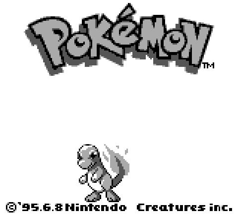
</p>

A faithful reimplementation of **Pokémon Red and Blue** in **Rust**, built from the [pret/pokered](https://github.com/pret/pokered) disassembly — playable on **desktop, web, Android, and iOS** from a single codebase, fully playable in **English and 中文**, and shipping with a full **visual editor suite** for maps, data, UI layouts, and saves.

This repo is **game-only**: the generic **JRPG engine** lives in a separate repository and is consumed here as a Cargo **git dependency** (`dotzuki-engine`, `dotzuki-engine-dsl`, `dotzuki-engine-script`, `dotzuki-rules`, `dotzuki-renderer`, `dotzuki-ui`, `dotzuki-audio`, `dotzuki-app`, `dotzuki-tui` — see `Cargo.toml`, all pinned to a `v0.5.2` tag of the engine repo).

## Screenshots

<p align="center">
  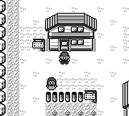
  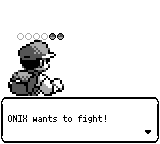
</p>
<p align="center">
  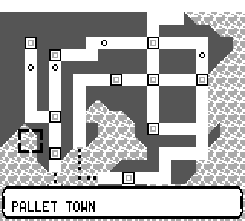
  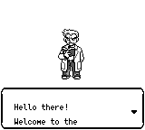
</p>

### 中文截图

The whole game is bilingual (`@t("english", "中文")` everywhere) — here is the same tour in Chinese:

<p align="center">
  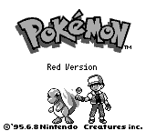
  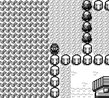
</p>
<p align="center">
  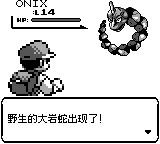
  
</p>

Screenshots are regenerated with `scripts/capture_readme_screenshots.sh` (headless captures via `pokered-app screenshot --lang en|zh`, with enough frames for each screen to finish loading).

## Highlights

- **Faithful to the original** — all 248 maps, 151 species, moves, items, and game logic rebuilt from the disassembly, with ongoing fidelity audits (`docs/FIDELITY_GAPS.md`)
- **Cross-platform** — native desktop app, WASM web build, Android and iOS shells
- **Bilingual** — every screen and line of dialogue in English and 中文, switchable in-game
- **Authentic audio** — Game Boy APU emulation (`pokered-audio`)
- **Hackable by design** — per-map JavaScript scripts, a DSL for UI layouts, and JSON-driven game data
- **Full editor suite** — map editor, Pokémon/move/trainer data editors, UI layout editor with live preview, save editor, sprite tools, and an AI assistant

## Editor Suite

`tools/pokered-editor/` is a Vue/Vite application (with an Electron shell) for editing every aspect of the game.

<p align="center">
  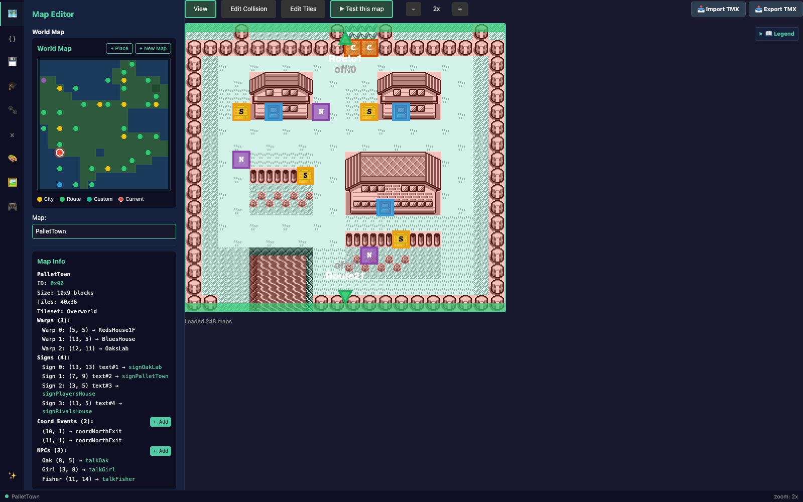
</p>
<p align="center">
  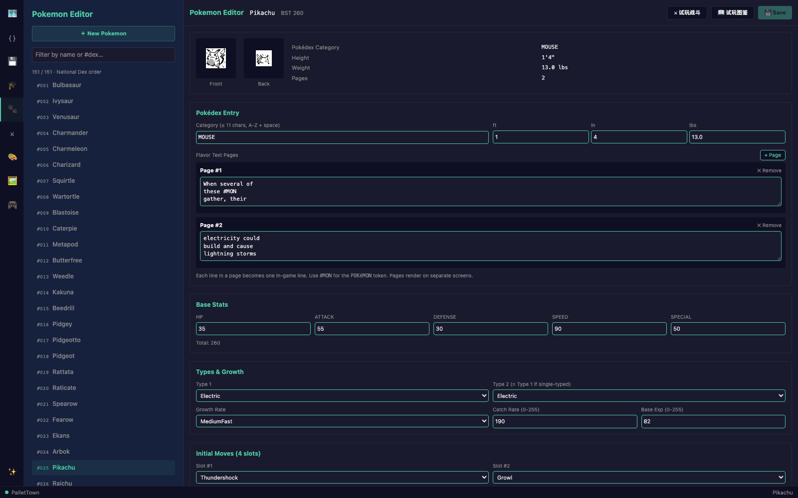
</p>
<p align="center">
  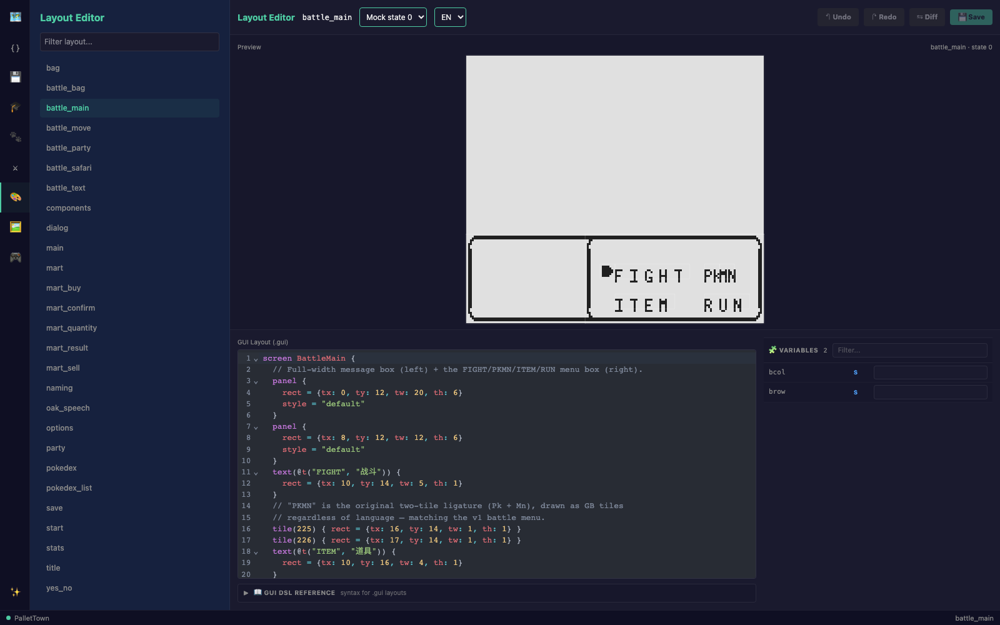
</p>
<p align="center">
  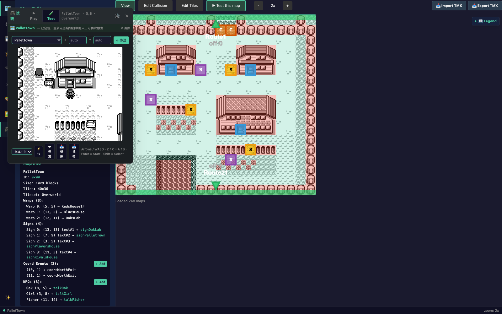
</p>

```bash
cd tools/pokered-editor
pnpm install
pnpm dev        # or: pnpm electron:dev
```

## Getting started

```bash
# 1. Fetch the game graphics (NOT committed; REQUIRED for any build)
scripts/fetch-gfx.sh

# 2. Build / run
cargo run --release --bin pokered-app

# 3. Test
cargo test
```

The engine is consumed as a Cargo git dependency: `https://github.com/liuyanghejerry/dotzuki`, pinned to tag `v0.5.2` (see the `Cargo.toml` of each crate). After pulling a new engine tag, bump the `tag` and run `cargo update`.

## What this repo contains

- `crates/` — the game itself (`pokered-data` (248 maps, species/move/item tables), `pokered-core` (pure logic), `pokered-renderer`, `pokered-ui`, `pokered-audio` (GB APU emulation), `pokered-app` (native binary + debug CLI), `pokered-tui`, `pokered-ui-preview`) plus platform shells: `pokered-web` (WASM), `pokered-runner-web` (editor Play bridge), `pokered-layout-preview` (editor layout-preview WASM: per-menu mock data, `custom:hp_bar`, DSL compile bridge), `pokered-debug-server`, `pokered-android`, `pokered-ios`, plus `scene_apply` (story-translation helper bin)
- `tools/pokered-editor/` — the Vue/Vite editor suite (maps, saves, data, UI layouts, AI assistant) + Electron shell
- `android/` / `ios/` — mobile build projects
- `scripts/` — Python data-extraction/verification helpers
- `docs/` — NPC dialogue transcripts, move animation data, fidelity audits

## Not included

- The **jrpg engine** — separate repo, consumed via git dependency.
- The game **gfx assets** — fetched from pret/pokered by `scripts/fetch-gfx.sh` (copyrighted; not redistributed).

See `CLAUDE.md` for the full developer guide (build commands, debug CLI, skills).
