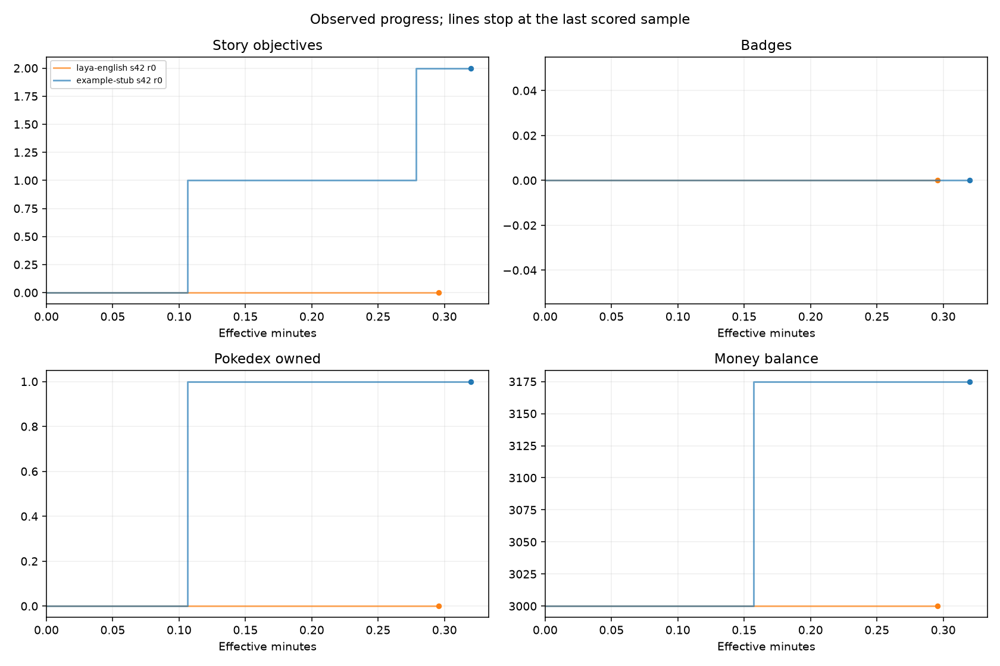

# Open-Pokered 模型 Benchmark

版本 `open-pokered-autonomy-v1` · 配置 `native-controller-v1` · 用途 **smoke**。

每行保留独立运行；未完成预算的结果不外推。服务中断、模型拒选、协议错误与超时分别列出。
本报告不计算加权总分，也不把提前结束的任务排成完整预算能力榜。

## 固定场景决策

| 模型 | 种子/重复 | 结束类别 | 有效答案正确率 | 覆盖率 | 顺序一致率 | Brier |
| --- | --- | --- | --- | --- | --- | --- |
| laya-english | 42/0 | completed | 0.594 | 1.000 | 0.625 | 0.599 |
| example-stub | 42/0 | completed | 0.406 | 1.000 | 0 | — |

### 跨运行汇总

**laya-english**：1 次；结束类别 `{"completed": 1}`。

| 指标 | 有效样本数 | 均值 | 中位数 | 最小 | 最大 | 标准差 |
| --- | --- | --- | --- | --- | --- | --- |
| accuracy | 1 | 0.594 | 0.594 | 0.594 | 0.594 | — |
| coverage | 1 | 1.000 | 1.000 | 1.000 | 1.000 | — |
| order_consistency | 1 | 0.625 | 0.625 | 0.625 | 0.625 | — |
| brier | 1 | 0.599 | 0.599 | 0.599 | 0.599 | — |

**example-stub**：1 次；结束类别 `{"completed": 1}`。

| 指标 | 有效样本数 | 均值 | 中位数 | 最小 | 最大 | 标准差 |
| --- | --- | --- | --- | --- | --- | --- |
| accuracy | 1 | 0.406 | 0.406 | 0.406 | 0.406 | — |
| coverage | 1 | 1.000 | 1.000 | 1.000 | 1.000 | — |
| order_consistency | 1 | 0 | 0 | 0 | 0 | — |
| brier | 0 | — | — | — | — | — |

## 限时自主探索

| 模型 | 种子/重复 | 结束类别 | 最后计分秒 | 剧情目标 | 徽章 | 图鉴见过 | 图鉴拥有 | 支线 | 最高等级 | 战败 | 观测收入 |
| --- | --- | --- | --- | --- | --- | --- | --- | --- | --- | --- | --- |
| laya-english | 42/0 | model_abstention | 17.735 | 0 | 0 | 0 | 0 | 0 | 0 | 0 | 0 |
| example-stub | 42/0 | time_limit | 19.200 | 2 | 0 | 5 | 1 | 0 | 6 | 0 | 175 |

### 跨运行汇总

**laya-english**：1 次；结束类别 `{"model_abstention": 1}`。

| 指标 | 有效样本数 | 均值 | 中位数 | 最小 | 最大 | 标准差 |
| --- | --- | --- | --- | --- | --- | --- |
| story_objectives | 1 | 0 | 0 | 0 | 0 | — |
| badges | 1 | 0 | 0 | 0 | 0 | — |
| dex_owned | 1 | 0 | 0 | 0 | 0 | — |
| sidequests | 1 | 0 | 0 | 0 | 0 | — |
| max_level | 1 | 0 | 0 | 0 | 0 | — |
| money_gained | 1 | 0 | 0 | 0 | 0 | — |
| effective_s | 1 | 17.750 | 17.750 | 17.750 | 17.750 | — |

**example-stub**：1 次；结束类别 `{"time_limit": 1}`。

| 指标 | 有效样本数 | 均值 | 中位数 | 最小 | 最大 | 标准差 |
| --- | --- | --- | --- | --- | --- | --- |
| story_objectives | 1 | 2 | 2 | 2 | 2 | — |
| badges | 1 | 0 | 0 | 0 | 0 | — |
| dex_owned | 1 | 1 | 1 | 1 | 1 | — |
| sidequests | 1 | 0 | 0 | 0 | 0 | — |
| max_level | 1 | 6 | 6 | 6 | 6 | — |
| money_gained | 1 | 175 | 175 | 175 | 175 | — |
| effective_s | 1 | 20.585 | 20.585 | 20.585 | 20.585 | — |

## 成本与调用

| 模型 | 轨道 | 种子/重复 | 调用数 | 已知输入 Token | 已知输出 Token | 用量缺失调用 | RTT 扣减秒 | P50 秒 | P95 秒 |
| --- | --- | --- | --- | --- | --- | --- | --- | --- | --- |
| laya-english | decisions | 42/0 | 32 | 2346 | 0 | 0 | 0.000 | 0.023 | 0.031 |
| example-stub | decisions | 42/0 | 32 | 0 | 0 | 32 | 0.000 | 0.000 | 0.000 |
| laya-english | story | 42/0 | 3 | 1331 | 0 | 0 | 0.000 | 0.105 | 0.153 |
| example-stub | story | 42/0 | 19 | 0 | 0 | 19 | 0.000 | 0.000 | 0.000 |

### 时间边界

| 模型 | 轨道 | 种子/重复 | 预算秒 | 原始墙钟秒 | 扣 RTT 后墙钟秒 | 超预算收尾秒 |
| --- | --- | --- | --- | --- | --- | --- |
| laya-english | decisions | 42/0 | 300 | 0.787 | 0.787 | 0 |
| example-stub | decisions | 42/0 | 300 | 0.031 | 0.031 | 0 |
| laya-english | story | 42/0 | 20.000 | 17.750 | 17.750 | 0 |
| example-stub | story | 42/0 | 20.000 | 20.585 | 20.585 | 0.585 |

Token 缺失时已知合计只是下界；不同 tokenizer 的数量不能直接等价比较计算成本。金额是采样余额正变化的下界。
墙钟可能包含等待在途操作结束的收尾时间；收尾不增加剧情成绩，最后计分观测始终在预算内。
watchdog/worker_failed 只保留最后 checkpoint；未知最终墙钟不显示为 0，未结束请求的用量也可能缺失。
决策正确率只统计有效答案，必须同时看覆盖率；概率指标仅统计返回完整分布的答案，不为仅返回标签的模型伪造概率。
当前固定场景集包含已公开调试样本，属于 development 集。选项反转和重复运行不增加独立场景数量，也不能称为隐藏测试集准确率。

## 剧情节点时间

| 模型 | 种子/重复 | 剧情节点 | 有效秒 | 原始秒 |
| --- | --- | --- | --- | --- |
| laya-english | 42/0 | get-pokedex | — | — |
| laya-english | 42/0 | get-starter | — | — |
| example-stub | 42/0 | get-pokedex | 16.705 | 16.705 |
| example-stub | 42/0 | get-starter | 6.379 | 6.379 |

未达到节点为空值，不能按结束时间当作完成时间。支线计分使用预定义观察目录，当前控制器以通关为目标。

[全部指标 CSV](metrics.csv) · [逐次结果与汇总 JSON](results.json) · [来源哈希与核验](verification.json)
