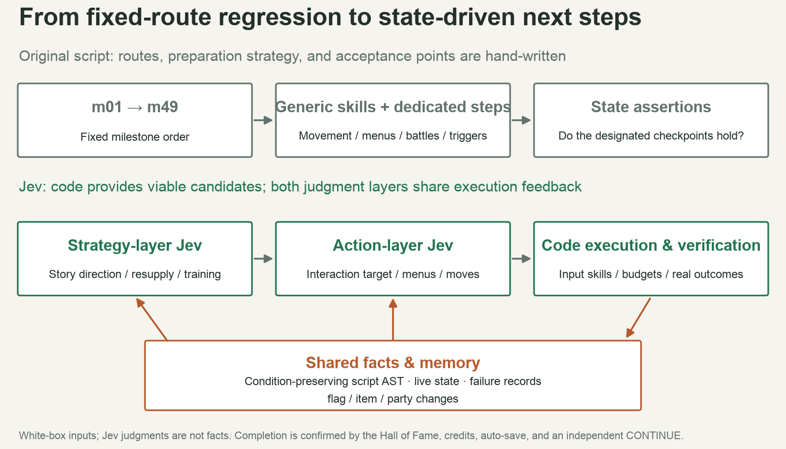
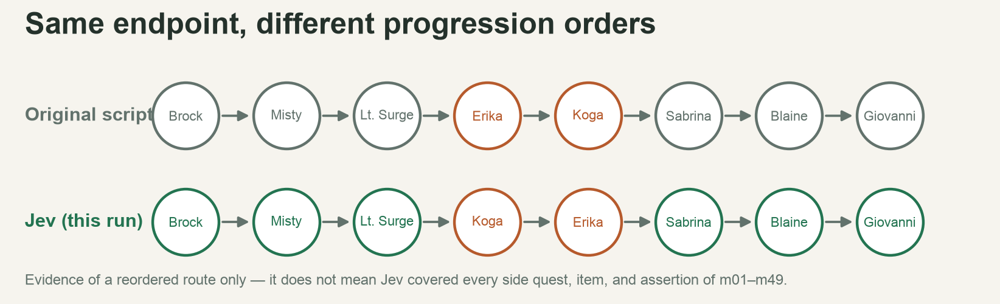
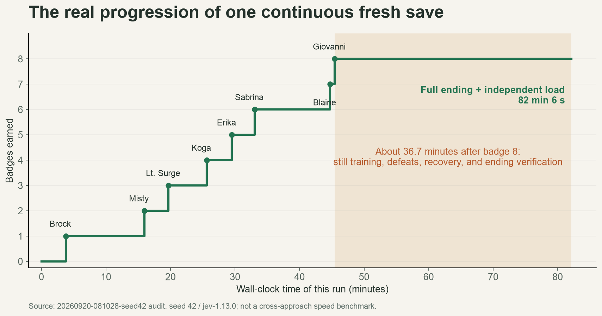

# Beating Pokémon Red with Jev: A Retrospective — Fast Decisions Matter, but Decision Quality Matters More!

**中文版：**[使用 Jev 驱动通关《宝可梦：红》复盘：快速决策很重要，但更重要的是决策质量！](jev-playthrough-retro-2026-09.md)

A while ago I did a fun project using AI and Pokémon:

[Five Months Rebuilding Pokémon Red with AI: Progress, Detours, and Lessons](my-retro-2026-08.en.md)

Since then, most of my energy has gone into fixing places that diverge from the original game. To do that well, I have to explore as much of the game's progression as possible — hunting for bugs with one or two screenshots doesn't cut it anymore.

So I had AI start clearing the game on its own. It quickly wrote a Python script that can blow through the first two gyms in under ten minutes — but a full playthrough takes hours.

The bigger problem: a scripted run has to hard-code one fixed route, leaving almost no room for free exploration — because a script can't enumerate every possible situation.

As luck would have it, Jev was released a few days ago. It was being hyped to the skies online, and it looked like it could make all kinds of autonomous decisions quickly and give the game an explicit next action.

So I signed up without hesitation and wired Astra, the master agent, into my automated playthrough setup. And honestly? It did carry the run to a clear for me — at exactly twice the script's time!

## The Existing Automated Testing Stack: What It Could Already Cover

open-pokered already had multiple layers of automation. The mainline driver queries live state, does closed-loop pathfinding, handles battles and failure recovery, and asserts outcomes at key checkpoints — it should not be mistaken for a blind sequence of button presses.

| Layer | Entry point and method | Main coverage | Question it answers |
| --- | --- | --- | --- |
| Unit and integration tests | Rust tests, Python driver and planner tests | Local behaviors: game rules, saves, scripts, navigation, input, battles, linking | Does a rule or module work as agreed? |
| Mainline milestone regression | playthrough.py + playthrough_late.py, m01–m49 | From boot and NEW GAME through the eight badges, Elite Four, champion, Hall of Fame, credits, and an independent CONTINUE | Can the game still be played through end-to-end along this scripted route? |
| Subsystem scenarios | scenarios.py, 11 scenarios | Bag, party, fleeing, win EXP, captures, wipes, save round-trips, menus, options, NPCs, switching in after a faint | Given a specific state, does this subsystem behave correctly? |
| BDD acceptance | bdd.py + features/, 15 scenarios | Expressing the above behaviors as readable Chinese/English Given / When / Then specs and constructing saves for acceptance | Is the readable behavior spec satisfied? |
| State construction | save_builder.py, debug protocol, snapshots | Set party, items, money, map, and serializable events to jump straight into edge states | Can a specific problem be reproduced cheaply? |
| Visual and animation verification | pokered-app/tests, screenshots, and dedicated differential tooling | Screens and timing for menus, text, healing, evolution, surfing, Hall of Fame, and more | When the logic holds, is what's on screen also correct? |
| Engineering checks | CI configs and other workflows | Build, tests, coverage, and checks for each target platform | Does the change build and pass the relevant engineering gates? |

Evidence from these layers is not interchangeable. Scenario tests can inject state to cover edges quickly; the mainline playthrough must start from a real NEW GAME and earn its progress through normal play. Constructing a "champion save" and booting it successfully is not the same as a legitimate clear.

The complex flows the original mainline covers include:

| Milestones | Scenarios |
| --- | --- |
| m01–m10 | Language selection and boot flow, Oak's intro, leaving the house, the blocking-story beats, receiving the starter, the rival, the parcel and Pokédex, Viridian Forest, Brock |
| m11–m20 | Mt. Moon and the fossils, Misty, Bill and the S.S. Ticket, the S.S. Anne, Cut, Lt. Surge, Rock Tunnel |
| m21–m30 | Erika, the Rocket Hideout, the lift and the Silph Scope, Pokémon Tower, Mr. Fuji, Snorlax, Koga, the Safari Zone, the Saffron gate checks |
| m31–m40 | Silph Co., Sabrina, Fly, Surf, Zapdos, the Pokémon Mansion puzzles, the last two gyms |
| m41–m49 | Badge gates, Victory Road, pushing boulders and dropping through holes, resupply, Elite Four, champion, the full ending, and save persistence |

The whole run used no warps, no gifted party, no cheats, and no save editing in place of play; the final team was Zapdos at level 56, Lapras at 15, and Venusaur at 55. The script is also somewhat non-deterministic — battle moves involve RNG — so six runs failed at different points before a seventh, with driver fixes applied, finally passed.

## Script-Based Automation: Where It Falls Short

**First, route coverage depends on what a human wrote in advance.** m01–m49 reliably expresses one designated route and covers quite a few side quests; but change the starter, badge order, party composition, or resource state, and you can land in combinations nobody handled specially. A green light means the written assertions held — not that every player path works.

**Second, story knowledge and operational detail tend to get tangled together.** "Get the S.S. Ticket before seeing the captain", "this switch must stay on", "stand on the other side of the counter to talk here" — these usually live in the code as route ordering, coordinates, and special-purpose steps. After a story or map change, you have to figure out whether the route knowledge went stale, navigation broke, or the engine actually regressed.

**Third, recovery coverage depends on explicit coding.** The original script already handles defeats, healing, training, and some retries, but recovery strategy is still human-specified. An unforeseen failure may call for a fresh judgment — "grind, resupply, switch targets, or go get a certain item first" — and the script does not automatically gain judgment nobody wrote.

**Fourth, maintenance cost compounds over long flows.** The original playthrough development fixed combination collisions, outdoor-entrance context, ledges, arrow tiles, short map arrays, continuing to walk the old direction after a map switch, learn-move and forced-switch menus, and more. Quite a few of those were driver problems; you can't blame every red light on the game engine.

**Fifth, a designated route is bad at actively finding "missed paths".** By design, the script acquires the Silph Scope, identifies the ghost, and only then rescues Mr. Fuji; autonomous exploration might try a different order of approach and expose gaps in gating or story constraints. That exploratory ability is valuable, but it still needs a deterministic verifier to tell a legitimate variant from a bug.

So we keep the scripts for fast, locatable regression, while looking for a complementary mechanism that can choose its own next step within clear boundaries — Jev gave me exactly that opportunity.

## What Jev Is, and What We Wanted It to Solve

Jev is TypeSafe's System One model. The application feeds it text or structured state, defines the allowed answers, and receives typed judgments with probabilities. It supports Choice (pick from candidates), Noul (decide whether a claim holds), and Score (rate degree of order). Current input is text-only, though — it does not directly process images, audio, or video.

This project's autonomous playthrough mostly uses **Choice**. What Jev actually reads is game state, script facts, and candidate descriptions. The existing semantic dialogue assertions use Noul; the client supports Score too, but "the capability is wired up" must not be written as "this run was optimized with it".

We wanted it to make two kinds of judgments:

| Layer | Question to answer | What we actually hand it |
| --- | --- | --- |
| Strategy layer | Which story segment should we push next? Is now the time to recover, train, or prepare prerequisites? | Unfinished goals, script dependencies, party and resource summaries, travel routes, and records of blockage |
| Action layer | For the current goal: who exactly to interact with, which menu item to pick, which move to use? | Current sub-goal, viable candidates, live state, recent action results, and relevant battle info |

Parts of the original script's basic machinery are still reused: exact rules, path search, input timing, budgets, legal candidate generation, and completion verification. The model can only judge among the candidates offered; missing candidates or wrong facts cannot be rescued by "choosing more cleverly".

## What We Actually Fed Jev

Jev's context space is limited — roughly 32K per input — so a full game snapshot cannot be sent verbatim every time. The newly recorded **2,122 calls** break down into seven kinds:

| Call type | Count | Actual input |
| --- | --- | --- |
| Strategy choice | 346 | Completed / unfinished goals; location, badges, party levels/HP/status/moves/PP, bag, money; story flags, mechanisms, and object states relevant to the candidates; map routes, known navigation failures, recent outcomes, unresolved defeats; candidates annotated with script outputs, prerequisite effects, grid reachability, estimated steps, opposing teams, healing-reset costs, and similar context |
| General action choice | 869 | Current sub-goal, the parent goal being advanced, local state, the last three outcomes, strategy context; per candidate: target object, action, script effect, and navigation instructions |
| Battle move choice | 820 | Both sides' species and levels, base stats, HP bands; for each usable attack: power, accuracy, type multiplier, same-type bonus, crit chance, PP bands, and expected power. This call has no exact HP/PP and no full map |
| Dialogue options | 63 | Sub-goal, recent dialogue, current location, travel intent, relevant script effects and confirmation options, current menu; full party and terrain are not attached again |
| Forced switch | 16 | Opponent's current state; each deployable candidate with party-member status and effective attacks |
| Learning a move | 4 | Current Pokémon, old and new move data, options to keep or replace |
| Restricted battle handling | 4 | Current battle state, the constraint that unidentified ghosts block attacks, legal disengage candidates |

**Terrain reaches the model mostly as code-computed facts.** The model may receive descriptions like "the target's trigger area is reachable, about N steps, Surf required", "trees or a gate block this route", "this switch changes these tiles". The full collision grid, per-tile BFS, and input timing are handled by code; the recorded footage was never sent as visual input. Script semantics can also supply confirmation options, item outcomes, and opposing teams ahead of time — so this is autonomous exploration assisted by white-box semantics.

To make the interaction with Jev easier to follow, I also built a web dashboard that shows "current game state" and the "input for that call" separately.

For example, the battle view can display live exact HP, while the move-choice input still shows only the HP bands from the original call; older strategy snapshots are not overwritten by later party states either. The complete application-level inputs and outputs are stored in `jev-inputs.json`, loaded on demand by the interactive page, so every candidate can be inspected — not just the first three shown in the video: [Jev full playthrough · synchronized decision dashboard](https://liuyanghejerry.github.io/open-pokered/jev-dashboard/full-run/jev-player.html?lang=en).

*A simplified diagram of the Jev call pipeline.*

This forms a closed loop: **pick a direction → pick an action → execute → verify → feed back**. The expected payoff is more flexible goal selection across different states, and less need to hand-write story itineraries one by one. Considering macro and micro together is the design goal, but there is no evidence yet that this achieves a global optimum.

Another boundary: **a constrained output format does not make the judgment correct.** Choice / Score confidence describes how concentrated the candidate probability distribution is; it cannot be treated as a "clear rate" or as proof of success. Thresholds need to be validated on this project's own data.

## Problems We Actually Hit, and How We Solved Them

Wiring Jev in was not a drop-in model swap. Early on I didn't split strategy and action layers; a single flat layer exposed problems in completion detection, state representation, execution, and memory — and the success rate turned out to be dismal: the game would often spin in place for a long time. So I implemented the two-layer judgment, then built navigation, resources, and complex mechanisms up to the point where the run could advance autonomously without stalling. Here are some of the interesting problems I ran into:

| Problem | What it looked like, and why | Fix and current state |
| --- | --- | --- |
| False success | No goal selected, `none` returned, or invalid config treated as "all done" | Distinguish refusal-to-choose, no viable goal, and true completion; success cannot be declared while unfinished flags remain. The final champion goal has separate ending-persistence verification |
| Lost prerequisites | The old map only knew which flags each map read or wrote, losing negation, early returns, branches, and effect ordering | Export a structure-preserving script AST and derive outcome/prerequisite relations from the actual conditions. An early `return` taken when the parcel is already collected is no longer misread as a prerequisite for collecting it |
| Handed the state, still picked the wrong target | During the starter phase it kept seeking Prof. Oak instead of going for the Poké Balls | Attach each candidate's conditions, outcomes, confirmation steps, and observed results. In one local probe, adding generic state alone still chose Oak 3/3; after adding concrete action semantics it chose the Poké Balls 3/3. That only proves the input improved on that state — it cannot be extrapolated into an overall success rate |
| Interactions treated as waiting | Pokédex previews, YES/NO, move learning, shops, and choice menus need different inputs; a uniform "skip dialogue" stalls | Execute full skills keyed to the current screen, script effect, and menu type; judge outcomes incrementally via items, flags, party, etc. |
| Loops and stale failure memory | Opening the same dialogue miscounted as progress; an action that failed once was blocked forever, even after its preconditions changed | Define progress by actual state changes, keep failure context, and reopen candidates as the relevant preconditions change |
| Two-layer goal drift | Actions completed local steps but forgot the parent goal; leaving a map re-triggered mechanism resets | Pass parent goals and preparation conditions down to the action layer, handle coupled switches, and account for state resets from script `@load` |
| Inaccurate physical reachability | Exits, biking, auto-sliding, Surf embark/disembark, NPC movement, and dynamic obstacles made planning disagree with the engine | Build generic skills from real maps and engine rules, re-localize after observation; fix stale NPC memory, invalid elevator exits, and boundary movement |
| Conditional refusals read as permanent walls | The Safari Zone exit dialogue caused even the normal paid entrance to be blocked | Check whether the same story offers a currently usable choice teleport, or a flag written by a choice that clears its own condition; only add genuinely valid obstacles to navigation memory |
| Model waits changed execution timing | Race conditions between the async input queue and frame stepping; interrupts could also misalign protocol responses | Add a synchronous input timeline, respond to interrupts only after one full command round-trip; verify the final observation type, and isolate each run's binary and companion save files |
| Under- or over-preparing after defeats | Repeated failed attempts on the one hand; constant healing at full HP and endless grinding on the other | Record actual opponents and defeat states; provide training, recovery, and battle candidates, with move info and a judgment cache. The clear works now, but the efficiency issues remain |

Some of these fixes improved the information handed to the model; others fixed the code executor. In short, the outcome of "using Jev" is the outcome of the whole system — it cannot all be attributed to the model itself.

While using Jev, many inputs were impossible to anticipate up front. For example, buying potions at a shop was not among Jev's original options; only after six consecutive failed attempts against Sabrina did Astra step in and enrich the context on its own initiative, adding options like using healing items — saving Jev from grinding forever.

## Versus the Original Scripted Automation: What Did We Actually Gain?

Judged on the single requirement of clearing the game, the script is more stable, faster, and costs zero model tokens:

| Metric | Script (no model involved) | Two-layer Jev autonomous exploration |
| --- | --- | --- |
| Full ending, natural save, and independent load | Passed | Passed |
| Wall-clock time | 66 min 20.09 s | 121 min 25.58 s |
| Full raw-recording length | 2 h 57 min 52.15 s | 4 h 18 min 17.63 s |
| Raw-recording simulated frames | 640,329 | 929,858 |
| Strategy / action model calls | 0 / 0 | 346 / 1,776 |
| Input / output tokens | 0 / 0 | 8,023,570 / 118,672 |
| Total model-call latency | 0 | 2,169.396 s |
| Observed battle segments | 293 | 776 |
| Distinct retreats / whole-party HP-zero events | 15 / 16 | 21 / 21 |
| Maps visited | 132 | 133 |
| Final Pokédex: seen / owned | 109 / 5 | 111 / 4 |
| Final party | Zapdos 55, Venusaur 55, Lapras 15 | Charizard 85, Lapras 15 |
| Final money | 31,799 | 38,374 |
| Independent load result | Pallet Town, eight badges, Hall of Fame entry 1 | Pallet Town, eight badges, Hall of Fame entry 1 |

But Jev introduces nondeterminism — and can handle nondeterminism — which lets the whole flow touch more edge territory:

Although in the worst case it might not clear the game at all:

*A failed record: no clear after 82 minutes, forcibly terminated.*

Still, I believe this kind of randomized exploratory testing is genuinely meaningful for game regression. The current version only compared the feasibility of a Jev-driven clear; research into diversity is clearly not enough yet. I plan to give Jev more strategic biases and different ultimate objectives — completing the Pokédex, or clearing the game with a minimal party — none of which a pre-written script can achieve.

That's it for my first taste of Jev. If you'd like to see it in action, click here to try it: [https://liuyanghejerry.github.io/open-pokered/jev-dashboard/full-run/player.html?lang=en#chapter=1](https://liuyanghejerry.github.io/open-pokered/jev-dashboard/full-run/player.html?lang=en#chapter=1)!
