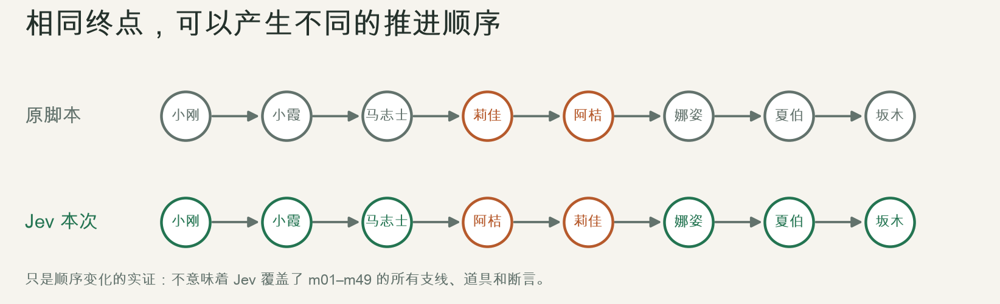
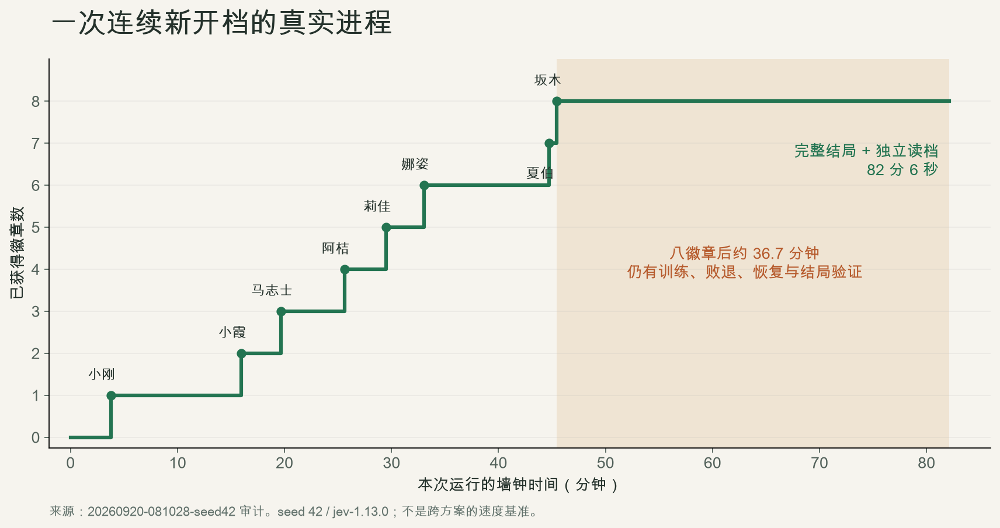

# 使用 Jev 驱动通关《宝可梦：红》复盘：快速决策很重要，但更重要的是决策质量！

之前我用AI给宝可梦整了个活：

[用 AI 复刻《宝可梦 红》的五个月：进展、弯路与收获](my-retro-2026-08.md)

在那之后我的精力主要是用在修缮和原作不一致的地方，但要这么做的话就必须尽可能探索游戏的进度，不能只靠一两个截图来找问题了。

于是我让AI开始自行进行通关，很快 AI 就用Python写了一份脚本，通过脚本 AI 可以在十分钟以内快速打过最初的2个道馆，但要完全打通一周目，消耗的时间往往需要按小时计。

更麻烦的是，脚本通关只能写死一个很固定的路线，自由探索的空间其实非常小——因为脚本没法枚举所有的情况。

好巧不巧，Jev 在前几天发布，这玩意儿在外网吹的天花乱坠，看起来能很快速地做各种自主决策，给出游戏明确的下一步指令。

好家伙，我果断注册了一个让 Astra 大师接进我的自动化通关脚本里，你别说，你还真别说，它最后还是帮我完成了通关——只不过是花了脚本双倍的时间！

## 原先的自动化测试能力：已经能测什么

open-pokered 原本已有多层自动化。主线驱动会查询实时状态、闭环寻路、处理战斗与失败恢复，并在关键节点断言结果；不能把它简单理解成一串盲按键。

| 层次 | 入口与方式 | 主要覆盖 | 它回答的问题 |
| --- | --- | --- | --- |
| 单元及集成测试 | Rust 测试、Python 驱动与规划器测试 | 游戏规则、存档、脚本、导航、输入、战斗及联机等局部行为 | 一个规则或模块是否按约定工作？ |
| 主线里程碑回归 | playthrough.py + playthrough_late.py，m01–m49 | 从开机、新建游戏到八徽章、四天王、冠军、名人堂、片尾及独立 CONTINUE | 沿这条已编写路线，游戏还能完整玩通吗？ |
| 子系统场景 | scenarios.py，11 个场景 | 背包、队伍、逃跑、获胜经验、捕获、全灭、存档往返、菜单、选项、NPC、倒下后换人 | 给定一个明确状态，这个子系统是否正确？ |
| BDD 验收 | bdd.py + features/，15 个场景 | 用中英文 Given / When / Then 表达上述行为及构造存档验收 | 可读的行为规格是否满足？ |
| 状态构造 | save_builder.py、调试协议、快照 | 设置队伍、物品、金钱、地图及可序列化事件，快速进入边界状态 | 能否低成本复现一个特定问题？ |
| 画面及动画验证 | pokered-app/tests、截图和专项差分工具 | 菜单、文字、治疗、进化、冲浪、名人堂等画面与时序 | 逻辑成立时，画面表现是否也正确？ |
| 工程检查 | CI 配置及其他工作流 | 构建、测试、覆盖率与各目标平台检查 | 改动能否构建并通过相应工程门槛？ |

这些层次的证据不能互相替代。场景测试可以注入状态，以便迅速覆盖边界；主线通关则必须从真实 NEW GAME 开始，用正常操作获得进度。构造一个“冠军存档”并成功启动，不等于正常通关。

原主线具体覆盖的复杂流程包括：

| 里程碑 | 场景 |
| --- | --- |
| m01–m10 | 语言与开机流程、博士开场、房屋出口、拦截剧情、领取初始宝可梦、劲敌、包裹与图鉴、常磐森林、小刚 |
| m11–m20 | 月见山及化石、小霞、正辉与船票、圣安奴号、居合斩、马志士、岩山隧道 |
| m21–m30 | 莉佳、火箭队基地、电梯与检视镜、宝可梦塔、富士老人、卡比兽、阿桔、狩猎地带、金黄市门禁 |
| m31–m40 | 西尔佛、娜姿、飞翔、冲浪、闪电鸟、宝可梦屋机关、最后两座道馆 |
| m41–m49 | 徽章关卡、冠军之路、推石与落洞、补给、四天王、冠军、完整结局和存档持久化 |

整个过程没有使用传送、赠送队伍、作弊或编辑存档代替游玩，最终队伍为闪电鸟 56 级、拉普拉斯 15 级、妙蛙花 55 级。而且这个脚本也有一定的不确定性，因为战斗技能有随机数，所以有六轮在不同位置失败，经修改驱动后第七轮运行才通过。

## 基于脚本的自动化：短板在哪里

**第一，路线覆盖取决于人预先写了什么。** m01–m49 能可靠表达一条指定路线，也覆盖不少支线；但改变初始宝可梦、徽章顺序、队伍组成或资源状态，就可能进入没有专门处理的组合。一个绿灯表示已写断言成立，不表示所有玩家路径都能通过。

**第二，剧情知识和操作细节容易混在一起。** 例如“先拿船票再找船长”“某个开关需要保持开启”“这里站到柜台另一边交谈”，常常以路线顺序、坐标和专用步骤体现。剧情或地图变化后，需要判断是路线知识失效、导航错误，还是引擎真的回归。

**第三，恢复范围依赖显式编写。** 原脚本已经能处理败退、治疗、训练和部分重试，但恢复策略仍由人指定。一个未预料的失败可能要求重新判断“练级、补给、换目标还是先取得某个道具”；脚本不会自动获得未编写的判断能力。

**第四，长流程的维护成本会累积。** 原一周目开发曾修复组合碰撞、室外入口上下文、断崖、箭头地板、短地图数组、切图后继续走旧方向、学习招式和强制换人菜单等问题。其中不少是驱动问题，不能把每次红灯都归因于游戏引擎。

**第五，指定路径不擅长主动寻找“遗漏的路径”。** 脚本会按设计获取检视镜、识别幽灵再救富士老人；自主探索却可能尝试不同的进入顺序，暴露门禁或剧情约束的缺口。这种探索能力有价值，但仍需要确定性的验证器判断它是合法变体还是漏洞。

因此，我们保留脚本用于快速、可定位的回归，同时寻找一种能在明确边界内自主选择下一步的补充机制——Jev给了我这样的机会。

## Jev 是什么，我们希望它解决什么

Jev 是 TypeSafe 的 System One 模型。应用向它提供文本或结构化状态，定义允许的答案，再接收有类型的判断与概率。它支持 Choice（从候选中选择）、Noul（判断是否成立）和 Score（有序程度评分）。不过当前输入只能是文本，不直接处理图像、音频或视频。

本项目的自主通关主要使用 **Choice**。Jev 实际读取的是游戏状态、脚本事实及候选描述。已有的语义对白断言使用 Noul；客户端支持 Score，但不能把“已封装”写成“本次通关已经用它优化过”。

我们希望它承担两类判断：

| 层次 | 要回答的问题 | 实际交给它的信息 |
| --- | --- | --- |
| 策略层 | 接下来推进哪段剧情？当前是否应该恢复、训练或准备前置条件？ | 未完成目标、脚本依赖、队伍与资源摘要、路程和受阻记录 |
| 动作层 | 为当前目标，具体与谁交互、选哪个菜单项、使用哪个技能或招式？ | 当前子目标、可行候选、实时状态、近期操作结果及相关战斗信息 |

原先的脚本仍然要有一部分基础能力复用，继续负责精确规则、路径搜索、按键时序、预算、合法候选生成和完成验证。模型只能在提供的候选中判断；候选遗漏或事实错误，不能靠“更聪明地选择”补救。

## 我们实际向 Jev 提供了什么

Jev 的上下文空间很有限，单次输入只有32K左右，因此不能每次原样发送全量游戏快照。新录制的 **2,122 次调用**分为以下七类：

| 调用类型 | 次数 | 实际输入 |
| --- | --- | --- |
| 策略选择 | 346 | 已完成 / 未完成目标；位置、徽章、队伍等级/HP/状态/招式/PP、背包、金钱；与候选相关的剧情标志、机关和对象状态；地图路线、已知导航失败、近期结果和未解决败退；候选附带脚本产出、前置效果、格点可达性、预计步数、对手队伍或治疗重置代价等相关信息 |
| 通用操作选择 | 869 | 当前子目标、所推进的上层目标、局部状态、最近三条结果、策略上下文；候选中的目标对象、操作、脚本效果及导航说明 |
| 战斗选招 | 820 | 双方种类与等级、基础种族值、HP 分档；可用攻击的威力、命中率、属性倍率、本系加成、暴击概率、PP 分档及期望威力。此调用没有精确 HP/PP，也没有完整地图 |
| 对话选项 | 63 | 子目标、最近对白、当前位置、旅行意图、相关脚本效果和确认选项、当前菜单；不重复附带完整队伍和地形 |
| 强制换人 | 16 | 对手当前状态；每个可出战候选附带队伍成员状态与有效攻击 |
| 学习招式 | 4 | 当前宝可梦、新旧招式数据、保留或替换选项 |
| 受限战斗处理 | 4 | 当前战斗状态、未识别幽灵阻止攻击的约束、合法脱离候选 |

**地形主要以代码计算的事实进入模型。** 模型可能收到“目标触发区域可达、预计若干步、需要冲浪”“某处树木或门禁阻碍路线”“某个开关改变哪些地块”等描述。完整碰撞网格、逐格 BFS 和按键时序由代码处理；录像画面没有作为视觉输入发送。脚本语义也可能提前提供确认选项、物品产出与对手队伍，因此这是白盒语义辅助的自主探索。

为了更直观地看到和 Jev 的互动，我还专门做了一个网页大盘，把“游戏当前状态”和上述“当次输入”分开显示。

例如战斗画面可以显示实时精确 HP，但选招输入仍只展示原调用的血量分档；旧的策略快照也不会用后来的队伍状态覆盖。完整应用层输入与输出保存在 `jev-inputs.json`，交互页按需加载，可检查全部候选而不限于视频中显示的前三项：[Jev 完整通关 · 同步决策大盘](https://liuyanghejerry.github.io/open-pokered/jev-dashboard/full-run/jev-player.html)。

*Jev 调用链路简图*

这形成了“**选方向 → 选操作 → 执行 → 验证 → 反馈**”的闭环。预期收益是让不同状态下的目标选择更灵活，并减少逐条编写剧情行程的需求。宏观与微观共同考虑是设计目标，不过目前尚无证据证明这就能实现全局最优。

另一个边界是：**输出格式受约束，不代表判断内容正确。** Choice / Score 的 confidence 描述候选概率分布的集中程度，不能当作“通关正确率”或成功事实；阈值需要在本项目的数据上验证。

## 实际遇到的问题，以及我们的解法

接入过程不是换一个模型调用就完成了。早期我没有分成策略层和动作层，只有一个单纯的层次尝试暴露出完成判定、状态表达、执行和记忆问题；随后发现这样的成功率极低，游戏往往会长时间地在原地打转。于是我又实现双层判断，再把导航、资源与复杂机关补到能够连续自主推进。下面是我遇到的一些有趣的问题：

| 问题 | 实际表现与原因 | 解法及当前状态 |
| --- | --- | --- |
| 假成功 | 未选出目标、返回 none 或配置无效，被当成“全部完成” | 区分拒选、无可行目标和真实完成；未完成 flag 仍存在就不能判成功。最终冠军目标另有结局持久化验证 |
| 前置条件丢失 | 旧图只知道某地图读写过哪些 flag，丢失否定、早退、分支和效果顺序 | 导出保留结构的脚本 AST，按实际条件建立产出及前置关系。包裹已领取时的提前 return 不再被误读为领取包裹的前提 |
| 给了状态，仍选错对象 | 初始宝可梦阶段反复找博士，而不是去精灵球 | 给候选附上其条件、产出、确认步骤和已观察结果。一个局部探针中，仅增加通用状态仍 3/3 选博士；补充具体动作语义后 3/3 选精灵球。它只证明该状态上的输入改进，不能外推为总体成功率 |
| 交互被当成等待 | 图鉴预览、YES/NO、学习招式、商店和选择菜单需要不同操作，统一“跳过对白”会停住 | 按当前画面、脚本效果和菜单类型执行完整技能；用物品、flag、队伍等增量判断结果 |
| 循环与过期失败记忆 | 打开同一段对白被误判为进展；某动作失败后永久屏蔽，即使前提已改变 | 以实际状态变化定义进展，保留失败上下文，并随相关前提变化重新开放候选 |
| 两层目标脱节 | 动作只完成局部操作，却忘记父目标；离开地图又触发机关重置 | 向动作层传递父目标和准备条件，处理耦合开关，考虑脚本 @load 带来的状态重置 |
| 物理可达性不准确 | 出口、骑行、自动滑行、冲浪上下岸、NPC 移动和动态障碍使规划与引擎不一致 | 从实际地图和引擎规则建立通用技能，观察后重新定位；修复陈旧 NPC 记忆、无效电梯出口与边界移动 |
| 条件拒绝被当成永久墙 | 狩猎地带的退回对白导致正常付费入口也被阻断 | 检查同一剧情中是否有当前可用的选择传送，或选择写入的 flag 能解除自身条件；只把真正有效的阻碍加入导航记忆 |
| 模型等待改变执行时序 | 异步输入队列与推进帧之间存在竞态；中断还可能使协议响应错位 | 新增同步输入时间线，等待一次完整命令往返后再响应中断；核对最终观察类型，并隔离每次运行的二进制与附属存档 |
| 战败后准备不足或过度 | 多次挑战失败；另一方面又出现满血后反复恢复、不断练级 | 记录实际对手和战败状态，提供训练、恢复及战斗候选，加入招式信息和判断缓存。已能完成通关，但效率问题仍在 |

这些解法中，有些改善了给模型的信息，有些修复了代码执行器。总之，“使用 Jev”带来的结果是整个系统的结果，不能全部归因于模型本身。

在 Jev 的使用中，很多输入也没法一开始就想到。例如最初我们给 Jev 的选项里并没有去商店买药，连续对战娜姿6次都失败之后，Astra 老师主动为 Jev 丰富了上下文，增加了吃药这样的选项，才让 Jev 不至于永远只是疯狂练级。

## 相比原先脚本自动化，实际获得了什么

如果只是按通关这个单项要求来看，脚本的稳定性更强、速度更快且模型成本为零：

| 指标 | 脚本（无模型参与） | 双层 Jev 自主探索 |
| --- | --- | --- |
| 完整结局、自然存档及独立读档 | 通过 | 通过 |
| 墙钟耗时 | 66 分 20.09 秒 | 121 分 25.58 秒 |
| 完整原片时长 | 2 小时 57 分 52.15 秒 | 4 小时 18 分 17.63 秒 |
| 完整原片模拟帧 | 640,329 | 929,858 |
| 策略 / 动作模型调用 | 0 / 0 | 346 / 1,776 |
| 输入 / 输出 tokens | 0 / 0 | 8,023,570 / 118,672 |
| 模型调用总延迟 | 0 | 2,169.396 秒 |
| 观察到的战斗片段 | 293 | 776 |
| 明确败退 / 全队 HP 归零事件 | 15 / 16 | 21 / 21 |
| 访问地图数 | 132 | 133 |
| 终态图鉴：见过 / 拥有 | 109 / 5 | 111 / 4 |
| 最终队伍 | 闪电鸟 55、妙蛙花 55、拉普拉斯 15 | 喷火龙 85、拉普拉斯 15 |
| 最终金钱 | 31,799 | 38,374 |
| 独立读档结果 | 真新镇、八徽章、名人堂记录 1 | 真新镇、八徽章、名人堂记录 1 |

但是 Jev 带来了不确定性，且也能处理不确定性，这就可以让整个流程碰触更多边界地带：

虽然极端情况下可能压根都通关不了：

*一次失败记录，全程82分钟都没通关，最后被强行结束*

不过我仍然觉得这种带有随机性的探索性测试对于游戏回归是非常有意义的，目前这个版本仅仅只是对比了 Jev 通关的可行性，但多样性的研究显然还不够。我打算进一步为 Jev 赋予更多策略偏向和不同的终极目的——比如以集齐图鉴作为目的、以最少的宝可梦队伍通关等，这些都是靠预制脚本无法实现的。

好了，本篇文章的 Jev 初体验就先写到这，想实际看一下效果的各位可以点击：[https://liuyanghejerry.github.io/open-pokered/jev-dashboard/full-run/player.html#chapter=1](https://liuyanghejerry.github.io/open-pokered/jev-dashboard/full-run/player.html#chapter=1) 进行体验！
