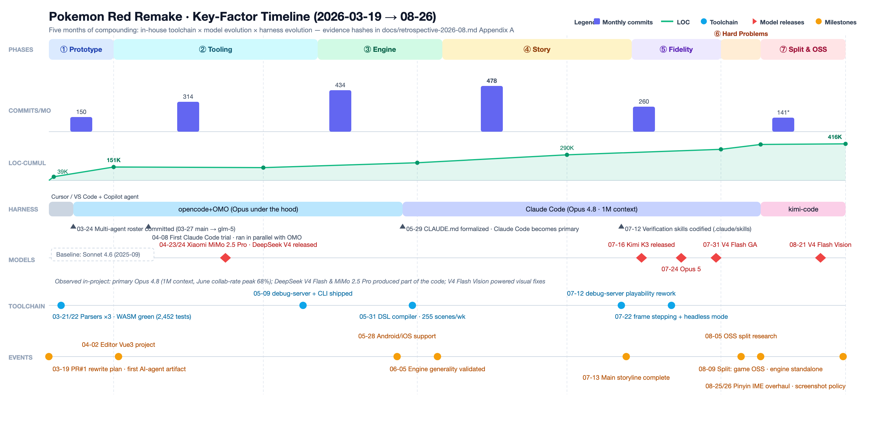
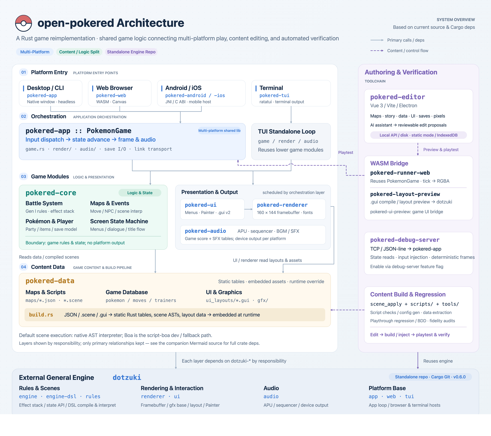

# Replicating Pokemon Red 1:1 in 5 Months with AI: How I Did It, and What I Learned

**中文版：**[5个月一比一复刻《宝可梦 红》，我是怎么做的，我又收获了哪些认知](my-retro-2026-08.md)

In March 2026, I noticed AI Coding was getting stronger and stronger — ordinary programming tasks could no longer probe its limits. So I ran a crazy experiment: use AI to replicate the classic game *Pokemon Red*, and see how far AI could really go. Five months later, the remake is entering its final stage, and I have a much clearer picture of what AI can do and how to work with it.

The game is now fully playable. The original only ran on the GameBoy, but my remake supports macOS, Windows, the web, Android, and iOS — even a TUI!


To make it easy to try, I deployed a build on GitHub — click and play: https://liuyanghejerry.github.io/open-pokered/

The whole project is now open source: https://github.com/liuyanghejerry/open-pokered . This version has the game engine extracted. I didn't publish the original working repo directly, mainly because the engine/game split was only finalized later — this version is much cleaner.

I also extracted the game engine into its own project: https://github.com/liuyanghejerry/dotzuki , which can power more interesting games in the future.

## What Makes This Hard?

At the time of writing, the remake project had **1,823 commits**, **189 merged PRs**, and **416K lines** of code (Rust/Web/DSL/Python, covering engine + game + toolchain).

I know GPT-6 is dominating the Internet right now, but even GPT-6 can't do this in one prompt — making a demo is easy; making a faithful remake is hard; optimizing the architecture on top of that is harder still.

But where exactly is the difficulty?

**Different hardware, different programming — the code can't be copied.** The community already has a disassembly of *Pokemon Red* (https://github.com/pret/pokered), complete with comments, so I didn't need to mine the ROM for information. But GameBoy-era games were written almost entirely in assembly, tied to a specific CPU architecture. Although AI has largely freed us from reading assembly, this project has 1,923 assembly files and 174K lines of assembly code, and AI can't precisely restore the semantics of every instruction — which means we had to invest heavily in testing.

**Nobody has organized all the game logic for you.** Even though this is the first-generation Pokemon game — the simplest one — it still has 151 Pokemon, 165 moves, 391 trainers, 245 maps, roughly 500 NPCs, and over 200 map items. What needs aligning is not just the numbers, but also the relationships and the animations. When you write your own game, you define what you want and what's correct. When you remake a game, there is only one answer: if yours differs, you're wrong — it's not a faithful remake. And because GameBoy hardware was extremely limited, the original developers had to count every byte, sacrificing many general-purpose designs. For example, there is no complete script engine in all of *Pokemon Red* — a big difference from modern engine-based games. Game logic and rendering logic are deeply intertwined; you can hardly call it layered.

**Direct frame-by-frame comparison doesn't work.** I guessed some people would do what I did at first: have AI control an emulator running the original, then break it down and implement frame by frame. I tried — it's extremely inefficient. Lacking any understanding of the game's internals, with only images and little else to go on, the AI spends most of its time on the most basic operations: even "press forward a few times, then back" requires repeated deliberation. You find that the AI is mostly not understanding the game but wrestling with basic controls. GPT-6 improved this significantly, but doing the entire game this way is still prohibitively expensive.

**Games are dynamic, not static — and often there's no standard at all.** I've tried replicating other people's web pages, with a much higher success rate than replicating a whole game. Most web pages follow modern component-based design, and the web is highly structured information — great for reasoning and imitation. Games aren't like that: their basic building blocks are more abstract, non-standard, and far less structured. More importantly, much of a game's content is dynamic — you have to experience the process, not just a static result — which drives the cost of alignment up dramatically.

## Timeline at a Glance

The project evolved right alongside AI's growing capabilities, so you could say it captured the full dividend of this entire cycle.



### Testing the Waters

When the remake kicked off, AI's capabilities were fairly limited, so I had to intervene manually relatively often. The most important tech-stack choices and architecture design were made in that period.

The main work then was modeling: maps, Pokemon, moves, the Pokedex — turning them into well-defined data structures. The primary approach was to have AI read the assembly code, then keep enriching the unit tests.


But unit tests alone only prove the code has no logic bugs — they can't ensure alignment with the original. So I kept having AI organize the original's logic — its map rendering logic, battle logic, and so on — and then re-implement that logic in my remake based on those write-ups.

### Building the Toolchain

As AI models and harness infrastructure evolved, tool calling matured. I began dispatching larger tasks. A game looks like a monolith, but it's actually composed of many subsystems.


Take *Pokemon Red*'s battle system — a relatively independent subsystem. Without doing anything special, testing a battle would require starting the game, playing through the story until you reach a trainer who can battle, and only then entering combat. Very inefficient. A better approach is to isolate the subsystem with dedicated unit tests and a dedicated CLI test entry, so AI can close the loop on battles autonomously.

Early battle testing was very simple — purely CLI input and output — but fully sufficient for verifying battle algorithms. Get the underlying algorithms working first, then add visual coverage: the whole process is far more efficient.


Later, AI gained multimodal capabilities and could analyze game screenshots or do screenshot comparisons, so I built an instant-screenshot tool to let AI see as it worked.


### Building the Engine

As mentioned, the original *Pokemon Red* has no strict layered design, and its script engine is extremely minimal. But it's 2026 — there's no need to be that constrained — so I spent a dedicated stretch building an engine. Beyond the story script engine, I built an extra DSL for dialog boxes, so the many dialog boxes in the game could be aligned and fixed in a unified way.


Because I had built extensive unit tests early on, they proved valuable during engine development.

Later I split the engine into its own repository, fully isolated from the game's story content — stripping out almost everything Pokemon-related: https://liuyanghejerry.github.io/dotzuki/stable/

That also dramatically cut the project's regression cost.

### Story Completion & Visual Fidelity

With the script engine in place, story completion had a solid foundation. In the summer of 2026, once the script engine proved stable, I used the Flash-series models for large-scale story completion — very efficient. I had initially worried AI would struggle with my custom DSL; that turned out to be completely unfounded. Of course, to make the DSL work well, I also equipped it with a syntax checker and a manual for AI to consult quickly.


After completing large amounts of story content, I turned to visual fidelity details. By then domestic models were shipping multimodal capabilities too, so I rebuilt the game's debug tooling — adding commands for teleporting the protagonist anywhere, real-time map queries, joystick state, joystick control, and more. AI could loop rapidly between playing and looking, and visual details improved quickly.


### Climbing Higher Peaks

Many game details can't be identified through static code analysis — for instance, later areas that only trigger with special items or special story events. Looking at a single scene's script rarely reveals the problem.


These cases require constructing game states for dynamic analysis, so recently I started experimenting with a more powerful testing mechanism — **AI playthroughs**.

A playthrough means having AI write gameplay scripts that simulate a human completing the game. If something unexpected happens along the way, that's a bug. In my testing, the latest Kimi K3, GLM-5.3, and others can all write completion scripts and run playthroughs. The one caveat: without guidance, AI's completion scripts tend to stick to the main storyline and rarely try side quests.

After GPT-6 launched, AI's ability to operate tools and windows got even stronger, letting me layer "free-roam" tasks on top of scripted playthroughs, so AI and scripts coexist better.

In addition, most pre-GPT-6 models don't understand consecutive frames well enough, so a portion of the animations in my project are still not fully aligned — one of the things to catch up on in the future.

Now let me share some of the shifts in my own understanding along the way.

## Insight 1: Model Capability Is the Decisive Factor

A remake project has two kinds of work, with completely different demands on the model.

One is **well-patterned local production**: writing parser scripts, moving data, migrating scenes. Models from March 2026 could handle this — even Copilot-level code completion suffices. This kind of work is never the bottleneck.

The other is **judgment calls that require real reasoning**. The core work of a remake isn't "write a Pokemon-like game" — it's **alignment**: on the left is the original's disassembly, on the right is my Rust, and the question is "do these two behave identically under boundary conditions" — how the catch-rate RNG samples, how badly-poisoned switches with regular poison, whether the critical-hit table lookup uses the same index. Because the language, tech stack, and architecture all changed, the model must understand two semantics at once and argue equivalence. If the model can't reason well enough, it hands you a report that "looks aligned" — worse than not doing it at all, because human intervention never ends.

One thing that impressed me: integrating the Rust framebuffer module on Android/iOS. With earlier models, they could never get the lifecycle and same-layer heterogeneous rendering right. Then Claude Opus arrived and solved it in about half an hour.

But reasoning alone wasn't enough — there was a second threshold crossed even later: **vision**. Rendering issues — a font shadow off by one pixel, a menu cursor misaligned — before strong multimodal models shipped, I had to eyeball screenshots myself and describe the differences back in text; even pixel-diff tests couldn't spare me from describing the diffs. Once screenshots could be fed back to the model, "spot the difference" became a closed loop, and visual fixes could iterate.

## Insight 2: The Harness Determines How Involved You Must Be

Over these five months I used four generations of harnesses, and the difference between generations wasn't "writing faster" — it was **how big a thing I could hand to AI**:

- **Cursor / VS Code era** (March): single-file generation, I reviewed every diff, commits were my hand-written milestone journal pushed straight to master. Automation was minimal — at most build verification and some basic unit tests.
- **opencode + OMO era** (from late March): I quickly realized the project depended on me too heavily and progress would never leap forward. Luckily I found the powerful oh-my-opencode tool in the community. Models at the time each had their strengths — Claude and GPT were good at different things — so opencode + OMO's role decomposition (planning / implementation / review / retrieval) plus multi-vendor routing could cut "one feature" into parallelizable task packages. Context windows were generally only 200K+ then; OMO's auto-compaction gave tasks a chance to close the loop. It solved the **single-feature, single-task** granularity.
- **Claude Code era** (from late May): after a while I found Claude Opus's reasoning outstanding, plus it had strong vision — to the point that I basically stopped using the other models in opencode, only occasionally needing GPT for tricky problems. So I went all-in on Claude. CLAUDE.md let project memory survive across sessions, skills solidified debugging and screenshot verification into repeatable flows, and the 1M context let a single task run for a long stretch. Task granularity evolved from "feature" level to "campaign" level.
- **kimi-code era** (late August to now): Opus is great, but obtaining and protecting an account gradually became a problem. Thankfully Kimi K3 arrived out of nowhere. After trying K3's capabilities immediately, I subscribed on the spot — and it proved to be an incredible deal. In this era, long-horizon tasks (like git archaeology across three repos) became routine. Goals can be as vague as "figure this out."

The essence of this line is **steadily declining human involvement**: from author, to dispatcher, to acceptance reviewer. In the OMO era I had to cut intent into chunks the model could swallow; once agentic models arrived, the cutting itself could be delegated. The vaguer and longer the task, the more it feeds on the product of model × harness — if either is missing, the delegation boundary falls back a notch.

## Insight 3: Tech Stack Is the First Architecture Decision of the AI Era

Two selection decisions were made in the first week, on intuition; only five months later did I see clearly what they actually saved.

**Rust's core value is verification cost.** AI writes code fast, but the confirmation cost of "is what AI wrote correct" is the real bottleneck. The Rust compiler is a first reviewer that never gets off work: type errors, ownership issues, half the API misuses — all caught at compile time, with feedback in seconds. By day 3, the repo already had 2,452 tests running.

April was the only month with net-negative code growth (+48K / −55K lines) — the editor rewritten from scratch, the battle system refactored. Without the compiler and automated tests as a safety net, I wouldn't have dared let AI delete code like that. The first criterion for choosing a language in the AI era should change from "ecosystem and performance" to "**the cost of machine-verifying output**" — and Rust happens to be the optimal answer under that criterion.

**The right tech stack makes cross-platform extremely easy.** Rust itself is a strongly cross-platform language with a community full of reusable cross-platform components — including the framebuffer our game renderer depends on.

To validate cross-platform feasibility, the WASM build worked in 3 days; after the renderer split into framebuffer/gpu features on May 12, Android and iOS followed by the end of the month; by the final split, Web, desktop, Android, iOS, and TUI — five platforms — shared the same rendering stack. Mobile adaptation and web deployment would each occupy a full person in a traditional project; we finished each platform in just a few commits. The biggest hidden cost of a remake isn't just "writing the game" — it's "making the game run identically everywhere it can run" — and that cost was eliminated in one stroke by the architecture decision.

In hindsight, had we chosen the wrong tech stack, the Token cost of cross-platform work would have stayed high no matter how strong the models were, and every new feature would have come with extra cost.

## Insight 4: Architecture Decides How the Game Should Be Split



Model, harness, and toolchain are three multipliers — but what shape of object the multiplication acts on is decided by architecture. To remake a monolithic GB game, the easiest path is a monolithic Rust program — logic, rendering, and platform code all tangled together. AI can write that too; it's just that every later change happens inside that tangle. But I'm a software veteran, so instead of letting AI deliver only features, I deliberately chose and partitioned the architecture:

- **Separate logic from engine**: in *Pokemon Red*'s GameBoy era, the programmers' main challenge was squeezing the game into that tiny hardware. Today's software and hardware environment is completely different, and I didn't want the remake to become a frozen, unreusable monolith — so I deliberately had AI split the project into an engine and a game body.
- **Separate logic from platform**: cross-platform needs more than the right tech stack — platform-specific parts must be isolated, so game logic doesn't care about rendering methods or hardware input handling. In the past, making a game run in a TUI was basically redoing the whole game; with the right architecture, a TUI is just one more small renderer.
- **Separate content from code**: the disassembled *Pokemon Red* doesn't distinguish data from code — they're basically the same blob, a limitation imposed by the hardware. If AI simply copied it, the remake would be the same. But I wanted logic and data separated, so I designed a dedicated story engine, a dialog-box layout engine, and so on, sinking all such data into DSL and JSON. Besides making content easier to adjust, this also gave us hot reload during development — no more waiting for a compile-and-package cycle for every tweak.

Anyone who programs with AI long-term will feel this: CI/CD costs keep rising, because AI writes not just code but also tests. If every change runs the full test suite, you wait longer and longer — and your GitHub Actions bill grows accordingly. With the right architecture, module boundaries become firewalls for AI changes. Each module has a single responsibility, the blast radius of a change is predictable, CI scope stays controllable — and that in turn optimizes the long-term cost structure.

What architecture partitioning decides is not what the code looks like, but **where change happens**. Early on it's the overhead of "writing extra skeleton"; later it gives every new requirement — a new platform, a new game, a new audit — a clear place to land.

## Insight 5: Verifiability Must Be Built Deliberately

Games are graphical programs, naturally hostile to AI: **the engine's internals are invisible, and game progress is uncontrollable**. After changing an encounter logic, verifying it meant literally walking in and triggering dozens of wild battles — in the early days, that verification was basically me, by hand. I'd seen and tried community projects where AI controls a GameBoy emulator, but that mode forces AI to judge every single step: incredibly slow, and it burns through your Token plan fast.

An important community shift in the first half of this year: browser-use-type projects became genuinely usable. Beyond better model reasoning, browser-use's spread relied on Chromium's long-accumulated CDP protocol — a protocol that gave AI hands and feet. That inspired me.

AI's image recognition is both slow and inaccurate — so don't rely on image recognition alone. The solution was a debug server: a JSON-line command/response protocol over a TCP port, modeled on Chrome's DevTools Protocol — state queries (`get_state`/`get_npcs`), input injection (`press_sequence`), time control (`step_frames` for synchronous frame-by-frame stepping), teleport (`warp`):

```
05-09  born (same day the CLI got warp / skip-intro)
07-12  playability rework — truly usable for playtests
07-22  frame stepping + headless mode
        ↓ immediate payoff
late 07  battle-fidelity campaign rolls out
08-14→17 fidelity-audit blitz: two rounds of high/mid-priority issues merged in four days
```

**The returns on verification capability are paid out concentrated in the later stages** — which is exactly why it's easy to postpone investing in it. Verification tooling is no longer a byproduct of development; it's infrastructure to be built in advance. It matters far more to AI than to humans — a human can "play and see," but AI must "measure," and only the measurable is truly improvable.

My testing infrastructure is worth another mention: tests in this project were not an afterthought. Beyond extensive unit-test coverage, I used golden snapshot tests to lock down the rendered output of menus, dialog boxes, and battle screens with framebuffer hashes — any refactor that changes visual output goes red immediately. Since my tools and models kept changing, all of these test capabilities live in GitHub CI to ensure long-term stability, and every change must go through a pull request that triggers CI.

## Insight 6: Cost Structure Changes How Work Is Organized

This one isn't a technical insight — it's an economic one.

On April 23/24, Xiaomi's MiMo 2.5 Pro and DeepSeek V4 launched almost simultaneously, and my monthly commits jumped from 314 to 434; on July 16, Kimi K3 arrived with long-horizon agentic capability, and V4 Flash went GA at the end of the month. These models, plus Kimi, shouldered a considerable share of the project's code output. Their division of labor with Opus wasn't "good vs. bad" — it was **pairing the expensive with the cheap**: expensive models handle decisions and reviews; cheap models handle scaled execution.


The point of cheap isn't saving money — it's that **things that weren't worth doing before are now doable**. Full-fidelity alignment, scene-by-scene comparison, large-scale story completion — these tasks share a profile: individually simple, massively numerous — a perfect match for "cheap models + high parallelism." When token prices drop by an order of magnitude, work organization changes with it: from "carefully pick what the expensive model does" to "scatter tasks to cheap models in parallel, with the expensive model spot-checking."

A dependency shift happened at the same time: from full reliance on overseas models to domestic models taking the lead — no longer at anyone's mercy.

## Closing Thoughts

Over these five-plus months, beyond models getting stronger, what I've felt most is that the philosophy of engineering itself has fundamentally changed. The value of verification tooling, architecture design, and tech-stack selection will rise significantly in this era — and measuring whether a project is well-built becomes genuinely feasible, no longer stuck at "cyclomatic complexity."
The *Pokemon Red* remake is still not finished, but I'm increasingly confident I'll complete it.
