# 5个月一比一复刻 《宝可梦 红》 ，我是怎么做的，我又收获了哪些认知

**English version:** [Replicating Pokemon Red 1:1 in 5 Months with AI: How I Did It, and What I Learned](my-retro-2026-08.en.md)

2026年3月，我察觉到 AI Coding 的能力越来越强，普通的编程小任务已经无法探查 AI 的能力上限，于是我做了一个疯狂的实验：用 AI 复刻一次经典游戏《宝可梦 红》，看看 AI 到底能做到什么地步。5个月过去了，复刻已经进入收尾阶段，我对 AI 能做到什么地步、该如何使用 AI 也有了更清晰的认知。

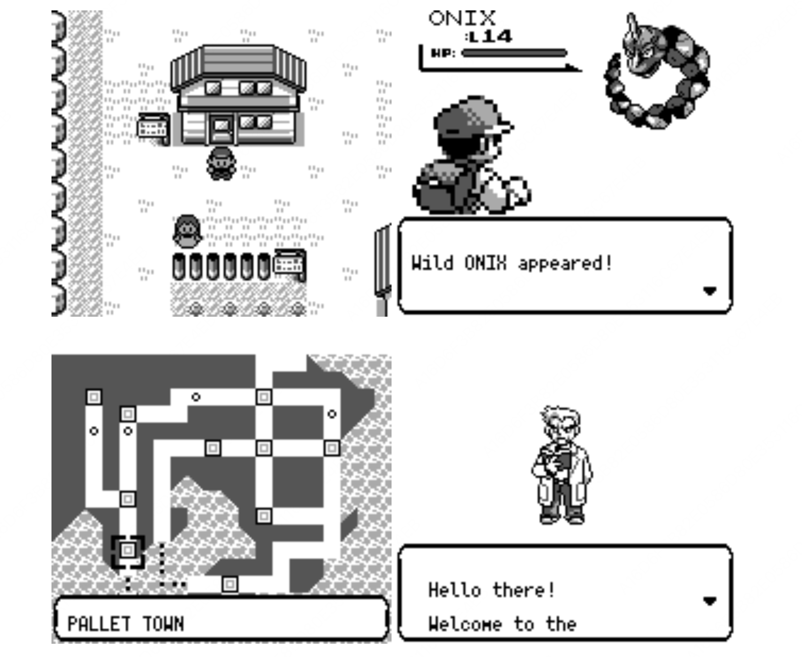
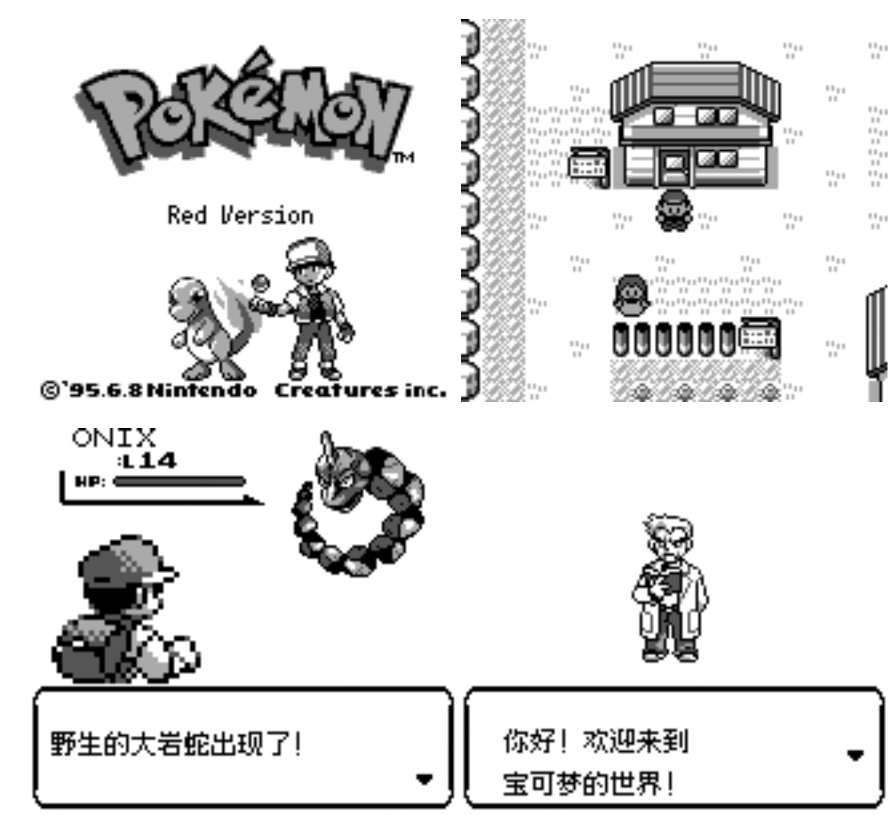

目前游戏已经完全处在可玩的状态。原版只能在 GameBoy 上运行，但我的复刻可以支持macOS、Windows、网页、Android和iOS，甚至可以支持 TUI ！

为了能快速展现效果，我在Github上部署了一版，大家可以直接点击体验： https://liuyanghejerry.github.io/open-pokered/

目前整个项目已经开源： https://github.com/liuyanghejerry/open-pokered 。这个版本是抽离了游戏引擎后的版本，我没有将原始工程直接发出来，主要是因为引擎和游戏的拆分是后来才正式完成，现在这个版本更加纯净。

我也将游戏的引擎单独抽离成了一个单独的工程：https://github.com/liuyanghejerry/dotzuki ，未来还可以基于这个引擎做更多有趣的游戏。

## 这个事情难在哪？

在撰写这篇文章时，复刻项目里共 **1823 条提交**、**189 次PR合并**，共计**41.6 万行**代码（涉及Rust/Web/DSL/Python，包括引擎+游戏+工具链）。

我知道现在 GPT-6 在网上已经杀疯了，但即使用 GPT-6 也不是一句话就能做好——做一个demo容易，但做一个复刻还原是比较难的，在其上优化架构就难上加难了。

但到底难在哪？

**硬件平台不同，编程方式也大有不同，代码没法照抄。**《宝可梦 红》在社区里已经有一份逆向工程了（https://github.com/pret/pokered ），里面甚至还有注释，所有我不需要从ROM中再去挖掘信息，但 GameBoy 时代的游戏基本上都是用汇编写的，而且汇编代码往往也是基于特定的CPU架构。虽然使用AI已经基本不需要阅读汇编代码了，但该项目有 1,923 个汇编文件，涉及 17.4 万行汇编代码，AI也没法精准还原每一句汇编的语义，这就导致我们需要投入大量的测试成本。

**没有人帮你梳理好所有的游戏逻辑。**尽管这是宝可梦的初代游戏，已经是最简单的宝可梦游戏了，但其中仍然有151只宝可梦、165个技能、391个训练师、245张地图、约500个NPC、200多个地图道具，其中要对齐的不仅是数值，同时还有关联关系和动效。自己写一个游戏时，你可以自己定义想要什么、什么才是对的，但你复刻一款游戏，答案往往是只有一个，你不一样，那你就是错的，就不是忠实还原了。而且因为 GameBoy 时代的硬件性能非常有限，当时的开发者不得不精打细算，牺牲了很多通用性的设计。比如整个《宝可梦 红》当中都没有一个完整的脚本引擎——这和现代游戏的引擎式做法相差很大。大量的游戏逻辑和渲染逻辑混合在一起，很难说有分层一说。

**直接逐帧对比并不可行。**我猜有人会和我一样，上手就尝试让AI控制模拟器版的原作，然后进行逐帧拆解和实现。我试过，这种方式非常低效。由于缺乏游戏内部信息的理解，只有图像等少量信息，AI 会花大量的时间在最基础的操作上，点几次前进、几次后退都需要反复思考衡量。你会发现大部分时间 AI 都不是在理解游戏，而是在折腾基本操作。 GPT-6出现后，情况有大幅改善，但如果整个游戏都按这种方式来做，成本依然非常之高。

**游戏是动态的，而不是静态的，时常也没有标准可言。**我试过复刻别人的网页，成功率要比复刻整个游戏高得多。大部分网页遵循组件化的现代设计，且Web是高度结构化的信息，这对于推理和模仿非常有利。但游戏往往不是这样，游戏的基础构件更加抽象、非标，结构化程度要更弱。更关键的，游戏的很多内容是动态的，需要感受整个过程而不是静态的结果，对齐的成本就会被显著拉升。

## 大致时间轴

整个工程是刚好伴随 AI 能力增强而不断迭代的，因此可以说是吃满了整个周期的红利。

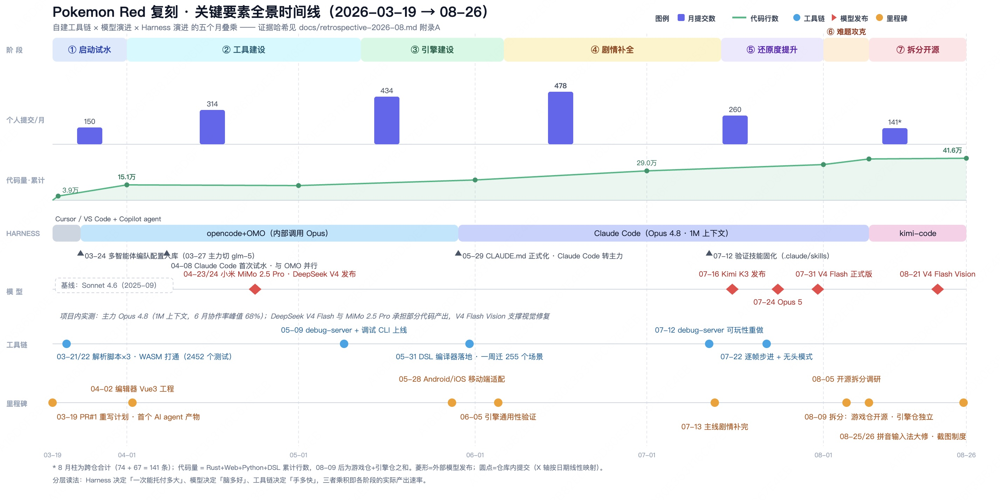

### 启动试水

复刻项目开工时，AI 的能力比较有限，因此我的人工介入也会相对多一些。项目最主要的技术栈选型和架构设计都是在那个时期完成。

这个时期最主要的工作是建模：对大地图、宝可梦、技能、图鉴等信息进行建模，设计成明确的数据结构。此时最主要的手段是让AI阅读汇编代码，然后通过不断丰富单元测试。

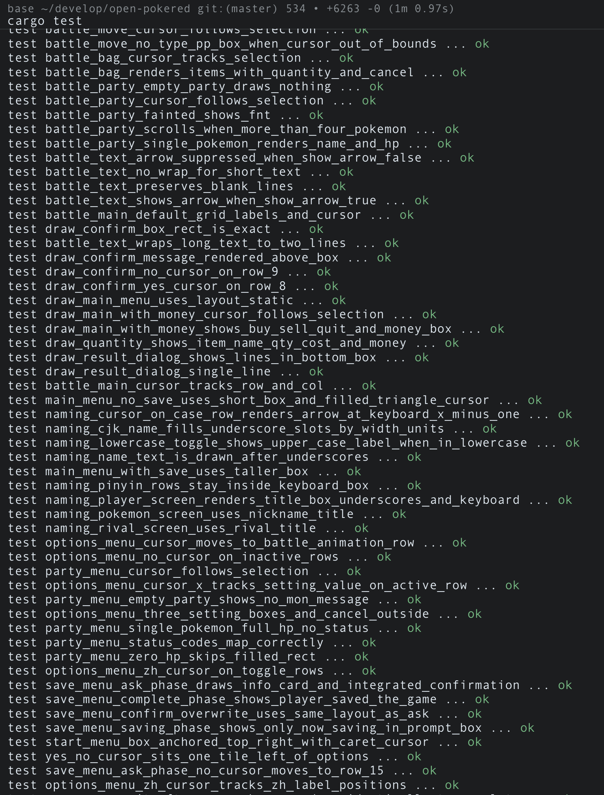

但是单靠单元测试只能证明代码没有逻辑漏洞，但不能确保对齐原作。因此我开始不断让 AI 梳理原版的逻辑，例如原版的地图展示逻辑、对战逻辑等，然后再让 AI 基于梳理出来的逻辑重新在我的复刻版当中实现。

### 工具建设

随着 AI 模型能力和 Harness 设施的演进，工具调用的能力开始变得成熟。我也开始进行更大规模的任务分派。游戏看起来是个整体，但实际上是由很多个子系统构成。

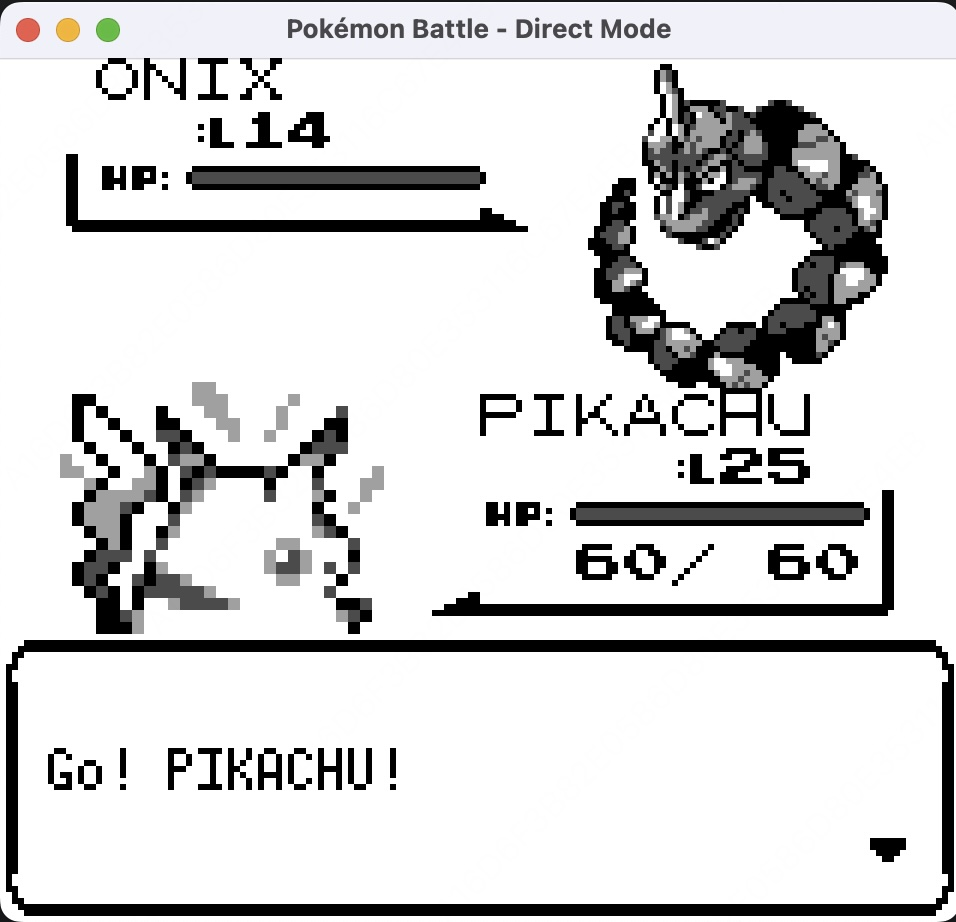

例如《宝可梦 红》的对战系统，就是一个相对独立的子系统。如果不做任何事情，那为了测试对战，就必须要先开始游戏，然后走剧情，直到玩到能对战的训练师，然后才可以进入对战。这种测试就非常低效。更好的办法是将这个子系统独立出来，有专门的单元测试，以及有专门的命令行测试入口，这样 AI 可以自主闭环进行对战。

早期的对战系统测试非常简单，完全基于命令行输入和输出，但用于验证对战算法已经完全足够。先调通底层算法，再去做图像覆盖，整个过程会更加高效。


后续 AI 开始具有了多模态能力，能够开始分析游戏截图，或是进行截图对比，因此我也专门做了即时截图的工具，方便 AI 边做边看。


### 引擎建设

正如前面所说，《宝可梦 红》的原版没有很严格的分层设计，其游戏脚本引擎也非常精简。但我们现在是2026年了，完全没必要这么拘束，因此我专门花了一段时间来进行引擎的建设。除了游戏剧情的脚本引擎外，我还额外做了一套DSL来表达对话框，这样游戏中涉及的多处对话框都可以用统一的方式进行对齐修正。

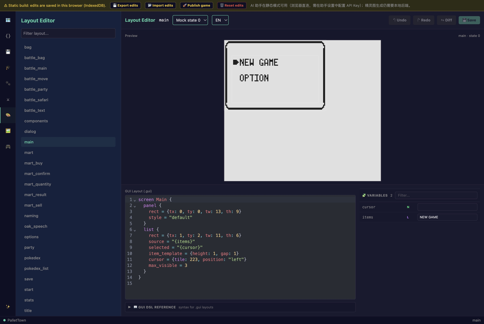
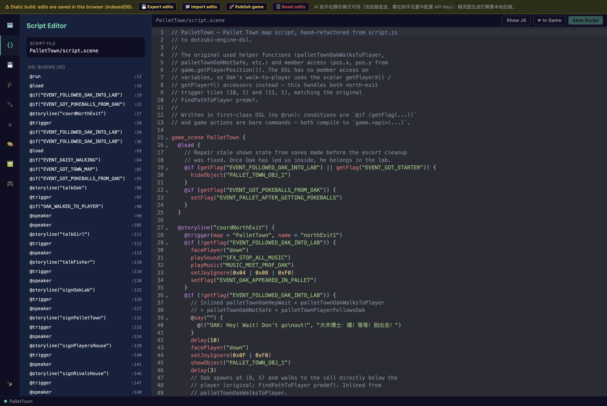

前期因为建设了大量的单元测试，建引擎的时候这些单元测试也发挥了不少作用。

后来我专门将引擎拆成了一个独立仓库，使其与游戏的剧情完全隔离，甚至去掉了几乎所有和宝可梦相关的元素：https://liuyanghejerry.github.io/dotzuki/stable/

这样工程的回归成本也可以大幅下降。

### 剧情补全 & 画面还原度提升

有了脚本引擎，剧情的补全就有了更好的基础。26年夏季，确定了脚本引擎没有大问题之后，使用 Flash 系列模型进行了大规模的剧情补全，效率非常高。我最初还担心 AI 对我自定义的DSL理解会有困难，实际上这完全是多虑。 当然为了更好地让DSL工作，我也配备了语法检查工具和手册，方便 AI 快速参阅。

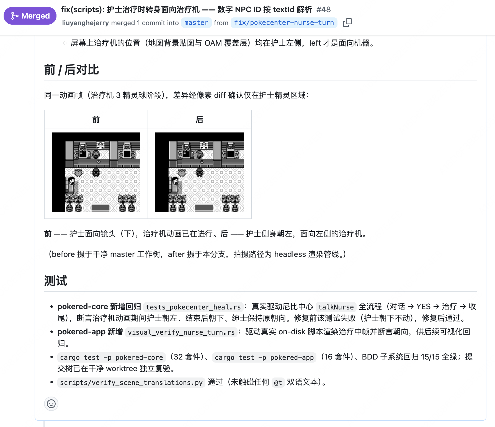

剧情大量补充之后，我开始关注游戏的一些画面还原细节。此时国内的模型也都开始配备多模态了，因此我重做了游戏的调试工具，增加了主角的随意定位能力、地图实时获取能力、摇杆状态、摇杆控制等命令，AI 可以快速地在玩和看之间不断循环，画面细节提升较快。

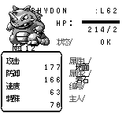
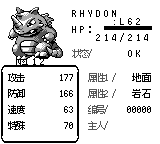

### 攀登更高的峰

许多游戏的细节靠代码静态分析是无法有效识别的，例如游戏中存在许多需要特殊道具，或者特殊剧情才能触发的后续关卡，单看某个场景的游戏脚本是不太能看出问题的。

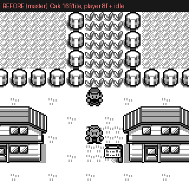
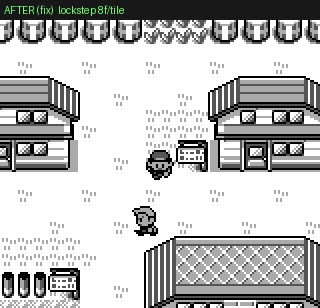

这种情况下需要构造游戏的状态来动态分析，因此最近我开始实验一种更强大的测试机制——**试玩**。

所谓试玩，就是让 AI 写游戏的操作脚本，来模拟人类进行游戏通关。在游戏的通过过程中，如果遇到了预期外的情况，那就说明遇到了 bug 。根据我的实测，最新的 Kimi K3、GLM-5.3等都可以写出通关脚本并进行试玩，美中不足在于如果不加以引导，那么 AI 的游戏通关脚本会仅限于进行游戏的主线剧情，支线剧情往往不会去尝试。

GPT-6 发布之后，AI 操控工具和窗口的能力更加强大，我可以在试玩的基础上进一步叠加一些“自由游走”的任务，让 AI 和脚本更好地共存。

另外，在GPT-6之前的模型大部分对连续帧的理解不够好，因此我的工程中还遗留了相对一部分动效没有完全对齐，这也是未来可以追齐的内容之一。

下面我再说一些我自己在过程中的认知迭代。

## 认知一：模型能力是决定性因素

复刻这类项目有两种工作，对模型的要求截然不同。

一种是**模式明确的局部生产**：写解析脚本、搬数据、迁移场景。这类工作2026年3月的模型就能胜任，甚至仅靠 Copilot 级别的代码补全都能做完。这种工作不会构成瓶颈。

另一种是**需要真正推理的判断题**。复刻的核心工作不是"写一个像宝可梦的游戏"，而是**对齐实现**：左边是 原作的反汇编，右边是我的 Rust，要回答的问题是"这两个东西在边界条件下行为是否一致"——捕捉采样的随机数怎么取、剧毒和普通中毒如何切换、暴击率查表的下标有没有差异等。由于编程语言、技术栈、架构模式都做了变化，我们需要模型同时理解两套语义再做等价性论证。如果模型推理能力不够，它会给你一份"看起来像对齐了"的报告，还不如不搞，人工介入只会永无止境。

让我印象深刻的一点是 Rust 的 framebuffer 模块的 Android/iOS 集成。在使用早期的大模型进行集成时，大模型总是搞不定生命周期和同层异构渲染。后来 Claude Opus 入场，这个问题几乎在半小时内就搞定了。

但只靠推理能力还不够，还有一道更晚才跨过去的门槛：**视觉**。渲染问题——字体阴影偏了一像素、菜单光标错位——在强力的多模态模型上线之前，只能我人眼过截图再文字描述回去，即使使用像素对比测试也逃不过要描述差异。截图能回传模型之后，"看图找茬"才形成闭环，让视觉修复能够循环起来。

## 认知二：Harness 决定人的参与度

在复刻进行的这五个月里，我用了四代不同的 harness，每代之间的差别不是"写得更快"，而是**我可以交给AI多大的事**：

- **Cursor / VS Code 时期**（三月）：单文件级生成，我审每个 diff，提交是我手写的里程碑流水账、直推 master。那时候自动化程度比较低，最多也就做做build验证和一些基础的单元测试。
- **opencode + OMO 组合时期**（三月下旬起）：很快我意识到这个工程对我的依赖太重，进度也难有突飞猛进，万幸我在社区中发现了oh-my-opencode这样的强力工具。彼时的大模型各有千秋，Claude和GPT擅长的工作各不相同，因此通过 opencode + OMO 的角色分解（规划/实现/评审/检索）加多供应商分流，可以把"一个特性"切成可并行委托的任务包。这个时期大模型的上下文普遍只有200多，通过OMO进行自动compact，能够让任务有机会闭环。它解决的是**单特性、单任务**这个粒度。
- **Claude Code 时期**（约五月底）：一段时间后我发现Claue Opus的推理能力极为突，同时还拥有强大的视觉能力，以至于opencode中的其他模型我基本用不上，只有排查疑难杂症时才偶尔需要GPT，因此我决定全力拥抱 Claude 。CLAUDE.md 能让项目记忆跨会话存活，skills 把调试和截图验证固化成流程，1M 上下文也能让单个任务连续运作很久。此时目标的粒度从"特性"级别演化为"战役"级别。
- **kimi-code 时期**（八月下旬至今）：Opus虽好，但搞定账号、保护账号逐渐成了难题，万幸kimi k3横空出世。我在第一时间尝试了K3的能力后当机立断开了订阅，事实证明这笔买卖是超值。这个时期长程任务（比如跨三个仓库做 git 考古）成为日常。目标可以模糊到"把这件事弄清楚"。

这条线的本质是**人的参与度持续下降**：从作者，到调度员，到验收员。OMO 时代我必须把意图切成模型能吞下的块；agentic 能力强的模型出现后，切块这个动作本身也可以委托出去了。目标越模糊、周期越长的任务，越吃模型和 harness 的乘积——两者缺一个，委托边界就退回上一档。

## 认知三：技术栈是 AI 时代的第一架构决策

两个选型决定是开工第一周做的，当时凭直觉，五个月后才看清它们到底省了什么。

**Rust 的核心价值是验证成本。** AI 写代码快，但"AI 写得对不对"的确认成本才是瓶颈。Rust 编译器是一个永不下班的第一 reviewer：类型错误、所有权问题、半个 API 误用，全在编译期被拦下，反馈以秒计。第 3 天仓库里就有 2452 个测试在跑。

四月是唯一一个代码净减月（+4.8 万/−5.5 万行）——编辑器推倒重写、战斗系统重构——没有编译器和自动化测试托底，这种删法不敢用 AI 做。AI 时代选语言的第一标准应该从"生态和性能"改成"**机器验证产出的成本**"，Rust 恰好是这条标准下的最优解。

**正确的技术选型让跨平台变得极为容易。** Rust 本身就是一门跨平台能力极强的语言，其社区中拥有大量跨平台的可复用组件，其中就包括了游戏渲染引擎所依赖的 framebuffer 。

为了验证跨平台的可行性，3 天时间 WASM 构建就通了；5 月 12 日渲染器拆出 framebuffer/gpu feature 之后，Android、iOS 在月底跟上；到最后拆分，Web、桌面、Android、iOS、TUI 五端共享同一套渲染栈。移动端适配、Web 部署这些在传统项目里各占一个人力的事，而我们每个平台只在几条提交里就搞定了。复刻类项目最大的隐性成本不止在于"写出游戏"，而是"让游戏在每个能跑的地方都跑得一样"——这个成本被架构决策一次性压掉了。

回过头来看，如果我们选错了技术栈，即使模型的能力很强，跨平台的 Token 成本也会高居不下，并在每一次新特性加入时都迎来额外成本。

## 认知四：架构选型决定游戏怎么拆才是合理的

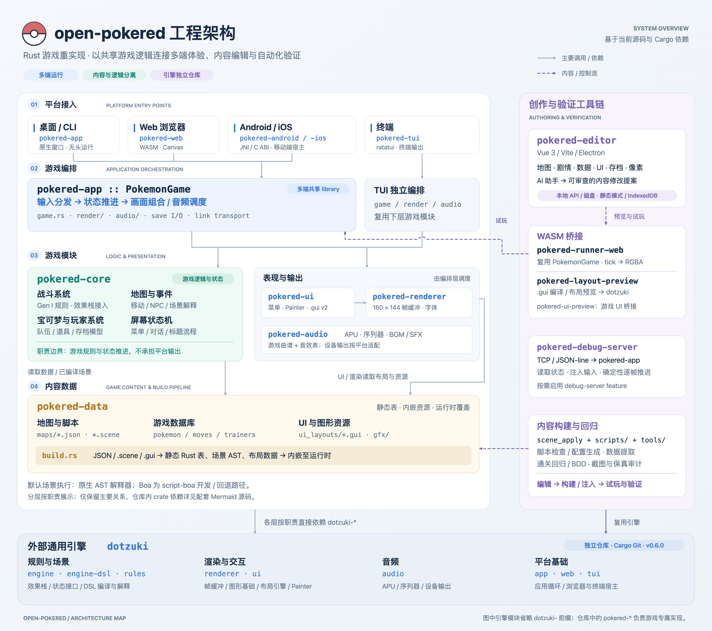

模型、harness、工具链是三个乘数，但乘法作用在什么形状的对象上，由架构分割决定。复刻一个单体的 GB 游戏，最省事的路径是写成一个单体的 Rust程序——所有逻辑、渲染、平台代码搅在一起，AI 也能写，只是之后每一次改动都要在一坨纠缠里做。但我也是软件领域的老兵了，我没有选择让 AI 只交付功能，而是有意识地对架构做了选型和分割：

- **逻辑与引擎分离**：在《宝可梦红》所在的 GameBoy 时代，程序员们的主要难点在于怎么把游戏做出来并塞进 GameBoy 那么狭小的硬件里。但今天的软硬件环境已经大为不同，我不希望游戏复刻后成为一个固化难以复用的大单体，因此我有意识地让 AI 把复刻的游戏工程拆成了引擎和游戏本体两部分。
- **逻辑与平台分离**：为了让游戏能够跨平台，只靠技术栈还不够，我们还需要将平台特定的部分隔离开，这样游戏逻辑就不需要再关心具体的渲染方式、硬件输入处理逻辑等。在过去你说要把一个游戏做成TUI，那真的是约等于重做一遍游戏，但你做对了架构选型，TUI也就只不过是多一个小渲染器罢了。
- **内容与代码分离**：反汇编版的《宝可梦红》并不区分数据和代码，它们基本上是同一坨东西，这也是硬件环境受限带来的局限。如果单纯让 AI 照抄，那么复刻出的游戏也会是一样。但我希望游戏的逻辑与数据进行分离，因此我设计了单独的剧情引擎、对话框布局引擎等，将这些数据全部下沉为 DSL 和 JSON。除了内容变得更容易调整，还能够顺手搞定开发时的热更新，减少改一次代码就等一次编译打包的痛苦。

长期使用 AI 进行编程的人会有一个感受： CI/CD 的成本会越来越高，因为 AI 不仅写代码，也写测试，但如果每次变更都执行全量的测试，不仅等待的时间越来越长，你的 Github Actions 的费用也会越来越高。而有了正确的架构之后，模块边界就是 AI 变更的防火墙。每个模块职责单一，改动的影响面可预测，CI 的运行范围也会更加可控，转而帮助我们优化了长期成本结构。

架构分割决定的不是代码长什么样，而是**变化发生在哪**。前期它是一笔"多写骨架"的开销，后期它让每个新需求——新平台、新游戏、新审计——都有一个明确的落脚点。

## 认知五：可验证性要专门建设

游戏是图形程序，对 AI 天然不友好：**引擎内部不可见，游戏进度不可控**。改完一段遇敌逻辑，想知道对不对，得真的走进去撞几十次怪，前期这部分验证基本只能靠我人肉。我在社区里看过 AI 控制GameBoy模拟器的项目，也尝试用过，但这种模式导致每一步的操作都需要 AI 进行判断，不仅速度奇慢无比，还会很快耗尽 Token Plan。

今年上半年社区里很重要的一个变化是：browser-use 类的项目变得真的可用。而 browser-use 的大面积推广，除了模型推理能力的提升外，还依赖于 Chromium 有一套长期积累的 CDP 协议，这套协议给 AI 装上了手脚，这给了我很大启发。

AI 识别图形不仅慢而且还不准，那就干脆别只依赖图形识别了，解法是 debug server：一个 TCP 端口上的 JSON-line 命令/响应协议，思路仿照 Chrome 的 DevTools Protocol——状态查询（`get_state`/`get_npcs`）、输入注入
（`press_sequence`）、时间控制（`step_frames` 同步逐帧步进）、传送（`warp`）：

```
05-09  出生（同日 CLI 拿到 warp / skip-intro）
07-12  可玩性重做，能真正用于 playtest
07-22  逐帧步进 + headless 模式
        ↓ 立竿见影
07 下旬  战斗保真度专项铺开
08-14→17 保真度审计闪电战，两轮高中优先级问题四天打包合入
```

**验证能力的回报是在后期集中兑现的**，这也是为什么它容易被推迟投资。验证工具未来不再是不是开发的副产品，是要提前建设的基础设施，它对 AI 的意义远大于对人——人可以"玩玩看"，AI 必须"量一量"，只有可度量的东西才是真正可改进的东西。

这里也值得再提一提我的测试能力建设，这个项目的测试不是补的，我不仅做了大量的单元测试覆盖，同时还使用 golden snapshot 测试把菜单、对话框、战斗画面的渲染输出用帧缓冲哈希锁死，重构只要改了视觉输出就立刻红。由于我的工具和模型一直在换，为了确保长期稳定，这些测试能力通通放进了 Github 的 CI，任何变更也必须通过 Pull Request 触发 CI。

## 认知六：成本结构改变工作组织方式

这条不是技术认知，是经济学认知。

4 月 23/24 日，小米 MiMo 2.5 Pro 和 DeepSeek V4 几乎同时发布，我的月提交量随即从 314 跳到 434；7 月 16 日 Kimi K3 带着 long-horizon agentic 能力进场，月底 V4 Flash 出正式版。这两个模型加上 Kimi，承担了项目相当一部分代码产出——它们和 Opus 的分工不是"好坏"之分，而是**贵贱搭配**：贵的模型管决策和评审，便宜的模型管规模化执行。

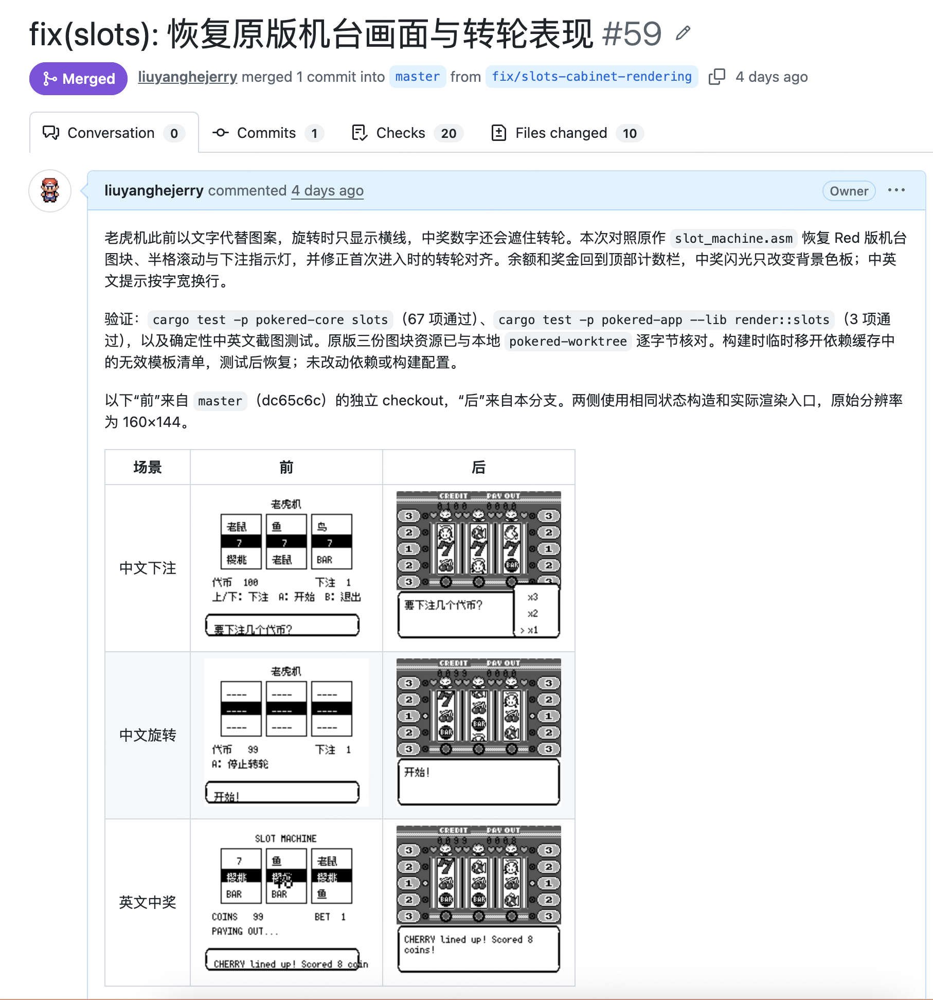

便宜的意义不是省钱，是**以前不划算做的事现在可以做了**。全量保真度对齐、逐场景比对、大规模剧情补全——这些活的共同点是单体简单、总量巨大，完美匹配"便宜模型 + 高并行度"。当 token 价格降一个数量级，工作的组织方式跟着变：从"精挑细选让贵模型做"变成"撒出去让便宜模型并行做，贵模型抽查"。

同时发生的还有依赖结构的变化：从完全依赖海外模型，国产模型占据主导，不再受制于人。

## 结语

在这5个多月中，除了模型越来越厉害之外，我感受到更多的是做工程的理念已经发生了根本性的变化，验证工具建设、架构设计和技术栈选型的价值在这个时代将显著提升，衡量一个工程做的好与坏将变得真正可行，而不再是停留于“圈复杂度”。
《宝可梦 红》的复刻至今仍未结束，但我已经越来越有信心将其完成。
