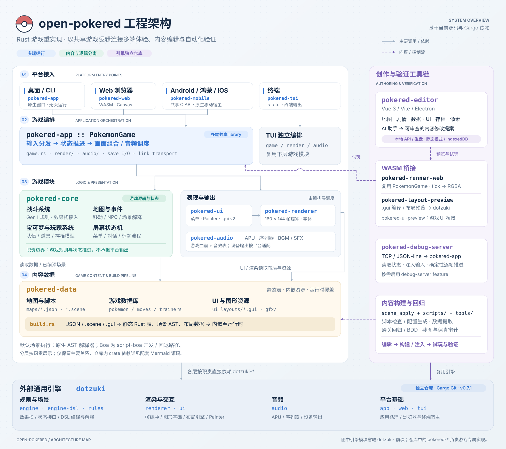

# open-pokered 工程架构

[高清 PNG](diagrams/open-pokered-architecture.png) · [可缩放 SVG](diagrams/open-pokered-architecture.svg) · [Mermaid 模块依赖图源码](diagrams/open-pokered-dependencies.mmd)

主图按职责分层，实线表示主要调用或依赖，紫色虚线表示内容或控制流；Mermaid 图覆盖当前工作区的直接 Cargo 依赖，包含可选依赖，不展开传递依赖、测试依赖或外部引擎内部关系。

| 层次 | 模块 | 职责 |
| --- | --- | --- |
| 平台接入 | `pokered-app`、`pokered-web`、`pokered-mobile`、`pokered-ios`、`pokered-tui` | 窗口、输入、平台生命周期与显示适配；Android 与鸿蒙共用移动 ABI |
| 游戏编排 | `pokered-app::PokemonGame`；TUI 自有 `game/render/audio` | 推进状态、切换屏幕、组合画面、调度音频和平台 I/O |
| 游戏逻辑 | `pokered-core` | 战斗、地图、事件、宝可梦、道具、存档模型与屏幕状态机 |
| 表现与输出 | `pokered-ui`、`pokered-renderer`、`pokered-audio` | 菜单布局、160 × 144 帧缓冲、图形基础、游戏曲谱和音频输出 |
| 内容数据 | `pokered-data`、`gfx/` | 地图、物种、招式、训练师、场景脚本、UI 布局与图形资源 |
| 创作与验证 | 编辑器、3 个 WASM 桥接 crate、调试服务、`scene_apply`、`scripts/`、`tools/` | 编辑、预览、试玩、内容构建和自动化回归 |
| 外部引擎 | 独立仓库中的 `dotzuki-*` | 通用效果栈、DSL、渲染、UI、音频和平台基础；Cargo Git 依赖固定在 `v0.7.0` |

阅读时留意这些边界：

- `pokered-app` 同时提供原生入口和共享 library，Web、移动端及编辑器试玩复用其 `PokemonGame`。TUI 使用自己的编排代码，直接复用 core、UI、renderer 和 audio。
- 分层表示职责，并非每一层只依赖紧邻下层。UI、renderer 会读取核心状态与数据；具体屏幕的画面组合还在 `pokered-app/src/render/` 和 TUI 的 `render/` 中。
- 战斗生产路径通过 `pokered-core` 的规则适配接入引擎 `StackDriver`。场景 `.scene` 默认在构建时编译为 AST，再由原生解释器执行；Boa 保留为 `script-boa` 开发 / 回退路径。
- `build.rs` 把 JSON 生成静态 Rust 表，把 `.scene` 编译并内嵌 AST / JS，把 `.gui` 编译并内嵌布局 JSON。UI 的 v1 与 v2 目前并存；`gfx/` 是单独获取且被 Git 忽略的图形资源。
- 编辑器当前布局预览和 DSL 编译使用 `pokered-layout-preview`，直接复用 dotzuki；`pokered-ui-preview` 是仓库内另一套游戏 UI 预览桥接。试玩使用 `pokered-runner-web`，通过输入、逐帧 RGBA 和数据注入接口连接完整游戏。
- 编辑器在本地 / Electron 模式经 API 编辑磁盘内容，静态模式使用浏览器 IndexedDB 覆盖数据。调试服务由 `pokered-app` 的可选 `debug-server` feature 启用，提供 TCP JSON-line 控制；回归脚本据此读取状态、注入输入并推进帧。

核对入口：[工作区清单](../Cargo.toml)、[开发与架构说明](../CLAUDE.md)、[共享游戏编排](../crates/pokered-app/src/game.rs)、[TUI 编排](../crates/pokered-tui/src/game.rs)、[内容构建](../crates/pokered-data/build.rs)、[布局预览加载](../tools/pokered-editor/src/composables/useWasmPreview.ts)、[试玩桥接](../crates/pokered-runner-web/src/lib.rs)。

更新架构图时，以各 crate 的 `Cargo.toml` 和实际调用代码为准。SVG 是展示图的可编辑源文件，PNG 是其 2 倍分辨率导出；Mermaid 文件单独维护精确到 crate 的依赖关系。
