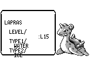
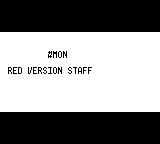
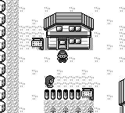

# 连续通关审计：2026-09-07

本轮新增确认 **43 项问题**（劲敌事件含不同独立原因），另有已观察待复现项。**已完成通关**：八枚徽章、联盟前劲敌、冠军之路、四天王及冠军均实际战胜，名人堂与片尾播放结束，自动存档后在独立新进程 CONTINUE 成功返回真新镇。主线通过正常按键驱动；过程中使用了下文明确记录的局部补丁，因此不能视为未修改版本已经可完整通关。未修复问题仍保留在报告中。

| 严重度 | 新问题 | 实机证据 |
|---|---|---|
| 高 | 一击必杀按等级而非当前速度判断，错误击倒冠军战主力 | 两次角钻击倒与原版对照；新增回归失败后修正 |
| 中 | 名人堂第二属性文字越过下边框 | 嘟嘟 FLYING／拉普拉斯 ICE 两组片尾截图 |
| 中 | 片尾 POKéMON 被显示为字面 #MON | 正常片尾截图与原版 $54 控制符对照 |
| 严重 | 从南端返回地下通道时渲染越界崩溃 | 正常步行两次复现，Rust panic 日志 |
| 严重 | 战斗用药删掉化石／关键道具，药品不减少 | 两次隔离复现，补丁后两次验证 |
| 高 | 红莲道馆谜题门禁未初始化，可直接通过 | 未答题／未胜训练家，两次穿门 |
| 中 | 红莲问答被替换，答对会隐藏训练家并标为已胜 | 七段真实问答及对象／旗标对照 |
| 高 | 宝可梦屋三层雕像无法交互，开关不触发 | 正面两次按 A 与真实地图测试失败 |
| 高 | 西尔佛胜利后金黄市火箭队不撤离，道馆仍被堵住 | 主线交互与独立重启步行复现 |
| 中 | 捕获闪电鸟后地图对象仍可见、可交谈 | 主线与独立 CONTINUE 后鸣叫截图 |
| 高 | 董事长室门锁无法用钥匙卡打开 | 主线两侧交互失败，实际地图测试复现 |
| 高 | 西尔佛坂木误用常磐道馆队伍 | 两次独立构造开门条件后实际触发 |
| 高 | 西尔佛三层未持钥匙也能穿过门禁 | 独立存档两次穿越，钥匙与解锁旗标均无 |
| 高 | 西尔佛劲敌误用圣安奴号队伍 | 两次开战均为 19 级比比鸟起手的四人队 |
| 高 | 新战斗仍派出已经倒下的队首宝可梦 | 三次野生遭遇与 0 HP 战斗截图 |
| 高 | 宝可梦塔一层楼梯无法上楼 | 两方向重踏楼梯及实际地图测试复现 |
| 高 | 坂木区域门锁未初始化，未胜守卫也能通过 | 隔离存档两次正常步行通过 |
| 高 | 主动交谈训练家只说话，不开战 | 坂木门前守卫重复实测；实际场景回归 |
| 高 | 地下通道南端出口返回北端 | 连续步行两次复现，补丁后到达 Route6 |
| 高 | 圣安奴号一层两出口无法离船 | 两出口步行复现及生产地图步行测试 |
| 高 | 有船票仍被拒绝登船 | 两次复现 |
| 高 | 劲敌战接口缺失；战后结果变量越域（华蓝／圣安奴号） | 入口两次复现，真实场景测试定位第二个原因 |
| 高 | RIVAL2／RIVAL3 类名数字被当成队伍序号 | 圣安奴号两次出现 5 级杰尼龟 |
| 高 | 劲敌初始宝可梦取决于当前领队，进化后落入默认分支 | 妙蛙草领队时错误选杰尼龟 |
| 高 | 正辉电脑事件绑定在空地 | 主流程及独立进程复现 |
| 中 | 长背包列表不滚动，选中项及光标移出屏幕 | HM03／HM04 两次菜单与实际学习对照 |
| 中 | 狩猎地带球数文字绘制在信息框外 | 西区、中央区两次 START 菜单截图 |
| 中 | 塔顶火箭队战败后不逃离、不隐藏 | 三名队员战后旗标与可见状态对照 |
| 中 | CUT 后树仍显示，但已能穿过 | 两次正常砍树，截图与通过坐标对照 |
| 中 | 遗忘招式菜单长名称越界并被截断 | 主流程及隔离存档二次复现 |
| 中 | 正辉缺少进出机器的演出 | 两次运行状态／截图及汇编对照 |
| 中 | 已离场劲敌重新进图后又出现 | 离场截图及多次地图往返对照 |
| 低 | 捕获卡比兽后仍播放其返回山里的对白 | 主流程及独立捕获复现 |
| 低 | 奖金文案硬编码 Player，额外小费／合计分页 | 多场战斗截图及汇编对照 |

接续 2026-09-06 的两徽章存档。此前已记录一次为绕过读档出口错误而进行的 Route4 定点恢复；本轮从其后正常取得的华蓝存档继续。以下记录严格区分未修改游戏的故障现场和局部补丁后的流程。

## 新确认：劲敌场景无法正常完成（严重）

1. 未修改版本在华蓝市 (20,6) 触发劲敌，对话后不进入战斗，`EVENT_BEAT_CERULEAN_RIVAL` 仍为 false。两次复现。见 `rival-repro-second.json`、`baseline-rival-abort-final.json` 和同名 PNG、`controller.log`。
2. 原因一：`CeruleanCity/script.scene` 调用 `startBattleSet`，而默认 `NativeHost` 未注册此函数。桥接层已经支持该命令，但调用到不了桥接层。运行器将未知函数异常记日志后结束脚本，玩家看不到错误。
3. 补齐接口后实际打赢一次：金钱 4463 → 5058、妙蛙草 22 → 23 级，但旗标仍未写入，劲敌未离场。见 `rival-battle-entered.json`、`rival-result.json`。
4. 原因二：三个条件分支各自声明 `result`，分支外读取时变量不可见。真实场景 AST 测试确定错误为 `variable 'result' is not defined`，见 `rival-scope-failure.log`。本地续跑补丁将三个完全相同的调用合为同一作用域的一次调用。
5. 关联风险（静态发现，尚未实测）：Route22 的两次劲敌战、PokemonTower2F 使用同一个缺失接口及相同作用域写法。

## 审计辅助改动

- 新增本地 debug `capture_frame { path }`，直接绘制当前帧为 PNG，命令本身不推进模拟。用于连续游玩截图；debug-server 4 项测试通过，实机截图调用成功。
- 临时导航器增加脚本空效果等待时的输入推进。自动化等待失败与游戏异常分别记录，不将所有超时当作卡死。
- 劲敌接口与华蓝场景作用域修复仅为打通审计续跑；补丁前不能通过的部分不会计作原版正常。

尚未通关。后续进度、现场证据继续追加。

## 补丁后进度

华蓝劲敌已在实机重赛胜利，完成旗标为 true，劲敌离场；见 `m15-rival-actual.json`、`rival-after.png`。本轮曾正常战败一次后重赛，不计作 bug。原生脚本 13 项测试通过（包含实际华蓝场景及战斗胜负返回测试）。

## 新确认：战后奖金文本与玩家名字错误（低，画面／文本）

实际击败 Route24 的 LASS 后显示 `Player got $210 for`，而本存档玩家名为 RED；还多出 `LASS wants to / give you a tip!` 和 `Total: $210!` 等分页。多场训练家战重复出现。见 `prize-player-name.png/json`、`prize-tip-extra.png/json`。

当前 `crates/pokered-core/src/battle/mod.rs:2470` 起硬编码该文案；参考 `data/text/text_2.asm:867` 的 `_MoneyForWinningText` 使用 `<PLAYER> got ¥...`、下一行 `for winning!`。本项只确认显示与流程文案问题，没有据此认定奖金数额计算错误。未修复，以保留续跑基线。

## 新确认：正辉家的电脑事件绑在空地上（高，交互错位）

答应帮助正辉后，面对实际电脑 `(1,4)` 按 A，只出现 `TELEPORTER is displayed on the PC monitor.`，不启动分离。站在 `(5,5)` 面朝上，对空地 `(5,4)` 按 A 才启动分离并设置 `EVENT_MET_BILL_2`。随后可正常找人形正辉获得船票。

当前 `BillsHouse/map.json` 将 sign 1 放在 `(5,4)`，`script_config.json` 将它绑定到 `pcMachine`；实际电脑 `(1,4)` 的 sign 2 却绑定到 `billsPc`，未帮助时只给普通提示。原版 `data/events/hidden_events.asm:488` 与 `engine/events/hidden_events/bills_house_pc.asm:1` 由 `(1,4)` 的同一电脑按剧情旗标分派细胞分离／普通显示／收藏列表。

现场：`bill-visible-pc-dialogue.png` 对比 `bill-invisible-pc-dialogue.png`，相应 JSON 包含坐标、旗标与 NPC 状态。未修改这一问题，续跑使用正常按键在错误的空地交互点推进。

## 新确认：正辉变身缺少进出机器的演出（中，画面／剧情）

答应帮助后，怪物形态仍站在 `(6,5)`，可见且无移动路径；分离后立刻隐藏怪物，并在 `(4,4)` 显示人形。见 `bill-agreed.json/png`、`bill-converted-actual.json/png`。原版 `scripts/BillsHouse.asm:19` 起让怪物上行进入机器后隐藏，`:62` 起定位人形并执行出机器路线。当前 scene 明确省略了这些移动，只剩对白及显隐切换。

## 验证补充

独立隔离存档跑开局回归：m01–m08 通过；m09 在常青森林 `(26,27)` 多次导航无进展，最后地图检查得到 PalletTown 而失败，见 `opening-regression.log`。因此不声称完整 m01–m10 回归通过。此日志不足以单独认定新增游戏缺陷。

当前已正常取得金珠及圣安奴号船票，妙蛙草 26 级，仍为两枚徽章。劲敌流程依赖本地补丁，正辉事件通过错误的空地交互点推进；尚未通关。

正辉两项问题已由独立隔离进程从门口存档复现第二次，见 `bill-repro.log` 和 `bill-repro-visible-pc.png`／`bill-repro-invisible-pc.png`。可运行 `python3 docs/audits/2026-09-07/repro-bill.py` 复现（先构建带 debug-server 的当前审计二进制）。

## 新确认：已离场劲敌在重新进图后再次可见（中，画面／持久化）

本轮华蓝劲敌经历一次正常战败、重新挑战胜利后，`m15-rival-actual.json` 中 NPC 已隐藏；之后离开华蓝再返回，劲敌又出现在 `(20,2)`。`EVENT_BEAT_CERULEAN_RIVAL` 始终为 true。再通过宝可梦中心进出两次，仍可见，见 `rival-reappeared-first-return.json`、`rival-reappeared-second-return.json` 和 `rival-reappeared-visible.png`。因此是离场状态恢复错误，不是合法的第二场剧情战。

两个互斥键 `__OBJ_HIDDEN_CERULEAN_RIVAL`、`__OBJ_SHOWN_CERULEAN_RIVAL` 同时为 true。`update.rs:2704` 隐藏对象时只从 unified_flags 删除 shown 键；随后 `sync_flags_from_engine` 的 merge 可把运行器里的旧 shown 值加回来。`screen.rs:1990` 恢复默认隐藏对象时又以 shown=true 覆盖先前隐藏处理。此处已确认当前存档的表现和冲突旗标；尚未对所有 NPC、所有首次胜利路径做普遍性断言。未修复。

## 新确认：地下通道南端出口回到北端（高，流程阻断）

连续步行 `Route5 → UndergroundPathRoute5 → UndergroundPathNorthSouth → UndergroundPathRoute6`，从南端入口屋 `(3,7)` 出门，却抵达 `Route5 (17,27)`，不是 Route6。连续两次复现，中间没有读档或 debug warp。见 `underground-south-before-exit.json`、`underground-wrong-exit-first.json`、`underground-wrong-exit-second.json` 及同名 PNG；完整协议压缩保存在 `continuous-protocol.jsonl.gz`。

原版 `scripts/UndergroundPathRoute6.asm:1` 先写 `wLastMap = ROUTE_6`，5/7/8 号入口也各自写所在道路。当前 scene 将此视作引擎记账而省略，但引擎只有从室外进入时记 last_map，因此贯穿地下通道后仍指向来时道路。这与先前“室内读档后出口默认 PalletTown”的缺陷是不同触发路径。

为续跑，本地补丁在地下通道入口加载时写入正确的道路，覆盖四个入口；南北两端为实机发现，东西两端为同源映射的防回归覆盖。下一轮继续从 `underground-blocked.sav` 和配套 sidecar 恢复。

地下通道补丁后实机已到达 `Route6 (17,13)`，见 `m19-route6.json`／`underground-exit-after.png`，全程仍为按键步行。相关大地图测试 721 项通过，见 `overworld-tests.log`。

## 新确认：战斗用回复药删除化石／关键道具（严重，数据损坏）

在独立诊断分支恢复补给存档（主通关存档未受影响），用 debug 启动野生小拉达战，按键使用 Growl 让对手造成伤害，再打开 ITEM 使用 Potion。两次均恢复 HP，但 `HelixFossil` 被删除，Potion 仍为 12 瓶。见 `item-consumption-0-before.json`／`item-consumption-0-after.json` 和第二组同名证据、`item-consumption-repro.log`。

原因：`battle/mod.rs` 的 `consume_selected_item` 将战斗过滤列表的 cursor 直接传给完整背包的 `remove_item_at`。本存档化石等不能在战斗使用的道具排在 Potion 前面，过滤后 Potion 是第 0 项，实际被扣除的却是完整背包第 0 项化石。HM／其他关键道具位于该位置时同样存在风险。

本次复现明确使用了调试生成的野生战，只作为子系统诊断，不计入通关路线。将修正为按所选 ItemId 扣除，并以实际战斗菜单回归覆盖野生／训练家两种过滤情况。`repro-item-consumption.py` 保留故障断言；修复后二进制应不再满足这些故障断言。

补给流程说明：实际出售金珠并买到 12 瓶 Potion、5 个 PokeBall。审计驱动最初误判商店 Result 会等待确认，多按 A 导致误卖 TM34，获得额外 1000；这属于驱动操作失误，单独记录，不列为游戏 bug。当前主存档仍有化石、TM11、船票、TM28 和上述补给。

道具扣除修复后，同一隔离存档的实机测试两次均为 Potion 12 → 11、HelixFossil 保留，见 `item-consumption-verified.log` 及 `item-consumption-fixed-0-after.json`／第二组证据。核心测试共 2452 项通过（`core-tests-final.log`）。新增 debug 只读状态包含实时战斗 HP、过滤后战斗背包、完整战斗背包和商店阶段，便于闭环使用道具，避免误用存档中的战前 HP。

补丁续跑已进入枯叶市并在中心回复，妙蛙草 28 级，两徽章；途中按正常战斗菜单用了两瓶回复药（12 → 10），化石／船票等保留。见 `m19-vermilion.json` 及配套存档。

## 新确认：持有船票仍被拒绝登船（高，流程阻断）

正常取得并持有 `SsTicket ×1`，在枯叶市 `(18,30)` 接受水手检票，却收到没有船票的对白并被推回 `(18,29)`。两次复现，见 `ticket-refusal-dialogue.png`、`ticket-refused-first.json`／`ticket-refused-second.json`。

`VermilionCity/script.scene` 的交谈与自动检票两处查询 `hasItem("S_S_TICKET")`，但传入脚本的 `ItemId::SsTicket.const_name()` 为 `SS_TICKET`，NativeHost 进行精确字符串比较。原版以道具编号 `S_S_TICKET` 查询，没有这层拼写不匹配。本地续跑补丁统一为背包提供的名称，并测试有船票放行／无船票推回两条实际场景分支。

自行车兑换券和旧钓竿已正常取得，见 `m20-bike-voucher.json`、`m20-old-rod.json`。当前存档位于登船检查前，两枚徽章，妙蛙草 28 级；未通关。

## 新确认：圣安奴号劲敌错误地使用第一阶段队伍（高）

正常登船触发劲敌，实际只有一只 5 级杰尼龟；一击获胜，只给 175 奖金。再次进入战斗仍是同一只。见 `ss-anne-wrong-party.png/json`、`ss-anne-rival-second-start.json`。原版 `data/trainers/parties.asm:675` 的圣安奴号队伍为比比鸟 19、拉达 16、勇基拉 18、克制所选初始宝可梦的进化形 20（本路线应为火恐龙）。

`trainer_data.rs::parse_trainer_id` 无条件剥离尾部所有数字，将 `OPP_RIVAL2` 解析为 `(Rival1, 1)`，而不是 `Rival2` 类。`RIVAL3` 同源受影响。app 的劲敌分支又覆盖 party_index，最终回到 Rival1 的开局队伍。局部补丁先识别包含数字的劲敌类名，再解析可选队伍序号，并覆盖三类的 make/parse 往返测试。

## 新确认：劲敌初始宝可梦选择随当前领队变化（高）

当前 `start_trainer_battle` 使用我方队伍第一只的 species 选择克制属性；`rival_starter_offset` 只识别三只未进化初始宝可梦，妙蛙草／妙蛙花等进入默认 0（杰尼龟）。因此本次妙蛙草领队遇到了错误的杰尼龟。源代码还未在正常流程写入存档的 player_starter／rival_starter 字段。原版 SSAnne2F 用固定的 `wRivalStarter` 选队，与领队或进化无关。

原生应用续跑补丁优先使用已保存的初始选择；未记录的旧存档可从当前领队的初始宝可梦进化线恢复，并写入固定选择。若旧存档领队已换成非初始进化线，本补丁无法可靠恢复历史选择，这类存档仍需进一步迁移处理，不能声称所有旧档都已修复。

圣安奴号战后也复现了前述 `result` 分支作用域错误：胜利后无完成旗标，站在触发处又开始战斗。记录为同类问题扩大影响范围，不重复增加数量。本地场景移除完全相同的冗余分支，实际场景 AST 测试验证战后旗标。接下来从登船前的正常存档重赛，丢弃这两场错误 5 级战斗的奖励与经验，不把它们计入有效剧情进度。

正确队伍重赛已实机胜利：敌方按原版四只及等级校验通过，`EVENT_BEAT_SS_ANNE_RIVAL=true`，劲敌离场，见 `ss-anne-correct-party.json`、`m21-ss-anne-rival.json`。使用两瓶 SuperPotion，妙蛙草升至 29 级。为正常购买补给，主动出售了本队无法学习的 TM11，买入 4 瓶 SuperPotion；与此前误卖 TM34 的驱动操作失误分别记录。最新核心测试 2454 项通过，劲敌数据测试 4 项、原生场景测试 15 项通过。

## 新确认：圣安奴号一层出口无法离船（高，流程阻断）

正常领取 HM01 后，从一层出口 `(26,0)`、`(27,0)` 分别持续向上 40 帧，仍停在 SSAnne1F，无法进入码头。见 `ship-exit-left-probe.json/png`、`ship-exit-right-probe.json/png`。新增实际地图步行回归也在未修复版本失败，见 `ship-exit-tests-before.log`。

原版 `ExtraWarpCheck` 对 SHIP 检查前方传送块；地图边界块为 `0x0c`，`gfx/blocksets/ship.bst` 中该块全部由 `0x01` 组成，而向上的传送块列表允许 `0x01`。当前依赖引擎的 `get_target_tile_for_direction` 把负坐标钳制成 0，向上读成当前行地板 `0x23`／`0x04`，无法触发出口。

本地适配层补丁在面对地图外侧时采样本图 borderBlock，不修改依赖缓存；只供既有前方传送块检查使用，室内其他入口保持原规则。两个出口步行测试已通过，大地图 724 项测试通过（`ship-exit-tests-after.log`）。实机续跑将再次从正常登船前存档恢复；旧的室内存档 last_map 缺陷仍未通用修复，因此不直接加载船内存档作为本次续跑起点。

离船补丁实机验证成功：从登船前室外存档正常重赛、领取 HM01，走一层出口触发开船演出并返回 `VermilionCity (18,31)`，`EVENT_SS_ANNE_LEFT=true`。见 `m22-ship-departed.json/png` 和匹配存档。此次有效重赛因 RNG 不同使用 4 瓶 SuperPotion、3 瓶 Potion；现余 7 瓶 Potion，妙蛙草 29 级。此前两瓶 SuperPotion 的结果属于另一重赛分支，不与当前物品账合并。

## 新确认：居合斩仅更新碰撞，树仍留在画面上（中，画面）

主流程在枯叶市 `(15,17)` 面朝下，用妙蛙草的 CUT 砍 `(15,18)` 的树。执行后可步行穿过并进入道馆，但 `gym-tree-before.png` 与 `gym-tree-after.png` 文件 SHA1 完全相同，树未消失。获得徽章离开道馆后，该树按正常地图重载规则恢复；从 `(15,19)` 朝上再次使用 CUT，再次可穿过，但树的像素区域仍完全相同，见 `tree-second-before/after/crossed.json/png`。

`overworld/field_moves.rs:132` 修改运行时 `map_data.blocks`；原生渲染器 `render/overworld.rs:340` 却从 `get_block_data(current_map)` 读取静态地图，没有使用运行时改动。两次主线操作确认；未修复。此处只将砍树画面确认为实测影响，不把其他地图块事件一概计为已复现。

## 新确认：遗忘招式菜单太窄，长招式名超出边框／屏幕（中，画面）

正常从背包使用 HM01、选择满四招的妙蛙草，遗忘菜单内 `LEECH SEED` 超出右边框，`POISONPOWDER` 延伸到屏幕外被截断。见 `cut-forget-menu.png`。从学习前室外存档另开隔离进程，重复同一正常菜单操作，再次出现，见 `move-forget-second.png/json`。可运行 `repro-move-menu.py` 复现；它不改变主通关存档。

`pokered-ui/src/menus/party.rs:178` 的 `draw_move_choice` 沿用窄的动作菜单框，仅增加高度，未按招式名扩展宽度。原版 `engine/pokemon/learn_move.asm:123` 使用从第 4 列开始、内部宽 14 格的独立招式框。未修复。

主线现已正常解开垃圾桶机关，击败马志士，取得雷电徽章与 TM24。实机对手为雷电球 21、皮卡丘 18、雷丘 24，匹配原版。妙蛙草 30 级，持有 CUT 与 Razor Leaf；后者升级时直接覆盖第四招，属于前日报告已确认的学招选择缺失，不重复计数。最新可续跑室外存档为 `m24-ready-north.sav` 及同名 sidecar，队伍已回复。

## 新确认：地下通道南端渲染触发数组越界崩溃（严重）

第三徽章后，从枯叶步行至 6 号道路，经南端入口进入 `UndergroundPathNorthSouth (2,41)`，下一次 `capture_frame` 导致应用退出；从同一室外存档重走第二次仍在该位置退出。协议最后状态处于淡入，截图未能生成。第二次进程日志明确为 `render/overworld.rs:146` 的 `index out of bounds: the len is 92 but the index is 92`，见 `underground-render-panic.log` 和两次协议／控制器日志。

原版 `constants/map_constants.asm:195` 明确注明该图头为 4×24，但原始 `.blk` 实际为 4×23。两仓库文件同为 92 字节。原生渲染器依地图头检查坐标后直接索引块数组，南端视窗及其外扩边缘采到不存在的最后一行。这里是正常渲染路径的崩溃，实机由审计截图触发；未另开图形窗口验证。将为缺失块增加边界块回退，以便继续审计。

实际地图南端视窗的渲染测试在补丁前同样越界失败；加入缺失块边界回退后，大地图渲染相关 13 项测试通过。接下来进行相同路线的实机复验。

同路实机复验已成功经过南端、穿过通道并回到 Route5，见 `underground-render-after.png` 和 `underground-return-route5.json`。渲染越界的局部续跑修复生效；砍树仍显示的问题尚未修复。

连续按键路线已取得自行车，穿过岩山隧道到达紫苑镇（妙蛙花 35 级），随后由 8 号道路经东西地下通道正确到达 Route7。洞内 32 级进化正常发生。此前四个入口 last_map 修复的东西方向也得到本次实机路线覆盖。各阶段见 m25～m27 证据；麻痹、药品／PP 消耗和导航目标落在墙格导致的重试不列为游戏缺陷。

## 已观察、待第二次复现：送饮料菜单显示内部道具名

彩虹百货屋顶选择给小女孩饮料，实际过滤背包画面显示 `FRESH_WATER`，含内部常量下划线，见 `drink-filter-first.png/json`。正常选择后拿到 TM13，余一瓶 FreshWater 可用于守卫。`render/elevator.rs:61` 在英文模式直接绘制内部 item 字符串，未转成道具显示名。第二次主线交互因移动 NPC 导航失败而未进入菜单，当前不计入 15 项双次确认问题。过滤背包是独立 `filter-bag` screen，驱动误等普通 choice 的超时本身不算游戏故障。

已到彩虹市并购买 15 瓶 SuperPotion、3 个 ParlyzHeal、3 个 Awakening、2 个 BurnHeal；取得 TM13、保留 FreshWater。已打败游戏中心守卫、按海报开关进入火箭队基地。最新室外补给存档为 `m28-celadon-supplied.sav` 与配套 sidecar。

## 新确认：主动交谈训练家只说话，不进入战斗（高，流程阻断）

取得 LiftKey 后正常坐电梯到 B4F，坂木门前两名守卫没有视线自动挑战（原版 trainer header 范围均为 0，要求主动交谈）。按 A 只得到战前对白，结束后仍可操作但没有战斗，两个完成旗标均未设置。对右侧守卫完整重复两次、对白后各等待 240 帧，仍不进入战斗，见 `zero-range-guard-first/second.json/png` 及 `rocket-guards-blocked` 存档。

`update.rs` 的 `InteractionResult::TrainerBattle` 分支先调用 scene／JSON 对白，成功后提前 return，导致后面的 pending battle 根本没有排入。有视线范围的训练家可通过自动挑战路径绕过，因此之前沿路战斗正常，范围为 0 的守卫则无法推进。原版 `RocketHideoutB4F.asm:92/94` 两个守卫范围 0，文本通过标准训练家交谈进入战斗。

真实 B4F 守卫的核心回归测试在原代码失败（对白后始终没有 battle）；局部补丁先排入延迟挑战，再等待脚本／对白结束后交给战斗屏幕，保留战前对白。核心 2456 项测试通过。接下来从彩虹市室外补给存档重新验证，不利用室内读档重置 last_map 的缺陷。

驱动说明：第一次基地导航把箭头当地板导致反复回到同一格；审计导航器已按原版 RLE 表规划滑行落点，第二次成功到达钥匙区。第一次进程因人工中断恰好打断协议读取，后续响应错配而关闭，属审计驱动异常，不是游戏崩溃；新控制器只在完整协议请求之间处理取消。以上重赛不叠加前一分支的经验和奖金。

交谈训练家补丁实机验证通过：B4F 两守卫按 A 对话后正常进入各自战斗，胜利旗标分别设置，见 `guard-fixed-battle-0/1` 与战后证据。随后正常击败坂木并拾取 SilphScope，妙蛙花 37 级，见 `m30-silph-scope`。完整开局回归再次 m01～m08 通过，m09 仍在常规驱动的森林导航／战斗中返回 PalletTown，未到达 m10，不能报告完整链通过；见 `opening-regression-after-talk-fix.log`。

## 新确认：坂木门锁没有初始关闭，未胜守卫也能通过（高，流程条件失效）

在独立诊断进程恢复两守卫均未战胜的 B4F 存档，两次只用方向键从 `(25,12)` 走至 `(25,7)`，穿过原本应锁住的入口，两名守卫完成旗标和门锁旗标均未设置。见 `door-before-0/1`、`door-passed-0/1.json/png` 与 `hideout-door-repro.log`，可运行 `repro-hideout-door.py`。诊断只在本层步行，不用室内存档的 last_map 去验证任何出口。

原版 `RocketHideoutB4F.asm:11-35` 在条件未满足时明确把 `(block x12,y5)` 改成关闭门块 0x2d；两仓库的原始 `.blk` 此处其实为开放地板 0x0e。当前 scene 注释误称 `.blk` 已关闭，省略了未解锁分支的关门替换。因此实际入口一直可通过；这是独立于“交谈守卫不开战”的条件校验缺陷，后者虽然阻止正常挑战，但可被这个门锁缺陷绕开。主线并未利用此绕过，而是在交谈修复后打赢两名守卫。门锁初始化尚未修复。

另有静态风险：该图 onLoad 的解锁复查未覆盖原版 EndTrainerBattle 重新设置地图回调位的行为（`home/trainers.asm:187`）；目前由于初始门已开放，尚未单独实测修正关门后的战后解锁，不计为新增确认项。

莉佳已通过正常战斗击败，取得彩虹徽章和 TM21，见 `m31-rainbow-badge`。道馆战消耗 4 瓶 SuperPotion；妙蛙花 39 级，在离馆后正常回复，四徽章室外存档为 `m31-celadon-four-badges.sav` 及配套 sidecar。

## 新确认：宝可梦塔一层楼梯无法上楼（高，流程阻断）

正常持有 SilphScope 返回紫苑镇，进入塔一层，踏上 `(18,9)` 的楼梯后仍停在一层。分别从 `(17,9)` 向右、`(18,10)` 向上进入，停等 120 帧均不传送，见 `tower-stair-failed-first/second.json/png`。实际地图步行测试也在原代码失败。

原版 `data/tilesets/warp_tile_ids.asm` 的 Cemetery 表列出 0x1b 后落入 Underground 表，额外继承 0x13。当前 `tileset_data.rs::is_warp_tile` 的 Cemetery 只列 0x1b，而楼梯实际为 0x13。本地续跑补丁补齐遗漏编号。

宝可梦塔劲敌 scene 的分支 result 写法与前面已确认的华蓝／圣安奴号相同；真实 scene AST 测试也验证战后旗标不能完成，见 `tower-scope-test-before.log`。此次在修楼梯时一并应用同类作用域修复，避免再打一个已知会丢失完成状态的战斗。未修改版本的塔劲敌本轮尚未实机触发，此项仅记为既有缺陷的场景测试扩展，不另增计数。下一步实机验证修复后队伍和完成旗标。

金黄市守卫正常接受 FreshWater 并解除通行限制。已通过玩家电脑存放 HelixFossil、SsTicket、TM28、TM24、LiftKey，买入 10 个 GreatBall；TM21 正常教给妙蛙花并替换 Tackle，以保留一个草系备用招式。当前塔外室外恢复点为 `m32-tower-ready.sav` 与配套 sidecar，四徽章、39 级。

## 新确认：塔顶火箭队战败后缺少逃离与隐藏（中，画面／剧情）

塔顶三名火箭队员均已击败，三个 `EVENT_BEAT_POKEMONTOWER_7_TRAINER_*` 旗标为 true，仍全部可见且没有剩余移动路径。见 `tower-rockets-path.json/png`。不同队员重复出现同一表现；本次可绕行到富士老人，未造成流程阻断。

原版 `scripts/PokemonTower7F.asm:31` 的战后处理调用 `PokemonTower7FRocketLeaveMovementScript`，完成移动后调用 `HideObject`。当前 `PokemonTower7F/script.scene` 明确省略这一段，仅保留对白与富士老人传送。未修复。

已完成嘎拉嘎拉幽灵战，`EVENT_BEAT_GHOST_MAROWAK=true`，并正常与富士老人交谈传送到宝可梦之家；见 `m34-ghost-calmed` 和 `m35-fuji-rescued` 证据。另观察到 6F 一次训练家与玩家坐标重合，已留存 `tower-trainer-player-overlap`，尚未独立复现，不计入上述确认数。

宝可梦之笛已领取，12 号道路卡比兽经正常削血后使用一枚超级球捕获。图鉴登记、队伍新增卡比兽 L30、`EVENT_BEAT_ROUTE12_SNORLAX` 及阻路对象隐藏均已验证，见 `m36-poke-flute`、`m38-snorlax-caught`、`snorlax-capture-result.png`。此段未使用 debug 战斗或队伍注入。

## 新确认：捕获卡比兽后仍声称它返回山里（低，剧情文本）

主流程和独立进程均通过正常削血、超级球捕获卡比兽。图鉴后仍显示 `SNORLAX calmed down! With a big yawn, it returned to the mountains!`，但队伍实际已有卡比兽。二次现场见 `snorlax-caught-but-mountains.json/png`、`snorlax-capture-repro.log` 和协议压缩文件。

原版 `scripts/Route12.asm:50` 检查 `wBattleResult == 2` 时跳过该对白；当前 `Route12/script.scene` 把 `win` 与 `caught` 合并进同一个带对白的分支。捕获及解封本身正常，错误仅确认在战后叙述。Route16 同类写法尚未实测，不额外计数。

主流程已正常步行穿过 12–15 号道路到达浅红市并完成回复，见 `m40-fuchsia-arrived`。此前已记录的升级自动覆盖第四招问题再次在 L43 发生（Growth 覆盖 RazorLeaf）；后续攻击 PP 用尽，妙蛙花倒下后改用卡比兽继续。导航脚本曾重复选择已倒下队员，已改进强制换人处理，该自动化缺陷不计作游戏 bug。

## 新确认：狩猎地带 START 信息框尺寸／文字定位错误（中，画面）

分别在 SafariZoneWest（181/500）和 SafariZoneCenter（044/500）打开 START 菜单，`BALL×30` 行位于边框下方，覆盖地图背景；见 `safari-remaining-after-prizes.png`、`safari-remaining-second.png` 及状态 JSON。首张地图纹理较深，球数尤其难读。

当前 `crates/pokered-ui/src/menus/start.rs:12` 使用外框 7×4 格，却将第二行放在 frame 内 y=3；实际截图中球数已经落到框外。原版 `engine/overworld/player_state.asm:225` 以内部 7×3 格绘制边框，并按屏幕格坐标 (1,1)、(1,3) 布局。未修改本项。

已取得 HM03 与金牙。此次时间用尽后正常传送回入口，但 `EVENT_IN_SAFARI_ZONE` 仍为 true，后续入口询问是否“提前离开”；已记录，暂列待复现状态／文本问题，不加入上述确认数。

已正常离开狩猎地带、交还金牙并取得 HM04，见 `m41-safari-prizes`、`m42-strength`。当前四枚徽章，尚未挑战浅红道馆或通关。

## 新确认：背包长列表不滚动，选中道具及光标移出屏幕（中，画面／交互）

在浅红市打开 ITEM，正常向下选择 HM04，画面仍只显示从 POKé BALL 起的前几件物品，选中行／箭头不可见；按 A 后却能选择卡比兽并学习 Strength。再次选择 HM03 同样没有滚动，随后正常进入 Surf 遗忘招式菜单。见 `hm04-selected.png`、`bag-hm03-offscreen.png`、`snorlax-strength-learned.json` 和 `surf-forget-menu.png`。

当前 `crates/pokered-ui/src/menus/bag.rs:38` 从 index 0 绘制所有物品，并将光标按绝对列表 index 计算，没有可见窗口或 scroll offset；长列表底部边框也越出画面。此处确认的是正常背包界面，不泛化到已实现滚动的战斗过滤背包。未修复，审计以可核对的道具序号继续按键操作。

## 新确认：队首倒下后，下一场仍派出 0 HP 宝可梦（高，战斗状态／画面）

妙蛙花在 14 号道路倒下、卡比兽接战后，连续三次 15 号道路野生遭遇仍以 Venusaur 0/142 为在场宝可梦，进入 PlayerMenu 并显示 `Go! VENUSAUR!`。队伍中卡比兽仍有 HP。见 `fainted-lead-three-encounters.json`（三个不同坐标）和 `fainted-venusaur-sent-out.json/png`。这发生在新战斗初始化阶段，与已改进的自动化强制换人操作分开。

原版 `engine/battle/core.asm:216` 循环寻找首个尚有 HP 的队员；当前 `crates/pokered-core/src/battle/state.rs:512` 初始化 active index 为 0，`battle/mod.rs:1260` 也以 party[0] 初始化画面。本次野生遭遇通过 RUN 退出，未据此断言所有攻击／失败结算表现。未修复。

浅红道馆已胜利，`EVENT_BEAT_KOGA=true`、`EVENT_GOT_TM06=true`，TM06 实际在背包；阿桔队伍为 Koffing L37、Muk L39、Koffing L37、Weezing L43。见 `koga-battle-entered`、`koga-result`、`m45-soul-badge`。卡比兽已通过正常菜单学会 Ice Beam、Surf、Rest、Strength；妙蛙花无法学 Strength 与原版 learnset 一致，不计作异常。

飞行队员捕捉驱动曾把训练家的鸟宝可梦当作野生目标，误投精灵球后被正确拦截，耗尽了此前存量；这属于驱动错误，不计作游戏问题。已用正常商店购买 15 枚超级球，并在投球前观察完整开战阶段区分训练家。早先关于该现象是敌方数据尚未就绪的临时判断已撤回。

捕捉驱动修正后，第二枚超级球成功捕获野生 Doduo L24，已确认加入队伍，见 `m47-fly-bird`。当前队伍为 Venusaur L47、Snorlax L30、Doduo L24；正在从 18 号道路经自行车道北上。自行车移动速度及坡道自动下滑需要与步行采用不同输入时序，相关导航重试未计作游戏缺陷。

自行车道已按正常输入完整北上，到达 Route16，见 `m48-cycling-north`。驱动使用连续 B 刹车队列跨过命令间隙，并按帧数结算队列，未改地图、速度或玩家状态。`tower-inputs/` 保存本阶段已执行的控制脚本（含失败尝试），需结合 `tower-controller.log` 判读，不能将目录内每个脚本视为通过的回归测试。

## 新确认：西尔佛三层门禁逻辑反转，未持钥匙也能通过（高）

从正常取得钥匙前的室外 `m51-saffron-fly` 存档独立启动，步行上三层，无 CardKey、无解锁旗标，仍两次从 (18,9) 穿过第二扇门到 (15,9)。见 `no-key-door-before-0`、`no-key-door-crossed-0`、`no-key-door-crossed-1` 以及 `silph-door-repro.log`。主通关存档未因此省略取钥匙。

原始地图该位置为开放地板块 0x0e；原版 `scripts/SilphCo3F.asm:20` 在解锁旗标为 false 时替换为 0x5f 锁门，`engine/events/card_key.asm:42` 使用钥匙后恢复 0x0e。当前 scene 误认为 0x5f 是开门块，反而只在解锁旗标 true 时写入它。未修复，其他楼层暂不据此全部计作已复现。

## 新确认：西尔佛劲敌漏选剧情队伍组（高）

进入 7F 劲敌战时，实机队伍是 Pidgeotto L19、Raticate L16、Kadabra L18、Charmeleon L20，即圣安奴号那组；胜利后事件没有完成，坐标剧情再次触发，第二场又是相同错误队伍。见 `silph-rival-battle`、`silph-rival-result`。此时此前 RIVAL2 类名解析补丁已生效，原因是本场只调用 `startBattle("OPP_RIVAL2")`，没有选择西尔佛的 6 基址队伍组；与此前类名数字误解析是独立原因。

战后未完成则是已记录的分支 result 作用域缺陷，扩展受影响地图列表，不重复计数。新增真实场景测试先分别验证到错误命令和胜利旗标 false。局部续跑补丁改为同层 `startBattleSet("OPP_RIVAL2", 6)`，并把胜利旗标和离场演出限定在胜利分支；败北分支为测试覆盖，未冒充本轮实机败北复现。

西尔佛劲敌续跑补丁验证：真实场景胜／负返回测试通过，`pokered-core` 2459 项单元测试及其集成测试均通过，debug-server 原生二进制构建成功；见 `pokered-silph-rival-after.log`、`pokered-silph-core-after.log`、`pokered-silph-build.log`。当前从 `m51-saffron-fly` 室外存档重放取钥匙流程，错误劲敌战所得奖金／经验不会混入补丁后主线。

## 新确认：董事长室锁门无法用钥匙卡打开（高，流程阻断）

主线持有 CardKey，在 11F (6,14) 与 (7,14) 分别朝上行走、按 A，均无法开门或触发钥匙对白。见 `boardroom-door-before`、`boardroom-door-first-attempt`、`m57-boardroom-blocked`。scene 的坐标触发器位于实心门块内，玩家无法踏入；也没有对应的交互触发器。实际地图测试在原代码失败。

局部续跑补丁给四个门格注册 OnInteract，仍由原钥匙条件决定是否开门；同时依据原版 card_key.asm 将本层开门块改为 3（原 scene 误填 14），并在重入地图时恢复解锁块。测试覆盖有／无钥匙和门的左右两侧。原生画面与主线通过仍待下次构建验证。

## 新确认：西尔佛坂木误用常磐道馆队伍（高）

此项是在两次独立诊断进程中确认：加载门前存档后，明确使用 debug 设置本层开门旗标并同图重载，再正常步行触发坂木；这两次构造状态不属于主线通关记录，也没有将奖励带回主线。实际敌方为 Rhyhorn45、Dugtrio42、Nidoqueen44、Nidoking45、Rhydon50，见 `giovanni-wrong-party-1/2.json/png`、`giovanni-party-repro.log`。

原版 SilphCo11F 对象表指定 GIOVANNI,2，应为 Nidorino37、Kangaskhan35、Rhyhorn37、Nidoqueen41。当前两条剧情入口均调用 OPP_GIOVANNI3。真实 scene 测试先失败，续跑补丁将两处都改为 OPP_GIOVANNI2。

这次还补上此前已记录的室内读档出口上下文：原生前端将已有 SRAM 的 last_map 字段与运行时连接，未修改存档格式。历史室内存档不会自动获得丢失的信息，主线将再次从 m51 室外点正常重放；不手改历史保存数据。核心 2463 项单元测试及集成测试通过；保存后独立重启出门与完整开局链仍待验证。

本轮原生保存验证通过：从室外正常步行进入 SilphCo1F，在 (11,15) 保存，关闭游戏进程，另起进程通过 CONTINUE 恢复并从门垫出门，确实回到 SaffronCity (18,21)。见 `save-exit-verify.py/log`、`save-exit-indoor-continued-exited.json/png`。历史缺失上下文的旧存档仍不在此保证范围内。

本次完整开局回归 **m01～m10 全部通过**，包括森林与小刚徽章，最终输出 `PLAYTHROUGH REACHED REQUESTED MILESTONE`；见 `silph-door-opening-regression.log`。此前两次停在 m09 的记录保留，不改写为通过。

门锁与坂木补丁主线验证：正常持有钥匙卡按 A 后解锁旗标为 true，可以从 (6,14) 走到 (6,13) 触发正确四人队伍。见 `boardroom-unlocked-fixed`、`giovanni-correct-party`。但开门后画面仍保留栅栏，属于此前动态地图块未刷新的画面缺陷在门锁上的扩展表现，未另增计数。新重放的守卫战里驱动在攻击 PP 耗尽后继续选 Growth，耗尽药品后由 Struggle 结束战斗；这是自动战术缺陷，已为驱动增加换人保护，不计作新游戏问题。

主线第一次正确队伍的坂木战败北，全部倒下后正常回到金黄市，金钱由 12056 减为 6028，队伍回复；没有设置坂木胜利旗标。随后正常购买 3 个 HyperPotion 和 1 个 EscapeRope。此段驱动还错误假设战斗用药目标每次重置到第 0 项，Revive 曾选到仍存活队员而被正确拒绝；目标光标实际沿用上次位置。相关失败保留，未计为游戏 bug。

三层门禁反转的主线后果进一步确认：补给后正常重返 3F，已解锁旗标仍为 true，但从 (18,9) 朝左行走及交互都无法通过。见 `silph-3f-reentry-door-blocked`、`silph-3f-reentry-door-still-blocked`、`m58-silph-3f-return-blocked`。此次为原第 24 项的流程阻断扩展，续跑补丁按原版恢复“未解锁写 95，已解锁写 14”，并注册朝向门格的钥匙交互。实际地图测试覆盖无钥匙、有钥匙及解锁后重入；未将其他楼层泛化为已经修好。

三层门禁补丁后，使用上述正常新保存的室内恢复点继续，无需再修改位置或事件旗标。已正常穿过三层门、重返董事长室，第二次正确队伍的坂木战获胜，妙蛙花 50 级，`EVENT_BEAT_SILPH_CO_GIOVANNI=true`，随后从桌子左侧交谈领取 MasterBall。使用正常 EscapeRope 返回金黄市并在中心回复，见 `m58-silph-giovanni`、`m59-master-ball`、`m60-silph-liberated`、`m60-saffron-healed`。

核心测试现为 2464 项单元测试及集成测试全部通过，原生构建通过。为了让战斗驱动依据实际状态选择药品对象，debug 只读快照新增当前队伍光标和整队实时 HP；这不改变游戏规则或队伍内容。

## 新确认：捕获闪电鸟后仍留在地图并可交谈（中，画面／剧情）

主线正常冲浪进入发电厂，固定 50 级闪电鸟战使用 MasterBall 成功捕获，队伍确实新增 Zapdos，球被消耗，EVENT_BEAT_ZAPDOS=true。战后对象仍在 (4,9)，按 A 仍鸣叫并显示 Gyaoo。独立进程从真实捕获后的存档 CONTINUE，重复验证该可见对象与交谈。见 `m65-zapdos-caught`、`caught-zapdos-still-cries`、`zapdos-visible-after-continue`、`caught-zapdos-cries-after-continue` 和 `zapdos-visible-repro.log`。

原版 home/trainers.asm:185–212 的 EndTrainerBattle 会对野生静态对象执行 HideObject；当前 PowerPlant/script.scene 只设置完成旗标，而且完成分支仍保留鸣叫对白。未修复；电球伪装对象与其他传说鸟未在本次泛化为已实测。冲浪下水、长河道移动、上岸和发电厂出口本段均正常通过。

## 新确认：西尔佛胜利后火箭队仍封锁金黄道馆（高，流程阻断）

EVENT_BEAT_SILPH_CO_GIOVANNI=true，玩家已经领取大师球并多次离开／返回金黄市。城内 NPC 1–7 仍可见，市民 8–13 仍隐藏；道馆守卫在 (34,4)，从 (35,4) 朝左交谈仍喊 Get out of the way，无法走入道馆门前。独立进程 CONTINUE 后重复正常交互／步行，仍被阻挡，见 `saffron-gym-rocket-after-giovanni`、`saffron-gym-still-blocked`、`gym-guard-after-continue`、`gym-guard-blocks-after-continue` 和 `saffron-guard-repro.log`。

原版 SilphCo11F.asm 的完成处理使用全局 Hide／Show 列表，隐藏金黄市 1–7、E/F 并显示 8–D。当前 11F 只隐藏本层对象，而 SaffronCity 的 @load 只有富士救出后的公司门卫处理，未实现城市解放状态；scene 注释却称全局切换已由运行时负责。实际地图回归先失败。局部续跑补丁在金黄市 @load 根据坂木胜利旗标恢复这两组对象，保留胜利前富士解锁公司入口的条件。

金黄市解放补丁实机通过：守卫隐藏后正常走进道馆，按四组原版同图传送点抵达娜姿，正常战胜并取得第六枚徽章与 TM46；见 `saffron-gym-guard-cleared-fixed`、`sabrina-battle`、`sabrina-result`、`m69-marsh-badge`。核心 2465 项单元测试及集成测试通过，原生构建通过。

此后正常飞到真新镇，使用卡比兽 Surf 穿过 21 号道路到达红莲岛并在中心回复，见 `m71-pallet-surf-bank`、`m72-cinnabar-arrived`、`m72-cinnabar-healed`。无 SecretKey 时道馆正确拒绝并把玩家推回 (18,5)；导航器曾把这个受事件控制的格子当作可停靠目标反复靠近，取消导航后转入宝可梦屋，未把正确锁门判为 bug。

## 新确认：宝可梦屋三层雕像开关无法交互（高，流程阻断）

正常进入宝可梦屋，从 1F→2F→3F，在雕像前 (10,6) 向上行走无法进入雕像格；随后两次正面按 A（中间后退再靠近）仍无对白、无选择框，EVENT_MANSION_SWITCH_ON 未设置。见 `mansion-statue-interact-0/1`、`mansion-statue-interaction-result`、`m75-mansion-statue-blocked`。

原版 data/events/hidden_events.asm:463 的 (10,5) 是朝向检查的隐藏交互位置，雕像格为不可行走的 0x3d；当前将其转成 OnStep 坐标剧情，且没有 OnInteract 绑定。真实地图测试在原逻辑失败。续跑补丁注册雕像朝向交互，并保留向上检查；同样的 1F、B1F 两处绑定一并由真实地图测试覆盖，但它们在主线尚未逐个实测，不能冒充额外确认项。

金黄市解放改动后的完整开局链 m01～m10 再次全部通过，见 `saffron-liberation-opening-regression.log`。

雕像续跑补丁的第一版实机 CONTINUE 仍无交互：此前单元用例从实际楼梯／warp 入口加载地图，而直接创建地图的读档入口只运行 @load，未建立 TriggerManager 绑定。已扩展测试同时覆盖直接构造后 run_on_load 与地图 warp 两条路径，并在 run_on_load 安装相同触发器。这是续跑补丁验证中发现的覆盖遗漏，不另增用户原版缺陷计数。

本轮调试协议另新增只读 get_map，用于观察脚本改过的实时地图块和交通状态；导航器据此规划动态门后的路径，不再只依赖静态 map.blk。该命令不修改地图，也不作为推进剧情的输入。核心 2466 项单元测试及集成测试通过。

最终雕像补丁实机验证：CONTINUE 后在三层雕像前正常按 A，出现 YES/NO 并切换开关；从 (16,14) 落洞至 1F (16,14)，再走楼梯到地下室。地下室 (18,25) 与 (20,3) 两处雕像均正常交互、分别切到 OFF／ON，之后正常拾取 SecretKey。见 `mansion-switch-choice-fixed`、`m76-mansion-drop-1f`、`m77-mansion-basement`、`m78-mansion-basement-switch-off`、`m79-mansion-basement-switch-on`、`m80-secret-key`。

包含首次雕像绑定的开局链 m01～m10 已通过；最终补充 CONTINUE 绑定后的新链正在运行，不能把前一构建的通过结果当作最终构建的完整验证。

## 新确认：红莲道馆未解题即可穿过锁门（高，流程条件失效）

从实际取得 SecretKey 后首次进入道馆，未回答任何问题，也未战胜训练家；两次从 (18,8) 向上穿过第一道门到 (18,5)，所有 EVENT_CINNABAR_GYM_GATE* 与该馆训练家完成旗标均未设置。见 `cinnabar-gate-before-0/1`、`cinnabar-gate-without-quiz-0/1`。实时地图块该处为开放地板 14。

原版 engine/events/hidden_events/cinnabar_gym_quiz.asm:143–200 依据六个门旗标，未解锁时在首门 (block9,3) 写 0x54，解锁后才写 0x0e；当前 scene 没有初始化门块，也没有题后替换门块。未修复。主线虽能绕过门禁，仍完成了当前移植版全部七段问答后才挑战馆主，不将门禁机制报告为正常。

## 新确认：红莲问答内容、交互对象与训练家结算偏离原版（中）

实际与七名训练家交谈时均进入自编问答，答对即写 EVENT_BEAT_CINNABAR_GYM_TRAINER_* 并隐藏该训练家，没有战斗；七个不同对象均如此。见 `cinnabar-quiz-2..8`、`cinnabar-quiz-cleared-2..8`、`m83-cinnabar-quizzes`。

原版有六个机器隐藏交互，使用独立门旗标；答对只开门，训练家仍可挑战。原版 data/text/text_2.asm:340–374 的题目包括“有 9 枚认证徽章？”、“蚊香蝌蚪进化 3 次？”、“TM28 是 TOMBSTONER？”等。当前换成 8 枚徽章、进化链、水克火、火焰鸟属性等七题，并加入“直接进化”的新限定，改变了原题与答案。这是原版机制／内容缺失，独立于门块始终开放的问题；未修复。

随后正常战胜夏伯，取得第七枚徽章及 TM38，见 `blaine-battle`、`blaine-result`、`m85-volcano-badge`、`m86-cinnabar-seven-badges`。宝可梦屋退出前重新切回 ON，经 1F 右侧出口离开，未用 debug 传送。最终包含 CONTINUE 绑定的构建，完整开局链 m01～m10 全部通过，见 `mansion-continue-opening-regression.log`。

## 联盟前准备与 Route22 关联修复

正常击败常磐坂木的 Rhyhorn45、Dugtrio42、Nidoqueen44、Nidoking45、Rhydon50，取得第八枚徽章及 TM27；见 `m90-earth-badge`、`m91-eight-badges-healed`。通过 PC 取回 TM24，正常给闪电鸟学习十万伏特，并花费 21900 购买联盟药品；`m93-league-supplied` 保留完整队伍、背包和 1542 金钱。

Route22 两阶段脚本的 result 越域是此前问题的关联位置，本次在实机触发前修复；测试覆盖两阶段正确队伍基数及胜负后的完成旗标，不能算作旧版本 Route22 实机复现。core 测试通过，native 构建通过；新开局链首轮 m09 返回 PalletTown 失败，正在复跑核对，暂不认定新回归。

## 新确认：击败小刚后未取消早期劲敌，八徽章仍遇开局队伍（高）

连续主线首次到达 Route22 时，早期和联盟前两个遭遇旗标同时为 true，两个劲敌对象同时可见并重叠在 (25,5)。踏入 (29,4) 实际开战为 Pidgey9／Charmander8。独立进程从同一未开战存档 CONTINUE 后再次正常踏入，仍为相同早期队伍；两次均未获取奖励或经验。见 `route22-eight-badges-wrong-stage`、`route22-wrong-stage-second`。

原版 scripts/PewterGym.asm:69–76 在获灰色徽章后隐藏早期劲敌并清除 EVENT_1ST_ROUTE22_RIVAL_BATTLE 和 EVENT_ROUTE22_RIVAL_WANTS_BATTLE。当前 PewterGym 脚本遗漏此步骤，真实脚本胜负测试先失败（`route22-stage-before.log`）。本地补丁补齐小刚胜利清理，并在 Route22 加载时按已经获得灰色徽章修正旧存档遗留旗标、恢复对应阶段对象可见性；不会清除当前联盟前事件。主线将从未开战存档恢复，不保留错误队伍的收益。

上一版 Route22 作用域补丁的开局链第二轮 m01～m10 全部通过，首轮 m09 失败保留在日志中。此次新增小刚清理后的最终构建还需重新验证。

## 新确认：寄生种子复活已倒下的对手，导致战斗反复无法结束（严重）

正确联盟前劲敌战中，闪电鸟击倒蛋蛋后，UI 已显示 `Enemy EXEGGCUTE fainted!`，但该回合的寄生种子随后把蛋蛋恢复到 10 HP，它还能继续使用日光束等招式。同一战斗多个不同回合重复，截图 `leech-revival-0.png` 同时显示倒下文案和仍在场的对手；`route22-stage-fixed-protocol.jsonl` 保存完整多轮过程，`leech-revival-occurrences.json` 为按帧间隔归纳的记录（不是独立运行次数）。自动化用药持续消耗，最终暂停于闪电鸟 22 HP、中毒，未取得战斗胜利。

原版 engine/battle/core.asm:424–450 在行动击倒对手后先跳转 faint handler，再考虑毒／烧伤／寄生种子。当前原生 residual handler 允许对 0 HP 的吸血者 heal，造成复活。测试 `residuals_stop_after_either_battler_faints` 在补丁前失败；补丁让双方任一倒下后停止这几类 residual，并增加真实 StackDriver 回合测试：被寄生的攻击者击倒吸血者后，对手 HP 必须保持 0、攻击者不被继续吸血、对手不得再出招。core 完整测试和新增回合测试通过。

Route22 阶段修复构建的完整 m01～m10 已通过。寄生种子异常战斗将从未开战的 m94 存档重新执行，明确丢弃该故障回合造成的消耗；未用 debug 加钱、加药或改 HP。

寄生种子修复后实际重赛胜利：正确六人队全部击败，EVENT_BEAT_ROUTE22_RIVAL_2ND_BATTLE 为 true，完成离场，闪电鸟剩 94/162 HP，仅用 1 个万能药。见 `m95-final-route22-rival-won`；未再发生反复复活。开始经过联盟徽章检查关卡。

## 新确认：联盟入口北门送回 22 号道路，无法进入 23 号道路（高）

击败最终 Route22 劲敌后正常进入 Route22Gate，从北门 (4,0) 出去却返回 Route22 (8,5)；离开门垫后重新进入，第二次仍返回相同位置。见 `league-gate-north-before/after/second`，已保存 `m96-league-gate-blocked`。

原版 scripts/Route22Gate.asm:6–12 每帧按 y<4 设置 wLastMap=Route23，否则 Route22；移植只保留 LAST_MAP 门数据，未实现切换，因而所有出口都指向进入时的道路。本地将四门明确绑定对应南北道路，保留原目标 warp 索引，并测试两列、南北方向与两种进入来源。

## 新确认：冠军之路一层对话直接解开怪力机关（高，机制缺失）

未发动怪力、未推动任何石头，在一层 (5,16) 面朝上按 A 与 (5,15) 石头交谈，EVENT_VICTORY_ROAD_1_BOULDER_ON_SWITCH 立即置 true、门块由脚本替换；石头始终停在 (5,15)，并未到原版要求的 (17,13)。独立 CONTINUE 重复相同按键再次复现。见 `victory-road-boulder-before/after`、`victory-switch-second-before/after`。

当前 VictoryRoad1F `talkBoulder1` 直接 setFlag／replaceTileBlock；原版 scripts/VictoryRoad1F.asm:28–41 调用 CheckBoulderCoords 检查真实石头位置。本项未修复，主线按当前正常交互通过这个被简化的机关，不视作原版怪力谜题成功。二层／三层脚本还把玩家踏上坐标当作石头压开关，继续实测。

联盟入口修复后实际到达 Route23，完成南段徽章检查、冲浪以及后续陆段并进入 VictoryRoad1F；见 m97～m105。寄生种子修复构建完整开局链 m01～m10 已通过；最新联盟入口构建的开局链仍在运行。

冠军之路机关补充：二层正常步行到 (1,16)、三层到 (3,5)，未推动石头也分别设置对应机关旗标，见 `victory2f-switch-before/after`、`victory3f-switch-before/after`；与一层对话解锁归为同一机制缺失。怪力推石本身在三层实际测试可用：正常使用卡比兽怪力，将 (24,10) 石头推到 (25,10)，不是所有推石能力均缺失。

## 新确认：冠军之路三层洞口没有下落传送（高）

两次从 (23,14) 向下踏入 (23,15)，等候后仍留在 VictoryRoad3F (23,15)，没有下落／地图切换。见 `victory-road-hole-result/second`、`m110-victory-road-hole-blocked`。原版 scripts/VictoryRoad3F.asm:57–75 调用 IsPlayerOnDungeonWarp，将玩家送到 VictoryRoad2F；对应 special warp 目标 (22,16)。当前洞口没有普通 warp 或对应坐标脚本，未接通该行为。暂未修复；主线正在验证正常怪力推开东侧石头后，经楼梯离开的替代路径。

最新联盟入口构建（含寄生种子修复）完整开局链 m01～m10 已通过，见 `league-gate-opening-regression.log`。

洞口后续处理：东侧石头推开后仍不能直接跨越平台边缘到达出口楼梯，因此补上三层 (23,15) 的坐标下落脚本，目标为原版二层 (22,16)。真实地图步行测试补丁前失败。顺带核对冠军入口，发现同一已知 result 越域写法，冠军胜利场景测试先失败；将三个相同 OPP_RIVAL3 调用合并到同一作用域。这是静态关联位置＋测试验证，尚未算作旧版冠军战实机复现。

洞口补丁实机验证：从三层 (23,14) 正常下移，落到二层 (22,16)，见 `m115-victory-road-hole-landed`。继续踩第二开关并经东侧楼梯，最终从二层边界出口离开至 Route23，进入 IndigoPlateau。见 m116～m121。没有通过 debug 命令传送。

联盟准备：正常飞往华蓝并步行至 Route25，拾取隐藏 Elixer 与 Ether，再正常飞回已访问的 IndigoPlateau；见 m122、m123。

## 既有“主动交谈不开战”问题的漏修路径：希巴

科拿已正常击败，门开放并进入 BrunosRoom；希巴前 (5,3) 两次按 A 均只播放完整开场对白，等待后仍无战斗、完成旗标未设置，见 `bruno-second-talk-start/end`、`m129-bruno-blocked`。不是战斗失败，也不是尚未等到过渡。

原因是 setup_triggers_for_map 为每个 NPC 初始位置额外安装 OnInteract，它先于 try_interact 分派，直接运行对白，绕过此前补上的训练家战斗交接。此前守卫单测未执行真实地图触发器注册，漏掉此路径。本地移除重复的 NPC 固定坐标触发器，让 NPC 交互统一经实际位置与可见性检查进入 try_interact；保留地图机关和告示牌触发器。更新守卫测试使其执行 run_on_load，增加希巴／菊子真实地图、对白后待战交接测试；补丁前希巴测试失败，补丁后 core 全套通过。归入已有问题，不增加总数。

包含洞口／冠军作用域修复的完整开局链 m01～m10 已通过；希巴交互修复构建将重新跑全链。

## 新确认：希巴房间未战就能通过出口（高）

两次独立进程从希巴未战存档 CONTINUE，分别从北门两列 (4,0)/(5,0) 正常进入 AgathasRoom，EVENT_BEAT_BRUNOS_ROOM_TRAINER_0 均未设置；见 `bruno-skipped-without-battle`、`bruno-skipped-without-battle-second`。主线没有跳过希巴，实际击败其五只队伍后前进，见 `m130-bruno-won`。

BrunosRoom 的原始 block(2,0) 是开放的 5，而 @load 只有“已胜时开门”分支，没有未胜时写入关闭块 36。原版 scripts/BrunosRoom.asm:2、11–26 每帧根据旗标写开／关块。未修复，独立绕过测试不计入主线。

## 新确认：菊子战胜后出口未更新，需要额外交谈才能开门（中）

正常获胜后 EVENT_BEAT_AGATHAS_ROOM_TRAINER_0 已设置，但 block(2,0) 仍为关闭块 59。两次朝北门行走都停在 (4,1)，无法到下一房间；返回再交谈一次才替换为开放块 14。见 `agatha-won-door-blocked-0/1`、`agatha-door-after-extra-talk`、m132/m133。

当前只在 @load 与 talkAgatha 的已胜分支换块，战斗交接后未调用它们；原版 scripts/AgathasRoom.asm:2、11–26 每帧更新出口。未修复，主线正常再交谈后通过。

已击败科拿、希巴、菊子，正常消耗 Elixer 恢复闪电鸟 PP、使用高级伤药回满体力，进入渡的房间，见 m134/m135。

## 新确认：战斗外 Ether 缺少招式选择，固定恢复第一招（中）

渡战后闪电鸟的 PP 为 [13,7,10,30]。在背包使用 Ether、选中闪电鸟后立即显示“PP restored”，没有让玩家选择招式；结果变为 [15,7,10,30]，道具消耗，钻啄仍为 7 PP。独立 CONTINUE 从同一用药前存档，重复正常操作再次得到同样结果。见 `ether-move-selection`、`champion-pp-restored`、`ether-field-second-*`。

`items/bag_use.rs:254` 把 move_index 固定传 0；原版 engine/items/item_effects.asm:1968–1988 在选宝可梦后调用 MoveSelectionMenu，仅 Elixir／Max Elixir 跳过选择。本项实测 Ether；Max Ether／PP Up 使用同一路径属关联风险，未分别实测。不修复，主线保留此次消耗和实际恢复结果。

渡已正常击败（暴鲤龙58、哈克龙56×2、化石翼龙60、快龙62），见 m137。进入冠军战，实际对方六只为比雕61、胡地59、钻角犀兽61、椰蛋树61、暴鲤龙63、喷火龙65。当前包含 NPC 交互修复的最终构建完整 m01～m10 已通过，见 `elite-talk-opening-regression.log`。

## 新确认：一击必杀错误地按等级判定，影响冠军战结果（高）

首次冠军战中，61 级钻角犀兽的角钻先后击倒 52 级妙蛙花和 56 级闪电鸟，两者未麻痹且当前速度高于钻角犀兽；见 `elite-talk-fixed-protocol.jsonl` 的 frame 33738、34306。随后卡比兽击倒钻角犀兽，但全队败于椰蛋树，白屏返回联盟，金钱 23821→11911，见 m139/m140。保留实际战败、花费和消耗，未回滚或补钱。

原版 `engine/battle/move_effects/one_hit_ko.asm` 比较双方当前速度，使用者速度小于目标时必定失败；等级不参与。当前生产规则 `special.ohko` 却使用 LevelGE，旧逻辑 oracle 和既有测试也重复了这一错误。增加覆盖角钻／断头钳／地裂的速度与等级相反用例，补丁前失败，见 `ohko-before.log`。本地修正生产 Accuracy 判定使用有效速度，移除 SetHp 的等级条件，并同步修正旧 oracle；core 全套通过。此次修补后的挑战从真实 m140 战败存档继续。

第二轮挑战进度：保留战败后金钱，正常飞往金黄市购买 7 个高级伤药，并步行到西尔佛 5F 拾取隐藏 Elixer；m141～m144。再次击败四天王，m145～m149；渡战闪电鸟倒下，由卡比兽完成收尾，战后正常用 Revive、HyperPotion、Elixer 恢复后进入冠军战（m150）。一击必杀的同速、速度阶段、麻痹回归通过；最终构建完整开局 m01～m10 通过，见 `ohko-current-speed-tests.log`、`ohko-opening-regression.log`。

## 新确认：名人堂双属性信息越过下边框（中）

正常冠军获胜后进入名人堂，嘟嘟的 FLYING 与拉普拉斯的 ICE 印在属性信息框下边缘／框外。见 `hof-doduo-overflow.png`、`hof-lapras-overflow.png`。当前 `render/hof_ceremony.rs:201` 使用高度 8 的内部框，TYPE2 的值却画在第 11 行，正落在下边框；原版 `engine/movie/hall_of_fame.asm:159–176` 的 TextBoxBorder 内高为 9。未修复。

## 新确认：片尾标题把原版文本控制符显示成字面 #MON（中）

正常片尾第一屏实际显示“#MON / RED VERSION STAFF”，见 `credits-literal-pokemon-token.png`。`credits.rs:125–130` 直接保留汇编中的 #MON，再由普通字体绘制；原版 `constants/charmap.asm:16` 的 # 是 $54（POKé 插入控制符），应显示 POKéMON。当前截图与静态调用链共同确认，未修复；不把同类未实测页面另外计数。

## 最终通关结果与存档验证

第二次冠军战正常获胜：对方比雕61、胡地59、钻角犀兽61、椰蛋树61、暴鲤龙63、喷火龙65均为 0 HP，见 `m151-retry-champion-result.json`。随后完整进入大木博士祝贺剧情与名人堂，片尾达到 THE END，按 A 返回标题，见 m152～m154。期间闪电鸟升至 60 级，第四招自动被 LightScreen 覆盖，仍属此前已记录的升级强制覆盖招式问题，不新增计数。

读取片尾自动保存的真实 SRAM（`m154-auto-saved.sav`，不依赖 debug 赋值），导出 `m154-auto-saved-export.json`：num_hof_teams=1，名人堂有闪电鸟60／卡比兽31／嘟嘟24／拉普拉斯15／妙蛙花54，徽章 255，金钱 31210。当前进程通过 CONTINUE 返回真新镇 (5,6)；随后关闭进程，从同一片尾自动存档在全新进程再次 CONTINUE，仍返回真新镇，EVENT_HALL_OF_FAME_DEX_RATING=true，见 `m159-fresh-process-postgame.json`、`postgame-reload-controller.log`。此验证完成后已关闭自动化游戏进程。

最终验证：核心完整测试通过（`ohko-core.log`），追加有效速度边界测试通过（`ohko-current-speed-tests.log`），原生 debug-server 构建通过，完整开局 m01～m10 通过（`ohko-opening-regression.log`），`git diff --check` 通过。保留原有编译警告。m156 的首次继续断言停在正常的存档摘要确认页，追加按 A 后成功；这是驱动等待／确认步骤，不记为游戏故障。

关键画面：

