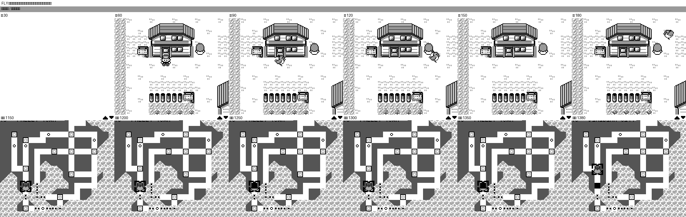
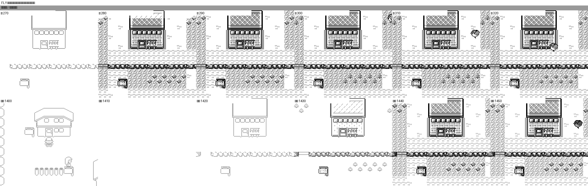
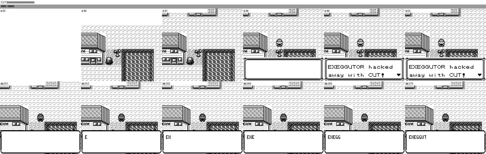
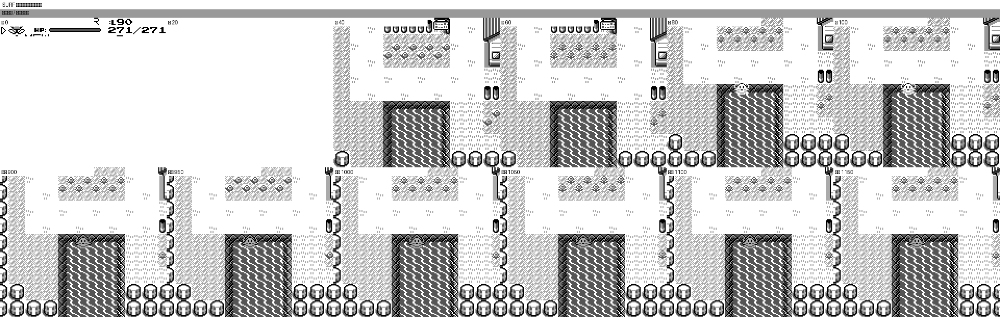
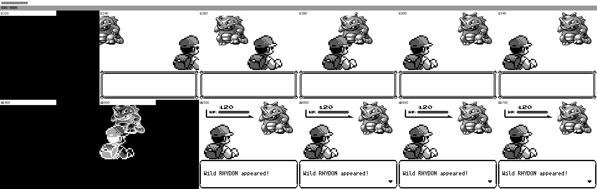

# 关键动效原版 / 当前版帧差异审计

日期：2026-09-10

## 结论

> 复核更正：首版报告使用了人工挑选的“相似阶段”代表帧，并以源码坐标表一致辅助判定。这种方法会隐藏速度和相机滚动差异，因此撤回所有缺少 raw-time 定量证据的 `通过` 结论。

| 动效 | 录制有效性 | 结果 | 结论 |
| --- | --- | --- | --- |
| 战斗进场 | 触发路径不同；缺少逐 phase 时长 | 部分通过，待定量复测 | 淡入、双方入场和出现文字均存在，但当前证据不足以判断时序是否一致。 |
| FLY 到达 | 可见阶段已录制；PNG/模拟帧映射未定量复核 | 部分通过，待定量复测 | 飞鸟进入与落地阶段存在；“12 坐标 × 3 帧一致”仅由源码推断，不能作为运行时通过结论。 |
| FLY 起飞 | 缺失阶段可直接观察 | **不通过** | 原版有“原地拍翅 → 向右下飞行 → 向左上飞行 → 白屏”的离场段；当前版直接淡出。 |
| SURF | 最终状态已录制；缺少上水 actor/phase 轨迹 | 部分通过，待定量复测 | 冲浪状态和水面精灵存在，但上水过程的时长与轨迹尚未完成定量对齐。 |
| CUT | 缺失阶段可直接观察 | **不通过** | 原版有白屏/重载/`AnimCut` 时序；当前版直接替换树块、播放音效并打印文字。 |
| 台阶跳跃 | 连续 raw-time 窗口与背景 ROI 已复核 | **不通过** | 原版 37 帧平滑滚动 32px；当前版 18 帧，并在落地帧一次跳动 32px。落点相同，但动画过程不一致。 |

已确认的修复优先级为台阶跳跃相机/节奏、FLY 起飞状态机和 CUT 覆盖层/OAM。战斗进场、FLY 到达和 SURF 需要按新流程重新捕获后才能给出最终判定。

## 录制方法

- 原版使用 pret/pokered 固定提交 `fbcf7d0` 构建的官方 `pokeblue_debug.gbc`。使用 DEBUG 测试入口准备完整队伍和场景；动画例程与 Gen-1 原版一致，但战斗 HUD 会显示 Blue/DEBUG 路径。
- 当前版使用仓库现有 `target/debug/pokered-app`，提交为 `e54a435`。各场景使用可重复的字段快照，分辨率均为 160×144。
- 帧率按 60fps 导出 MP4；对比图中的帧号是各录制文件内部帧号，不是跨实现的绝对模拟器时钟。
- 场景坐标：FLY `PalletTown (5,6) → ViridianCity (23,26)`；CUT `VermilionCity (15,17)` 面向树；SURF `PalletTown (5,13)` 面向水；台阶 `Route1 (10,4) → (10,6)`。
- 二次复核使用同一语义触发点后的 raw-time 窗口，不做时间拉伸。台阶背景 ROI 为 `(x=0,y=10,w=56,h=120)`，避开玩家与动态 UI，并逐帧搜索整数平移。

构建备注：本次尝试重新构建 debug-server 时被本机 Cargo 缓存中的 dotzuki 模板包名 `{{project-name}}` 解析错误阻断，因此使用已存在且对应当前提交的 debug binary 完成录制；未修改该无关缓存。

## 帧证据

### FLY

起飞对比最清楚：原版在地图淡出前持续出现飞鸟，当前版未出现离场飞鸟，目的地选择界面随后直接进入白色淡出。

到达段两侧均能看到飞鸟从右上方进入并在玩家位置落地；当前图只证明阶段存在，尚未证明运行时拍翅节奏和每段时长一致。

录制： [原版 MP4](../../screenshots/visual-key-animations/fly-reference.mp4) · [当前版 MP4](../../screenshots/visual-key-animations/fly-current.mp4)

### CUT

原版触发后先出现白屏，再回到地图并进入文字阶段；当前版从动作菜单退出后直接在地图上开始文字打印。

录制： [原版 MP4](../../screenshots/visual-key-animations/cut-reference.mp4) · [当前版 MP4](../../screenshots/visual-key-animations/cut-current.mp4)

### SURF

两侧的持续帧都显示玩家已经处于水面运输状态；文字内容中的训练家名不同是测试存档差异。该证据没有覆盖触发到上水完成的逐帧 actor 轨迹，因此不能判完整通过。

录制： [原版 MP4](../../screenshots/visual-key-animations/surf-reference.mp4) · [当前版 MP4](../../screenshots/visual-key-animations/surf-current.mp4)

### 台阶跳跃

首版对比图以不同时间密度人工挑帧，使两侧看起来处于相似阶段，掩盖了真实差异。修正后的图使用同一个 `t+N`：current 在第 18 帧已经结束，reference 到第 37 帧才稳定。

| 指标 | reference | current | 结果 |
| --- | --- | --- | --- |
| trigger → 首个稳定帧 | 37 帧（`0:36`） | 18 帧（`775:792`） | FAIL，current 仅为 48.6% |
| 背景累计 Y | -32px | -32px | 总位移相同 |
| 背景移动分布 | 16 次 × -2px | 1 次 × -32px | FAIL，current 落地瞬移 |
| 最大单帧背景位移 | 2px | 32px | FAIL，差 30px |

指标：[JSON](../../screenshots/visual-key-animations/ledge-sequence-comparison.json)

录制： [原版 MP4](../../screenshots/visual-key-animations/ledge-reference.mp4) · [当前版 MP4](../../screenshots/visual-key-animations/ledge-current.mp4)

### 战斗进场

两侧都经过过渡、精灵出现和 `Wild RHYDON appeared!` 阶段。原版录制走官方 FIGHT/DEBUG 入口；当前版使用 debug server 的 `start_wild_battle Rhydon level20`，所以玩家精灵、训练家名和前置菜单时序不作像素级结论。

录制： [原版 MP4](../../screenshots/visual-key-animations/battle-reference.mp4) · [当前版 MP4](../../screenshots/visual-key-animations/battle-current.mp4)

## 实现侧交叉检查

- 当前 FLY 入口 [`field_moves.rs`](../../../crates/pokered-core/src/overworld/field_moves.rs#L393-L411) 只设置 `pending_fly_arrival`、目的地和白色淡出；当前实现没有离场飞鸟状态。到达坐标表位于 [`presentation.rs`](../../../crates/pokered-core/src/overworld/presentation.rs#L176-L231)，与原版 `FlyAnimationEnterScreenCoords` 一致。
- 原版 `_LeaveMapAnim` 在 `player_animations.asm` 中包含原地拍翅、两段坐标列表和最终白屏；这与 FLY 起飞录制差异吻合。
- 当前 CUT [`field_moves.rs`](../../../crates/pokered-core/src/overworld/field_moves.rs#L121-L148) 直接 `set_block`、发 `SFX_CUT` 并进入文字，没有原版 `InitCutAnimOAM` / `AnimCut` 对应的渲染阶段。
- 当前台阶渲染 [`overworld.rs`](../../../crates/pokered-app/src/render/overworld.rs#L596-L640) 虽然复制了原版 16 项 Y 偏移表，却把 `elapsed` 同时作为角色平移叠加在静止背景上；逻辑坐标提交后背景再整体跳到新视口。常量相同没有产生相同的合成运动，这与录像中的 32px 落地瞬移吻合。
- 当前冲浪入口 [`field_moves.rs`](../../../crates/pokered-core/src/overworld/field_moves.rs#L221-L238) 设置 `TransportMode::Surfing` 并将玩家推进到水面；录制结果与该状态转换一致。

## 流程复盘与修正

首版流程有三个问题：contact sheet 只适合导航却被用于判定；人工抽帧引入了时间重采样；源码表一致被误当成运行时画面一致。修正后的 Skill 要求：

1. 记录 PNG → emulator frame 映射和完整 phase manifest；
2. 使用相同 `t+N` 的 raw-time 对比，提前结束的一侧显示 `ENDED`；
3. 分开测量 actor、background/camera、phase 和 state；
4. 对时长、最大单帧位移、运动分布设置硬门槛；
5. 缺少任一 mandatory channel 时最高只能判 `部分通过`；
6. 确定性场景重复两次后才能给最终 `PASS`。

流程定义见 [`quantitative-alignment.md`](../../../.agents/skills/key-animation-differential/references/quantitative-alignment.md)，自动分析脚本见 [`compare_sequences.py`](../../../.agents/skills/key-animation-differential/scripts/compare_sequences.py)。

本次仅新增审计文档和录制证据，没有修改游戏实现代码。
