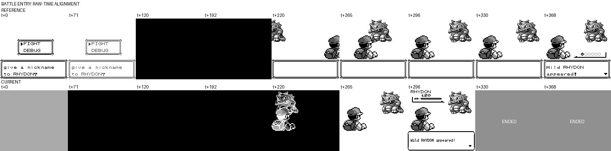
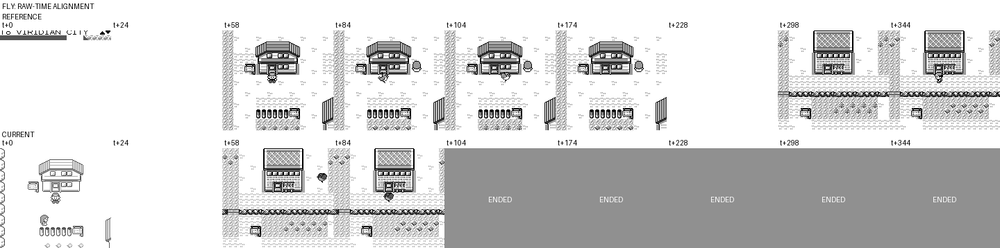
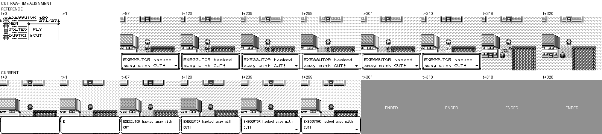
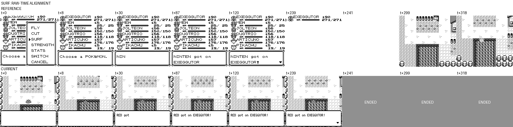
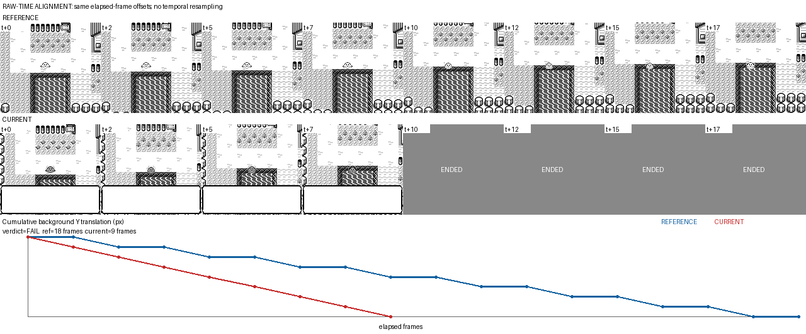
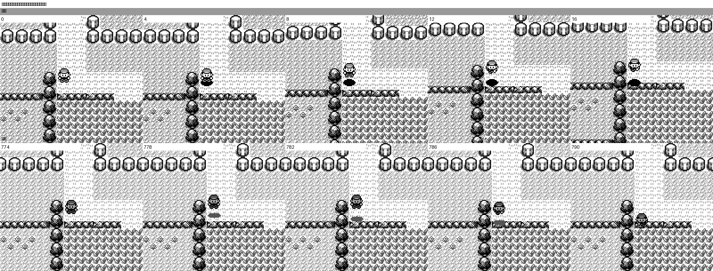

# 关键动效原版 / 当前版帧差异审计

日期：2026-09-10

## 修复后结论

五个场景已按更新后的流程完成修复和双跑验证，当前均为 **PASS**。这里的 PASS 指 raw-time、phase、actor/background/state 时序和结束状态一致；DEBUG Blue 与当前实现的字体、精灵资产和调色差异仍属于已声明的像素 confounder。

| 动效 | reference | 修复前 | 修复后 | 结果 |
| --- | ---: | ---: | ---: | --- |
| 战斗进场 | 369 帧 | 297 帧 | 369 帧 | **PASS** |
| FLY 起飞到落地 | 345 帧 | 86 帧 | 345 帧 | **PASS** |
| CUT 覆盖层 | 18 帧 | 缺失 | 18 帧 | **PASS** |
| SURF 位移 | 18 帧 | 9 帧 | 18 帧 | **PASS** |
| 台阶跳跃 | 40 帧 | 17 帧 | 40 帧 | **PASS** |

修复后完整指标见 [post-fix-summary.json](../../screenshots/key-animation-fixes/post-fix-summary.json)。五个 current 场景各录制两轮，整个 verdict window 的 PNG 均逐帧哈希一致。

端到端回归也从全新开局跑到 `m40`（第八枚徽章），退出码为 0；其中 m17/m18/m35 实际使用 CUT，m36/m37 实际使用 SURF，m37 实际使用 FLY。首轮回归还暴露了 Rock Tunnel 随机战斗 blackout 后测试脚本不会重试的问题；流程现仅在确认回到 Route10 治疗点时重试，其他导航异常仍直接失败。

关键修复：

- 战斗恢复 72 帧缺失时长，`WildReveal` 期间隐藏敌方 HUD，并按原版顺序显示球列和逐步打印文字；
- FLY 增加完整离场飞鸟、白屏/地图提交延迟和 47 帧到达飞鸟；
- CUT 延迟地图提交，恢复 18 帧四精灵覆盖层和前九帧文字背景保留；
- SURF 在文字关闭后执行 `37 帧全白 + 23 帧仅地图` 的菜单恢复，再按完整逐帧序列移动；
- 台阶跳跃恢复 16 次 × 2px 的相机滚动和 `y=4 → 5 → 6` 逻辑状态路径。

流程本身也补上了 `ordered_background_cadence`：旧版 SURF 的总时长、总路程、最大步长和平滑度可以同时通过，但有序检查会在首个错位 `t+1→t+2` 失败；修复后完整 18-transition 序列通过。对应指标见 [SURF](../../screenshots/key-animation-fixes/surf-sequence-comparison.json) 和 [台阶](../../screenshots/key-animation-fixes/ledge-sequence-comparison.json)。

修复后的 reference/current raw-time 证据：

- [战斗进场](../../screenshots/key-animation-fixes/battle-entry-reference-current.png)
- [FLY](../../screenshots/key-animation-fixes/fly-reference-current.png)
- [CUT](../../screenshots/key-animation-fixes/cut-reference-current.png)
- [SURF 完整窗口](../../screenshots/key-animation-fixes/surf-reference-current.png) / [SURF 位移序列](../../screenshots/key-animation-fixes/surf-movement-reference-current.png)
- [台阶跳跃](../../screenshots/key-animation-fixes/ledge-reference-current.png)

PR 所需的同一 `t+N` 修复前后截图已归档在 [`docs/screenshots/key-animation-fixes`](../../screenshots/key-animation-fixes/)；图片文件均采用 `*-before.png` / `*-after.png` 命名，提交 PR 时应按仓库规则改写为分支固定的 raw URL。

## 修复前结论

更新后的逐帧流程已完整复跑。五个场景均未通过；旧报告中的三个“部分通过”在补齐 raw-time、phase、相机和状态通道后都确认存在实质差异。

| 动效 | reference | current | 结果 | 关键差异 |
| --- | ---: | ---: | --- | --- |
| 战斗进场 | 369 帧 | 297 帧 | **FAIL** | current 快 72 帧，并在 `WildReveal` 提前显示敌方 HUD。 |
| FLY 起飞到落地 | 345 帧 | 86 帧 | **FAIL** | current 缺失离场飞鸟，地图切换提前 203 帧；到达首坐标又多停 24 帧。 |
| CUT | 321 帧 | 301 帧 | **FAIL** | current 先删树再打字，且完全缺失 reference 的 18 帧 CUT OAM 覆盖层。 |
| SURF | 位移 18 帧 | 位移 9 帧 | **FAIL** | current 在文字尚未结束时就移动，位移节奏快一倍。 |
| 台阶跳跃 | 40 帧 | 17 帧 | **FAIL** | current 把 16 次 × 2px 的滚动压成一次 32px 落地瞬移。 |

完整数值与窗口定义见 [rerun-summary.json](../../screenshots/visual-key-animations/rerun-summary.json)。优先级建议：台阶相机/状态路径、FLY 离场状态机、CUT 覆盖层、SURF 位移节奏、战斗 HUD/时长。

## 修复前录制有效性

- reference 使用 pret/pokered `fbcf7d0` 构建的官方 `pokeblue_debug.gbc`，SHA-1 为 `5b1456177671b79b263c614ea0e7cc9ac542e9c4`；预置 state SHA-1 为 `9e472f881da3a1a2633a1169e2d7a9e304542be4`。DEBUG Blue 只用于可重复地准备队伍和场景，不能当作 Red 的像素资产基准。
- current 的可见实现基线为 `e54a435`；本分支新增的 recorder/debug 协议只写证据，不修改画面逻辑。两侧均为 160×144，每张 PNG 对应一个原始模拟帧。
- reference 每帧 manifest 记录输入、WRAM、玩家屏幕坐标和可见 OAM；current 的 `frame-manifest.jsonl` 记录 `capture_index`、`frame_count`、screen/map、movement、FLY/fade、dialogue 和 battle phase。已验证 current 的 `capture_index + 1 == frame_count`。
- FLY、CUT、SURF、台阶的 setup 与 trigger 使用同一条 `press_timeline`，并把 trigger 固定在绝对第 300 帧；四个场景两侧各两轮均逐帧哈希一致。
- battle reference 两轮逐帧一致。current 两轮 phase/state 一致，但绝对触发帧不同造成 wipe 的 9 个像素帧不同；因此 battle 本就不能进入 `PASS` 候选。下述 72 帧时长和 HUD 差异在两轮都存在，不依赖这 9 帧波动。
- verdict window 内没有使用 `step_frames`。它会在 debug 命令所在的外层 update 中递归 update，使录制顺序不再天然等于帧号。
- 所有窗口都以语义 trigger 和第一个稳定结束帧裁切，不拉伸、不补帧；较短一侧在 raw-time 图中显示 `ENDED`。

复跑过程中有四类录像被有效性检查丢弃：battle 曾只进入昵称提示而没有开战；CUT 曾因 start-menu 游标持久化误入背包并使用自行车；SURF 曾因单帧按键未被原版轮询采到；台阶曾在 pre-trigger “校正朝向”时提前开始跳跃。旧证据已删除，未用于本结论。

## 修复前帧证据

### 战斗进场 — FAIL

reference 从 `wIsInBattle` 首次置位到完整 `Wild RHYDON appeared!` 为 369 帧；current 从 `TransitionFlash` 到 `WildReveal(wait_frames=0)` 为 297 帧，仅为 80.5%。同一 raw-time 下，current 在 `t+296` 已结束，reference 到 `t+368` 才出现完整文字。



current 在野怪出现文字阶段已绘制 RHYDON 的名称、等级和 HP 条；reference 此时尚未显示敌方 HUD。reference 走官方 TestBattle 的昵称 `NO` 触发，current 走 `start_wild_battle`，所以触发前菜单和玩家存档内容属于已声明 confounder；进场后的时长与 HUD 顺序仍可直接判失败。

### FLY — FAIL

reference 的完整窗口为 345 帧，current 为 86 帧。reference 在 `t+58` 后进入离场飞鸟段，`t+228` 才切换到 Viridian City；current 没有离场飞鸟，在 `t+25` 已切图。



到达段也不一致：reference 从第一帧入场飞鸟到普通玩家精灵稳定为 47 帧，current 为 61 帧。current 在 fade 期间把第一组 `(152,5)` 坐标保持了约 27 帧，之后才恢复每组三帧的坐标推进；源码坐标表一致没有产生一致的运行时节奏。

### CUT — FAIL

reference 先完成文字，再在 `t+301` 后进入 CUT 图形阶段；OAM 36–39 在原始帧 302–319 连续出现 18 帧，随后树消失并稳定。current 在 `t+0` 已替换地图块并开始打字，没有该 OAM phase。



这不仅是总时长差异，也是可见 phase 缺失和状态提交顺序错误，属于硬失败。

### SURF — FAIL

两侧最终都到达 `(5,14)` 且背景总位移都是 16px；但 reference 在文字确认后才移动，位移窗口为 18 帧，current 在文字仍为空/打印中时立即移动，9 帧完成。



稳定背景 ROI 的结果：两侧均为 8 次 × 2px、最大单帧 2px，但 current 没有 reference 的隔帧保持，因此速度正好快一倍。



指标：[surf-sequence-comparison.json](../../screenshots/visual-key-animations/surf-sequence-comparison.json)

### 台阶跳跃 — FAIL

reference 从 jump flag 首帧到第一个稳定帧为 40 帧；current 从 `Jumping(walk_counter=16)` 到 `Idle` 为 17 帧，只占 42.5%。



| 指标 | reference | current |
| --- | ---: | ---: |
| 背景累计 Y | -32px | -32px |
| 背景移动分布 | 16 次 × -2px | 1 次 × -32px |
| 最大单帧背景位移 | 2px | 32px |
| 逻辑 Y 状态 | 4 → 5 → 6 | 4 → 6 |

current 最终落点虽然正确，但相机在落地帧整体跳动，且状态路径跳过中间 `y=5`。指标：[ledge-sequence-comparison.json](../../screenshots/visual-key-animations/ledge-sequence-comparison.json)

## 修复前实现侧交叉检查

- FLY 入口 [`field_moves.rs`](../../../crates/pokered-core/src/overworld/field_moves.rs) 直接设置目的地和白色淡出，没有原版 `_LeaveMapAnim` 的离场飞鸟状态；到达坐标表只覆盖后半段。
- CUT 入口同文件直接 `set_block`、发 `SFX_CUT` 并进入文字，没有 `InitCutAnimOAM` / `AnimCut` 对应渲染阶段。
- SURF 入口立即设置 `TransportMode::Surfing` 并推进玩家；录像中的“文字下移动”和 9 帧位移与该顺序一致。
- 台阶渲染 [`overworld.rs`](../../../crates/pokered-app/src/render/overworld.rs) 虽有原版 Y 偏移表，但角色偏移与静止背景的合成方式使逻辑坐标提交后视口一次跳 32px。
- 战斗渲染 [`battle.rs`](../../../crates/pokered-app/src/render/battle.rs) 的 `hide_enemy_hud` 未包含 `WildReveal`，与提前显示敌方 HUD 的画面吻合。

源码仅用于解释已观察到的帧差异，不参与替代运行时判定。

## 更新后的流程

本次把以下约束固化进 `key-animation-differential` Skill：

1. recorder 同帧写 PNG 和 `frame-manifest.jsonl`，不再猜 PNG 与 emulator frame 的映射；
2. `press_timeline` 接受逐帧按钮/`null` 和 `start_at_frame`，把 setup、trigger 与环境动画相位固定下来；
3. pre-trigger 同时校验截图和状态，菜单名称、坐标或朝向单独匹配都不算有效；
4. 两轮逐帧哈希复现后才允许进入 `PASS`；
5. moving-camera 场景强制测量 ROI 位移、最大单帧跳变和运动分布；
6. 非相机场景由 `raw_time_contact.py` 按相同 `t+N` 生成证据，较短一侧明确标记 `ENDED`。

流程定义见 [`quantitative-alignment.md`](../../../.agents/skills/key-animation-differential/references/quantitative-alignment.md)，采集入口见 [`rerun_key_animations.py`](rerun_key_animations.py)。current 固定场景快照位于 [`fixtures/current`](fixtures/current)。

复跑命令：

```bash
cargo build --bin pokered-app --features debug-server
OUT=$(mktemp -d /tmp/keyanim-rerun.XXXXXX)
/tmp/visual-oracle-venv/bin/python \
  docs/audits/2026-09-10/rerun_key_animations.py \
  --output "$OUT" --repeat 2 \
  --reference-rom /path/to/pokeblue_debug.gbc \
  --reference-world-state /path/to/world.state \
  --reference-symbols /path/to/pokeblue_debug.sym
```

本节记录的是修复前复跑结论，保留作问题证据；其 FAIL 状态已由文首的修复后双跑覆盖。
