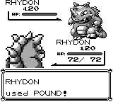
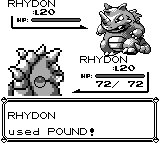

# 道具战斗动画逐帧差分

- 原版：`pret/pokered@fbcf7d0e19a3a2db505440d3ccd3d40ca996c15c`
- 正式 Red ROM SHA-1：`ea9bcae617fdf159b045185467ae58b2e4a48b9a`
- 当前实现：`open-pokered@7ff55ddaf21fe61754aa7f0f7ca75d91d623bd5b`
- 范围：33 条语义轨迹，每条重复 2 次
- 判定：持续帧数、实际 OAM、动态像素掩码、SFX ID 与触发帧全部精确相同

战斗外的道具流程由 138 项穷举分类测试及字段/队伍/音频状态机测试覆盖；本报告专门保存可与正式 ROM 逐帧比较的战斗动画证据。

## 结论

- PASS：33
- FAIL：0
- 不确定：0

## 逐场景结果

| 场景 | 原版→当前帧数 | OAM | 像素 | SFX | 结论 |
|---|---:|---|---|---|---|
| `x-stat-player` | 111→111 | ✓ | ✓ | ✓ | PASS |
| `x-stat-enemy` | 111→111 | ✓ | ✓ | ✓ | PASS |
| `safari-bait` | 55→55 | ✓ | ✓ | ✓ | PASS |
| `safari-rock` | 59→59 | ✓ | ✓ | ✓ | PASS |
| `master-caught` | 265→265 | ✓ | ✓ | ✓ | PASS |
| `master-ghost-dodged` | 44→44 | ✓ | ✓ | ✓ | PASS |
| `master-trainer-blocked` | 77→77 | ✓ | ✓ | ✓ | PASS |
| `ultra-caught` | 265→265 | ✓ | ✓ | ✓ | PASS |
| `ultra-missed` | 84→84 | ✓ | ✓ | ✓ | PASS |
| `ultra-broke-free-1` | 196→196 | ✓ | ✓ | ✓ | PASS |
| `ultra-broke-free-2` | 252→252 | ✓ | ✓ | ✓ | PASS |
| `ultra-broke-free-3` | 308→308 | ✓ | ✓ | ✓ | PASS |
| `ultra-ghost-dodged` | 44→44 | ✓ | ✓ | ✓ | PASS |
| `ultra-trainer-blocked` | 77→77 | ✓ | ✓ | ✓ | PASS |
| `great-caught` | 276→276 | ✓ | ✓ | ✓ | PASS |
| `great-missed` | 95→95 | ✓ | ✓ | ✓ | PASS |
| `great-broke-free-1` | 207→207 | ✓ | ✓ | ✓ | PASS |
| `great-broke-free-2` | 263→263 | ✓ | ✓ | ✓ | PASS |
| `great-broke-free-3` | 319→319 | ✓ | ✓ | ✓ | PASS |
| `great-ghost-dodged` | 55→55 | ✓ | ✓ | ✓ | PASS |
| `great-trainer-blocked` | 77→77 | ✓ | ✓ | ✓ | PASS |
| `poke-caught` | 276→276 | ✓ | ✓ | ✓ | PASS |
| `poke-missed` | 95→95 | ✓ | ✓ | ✓ | PASS |
| `poke-broke-free-1` | 207→207 | ✓ | ✓ | ✓ | PASS |
| `poke-broke-free-2` | 263→263 | ✓ | ✓ | ✓ | PASS |
| `poke-broke-free-3` | 319→319 | ✓ | ✓ | ✓ | PASS |
| `poke-ghost-dodged` | 55→55 | ✓ | ✓ | ✓ | PASS |
| `poke-trainer-blocked` | 77→77 | ✓ | ✓ | ✓ | PASS |
| `safari-caught` | 265→265 | ✓ | ✓ | ✓ | PASS |
| `safari-missed` | 84→84 | ✓ | ✓ | ✓ | PASS |
| `safari-broke-free-1` | 196→196 | ✓ | ✓ | ✓ | PASS |
| `safari-broke-free-2` | 252→252 | ✓ | ✓ | ✓ | PASS |
| `safari-broke-free-3` | 308→308 | ✓ | ✓ | ✓ | PASS |

完整 RLE 逐帧轨迹保存在 `frame-traces.json.gz`，摘要与来源校验保存在 `summary.json`。

## master / 当前分支截图

同一 Ultra Ball 捕获场景的第 12 帧；“前”由 `master@c382739` 的生产渲染器在独立 worktree 中生成，“后”由当前提交的 `item-animation-frames` 生成。

| 前 | 后 |
|---|---|
|  |  |
