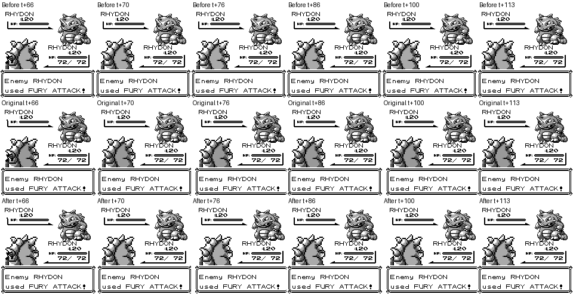

# 全招式动画安排检查与修复

日期：2026-09-28。当前工作分支 `fix/gba-frame-pacing`，HEAD `403514b7ba0e1cba9e8c74af3787aaa3d9bd5389` 加工作区修改。

## 结果与范围

| 检查 | 结果 | 范围与限制 |
|---|---|---|
| 165 招式独立动画 × 双方 × 重复 2 次 | PASS，330/330 条轨迹 | 持续帧数、每帧实际 OAM、动态像素掩码均相同；不包含实战命中反馈和伤害结算 |
| 165 招式实战回合 × 双方 | 330/330 完成 | `PokemonGame.update`，Mew 50 级、对方 Splash、seed 42；连按 A 不能重叠播放或卡死；不等于穷举所有状态组合 |
| 双方出招与 HP 衔接 | 回归通过 | 双方先手顺序、中英文、动画开关；攻击结束后才更新该次 HP |
| 寄生种子回合吸血 | 回归通过 | 双方受种子、中英文、动画开关；Absorb 有实际 OAM，播放结束前 HP 不变，结束后受种方扣血、播种方回血 |
| 蓄力 | 回归通过 | 飞翔、挖洞、日光束、旋风刀、火箭头槌、神鸟，双方；蓄力页留在实际行动位置，不播放命中动画 |
| 多段攻击 | 回归通过 | 二连踢逐击动画→该击扣血→下一击；共用记录路径覆盖 2–5 次攻击、二连踢、双针 |
| 调用招式 | 回归通过 | 鹦鹉学舌双方后手：对手→调用动画→实际招式；挥指使用同一排列路径 |
| 未命中、属性无效 | 回归通过 | 提前决定是否播攻击/命中反馈，爆炸类保留本体动画；普通攻击打幽灵覆盖 |
| 命中反馈 1（纵向震动）、4（守方闪烁） | PASS | 独立校准窗口双方各重复 2 次，持续帧数/OAM/动态像素掩码均相同 |
| 命中反馈 2、3、5、6（横向震动） | PARTIAL；严格像素门槛 FAIL | 时长、OAM、幅度与节拍一致；改变 WX 的少数过渡帧仍有 LCD 分界行差异，未宣称逐像素完全一致 |

## 修复内容

- 移除所有招式额外叠加的统一前冲，动作由原版招式命令流控制。
- 依据原版效果处理程序分配命中反馈，强化、恢复、屏障、寄生种子等辅助招式不再一律震动。
- 动画与 HP 使用类型化事件串联，避免靠翻译后的文本猜技能；敌方出招、回合吸血和逐击伤害均有独立完成握手。
- 蓄力首回合使用原版 `ChargeEffect` 的动画选择：飞翔→Teleport，挖洞→SlideDown，其余→XStatItem；下一回合才播放实际攻击。
- 多段伤害只观察引擎已有各击结果，不重新掷随机数或改动伤害算法。
- 挥指/鹦鹉学舌的提示与动画放到实际行动之前，不再把双方调用提示全部提前到回合开头。
- 命中反馈按原版幅度和等待帧执行；守方闪烁使用独立于招式内部闪烁的图块复制相位。
- 直入战斗 CLI 也接入同一动画完成握手。

**叫声在原版红版确实使用音符，成功降攻后也有慢速横向震动。** 原版 `GrowlAnim` / `DoGrowlSpecialEffects` 明确指定音乐符号图块，`PlayApplyingAttackAnimation` 指定成功降能力后的慢速震动。此次移除的是额外前冲，修复的是反馈安排和节奏，没有删除原版已有动作。

## 证据

- [165 招式逐项结果](isolated/summary.json)、[连续逐帧指标](isolated/frame-traces.json.gz)。每条窗口从 `MoveAnimation` 入口到 `.animationFinished`，无时间重采样；repeat=2。
- `feedback-1` 至 `feedback-6` 各有 `summary.json` 和 `frame-traces.json.gz`。用 Growl 命令流后强制指定反馈类型，校准共用反馈，**不是声称叫声实战会使用全部六种反馈**。
- 原版正式 Red ROM SHA1 `ea9bcae617fdf159b045185467ae58b2e4a48b9a`，原版源码 `fbcf7d0e19a3a2db505440d3ccd3d40ca996c15c`。DEBUG Blue ROM 仅布置状态，比较帧来自正式 Red ROM。PyBoy 每次前进一个仿真帧，当前版每次一次 update/draw，160×144。
- 校准双方均为 Rhydon Lv20；原版初始对话残留“FURY ATTACK”，两端保持相同底图。被钩子执行的动画 ID 是 45，见轨迹中的 resolved animation ID；不能用底图中的旧对话判断正在执行的动画。
- 连续原始 PNG 暂存 `/tmp/battle-all-moves/`；仓库保存压缩逐帧 OAM/像素指标及短录像。



慢速震动原始窗口：[原版](../../screenshots/all-move-sequencing/growl-reference.mp4) · [当前](../../screenshots/all-move-sequencing/growl-current.mp4)。窗口 114 帧；t+66 进入反馈，持续 48 帧，无相位拉伸。对照图仅便于浏览，判定依据完整逐帧数据。

[寄生种子实战 Absorb 录像](../../screenshots/all-move-sequencing/leech-seed-absorb.mp4)：测试全局帧 145–257，连续 113 帧，以 60fps 播放。此片段是当前实战效果证据，不是与原版完整回合的逐帧 PASS 声明。

## 验证与复现

- `cargo test -p pokered-core --lib`：2592 passed。
- `cargo test -p pokered-app --lib render::battle::tests`：24 passed；包括全部 330 个实战回合及上述定向回归。
- Native release、GBA release 构建通过；ROM 及 SuperFW 配套补丁摘要见 [builds.json](builds.json)。
- GBA 模拟器内存压力检查 13/13 通过，包括 330 招式、248 地图、满 PC / SRAM，见 [gba-memory.log](gba-memory.log)。先前 100,000 帧截断的试跑只完成 3/13，不计入通过；延长捕获窗口后完整通过。
- Python 工具语法检查与 `git diff --check` 通过。

```sh
cargo build --release --bin pokered-app --features debug-server
target/release/pokered-app battle --config docs/audits/2026-09-28-all-move-sequencing/local-battle.json --lang zh
```

本机测试配方为低血量妙蛙种子对卡比兽；四个招式刻意设为寄生种子、叫声、二连踢、日光束，用来手动控制特殊流程，非自然习得配置。Z 确认、X 返回、方向键选择。

横向反馈剩余差异涉及原版 CPU/LCD 中途写寄存器的行相位，当前采用通用扫描线边界。尚未穷举失败原因、替身/变身/束缚/忍耐、连续调用等所有组合；本报告不把独立动画 330/330 的结果扩大为这些组合全部逐帧一致。
