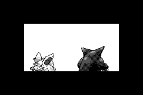
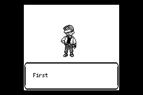
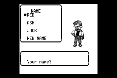
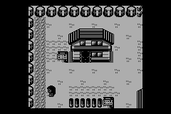
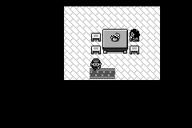

# GBA 真机掉帧排查与修复（2026-09-28）

用户反馈：开场动画、Oak 介绍 Red / 起名前人物平移、进出房间切地图明显变慢。

## 定位与修改

- 默认模拟器使用 agb 设置的快速 ROM 时序。SD 卡的 SuperFW 补丁会取消启动时的 WAITCNT 写入；慢速卡访问下，原先的绘制路径约慢一倍。新增音频另增加约 0.3–0.6 ms/update，但不是这些场景的主要开销。未修改硬件时序或超频。
- GBA 专用链接脚本把采样确认的图块、文字、像素、Oak 绘制及 PSG 寄存器写入热点放进 IWRAM。保持 agb 启动复制符号；链接时强制至少保留 8 KiB 启动/中断栈空间。通用引擎实现不变。
- 地图淡入淡出原先禁止复用合成画面，导致每个逻辑帧重新画地图。现在复用索引像素，将实际 BGP 调色板阶段加入画面缓存键；地图、NPC、角色或动画变化仍按原有键失效。保留每个淡入淡出阶段。
- 开场图片使用原生灰度索引绘制，保留 Nidorino 的透明色；开场、Oak、Game Freak 绘图直接借用缓存图块，去掉每次绘制的整组 clone。
- 新增 `hardware-timing` 实际驱动开场、Red 入场/右移/左移、进家门和出家门；CI 同时测慢速 ROM 配置。没有恢复多逻辑帧追赶或关闭音频。

## 结果与限制

以下是 mGBA 0.10.5 的模拟硬件时间，**不是已经拿到用户真机复测结果**。慢速模式模拟当前 SuperFW WAITCNT 补丁：取消 agb 启动写入，保留复位的 ROM 4/2 wait states、关闭预取；不包含烧录卡固件额外 IRQ 开销。固件作者对慢速卡限制的说明见 [SuperFW troubleshooting](https://superfw.davidgf.net/docs/usermanual/troubleshooting/)。

| 场景 | 平均绘制 ms 前 → 后 | 有效逻辑帧率 前 → 后 |
|---|---:|---:|
| 完整开场窗口 | 34.64 → 23.19 | 21.6 → 30.6 |
| Red 入场 | 16.13 → 9.17 | 34.0 → 44.8 |
| Red 右移 / 选名字 | 16.82 → 9.69 | 31.7 → 44.0 |
| Red 左移 | 24.89 → 14.12 | 25.6 → 39.2 |
| 进家门 | 37.31 → 8.22 | 17.8 → 44.3 |
| 出家门 | 36.61 → 7.41 | 17.6 → 44.2 |

平均绘制耗时按全部逻辑帧计，包含复用帧；有效逻辑帧率按 VBlank 显示标记间隔计算，非 LCD 扫描频率。场景窗口包括停留帧。最慢地图初次加载仍有一次性停顿：进入约 122 ms，离开约 188 ms；不能宣称全程 60 FPS。

- `before.json` / `after.json`：Timer 2/3 原始统计，六场景均每逻辑帧渲染一次。
- `pixel-comparison.json`：1,409 个同场景同逻辑帧 RGB FNV-1a 校验一致；六组 PNG 另保留完整截图。
- 音频仍检测到非零采样，四个 PSG 声道都有活动。
- 渲染单元回归 92 项、性能工具回归 26 项通过；新淡入淡出测试将每个黑/白淡出、黑屏、淡入阶段与完整重绘逐像素及调色板比较。
- GBA 内存完整 13 组通过：302 个图鉴条目、248 次地图切换、330 个招式、片尾、300 次 PC 操作以及满队伍/240 只箱内宝可梦/50 条名人堂存档读写；最低堆余量 8312 B，最低 EWRAM 栈余量 15912 B（`memory.log`）。
- 普通卡七场景相对本轮修改前全部通过原 15% / 25 ticks 门槛（`perf-compare.log`）。原仓库基线来自无音频版本，新增 PSG 后 update 指标超出旧基线；保留 `previous-silent-baseline.json`，现更新基线为开启音频的实测值，未放宽门槛。

## 复现

```sh
cd crates/pokered-gba
cargo +nightly-2025-12-07 build --release --features hardware-timing
agb-gbafix target/thumbv4t-none-eabi/release/pokered-gba -o /tmp/hardware-timing.gba
cd ../..
python3 scripts/gba_frame_timing.py --suite hardware --slow-cart \
  --rom /tmp/hardware-timing.gba --log /tmp/hardware.log --output /tmp/hardware.json
```

`--slow-cart` 只修改临时副本，并校验启动指令；它不是提供给烧录卡的 ROM。换 agb 版本需重新审核链接脚本和补丁位置。普通卡性能仍运行 `perf-benchmark`。

`capture.c` 是本次无窗口取证工具（libmgba 0.10.5），参数：ROM、PCM 输出、RGBA 输出、最多 VBlank 数、`FRAME_TIMING_VIEW` 的十六进制地址。用对应 ELF 的 `llvm-nm` 查地址；本次为 `020179cc`。可用 `cc capture.c -I$(brew --prefix mgba)/include -L$(brew --prefix mgba)/lib -lmgba -o capture` 编译。通过硬件计时而非宿主运行耗时衡量性能。每个 scene 的第 20 帧另存 RGBA；日志保存各显示帧 RGB 校验及 VBlank 编号。

## 画面对照（前 / 后）

| 场景 | 前 | 后 |
|---|---|---|
| 开场 |  |  |
| Red 入场 |  |  |
| 起名 |  |  |
| 进门 |  |  |
| 出门 |  |  |


## 可玩 ROM

构建命令：`cd crates/pokered-gba && ./build.sh`（无自动驾驶/分析特性）。
输出 `target/thumbv4t-none-eabi/release/pokered-gba.gba`，5,327,852 字节，
SHA-256 `867c7f478c5c5291fb8efbe331290bdd3bfb612a8e7e6c9a2ab55461230123a5`。
同目录的 `pokered-gba.patch` 已按新 ROM 重跑生成器；结果与此前 SD 卡上的
800 字节 SuperFW 补丁相同（见 `rom.json`）。可玩版额外运行 1,800 个 VBlank：
四声道活动，2,656,808 个采样中 1,851,660 个非零，没有 panic。
当前 SD 卡未挂载，未将本次 ROM 写入 SD；保留之前 SD 内容和存档。
