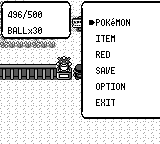
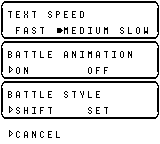
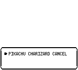
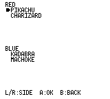
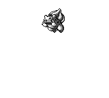

# 原版差距 1、2、3、5、6 修复记录

对比基线：游戏提交 `403514b7ba0e1cba9e8c74af3787aaa3d9bd5389`。
原版依据沿用[审计记录](../2026-09-28-original-gaps/report.md)中的 Red 反汇编及 ROM。

## 修复结果

| 项目 | 现在的行为 | 验证 |
|---|---|---|
| 1 狩猎门厅 | 返回门厅、回答 NO 后保留步数和球数；YES、离开设施、额度用尽才结束本局。狩猎球使用专用计数，不进入背包；额度耗尽返回门厅后告别并自动走向出口，不会误入再次付费。 | 单元测试覆盖消耗球、门厅不扣步、重新入场、退出及旗标同步；真实门口往返重复 2 次，498→496 步，费用保持 ¥2500；超时退出再取得 HM04 的流程重复 2 次通过，费用同样不变（[日志](safari-timeout.log)）。 |
| 2 选项标记 | 非活动行保留空心标记；移动游标及修改取值时正确擦除、恢复标记。 | 英中菜单测试、完整绘制与局部重绘像素比对、GBA 编译布局与动态布局一致性。初次打开的实心光标经像素复核原本就存在，已纠正原审计中的误判。 |
| 3 联机交换 | 选择前交换双方队伍和训练家名字；左右切换队伍，A 查看对方能力及招式，B 返回；确认时显示双方名字。完成后直接继续选择，刷新进化后的队伍。 | 双端路由／驱动测试覆盖取消、断线、慢一方、连续交换和预览数据一致性；冻结地图上的选择及能力页重绘回归。 |
| 5 进化时序 | 等旧叫声结束后开始变形音乐；成功时先等新叫声，再播完成音效，结束后停留 40 帧。静音／无设备时仍运行序列计时。 | 共享音频序列器的 3 组进化流程、151 种叫声结束测试、人工延长 busy 信号的状态机测试。 |
| 6 GBA 声音 | 共用音乐、音效、叫声序列器，写入 GBA 四声道 PSG；VBlank 计数保持音频时钟独立于绘图速度。存档逐个读取 8 KiB 区块，并在载入前释放旧音频和图像缓存，避免完整存档回读时内存不足。 | mGBA PCM 录制和四声道状态检查；GBA 全量内存场景回归，见下方验证记录。 |

交换协议升为 **v3**，两端都需要更新；旧协议无法提供确认前的队伍预览，会在握手时拒绝。

音频依赖固定为独立引擎修复分支的提交
[`f57af30a9b20dc7b8b64783aa836d3b46b8b2d8f`](https://github.com/liuyanghejerry/dotzuki/commit/f57af30a9b20dc7b8b64783aa836d3b46b8b2d8f)。
其中增加了 `no_std + alloc` 支持和寄存器输出接口，并修正稀疏声道被压缩的问题：叫声中的空声道必须保留，否则噪声数据会被错误解析，导致等待音效结束时卡住。截断声道数据也会正确清除播放状态。

## 前后截图

截图基于相同状态／输入序列；交换和进化使用基线工作区与修复工作区运行同一测试夹具。进化截图取开始后的第 190 帧，显示按实际叫声时长推进后的阶段差异。

| 场景 | 前 | 后 |
|---|---|---|
| 狩猎门厅往返后 |  |  |
| 选项默认值 |  |  |
| 交换选择 |  |  |
| 进化第 190 帧 |  |  |

新增[对方能力页](../../screenshots/original-gap-fixes/peer-stats-after.png)复用现有宝可梦能力和招式渲染器。

## 验证与复现

- `cargo test -p pokered-core --lib`：2585 项通过；包含完整存档、损坏校验和、旧格式分块读取回归。
- `cargo test -p pokered-app --lib --features debug-server`：102 项通过。
- `cargo test -p pokered-app --test cable_club_flow --test evolution_audio_timing`：10 项通过，另有 1 项截图夹具按需执行。
- `cargo test -p pokered-audio`：96 项通过。
- `cargo test -p pokered-ui --lib --test menus`：65 项通过。
- `cargo check -p pokered-tui`：通过。
- [11 个场景回归全部通过](scenarios.log)。运行时使用构建完成后的独立二进制副本，避免并行 Cargo 测试覆盖 debug-server 二进制。
- 引擎 `dotzuki-audio` 的 150 项单元测试通过。
- 常规新游戏流程 **m01–m28 通过**：[日志](playthrough.log)、[m28 状态](playthrough-m28.json)。m29 暴露出超时离场仍按入场处理的问题，随后补齐原版 `EVENT_SAFARI_GAME_OVER` 告别／自动行走分支，并更新 m29 驱动。修复后的 **m29 专项重复 2 次通过**，见上方超时日志。
- **未取得完整 m01–m49 通关通过结果**。追加的同步按键加速驱动在 m22 的 `EVENT_BEAT_ROCKET_HIDEOUT_4_TRAINER_2` 旗标断言处退出（[日志](playthrough-driven.log)）；常规驱动此前已通过该阶段。此加速尝试不作为完整通关证明。

狩猎超时离场专项复现（仅初始队伍、金牙和定位使用调试准备；付费、耗步、离场、换取 HM04 均正常执行）：

```sh
python3 docs/audits/2026-09-28-original-gap-fixes/reproduce_safari_timeout.py
```

截图复现：

```sh
GAP_SCREENSHOTS=/tmp/gap-shots cargo test -p pokered-app \
  --test visual_verify_link --test evolution_audio_timing -- --ignored
```

GBA 最终验证：

- **13/13 内存场景通过**：[日志](gba-memory.log)。覆盖 248 张地图、330 次双方招式动画、3 次进化、3 次交换、300 次 PC 操作、6 只队员／240 只仓库宝可梦／50 队名人堂的存档回读。最终剩余连续堆空间 28304 B，栈余量 15592 B。
- [PCM 录制日志](gba-audio.log)：2656808 个双声道交错采样中 1838014 个非零，四声道状态累计为 `0xF`。附[第 20–24 秒的录音](gba-audio.wav)及[录制结束画面](../../screenshots/original-gap-fixes/gba-menu-after.png)。

```sh
cd crates/pokered-gba
cargo +nightly-2025-12-07 build --release --features memory-scenarios
agb-gbafix target/thumbv4t-none-eabi/release/pokered-gba -o /tmp/memory.gba
/tmp/gba-audio-capture /tmp/memory.gba /dev/null /tmp/memory.rgba 2000000
# 最终须出现 memory: ALL PASS，而不是只看进程退出码。
```

GBA 使用 `nightly-2025-12-07`、mGBA 0.10.5。诊断和录音均运行临时目录中的 ROM 副本，不接触玩家存档。[录制程序](capture_gba_audio.c)通过 libmgba 执行 ROM、读取 PSG 状态并导出双声道 44.1 kHz signed-16 PCM。

```sh
cc -I/opt/homebrew/opt/mgba/include capture_gba_audio.c \
  -L/opt/homebrew/opt/mgba/lib -lmgba \
  -Wl,-rpath,/opt/homebrew/opt/mgba/lib -o /tmp/gba-audio-capture
/tmp/gba-audio-capture /tmp/test.gba /tmp/audio.raw /tmp/screen.rgba
```

寄存器及波形 RAM 分组依据：[GBATEK GBA Sound Controller](https://mgba-emu.github.io/gbatek/#gbasoundcontroller)。这次验证覆盖逻辑和模拟器输出；没有做 GBA 实机测试，也不宣称与原版逐采样相同。
