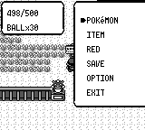
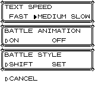
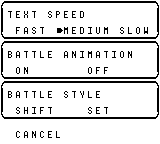
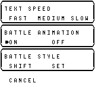

# 当前版本与原版的明显差距（2026-09-28）

本轮确认 **6 类值得继续处理的差异**：狩猎地带额度重置、选项菜单状态指示、联机交换信息缺失、字体与边框、进化音画同步、GBA 无声。前两项有当前二进制复现；字体有原版 ROM 静态画面对照；其余为生产源码确认，未冒充双机联机或音频实测。

没有修改游戏实现。本报告是重点抽查，不是全部剧情、平台、声音及动画的完整保真验收。

## 基准和方法

- 当前：`open-pokered-2@403514b7ba0e1cba9e8c74af3787aaa3d9bd5389`，开始时工作树干净。
- 当前构建：`cargo build --offline --bin pokered-app --features debug-server`，本轮成功重建 `target/debug/pokered-app`。实际锁定的共享引擎目录为 Cargo checkout `7efac8a`。
- 用户指定的 `~/develop/pokered` 当前 HEAD 为 `62c1efa11a8bdc2e51b98dfd7f7a15f4c3d1ca72`，它的工作树已经删除原版汇编，也是 Rust 重写版。保留其中已有未提交改动；从它的 Git 对象库只读导出原版提交 `fbcf7d0e19a3a2db505440d3ccd3d40ca996c15c` 的汇编用于比对。CodeGraph 查询也返回重写版代码，因此没有用它作为原版依据。
- 静态画面使用 `~/develop/pokered-worktree/pokered.gbc`；该工作树 HEAD 同为 `fbcf7d0e…`，正式 Red ROM SHA-1 为 `ea9bcae617fdf159b045185467ae58b2e4a48b9a`。PyBoy 2.7.0，160×144，复制 ROM 到临时目录运行，不读写用户存档。
- 当前场景使用独立临时存档、调试服务器和真实按键。狩猎测试只在准备阶段注入队员、定位到门口；付费、出门、选择继续及重新进入均走正常交互。同步按键使用 `press_timeline(..., advance=true)`；早期非同步按键采集未成功推进对话，已丢弃，未用于结论。
- 原版选项从标题菜单打开，当前选项从新游戏开始菜单打开；均为英语、默认 MEDIUM / ON / SHIFT。这里只比较静态设置界面，不比较进场时序或调色板。

## 1. 高：狩猎地带返回门厅再继续，会补满额度

**玩家表现：** 付费进入后消耗步数，走回门厅，在 `Leaving early?` 选择 NO，再回园区，剩余步数从 **498/500 变成 500/500**，金钱始终为 **2500**，没有再次付费。两轮独立新游戏复现，前后截图分别逐字节一致。

| 返回门厅前 | 选择 NO 后重新入场 |
|---|---|
|  |  |

**当前原因：** [screen.rs](../../../crates/pokered-core/src/overworld/screen.rs) 的地图切换逻辑（2473–2480）在进入门厅这个非 Safari 地图时调用 `end_safari_game()`；再次进入园区时调用 `start_safari_game()`，后者重新写入 500 步、30 球（2394–2408）。门厅对话仍可通过脚本旗标进入继续分支，但内部额度已被清空，重新入场就变成新局。

**原版：** `scripts/SafariZoneGate.asm:245–253` 的离场询问 NO 分支只播放祝好运并向上走，不改剩余球数或步数；写入新额度在付费成功分支 `:170–199`。

**证据边界：** 实测确认步数重置；球数同样重置由同一生产函数确认，本轮没有先投球再复测。普通背包还会出现 `SafariBall ×30`，原版付费只写专用 `wNumSafariBalls`；未继续审计该背包物品的全部外溢影响。

证据：[两轮状态/背包/旗标](safari-observations.json)、[复现脚本](reproduce_safari.py)。建议把“是否正在狩猎”和“当前地图是否计步”分开，只有真正退场、用尽额度或新付费才结束/初始化一局。

## 2. 中：选项菜单缺少非活动行的当前值指示

原版会在 TEXT SPEED / BATTLE ANIMATION / BATTLE STYLE 当前取值旁保留空心箭头，再用实心箭头表示正在操作的行。当前只有单个活动箭头，其他行的当前值无标记，玩家不能一眼确认动画是否打开、战斗模式是什么。

| 原版默认选项 | 当前实际打开选项 | 当前移到战斗动画行 |
|---|---|---|
|  |  |  |

修复阶段逐像素复核纠正了初始判断：初次打开的实心箭头已经存在；差距仅是非活动行缺少空心标记。

其他行标记消失的原因可直接定位：[options.rs](../../../crates/pokered-ui/src/menus/options.rs):92–158 的取值可见性均要求 `state.row` 等于当前行；[options.gui](../../../crates/pokered-data/ui_layouts/options.gui):79 起只有活动实心游标，没有原版的常驻空心标记。原版依据为 `engine/menus/main_menu.asm:649–690` 的 `SetCursorPositionsFromOptions`。

完整当前行切换证据：[文字行](options-live-text.png)、[动画行](options-live-animation.png)、[模式行](options-live-style.png)、[取消行](options-live-cancel.png)；[采集脚本](capture_options.py)。

## 3. 中：联机交换前无法查看对方的队伍和能力

当前交换界面只画本地队伍。协议在双方确认前只传选择索引，实际宝可梦资料到交换执行阶段才传来；因此确认时看不到对方到底拿出了什么宝可梦，也没有原版的对方能力查看流程。

- 当前：[render/link.rs](../../../crates/pokered-app/src/render/link.rs):1–12、94 起只画本地列表；[cable_club.rs](../../../crates/pokered-app/src/link/cable_club.rs):67–72、107 起的选择/确认阶段；[link_trade.rs](../../../crates/pokered-core/src/link/link_trade.rs):3–7、`select_mon` / `confirm_trade` 的协议顺序。
- 原版：`engine/link/cable_club.asm:635–657` 同时画双方队伍及训练家名字；`:332–369` 支持查看对方宝可梦能力。
- 此外，当前完成交换后返回房间，要再次操作桌上设备；原版直接回交换选择循环（当前 `cable_club.rs:407–417` 也明确记录此差异）。

这是交换体验不完整，不能表述为“联机/交换功能完全没实现”。本轮为生产调用链静态确认，未运行双端交换。

## 4. 中（风格差异）：英文字体和边框仍明显不同

上面的选项截图可直接看出字形、字间距和边框装饰不同；当前英文细窄且在 tile 排版时分散，原版是其自带字形和装饰框。

当前 [framebuffer.rs](../../../crates/pokered-ui/src/backends/framebuffer.rs):115–153 的文本/字形调用共享引擎 `embedded_font`。锁定引擎的该模块使用 Fusion Pixel 10px，拉丁字形 advance 为 5px，CJK 为 10px；tile 模式仍按 tile 放置字符，因此不能把所有英文界面简单概括成“每字只占5px”。原版 `home/text.asm` 将字体 tile 写入地图，字符格为8px。

这属于有意采用通用中英文字体后留下的保真差异，旧台账也曾把字体、边框列为延后项；应与第2项操作反馈问题分开。若追求原版英语观感，可保留中文字体并给英语恢复原版字形/边框。

## 5. 中低：进化仍用固定等待，声音与画面没有按原版握手

- 当前 [evolution_screen.rs](../../../crates/pokered-core/src/evolution_screen.rs):57–73 把旧形态叫声等待固定为 **60帧**、成功文本阶段固定为 **100帧**。不同物种的叫声长度无法反映到等待时间。
- 同文件 `:357–361` 在进入成功阶段时同时排入新形态叫声和 GetItem2 成功音效；[game.rs](../../../crates/pokered-app/src/game.rs):3462–3473 在同一次 update 中立即执行这些请求。
- 原版 `engine/movie/evolution.asm:41–48` 调用 `WaitForSoundToFinish` 后才进入下一阶段；`engine/pokemon/evos_moves.asm:151–155` 的成功音效走 `PlaySoundWaitForCurrent`，等音效完成后再延时40帧。

固定时长和同帧请求顺序是已确认代码差异；具体哪种叫声被覆盖、听感差多少，需要独立音频采集，本轮不作已实测断言。

## 6. 高（仅 GBA）：完全没有音乐、音效和叫声

[pokered-audio/src/lib.rs](../../../crates/pokered-audio/src/lib.rs):30–35 在 `target_os = "none"` 选择 [output_none.rs](../../../crates/pokered-audio/src/output_none.rs)。后者的 `play_music`、`play_sfx`、`play_cry` 等全部为空实现；GBA 构造器 [game.rs](../../../crates/pokered-app/src/game.rs):1414–1415 使用这一输出。

这是整个平台的视听完整度差距，**不适用于正常带音频设备的桌面/WASM 版本**。本轮为构建条件及调用链确认，未重新运行 GBA ROM 听音。

## 已完成的验证与没有覆盖的部分

- 当前 debug-server 二进制重新构建成功。
- `python3 scripts/scenarios.py`：**11/11 PASS**。覆盖基本背包/队伍、野战逃跑/胜利/捕捉、战败回城、存档读回、菜单、选项状态、NPC 与强制换人；[日志](scenarios.log)。通过这些状态测试不代表选项渲染正确，见第2项。
- 原版数据核对：`verify_move_sfx_data.py` 166行、`verify_cry_data.py` 151种均 **0 diffs**；`verify_battle_anim_data.py` 的177坐标、122帧块、86子动画、203动画记录均 **0 diffs**，指向当前锁定共享引擎源码执行。
- 狩猎问题双跑一致；选项静态画面已实际查看。报告附带的两个脚本也独立复跑验证。
- 既有9月审计记录中的 FLY/CUT/SURF/台阶、165招式动画、道具动画已有修复和对拍记录，本轮没有把旧 FAIL 再报成当前缺口，也没有把那些历史 PASS 当成本提交的重新逐帧验收。
- 未做新一轮完整冠军通关、全部招式数值穷举、所有支线、双机联机、音频录制或全部前端检查。不能据此断言游戏只剩这6类差异。

优先顺序建议：桌面版先修 **狩猎额度、选项指示、交换前信息展示**；原版观感再处理字体/边框和进化音画时序。若当前目标是GBA，声音输出应列入优先事项。

## 复现

```bash
cargo build --offline --bin pokered-app --features debug-server
python3 docs/audits/2026-09-28-original-gaps/reproduce_safari.py
# 第二个脚本需要安装 PyBoy；ROM复制到临时目录运行。
python3 docs/audits/2026-09-28-original-gaps/capture_options.py \
  --rom ~/develop/pokered-worktree/pokered.gbc
```

脚本默认把新证据写到独立临时目录，可用 `--output` 指定输出位置。
