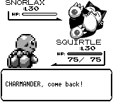
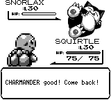
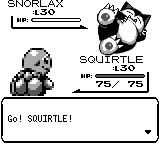
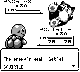
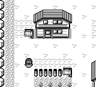
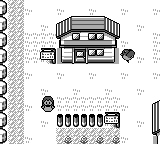
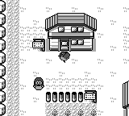

# 换人台词与终端 FLY 抵达动画

基线：`master@0f94a6faa1d4ff779e3bb0c3301ac0832994200c`。
原版依据：`pret/pokered@fbcf7d0e19a3a2db505440d3ccd3d40ca996c15c`，
`engine/battle/common_text.asm` 的 `PrintSendOutMonMessage` / `RetreatMon`，
`data/text/text_2.asm`，以及 `engine/overworld/player_animations.asm` 的 FLY 坐标。

## 行为

- 派出时，按对手剩余 HP 选择 Go / Do it / Get'm / The enemy's weak。
- 撤回时，按当前队员入场后对手损失的 HP 选择 enough / 无评价 / OK / good。
  这不是根据玩家队员自身剩余 HP 分档。
- 保留原版先将最大 HP 除以 4、读取除数和商的低字节，以及对手治疗后减法
  回绕的行为。对手 HP 为零时派出使用 Go，且不更新入场 HP 记录。
- 开场、主动换人、SHIFT 免费换人和濒死替换共用派出规则。入场 HP 记录进入
  帧级快照；新台词先本地化再分页，两个前端都识别英文／中文进出场提示。
- 终端抵达使用已有 BirdSprite 的侧面站立／扑翼帧（2 / 5），沿已有 FLY 坐标
  表移动，按当前终端视图的主角位置对齐，覆盖经过的 NPC。飞行期间不显示 Red，
  完成后恢复主角。此次只补终端抵达，桌面抵达和离场流程不改动。

## 验证

当前云环境运行，冻结依赖锁文件：

- `cargo test --locked -p pokered-core`：**2923 passed**，1 ignored doctest。
- `cargo test --locked -p pokered-data --lib`：**259 passed**。
- `cargo test --locked -p pokered-app --features debug-server`：**312 passed**，
  6 个按需截图测试 ignored；包括 lib / bin 重复执行的共享测试。
- `PR_SCREENSHOTS=/tmp/fly-shots cargo test --locked -p pokered-tui -- --include-ignored`：
  **24 passed**，包含截图夹具。逐像素验证全部 47 个抵达帧、边缘裁剪、透明区域、
  交替扑翼及主角恢复；前三帧鸟位于屏幕右侧之外。
- `PR_SCREENSHOTS=/tmp/switch-shots cargo test --locked -p pokered-app --features debug-server --test visual_verify_switch_dialogue -- --ignored`：
  **1 passed**。由生产换人输入生成台词，再由桌面游戏绘制。
- `git diff --check`：通过。

没有运行新的 GBA / WASM 构建或原版 ROM 模拟器；文本规则通过上述原版汇编核对。
云机器没有音频设备，截图运行会报告 ALSA 无设备，但不影响渲染结果。

## 前后截图

同一截图夹具先在基线游戏代码上执行，再在修复代码上执行。换人夹具保持队伍、
对手 1 HP 和输入相同；FLY 夹具使用同一真新镇画面，固定抵达动画第 15 / 33 帧。
终端截图是其生产渲染器生成的 160×144 帧缓冲，未经终端字符缩放。
抵达完成的第 47 帧前后 PNG 字节完全一致。

| 场景 | 前 | 后 |
|---|---|---|
| 撤回评价 |  |  |
| 对手低 HP 时派出 |  |  |
| FLY 抵达第 15 帧 |  |  |
| FLY 抵达第 33 帧 |  |  |
