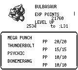
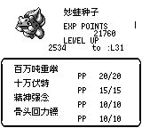
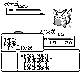
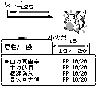
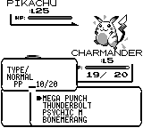
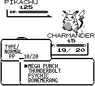

# 技能中文名称检查

基线：`master` / `a952ebf`。分支：`fix/chinese-move-names`。

## 名称数据

逐项核对第一世代 165 个技能，均有简体中文译名。对照
[PokeAPI move_names.csv](https://raw.githubusercontent.com/PokeAPI/pokeapi/master/data/v2/csv/move_names.csv)
的 `local_language_id=12`，统一四处差异：

| 技能 | 原译名 | 修订 |
| --- | --- | --- |
| Mega Punch | 百万吨拳击 | 百万吨重拳 |
| Mega Kick | 百万吨踢击 | 百万吨重踢 |
| Horn Drill | 独角钻 | 角钻 |
| Splash | 水溅跃 | 跃起 |

空技能 `None` 在两种语言中均显示 `---`。

## 显示路径

| 界面 | 检查结果 / 修复 |
| --- | --- |
| STATS 技能页 | native 和 TUI 曾固定使用英文 RenderData，现随游戏语言选择中文；共用 native 渲染的前端同步生效 |
| STATS 宝可梦名称 | 中文名称启用后，原按字节截断可能在汉字中间切片崩溃；改为按字符截断 |
| 战斗选招、战斗中道具选招 | 原通过 Debug 枚举名拼英文；改用统一名称表。中文四行采用 10px 行距，同时显示属性、每招 PP |
| TUI 战斗选招 | 中文阶段在 tilemap 后使用共享 UI 的中文渲染，避免 tile 字库不能画汉字 |
| 战斗出招提示 | 已有分页前翻译路径；新增测试逐项覆盖全部 165 招 |
| 升级学招提示 | 原枚举拆词会生成 `PSYCHIC M` 等无法匹配翻译表的名称；改用标准英文名称作为翻译输入 |
| TM/HM 学习提示 | 已通过 dialog_text 翻译；新增全部 165 招的学会提示覆盖 |
| 队伍野外技能菜单、遗忘技能菜单 | 已直接调用 `lang_data::move_name(..., is_zh)`，无需修改 |
| 编辑器预览 | 技能及 STATS 的 RenderData 与预览所用语言保持一致（当前默认英语） |

本次检查技能名称；STATS 中 `EXP POINTS`、`LEVEL UP` 等非技能标签仍沿用现有显示。

## 画面对比

使用同一个确定性测试场景，在修改生产代码前（与 master 相同）及修改后分别渲染。

| 界面 | 前 | 后 |
| --- | --- | --- |
| STATS 中文 |  |  |
| 战斗中文 |  |  |
| 战斗英文 |  |  |

测试入口：`cargo test -p pokered-app --test visual_verify_move_localization`。
设置 `MOVE_SHOTS` 为输出目录可重新导出截图。测试还断言中文名称像素、全部技能字形可用，以及中文名称在 STATS 两页不会导致切片崩溃。

验证结果：核心库 2448 项测试、菜单 57 项测试、画面及字形 3 项测试、165 招翻译遍历测试均通过；`cargo check -p pokered-tui -p pokered-ui-preview` 通过。
