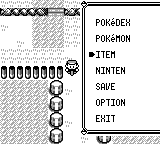
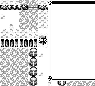
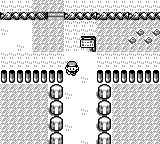
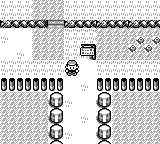

# START 窗口传输与缓存恢复（114、116）

## 玩家可见的问题

START 已进入初始化等待时，旧实现立即显示完整菜单，却继续忽略输入。原作先显示原地图，再显示空框，最后通过三次 VBlank 分批显示文字。另一个缓存缺陷会在草地附近行走时留下草地优先级遮挡的旧像素；直接完整绘制的截图不能发现它。

## 原作证据与修复范围

参照 pret/pokered `fbcf7d0e19a3a2db505440d3ccd3d40ca996c15c` 的 `DisplayTextIDInit`、`DrawStartMenu`、`CopyScreenTileBufferToVRAM` 和 `AutoBgMapTransfer`，在原版模拟器中以真实 SRAM CONTINUE 和实际 Bicycle 菜单准备常青市（ViridianCity，map id 1）场景，玩家坐标为 (20,30)。录制文件名中的 road 不表示当前地图为 Route1。Down 与 START 输入均逐硬件帧记录，不移动比较帧。

以进入 START 为 +0，地图保持到 +3，空框从 +4 开始，+21/+22/+23 分别显示第一、第二、第三部分文字。骑车场景进入于 t12、空框 t16、文字 t33–35；步行对应 t19、t23、t40–42。原作钩子录制的 101 张 PNG 与未插桩录制相同。

背景自动传输有三个六行部分，先显示哪个部分由此前 UI 历史保留的 `hAutoBGTransferPortion` 决定，不能写死为某种交通方式。原始夹具步行为部分2，骑车为部分0；对照时明确匹配这个瞬时状态。另外分别控制原作 HRAM 与复刻瞬时状态为0、1、2，各重复两次，六组对照的三个区域文字出现/未出现的时序没有错帧；所有重复 PNG 均相同。此比较排除边框布局与字体，仅证明内容出现的时序，不宣称整帧 RGB 相同，也不宣称各 UI 路径自启动以来的传输相位已完全对齐。

此次窗口阶段对齐限于非 Safari 的普通 START；Safari 先打印额外窗口，保留现有显示路径，单独待审计。新实现保留窗口阶段和传输部分；方向 Delay3 与 Redisplay 的输入等待继续显示已有文字。临时相位进入 JSON 快照，旧 JSON 缺字段使用默认值，SRAM 格式不变。所有 UI 的传输使能/暂停周期仍需进一步原作审计。

## 缓存缺陷（116）

历史测试夹具以 Down 输入、Route1 (20,30) 的第6帧复现缓存与完整绘制在 (66,74) 的不同像素。后续审查发现 Route1 宽10个地图块，即20个可行走格，x20 已越界；这份失败日志只证明边界夹具下的问题，不能作为地图内正常行走的证据。玩家精灵位于 y60–75，草地遮挡却绘制 y72–79；原有16×16玩家补丁没有保存最后四行，滚动后旧遮挡进入玩家区域。新增独立16×8遮挡补丁，在滚动前按逆序恢复重叠区域，保持每个补丁的最大尺寸。

缓存键同时纳入实际显示的玩家姿势、视口以及 START 窗口阶段。测试通过真实逐帧输入覆盖英/中文、步行/骑车、开菜单/持续行走，共8组100帧，逐像素比较缓存与完整绘制，并要求实际命中缓存复用。历史800帧全部一致；旧代码的失败日志保留。119复核将这两项移动测试改用地图内 (12,22)，原作方块数据确认 (12,22..24) 连续三格均为草地，并逐帧断言玩家仍在 Route1 范围内。有效夹具的两项测试通过，仍覆盖800帧逐像素/调色板比较。单独撤除草地补丁后，地图内同样在第6帧 (66,74) 失败；恢复补丁后全部通过。原作方块及图块哈希、正反测试日志见同目录 `fixture-119-verification.json`；旧档案保持历史来源。

## 尚未验证

此轮证据不证明移动 NPC 在字体加载时的站姿/位置、菜单关闭/子菜单返回时的图形恢复、连接与脚本移动时钟或冠军通关在最新代码上的完整回归。胜利之路2F第二机关已有差异记录，继续保留为待修项目。

## 复核与截图

Safari 范围保护加入前的 core/app debug-server 回归：3652通过，80组，55显式忽略，零失败；最终复核记录见后续提交说明。实际缓存录制步行与骑车各101帧、各重复两次；重复 PNG/JSON 全部一致，并且修复后与对应完整绘制录制的所有101 PNG逐字节相同。连续证据和失败日志保存在 `docs/screenshots/fidelity-start-menu-transfer-114/raw-traces.zip`，来源、比较边界和文件哈希见同目录 `manifest.json`。

以下前为实际master31b1、后为本分支，相同SRAM/物理输入/记录帧，均使用真实缓存绘制。它们展示整个PR的差异，含玩家与镜头节奏修复，不能用于宣称只有草地补丁改变了这一帧。

骑车后START t20：

步行Down t6：

## 性能复核（117）

360fd25的GBA性能门禁有两个指标越线：oak-dialogue-v1更新193ticks，限192.1；overworld-movement-v1提交103ticks，限102。保留原基线和门槛。此后仅对实际草地优先级图块保存额外补丁；菜单缓存按可见文字部分区分，空框等待期间复用已有画面；三部分循环避免取模。800帧完整/缓存像素回归仍通过；实际四组101帧优化前后PNG逐字节相同，见同目录performance-117-pixel-verification.json。新提交的GBA性能与完整CI结果仍需核对，不能把这些局部证明当作门禁通过。

## 可见状态缓存与 GBA 实测（118）

fc8d144的两项门禁仍为193/103，失败日志保留。继续定位到缓存同时记录了逻辑状态与延迟显示状态：逻辑计数先改变但LCD画面未变时提交一次，实际姿势/视口变化时又提交一次。缓存键现在在普通、有图形资源的呈现路径只使用实际显示的姿势和视口，保留交通方式、NPC、地形动画等可见字段；特殊动画和无资源文字回退继续使用原始字段。UI更新的纯屏幕类型判断使用枚举模式，避免完整PartialEq路径，行为不变。

8组100帧完整/缓存像素回归继续通过；4组101帧实际缓存PNG与360fd25逐字节相同。以nightly-2025-12-07构建同源perf-benchmark ELF，mGBA0.10.5 SDL软件模式、虚拟声音/视频运行生产7场景硬件Timer2计时，原基线31项指标全部通过：对白更新183ticks（上限192.1）、场景移动提交63（上限102）、移动绘制平均200（上限289.8）。基线及门槛未修改；原始结果、ELF和源文件SHA256见performance-118-verification.json。该本地实测不能替代匹配最新提交的远程CI检查。
