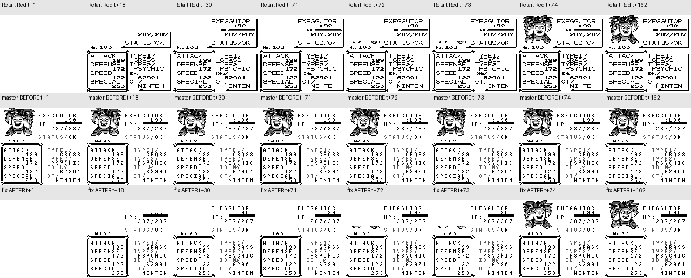

# 状态页载入、鸣叫音量与前图（59、79、81）

原作源码固定为 `fbcf7d0e19a3a2db505440d3ccd3d40ca996c15c`，retail Red ROM SHA1 为 `ea9bcae617fdf159b045185467ae58b2e4a48b9a`。使用 RGBDS 1.0.1 重建，哈希与已有原作审计基准一致。DEBUG Blue 仅通过真实 SAVE 准备 SRAM；正式录制使用 Red 正常 Continue、开始菜单、队伍与 STATS 输入。两次独立录制逐帧 PNG、PCM、状态与事件完全重复。

## 确认的差异

修复前判定 **FAIL**。STATS 的 A 在同一帧显示完整状态页并启动鸣叫，缺少清屏与图片载入；原作鸣叫结束前不接受翻页。椰蛋树实际输入：

|阶段|原作|master 修复前|修复后|
|---|---:|---:|---:|
|确认 A|0|0|0|
|全白画面开始|1|无|1|
|状态信息开始|18|0|18|
|鸣叫开始|71|0|71|
|前图完整显现|74|0|74|
|鸣叫结束、等待按键|162|91|162|

原作 `engine/pokemon/status_screen.asm` 的 StatusScreen 先白屏、装入 HUD tile 和文字，再由 `home/pokemon.asm` 的 LoadFlippedFrontSpriteByMonIndex 解压、补齐并镜像 7×7 前图，最后 PlayCry。缓存图片的复刻省略了这些可见等待。原作 BG 每帧复制屏幕的三分之一，前图有时出现一部分后会保持一帧；不能简单把三帧按图片三等分。

另两处运行证据：原作 NR50 全程为 `77→33（确认）→77（鸣叫第71帧）→33（鸣叫结束第162帧）`，复刻一直为 77；原作与复刻完整前图互为水平镜像。第二页原作保留第一张前图，复刻另加了 4px 下移；小图还缺少原作 7×7 缓冲区的底部补齐。

## 修复与验证

共用 StatsScreenState 保存载入阶段；队伍、PC 和联机入口均等待装图完成才启动一次鸣叫，并继续锁定鸣叫期间的 A/B。按原作 151 种精灵的解压时序区分等待时间和分段显现；不是统一使用椰蛋树的 71 帧。通过 `scripts/measure_stats_entry.py` 重放固定 Red 状态、消费真实 A、记录 StatusScreen/PlayCry 等 routine 获得时间表。两组使用不同 nickname 的测量结果一致，提交的脚本也重新生成了相同的 151 项。时间表抽取用受控 RAM 种类/名称夹具，不代表完成 151 次自然流程游玩。

背景音量在三个入口按原作降低，鸣叫期间恢复，结束再降低，退出恢复全音量。前图使用项目已有 blit_front_pic 补齐并镜像，两个页面保持相同位置。渲染缓存纳入载入阶段。

190 项 debug-server 应用单元、476 项未优化所有应用目标、2707 项核心单元、8 项联机集成通过。新增回归通过宝可梦中心电脑的真实隐藏交互、Bill 菜单、队伍/箱子列表、STATS，验证早按键忽略、原作音量窗口、翻页、返回 PC 原菜单及队伍/箱子不交换。另一回归逐帧比较实际状态页缓存绘制与完整绘制，防止漏掉清屏或装图阶段。既有联机测试仍比较选中种类的音频寄存器、完整鸣叫长度和只播放一次。

## 连续帧证据及范围

基线为实际 master `1b1cc2498260df93049706753270be9028229fc1`。两个 native 检出使用完全相同的只读测试模块、SRAM、地图 PalletTown (5,6) 面向 Down、6 只队伍及按键；确认 A 均按住两帧，第三帧释放。每次 update/tick 对应一张 PNG，未使用递归 debug step_frames，也未做时间重采样。帧号、输入、队伍、模块和二进制哈希在 manifest 中。

修复后的椰蛋树窗口：图片区域 x8..64/y0..56 在 t1..239 的每一个 RGB 像素均与原作相同；NR50 的 t-1..239 整个序列相同；语义阶段和鸣叫起止匹配。两次 PNG、PCM、JSON 完全相同。该载入窗口的图片和时序通过；完整两页演出仍为 **PARTIAL**：字体按用户要求排除，完整背景音乐/PCM 未作等价判定，第二页载入与退出还要继续审计。新录制已经确认第二页原作会等待约 7 帧，不能据本次入口验证宣称全状态页无差异。

PyBoy 的默认 Grey 第二灰阶为 153；本次明确使用与 app 相同的 DMG 灰阶 `[255,170,85,0]`，这属于模拟器配色配置，不是对时间或图片形状做归一化。

完整连续 PNG/PCM/事件：[原作](screenshots/fidelity-59/reference-raw.zip)、[master](screenshots/fidelity-59/native-before-raw.zip)、[修复](screenshots/fidelity-59/native-after-raw.zip)。每个归档保留 t-1..239 全窗口；重复哈希和状态记录见 [manifest](screenshots/fidelity-59/manifest.json)。
