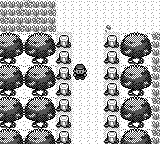
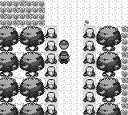

# 常青森林满包拾取修复

修复前，森林的三个可见地面道具忽略 `giveItem` 返回值：背包无法容纳物品时，仍设置领取标记、隐藏对象并显示领取成功。修复后只在给予成功时完成上述操作；失败显示原版 `No more room for items!`，保留物品供稍后领取。

范围为常青森林 Antidote、Potion 和 Poké Ball 三个脚本。依据固定 pret revision `fbcf7d0e19a3a2db505440d3ccd3d40ca996c15c` 的 `engine/events/pick_up_item.asm`、`engine/items/inventory.asm` 和 `data/text/text_1.asm`，原文与哈希保存在 `scripts/content_regression_fixtures/`。Route 1 样品满包后消耗机会是原版行为，继续由原有用例保护。

## 验证

```sh
cargo build --bin pokered-app --features debug-server
python3 scripts/content_regression.py --repeat 3 --output /tmp/full-bag-suite
python3 scripts/playthrough.py --until m10 --artifacts /tmp/full-bag-m10
```

扩展回归覆盖三个物品的满包重复拒绝、重启后保留、实际 ITEM → TOSS 操作腾出空间、领取成功及再次重启后不重复领取；另验证 20 格已满但现有精灵球堆叠可容纳时正常合并。初始化使用 debug 填包和 warp，拾取、丢弃与对话使用按键；保存由 debug 命令触发，重启走 CONTINUE。

master `2a87d93` 使用原有 Antidote 用例再次复现失败（7.149 秒），错误对话为 `RED found ANTIDOTE!`。同一原有用例在修复版本通过。完整结果见 [验证摘要](audits/full-bag-pickup/results.json)。测试时工作树基于上述 master，包含本 PR 的修复；报告中的 `engine_commit` 为构建时基线提交，源文件 SHA-256 用于识别被测改动。

本次完整内容回归 **30/30 通过，232.877 秒**；全新 m01–m10 通过，里程碑耗时合计约 **226.9 秒**。构建、Python 语法及原版 fixture 哈希校验通过；现有英中文本全部保留，仅新增背包满提示。

## 同状态截图

两边分别完成同一满包 Antidote 拾取尝试并保存，然后使用各自版本和存档，固定地图坐标及 30 帧中性输入截图。前图在 master 分支采集；后图在修复分支采集。玩家正上方的道具在修复后保留。

```sh
target/debug/pokered-app run --save <对应存档> --skip-intro \
  --warp ViridianForest,25,12 --no-audio \
  --screenshot <before或after.png> --screenshot-frames 30
```

| 前 | 后 |
| --- | --- |
|  |  |

此修复防止后续错误拾取；没有迁移已经丢失道具的旧存档，因为现有领取标记无法区分正常领取和此前的满包失败。
