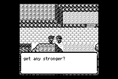
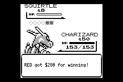

# GBA memory-peak audit

## Global follow-up (2026-09-27)

The expanded audit found additional failures beyond the original battle-entry
snapshot. These changes are included in the normal playable ROM:

| Failure / retained allocation | Change |
|---|---|
| Browsing the Pokédex accumulates decoded sprites; the minimal reproducer froze opening entry 38 | Limit the GBA decoded-tile LRU cache to 16 KiB / 32 entries, evict before decoding, and bound missing-asset names |
| Every visited map retains its trigger bindings; sequential loading failed at Bill's House (ID 88) | Remove previous maps' triggers on reload, preserving entry-edge state and reusing bounded capacity |
| Oak's full rating/parcel AST exhausts the heap during dialogue | Generate and select small ROM branches; preserve the compiled script's command order and side effects |
| A full save can still exhaust memory when Route 22 expands both encounters | Load only the eligible early/late encounter body (8,223 / 7,960 serialized bytes), avoiding the outer conditional's extra copy |
| Seismic Toss and other shake/wave effects clone the 23,040-byte framebuffer | Shift scanlines/rows in place with overlap-safe copying and white fill |
| Move sprites and horizontal raster effects add 10,240 / 10,752 bytes of temporary data | Borrow the two animation sheets together; use one 224-byte raster row |
| Slot-machine sheets permanently retain 4,608 decoded bytes | Read their 2bpp tiles directly from ROM, including the original reward-flash behavior |
| Evolution, trade and PC Hall of Fame pictures clone tiles already in the resource cache | Borrow cached tiles during rendering |

The Route 22 selector keeps the original function when a debug/corrupt save
enables both encounters. Script-parity tests compare every command and final
flag state for **256 Route 22 combinations** (all relevant flags, both rows,
win/loss and both languages) and **688 Oak cases**. These compare against the
original compiled AST, including its existing multi-statement rating behavior.
Pixel tests compare the in-place shifts, raster rows, reloaded assets and ROM
slot-machine tiles with the previous rendering paths.

The full **13-workload GBA suite passes**, with a minimum sampled contiguous
heap block of **13,256 B** and **17,656 B** of untouched stack. Hosted library
tests pass: renderer 391, app 99, core 2,580, data 256; Python gates 19.
The final **40-battle Route 22 rerun passes** with **21,560 B** minimum
contiguous heap and **18,336 B** untouched stack. All seven performance
windows pass the existing budget. The normal ROM was rebuilt without input
drivers and passed a 3,000-frame boot smoke test; its checksum is in the
evidence directory.

The new `memory-scenarios` ROM runs the production GBA loop with seeded full
storage and explicit completion assertions. Its coverage includes 302 Pokédex
entries, all 248 map IDs, parcel delivery and all 16 Oak rating bands, a fossil
dialogue, slots, repeated menus, 330 move animations during a paused Route 22
encounter, evolution/trade movies, the ending, the full Hall of Fame viewer,
and SRAM write/reload. The separate Route 22 ROM still completes actual
battles and NPC exits. The CI memory gate requires every case in order,
rejects panics/timeouts, and requires sampled heap/stack margins of 4 KiB.

```sh
cd crates/pokered-gba
cargo +nightly-2025-12-07 build --release --features memory-scenarios
agb-gbafix target/thumbv4t-none-eabi/release/pokered-gba
cd ../..
python3 scripts/gba_memory.py --suite scenarios \
  --rom crates/pokered-gba/target/thumbv4t-none-eabi/release/pokered-gba.gba \
  --log /tmp/gba-scenarios.log --timeout-seconds 300
# Restore the normal playable ROM after diagnostic builds:
(cd crates/pokered-gba && ./build.sh)
```

Evidence and exact workload limitations are recorded in
[`audits/2026-09-27-gba-global`](audits/2026-09-27-gba-global).
The hosted first-clear chain passes m01–m08 but stops at the existing m09
Route 2 navigation failure, reproduced on unchanged `5162065` as well.
The seeded GBA ending scenario does not certify a full story playthrough.

PR preparation also corrected two integration tests to borrow owned dialogue
lines; the complete core suite now passes (2903 tests, one ignored doctest).

The following Route 22-only measurements predate the expanded fixes above.

## Route 22 follow-up (2026-09-27)

The lab-only headroom measurements below did **not** cover Route 22. With a
starter and the early-rival flags, without receiving/delivering Oak's Parcel
or acquiring the Pokédex, stepping from `(30,5)` to `(29,5)` reproduced a GBA
allocation panic at battle entry. The frozen frame is Blue's final dialogue
page. The largest contiguous free block was **19,680 B**; the transition
requested a second **23,040 B** linear framebuffer while the Route 22 script
remained suspended. The panic logger printed `memory allocation of 0 bytes
failed`; the snapshot's actual pixel allocation is 160 × 144 bytes, not zero.

The GBA transition source now captures four indices per byte directly from
the existing framebuffer: **5,760 B**, saving **17,280 B** at every battle
entry, without first allocating a linear temporary. The display framebuffer
remains word-aligned and linear for DMA. Flash frames restore the saved
palette; wipe frames retain the caller's reset palette. Wipes expand once
per frame and skip identity tile copies; shifted Shrink tiles still read the
immutable snapshot. The conversion loops and 1 KiB expansion table use a
small amount of IWRAM rather than EWRAM heap. The final release ELF uses
3,560 B of IWRAM in total, with 30,340 B `.ewram` + 65,824 B `.bss`
leaving 165,980 B of raw EWRAM before allocator alignment/metadata. No Route 22 script, encounter
condition or parcel requirement was changed.

Validation with the pinned nightly and mGBA/libmgba 0.10.5:

- `repro-route22`: **40 completed battles and NPC exits**, followed by a real
  SRAM write. Five cases repeat eight times: both early trigger rows before
  the parcel, lower row after delivery, and both late-game trigger rows.
  Each case uses a full player party; late Blue uses his six-mon party.
  Cases seed state, then walk onto the coordinate trigger and advance/fight
  with buttons through the production update/render paths.
- Minimum sampled contiguous heap block: **7,624 B**. Minimum untouched
  64 KiB stack region: **18,336 B**, including construction, scripts,
  battle rendering and the final save. Stack painting happens before the
  stack switch. Heap probes are diagnostic allocations and can affect
  fragmentation; these are workload measurements, not an all-game bound.
- Renderer: **385 tests**, including pixel parity against the previous
  linear transition blitter for all eight transition kinds, clipped/odd
  dimensions, palette handling and all 256 four-pixel combinations.
  App: **97 tests**. Route 22 core library regressions: **6 tests**.
- All seven existing performance windows pass the unchanged 15%/25-tick
  gate. Battle-entry average draw: 2,441 → **2,531 ticks** (+3.7%), max:
  9,667 → **9,654**. Trainer-entry average: 1,755 → **1,609** (−8.3%),
  max unchanged at **10,544**. The performance baseline was not relaxed.
- The broader `cargo test -p pokered-core route22` command encounters a
  then-existing compile error in `tests/viridian_mart_shop.rs` (moving the
  owned `Box<str>` dialogue lines out of a borrowed page). The scoped
  `cargo test -p pokered-core --lib route22` command passes. This integration
  compile error was subsequently fixed during PR preparation (see above).

The CI workflow now builds a separate `repro-route22` ROM and runs
`scripts/gba_memory.py`: every expected encounter and final save must finish,
any allocation panic or timeout fails, and both sampled memory margins must
stay above 4 KiB. The runner isolates the ROM/save in a temporary directory;
its parser/timeout tests also verify an existing player's save is untouched.

```sh
cd crates/pokered-gba
cargo +nightly-2025-12-07 build --release --features repro-route22
agb-gbafix target/thumbv4t-none-eabi/release/pokered-gba
cd ../..
python3 scripts/gba_memory.py \
  --rom crates/pokered-gba/target/thumbv4t-none-eabi/release/pokered-gba.gba \
  --log /tmp/gba-memory.log --timeout-seconds 180
# Build the normal playable ROM afterwards (no diagnostic input driver):
(cd crates/pokered-gba && ./build.sh)
```

Filtered emulator logs and timer results are in
[`audits/2026-09-27-gba-route22`](audits/2026-09-27-gba-route22).
The regression screenshots below are taken at emulator frame 10,000: before
is frozen on the pre-battle dialogue; after continues the early Blue battle.
The before ROM is the working branch's pre-fix `5162065` plus the initial
Route 22 reproducer. The expanded after reproducer repeats the same encounter
with a full party; these screenshots document the freeze/recovery, while the
pixel-parity tests establish unchanged transition rendering.




## Historical lab-only audit (2026-09-25)

Hardware reality check: an allocation failure on GBA is Rust's alloc-error
panic, which prints only to the mGBA debug channel — on a real cartridge it
is an invisible halt. Every allocation whose size can exceed the largest
free block at its moment is therefore a latent freeze. This audit covers the
whole bare-metal build (`target_os = "none"`).

## Measured heap profile

Probed every frame with a fallible `try_reserve_exact` bisection
(`pokered_app::game::largest_free_block`, gated by `repro-markers`), running
the full `repro-rival` flow (intro → Oak's Lab → rival battle → save).
Values are the **largest allocatable contiguous block**:

| phase | largest free block |
|---|---|
| boot / empty | 65,536 B |
| main menu / Oak speech | 58 KiB → 49 KiB |
| overworld after intro | 40 KiB |
| battle transition (tightest window) | **26,112 B** (was 20,616 B before the boot-footprint fix) |
| after the first rival battle (Oak's Lab) | ~30 KiB |
| save in the lab (after streaming fix) | succeeds |

Heap region: `0x0201_77E8..0x0204_0000` = 166,424 B. agb's block allocator is
a free list with a forward-only bump pointer, so freed blocks do not restore
the "fresh" ceiling — the boot-time allocation order permanently shapes the
largest chunk.

## Fixed in this audit

1. **Dialogue text leaked permanently** (`DialoguePage { line1: &'static str }`
   was `Box::leak`'d at every construction: signs, item messages, NPC
   conversations, script dialogues — ~64-128 B per conversation, unbounded
   over a session; hundreds of conversations equal tens of KiB on a ~30 KiB
   working headroom). The lines are now owned `Box<str>`: same per-dialogue
   allocation, freed when the dialogue drops. Only the one-time battle-rules
   leaks remain (deliberate, bounded).
2. **Boot-time 32 KiB scratch stack** removed: `game_main`'s own frame is
   under a kilobyte (after the `#[inline(never)]` constructor fix), so the
   SRAM import runs on the main stack. At boot this used to keep 32 KiB
   (scratch stack) + 32 KiB (SRAM image) live simultaneously; the smaller
   footprint also moved the battle-transition floor up ~5.5 KiB to
   26,112 B.
3. **Save path** (earlier today): streams four 8 KiB banks
   (`export_sram_bank_into`) instead of one 32 KiB allocation; saving in
   Oak's Lab used to fail exactly here.

## Accepted risks (documented, not changed)

- **Battle-transition snapshot** (superseded by the 2026-09-27 compact snapshot fix; formerly 23,040 B `FrameBuffer`, the largest
  allocation in the battle window): requires the transition frame to have
  ≥23 KiB free. It is preceded by `resources.clear_cache()` and has been
  observed to succeed in every run at the 26 KiB floor (~3 KiB slack). Do
  not add retained allocations to the battle-entry window without
  re-measuring.
- **Boot SRAM image read** (32,768 B one-shot): boot has the emptiest heap;
  safe today. If the boot retained set grows, stream this too.
- **Per-frame churn, all freed within the frame**: move-animation tileset
  clones (2 × 5,120 B/frame while move objects are active,
  `render/battle.rs:4815-4819`), the horizontal-raster buffer (≤10,752 B,
  `battle.rs:3218`), Hall-of-Fame per-frame scaled tiles (3,136 B,
  `hof_ceremony.rs:299`), title/intro/Pokédex asset clones. Churn fragments
  the free list over time; none of it moves the per-phase floor today.
- **Map-transition cluster** (~6-15 KiB: MapJson materialization,
  script_config parse, script registry rebuild): runs with ≥30 KiB free;
  fine, but adjacent to the lab peak.
- **Game Corner slots sheets**: one-time 4.6 KiB retained when slots are
  first opened (`render/slots.rs`); acceptable.

## Re-measuring

Build with `--features repro-rival` (implies `autopilot` + `repro-markers`)
and run in mGBA; the log emits `repro: heap low <bytes>B at frame <n>` for
every new low-watermark and prints the free block on every screen
transition (`mk: transition to <screen> free=<bytes>B`). A future CI check
could assert the low watermark stays above a floor.

## Static sweep — top allocation sites (any phase)

| bytes | site | when |
|---|---|---|
| 32,768 | `game.rs` SRAM read image | boot (freed) |
| 23,040 | `game.rs:7315` transition snapshot `FrameBuffer` | battle entry (retained through the transition) |
| 16,384 | `battle.rs` `TileSet::blank(256)` | non-GBA-only path today |
| 10,752 | `battle.rs:3218` raster `Vec<Rgba>` | battle, per frame |
| 10,240 | `battle.rs:4815-4819` move-anim clones | battle, per frame |
| 9,408 | `intro.rs:78` gengar tile decode | intro |
| 7,168 | `title.rs:49` logo clone | title |
| 4,608 | `render/slots.rs` slots sheets | first slots visit (retained) |
