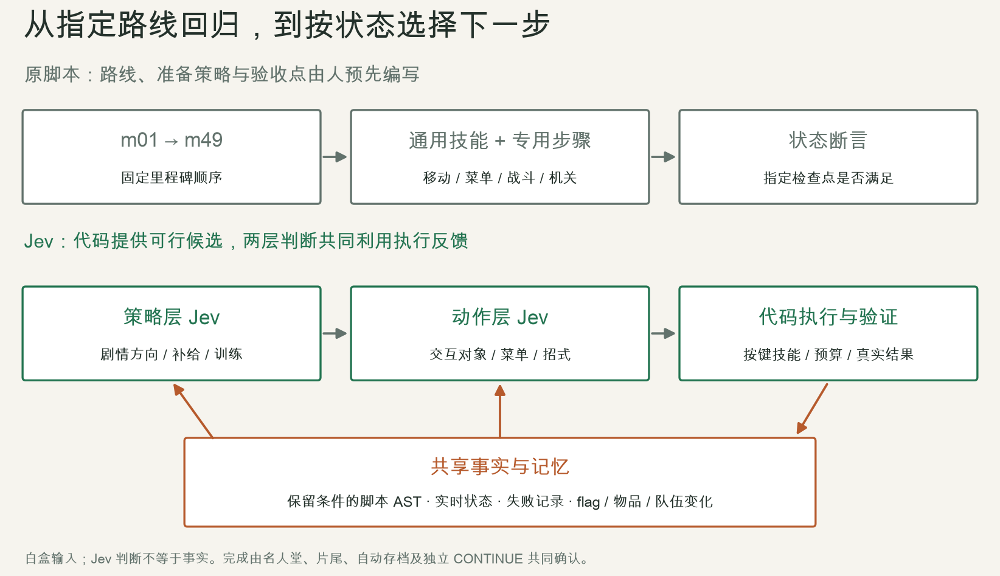
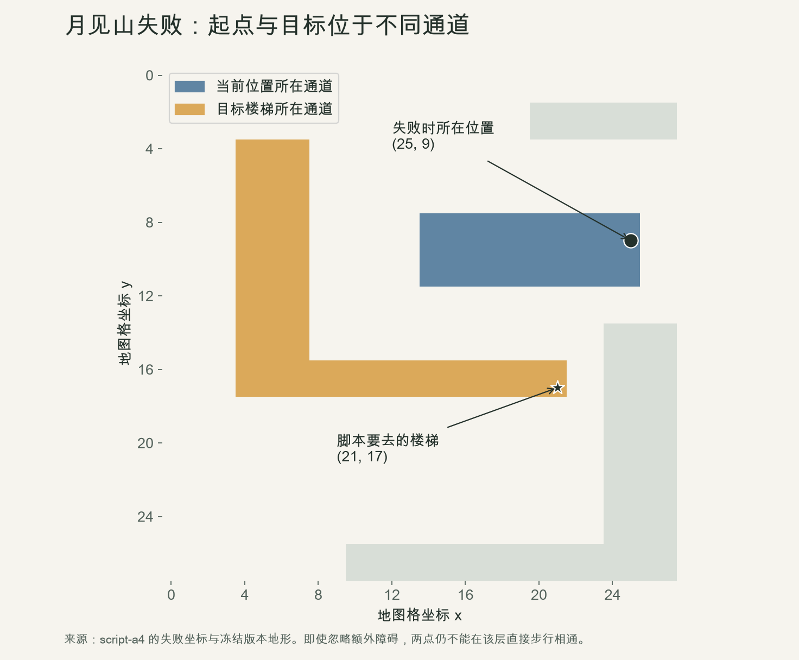
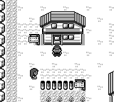
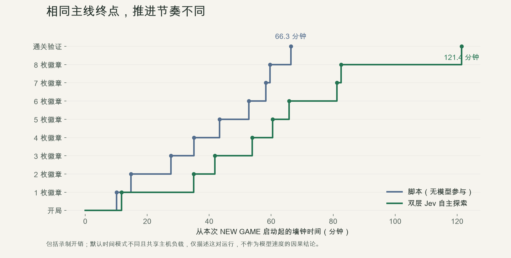
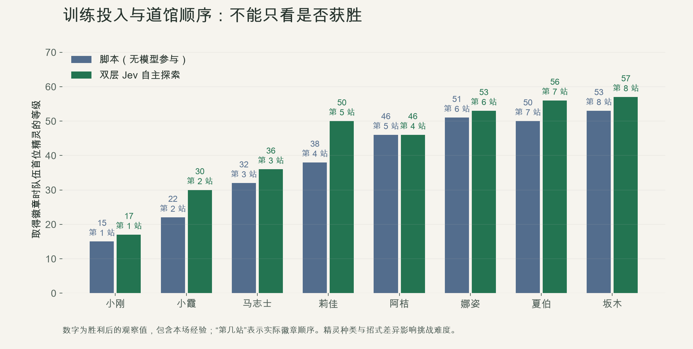
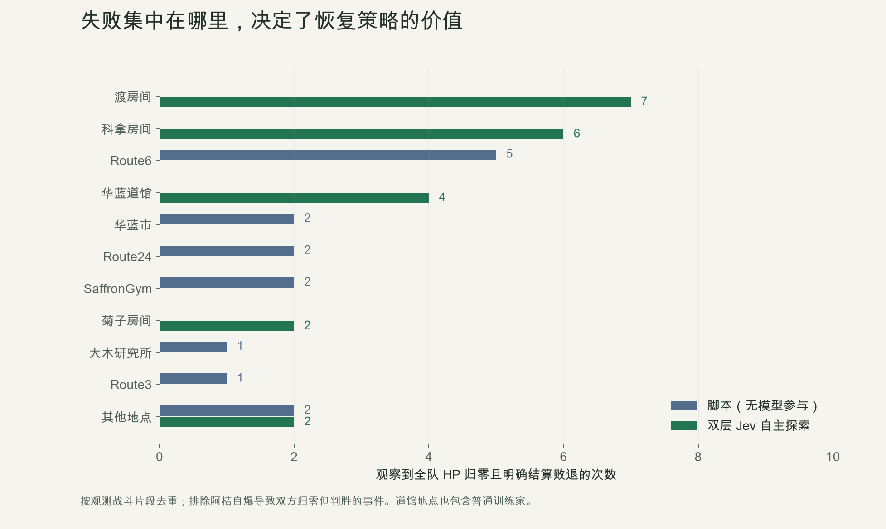
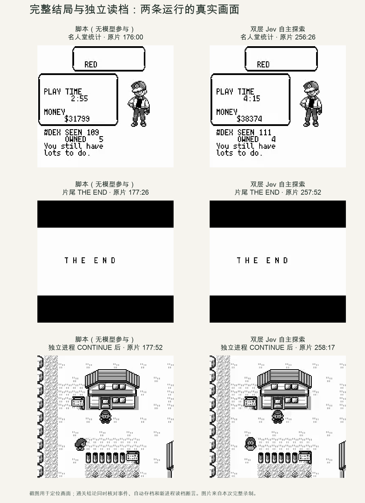

# 用 Jev 自主通关 open-pokered：整体复盘

日期：2026-09-21 · 实现基线：`475b5b2` · 关联 [PR #98](https://github.com/liuyanghejerry/open-pokered/pull/98)

**我们已经验证：在保留通用操作技能、允许读取游戏脚本和状态的条件下，双层 Jev 可以不照抄原有通关路线，从真实 NEW GAME 连续推进到完整结局，并通过独立进程读档验证。** 这给现有测试体系增加了“根据当前状态选择下一步”的能力。现阶段的证据还不能说明它更快、更便宜，或者已经能稳定替代脚本回归。

本文按“原有能力 → 局限 → 预期 → 实际问题与解法 → 收益 → 后续工作”复盘。历史脚本通关、Jev 开发期 b19 通关和 9 月 20–21 日完整补录分别标注；新录像的数字不沿用历史运行。

## 1. 原先的自动化测试能力：已经能测什么

open-pokered 原本已有多层自动化。主线驱动会查询实时状态、闭环寻路、处理战斗与失败恢复，并在关键节点断言结果；不能把它简单理解成一串盲按键。

| 层次 | 入口与方式 | 主要覆盖 | 它回答的问题 |
| --- | --- | --- | --- |
| 单元及集成测试 | Rust 测试、Python 驱动与规划器测试 | 游戏规则、存档、脚本、导航、输入、战斗及联机等局部行为 | 一个规则或模块是否按约定工作？ |
| 主线里程碑回归 | [`playthrough.py`](../scripts/playthrough.py) + [`playthrough_late.py`](../scripts/playthrough_late.py)，m01–m49 | 从开机、新建游戏到八徽章、四天王、冠军、名人堂、片尾及独立 CONTINUE | 沿这条已编写路线，游戏还能完整玩通吗？ |
| 子系统场景 | [`scenarios.py`](../scripts/scenarios.py)，11 个场景 | 背包、队伍、逃跑、获胜经验、捕获、全灭、存档往返、菜单、选项、NPC、倒下后换人 | 给定一个明确状态，这个子系统是否正确？ |
| BDD 验收 | [`bdd.py`](../scripts/bdd.py) + [`features/`](../scripts/features)，15 个场景 | 用中英文 Given / When / Then 表达上述行为及构造存档验收 | 可读的行为规格是否满足？ |
| 状态构造 | [`save_builder.py`](../scripts/save_builder.py)、调试协议、快照 | 设置队伍、物品、金钱、地图及可序列化事件，快速进入边界状态 | 能否低成本复现一个特定问题？ |
| 画面及动画验证 | [`pokered-app/tests`](../crates/pokered-app/tests)、截图和专项差分工具 | 菜单、文字、治疗、进化、冲浪、名人堂等画面与时序 | 逻辑成立时，画面表现是否也正确？ |
| 工程检查 | [CI 配置](../.github/workflows/main.yml)及其他工作流 | 构建、测试、覆盖率与各目标平台检查 | 改动能否构建并通过相应工程门槛？ |

这些层次的证据不能互相替代。场景测试可以注入状态，以便迅速覆盖边界；主线 fresh 通关则必须从真实 NEW GAME 开始，用正常操作获得进度。构造一个“冠军存档”并成功启动，不等于正常通关。

原主线具体覆盖的复杂流程包括：

| 里程碑 | 场景 |
| --- | --- |
| m01–m10 | 语言与开机流程、博士开场、房屋出口、拦截剧情、领取初始宝可梦、劲敌、包裹与图鉴、常磐森林、小刚 |
| m11–m20 | 月见山及化石、小霞、正辉与船票、圣安奴号、居合斩、马志士、岩山隧道 |
| m21–m30 | 莉佳、火箭队基地、电梯与检视镜、宝可梦塔、富士老人、卡比兽、阿桔、狩猎地带、金黄市门禁 |
| m31–m40 | 西尔佛、娜姿、飞翔、冲浪、闪电鸟、宝可梦屋机关、最后两座道馆 |
| m41–m49 | 徽章关卡、冠军之路、推石与落洞、补给、四天王、冠军、完整结局和存档持久化 |

2026-09-09 的历史记录确认了 **fresh 49/49、子系统场景 11/11、BDD 15/15**。主线没有使用传送、赠送队伍、写剧情 flag 或编辑存档代替游玩，最终队伍为闪电鸟 56 级、拉普拉斯 15 级、妙蛙花 55 级。此前六轮 fresh 在不同位置失败，经修改驱动后第七轮通过。这是历史开发记录，不是当前版本固定条件下的成功率测试。详见[原一周目回归报告](regression/first-clear-report.md)。

### 完整录像与同步决策大盘

[](jev-retrospective-assets/full-run/script-vs-jev-full.mp4)

**[Jev 完整原片 + 同步大盘播放器](jev-retrospective-assets/full-run/jev-player.html)** · [Jev 完整原片，4 小时 18 分 17.63 秒](jev-retrospective-assets/full-run/jev-full.mp4) · [直接查看三连胜后的恢复选择](jev-retrospective-assets/full-run/jev-player.html#time=12931.366666666667)

Jev 本次从真实 NEW GAME 连续完成名人堂、片尾和独立读档。原片保留全部 929,858 个模拟更新帧；网络等待不会制造游戏帧，所以原片时长不是墙钟耗时。本次墙钟时间为 121 分 25.58 秒。它是独立于 b19 的新录制，不能套用 b19 的指标。

**两路完整录制均已完成并通过结局验证。** [完整并排大盘 MP4](jev-retrospective-assets/full-run/script-vs-jev-full.mp4) · [并排交互播放器](jev-retrospective-assets/full-run/player.html) · [脚本完整原片](jev-retrospective-assets/full-run/script-full.mp4) · [结局校验](jev-retrospective-assets/full-run/verification.json)。

并排版按共同剧情节点分章，通常为 32 倍速，名人堂之后为 2 倍速；先完成的一侧以章末最近的清晰帧定格等候，原片时间同步标注。全过程保持各自原始顺序，关键解说共增加 40 秒停驻。加速版抽取展示帧，逐帧证据以两路完整原片为准，成片时长不能用来比较真实耗时。原脚本的失败与主动停止记录见第 4 节，未拼接不同尝试的前后半程。

为了让外部读者看懂决策，大盘将以下信息分开：

| 面板 | 来源与含义 |
| --- | --- |
| 策略层最近选择 | 实际目标、候选前三项及模型分配的选择概率；这些概率不是战斗胜率或通关成功率 |
| 策略 / 动作的当次输入 | 各自最近一次调用的真实输入快照、调用编号，以及按原片模拟时间计算的快照时刻和距画面的时差；视频展示摘要，交互播放器可展开完整 `state`、指令、全部候选及模型输出 |
| 动作层 / 技能执行 | 最近的模型选择、缓存复用或通用操作，不把所有按键都说成一次模型判断 |
| 执行器最近输入 | 实际记录的 A/B/方向键序列、`move_to`、`interact_with` 或 `skip_dialogue`；按命令完成后的下一次观测帧显示，不伪装成精确的按键按下动画 |
| 队伍与实际结果 | 从实时游戏状态读取 HP、等级、徽章，并在执行后确认目标效果、战胜或败退 |
| 复盘注解 | 开发者依据日志写成的解释，与模型输出分开；不声称还原了模型的隐藏推理 |

面板中文名称是对原始目标和操作的显示翻译，选择与概率来自日志。关键节点可跳转并暂停。并排成片在五处同时停驻两侧画面各 8 秒，随后从原位置继续：小刚首败、小霞阶段、折返寻找金牙、三连胜后撤退和补给未落实。

日志与录像通过 776 场战斗的共同帧锚点校验；采集器与模型日志起点差约 3.373 秒，校正后零帧不匹配。同一模拟帧上的多次判断显示最后一项，完整的墙钟顺序保留在日志中。[同步数据与校验信息](jev-retrospective-assets/full-run/jev-dashboard.json)。

底层输入的对齐精度与上述战斗锚点不同：不少 `press_timeline` 响应不带帧号，因此面板按命令完成后的下一次实际状态观测显示“最近输入”，不声称复原每一帧的手柄状态。普通对白确实常由技能调用 `skip_dialogue` 推进；YES/NO 等分支则由 Jev 选择菜单项，执行器再移动光标并按 A。选择 NO 也可能是“↓ → A”，并不等同于按 B；学习新招式时拒绝学习的技能路径则会使用 B。

此前的 [70 秒开场样片](jev-retrospective-assets/script-vs-jev.mp4)仅保留为历史附件，不作为完整通关比较的证据。

## 2. 基于脚本的自动化：短板在哪里

**第一，路线覆盖取决于人预先写了什么。** m01–m49 能可靠表达一条指定路线，也覆盖不少支线；但改变初始宝可梦、徽章顺序、队伍组成或资源状态，就可能进入没有专门处理的组合。一个绿灯表示已写断言成立，不表示所有玩家路径都能通过。

**第二，剧情知识和操作细节容易混在一起。** 例如“先拿船票再找船长”“某个开关需要保持开启”“这里站到柜台另一边交谈”，常常以路线顺序、坐标和专用步骤体现。剧情或地图变化后，需要判断是路线知识失效、导航错误，还是引擎真的回归。

**第三，恢复范围依赖显式编写。** 原脚本已经能处理败退、治疗、训练和部分重试，但恢复策略仍由人指定。一个未预料的失败可能要求重新判断“练级、补给、换目标还是先取得某个道具”；脚本不会自动获得未编写的判断能力。

**第四，长流程的维护成本会累积。** 原一周目开发曾修复组合碰撞、室外入口上下文、断崖、箭头地板、短地图数组、切图后继续走旧方向、学习招式和强制换人菜单等问题。其中不少是驱动问题，不能把每次红灯都归因于游戏引擎。

**第五，指定路径不擅长主动寻找“遗漏的路径”。** 脚本会按设计获取检视镜、识别幽灵再救富士老人；自主探索却可能尝试不同的进入顺序，暴露门禁或剧情约束的缺口。这种探索能力有价值，但仍需要确定性的验证器判断它是合法变体还是漏洞。

因此，我们保留脚本用于快速、可定位的回归，同时寻找一种能在明确边界内自主选择下一步的补充机制。

## 3. Jev 是什么，我们希望它解决什么

Jev 是 TypeSafe 的 System One 模型。应用向它提供文本或结构化状态，定义允许的答案，再接收有类型的判断与概率。它支持 Choice（从候选中选择）、Noul（判断是否成立）和 Score（有序程度评分）。官方文档说明，当前输入是文本，不直接处理图像、音频或视频。[来源：TypeSafe System One](https://docs.typesafe.ai/concepts/system-one)

本项目的自主通关主要使用 **Choice**。录像和截图供开发者审阅；Jev 实际读取的是游戏状态、脚本事实及候选描述。已有的语义对白断言使用 Noul；客户端支持 Score，但不能把“已封装”写成“本次通关已经用它优化过”。

我们希望它承担两类判断：

| 层次 | 要回答的问题 | 实际交给它的信息 |
| --- | --- | --- |
| 策略层 | 接下来推进哪段剧情？当前是否应该恢复、训练或准备前置条件？ | 未完成目标、脚本依赖、队伍与资源摘要、路程和受阻记录 |
| 动作层 | 为当前目标，具体与谁交互、选哪个菜单项、使用哪个技能或招式？ | 当前子目标、可行候选、实时状态、近期操作结果及相关战斗信息 |

代码继续负责精确规则、路径搜索、按键时序、预算、合法候选生成和完成验证。模型只能在提供的候选中判断；候选遗漏或事实错误，不能靠“更聪明地选择”补救。

### 本轮实际向 Jev 提供了什么

输入不是一份每次原样发送的全量游戏快照。新录制的 **2,122 次调用**分为以下七类；统计来自逐次调用日志，而不是按录像画面推断。

| 调用类型 | 次数 | 实际输入 |
| --- | ---: | --- |
| 策略选择 | 346 | 已完成 / 未完成目标；位置、徽章、队伍等级/HP/状态/招式/PP、背包、金钱；与候选相关的剧情标志、机关和对象状态；地图路线、已知导航失败、近期结果和未解决败退；候选附带脚本产出、前置效果、格点可达性、预计步数、对手队伍或治疗重置代价等相关信息 |
| 通用操作选择 | 869 | 当前子目标、所推进的上层目标、局部状态、最近三条结果、策略上下文；候选中的目标对象、操作、脚本效果及导航说明 |
| 战斗选招 | 820 | 双方种类与等级、基础种族值、HP 分档；可用攻击的威力、命中率、属性倍率、本系加成、暴击概率、PP 分档及期望威力。此调用没有精确 HP/PP，也没有完整地图 |
| 对话选项 | 63 | 子目标、最近对白、当前位置、旅行意图、相关脚本效果和确认选项、当前菜单；不重复附带完整队伍和地形 |
| 强制换人 | 16 | 对手当前状态；每个可出战候选附带队伍成员状态与有效攻击 |
| 学习招式 | 4 | 当前宝可梦、新旧招式数据、保留或替换选项 |
| 受限战斗处理 | 4 | 当前战斗状态、未识别幽灵阻止攻击的约束、合法脱离候选 |

**地形主要以代码计算的事实进入模型。** 模型可能收到“目标触发区域可达、预计若干步、需要冲浪”“某处树木或门禁阻碍路线”“某个开关改变哪些地块”等描述。完整碰撞网格、逐格 BFS 和按键时序由代码处理；录像画面没有作为视觉输入发送。脚本语义也可能提前提供确认选项、物品产出与对手队伍，因此这是白盒语义辅助的自主探索。

大盘把“游戏当前状态”和上述“当次输入”分开显示。例如战斗画面可以显示实时精确 HP，但选招输入仍只展示原调用的血量分档；旧的策略快照也不会用后来的队伍状态覆盖。完整应用层输入与输出保存在 [jev-inputs.json](jev-retrospective-assets/full-run/jev-inputs.json)，交互页按需加载，可检查全部候选而不限于视频中显示的前三项。



这形成了“**选方向 → 选操作 → 执行 → 验证 → 反馈**”的闭环。预期收益是让不同状态下的目标选择更灵活，并减少逐条编写剧情行程的需求。宏观与微观共同考虑是设计目标，尚无证据证明实现了全局最优。

另一个边界是：**输出格式受约束，不代表判断内容正确。** Choice / Score 的 confidence 描述候选概率分布的集中程度，不能当作“通关正确率”或成功事实；阈值需要在本项目的数据上验证。[来源：TypeSafe Confidence](https://docs.typesafe.ai/confidence)

## 4. 实际遇到的问题，以及我们的解法

接入过程不是换一个模型调用就完成了。早期 T2J 单层尝试暴露出完成判定、状态表达、执行和记忆问题；随后实现双层判断，再把导航、资源与复杂机关补到能够连续自主推进。以下按问题归类，避免把所有失败都算到模型身上。

| 问题 | 实际表现与原因 | 解法及当前状态 |
| --- | --- | --- |
| 假成功 | 未选出目标、返回 `none` 或配置无效，被当成“全部完成” | 区分拒选、无可行目标和真实完成；未完成 flag 仍存在就不能判成功。最终冠军目标另有结局持久化验证 |
| 前置条件丢失 | 旧图只知道某地图读写过哪些 flag，丢失否定、早退、分支和效果顺序 | 导出保留结构的脚本 AST，按实际条件建立产出及前置关系。包裹已领取时的提前 return 不再被误读为领取包裹的前提 |
| 给了状态，仍选错对象 | 初始宝可梦阶段反复找博士，而不是去精灵球 | 给候选附上其条件、产出、确认步骤和已观察结果。一个局部探针中，仅增加通用状态仍 3/3 选博士；补充具体动作语义后 3/3 选精灵球。它只证明该状态上的输入改进，不能外推为总体成功率 |
| 交互被当成等待 | 图鉴预览、YES/NO、学习招式、商店和选择菜单需要不同操作，统一“跳过对白”会停住 | 按当前画面、脚本效果和菜单类型执行完整技能；用物品、flag、队伍等增量判断结果 |
| 循环与过期失败记忆 | 打开同一段对白被误判为进展；某动作失败后永久屏蔽，即使前提已改变 | 以实际状态变化定义进展，保留失败上下文，并随相关前提变化重新开放候选 |
| 两层目标脱节 | 动作只完成局部操作，却忘记父目标；离开地图又触发机关重置 | 向动作层传递父目标和准备条件，处理耦合开关，考虑脚本 `@load` 带来的状态重置 |
| 物理可达性不准确 | 出口、骑行、自动滑行、冲浪上下岸、NPC 移动和动态障碍使规划与引擎不一致 | 从实际地图和引擎规则建立通用技能，观察后重新定位；修复陈旧 NPC 记忆、无效电梯出口与边界移动 |
| 条件拒绝被当成永久墙 | 狩猎地带的退回对白导致正常付费入口也被阻断 | 检查同一剧情中是否有当前可用的选择传送，或选择写入的 flag 能解除自身条件；只把真正有效的阻碍加入导航记忆 |
| 模型等待改变执行时序 | 异步输入队列与推进帧之间存在竞态；中断还可能使协议响应错位 | 新增同步输入时间线，等待一次完整命令往返后再响应中断；核对最终观察类型，并隔离每次运行的二进制与附属存档 |
| 战败后准备不足或过度 | 多次挑战失败；另一方面又出现满血后反复恢复、不断练级 | 记录实际对手和战败状态，提供训练、恢复及战斗候选，加入招式信息和判断缓存。已能完成通关，但效率问题仍在 |

详见[最初评审及局部实验](jev-story-exploration-review.md)和[连续开发记录](jev-autonomous-progress.md)。这些解法中，有些改善了给模型的信息，有些修复了代码执行器；“使用 Jev”带来的结果是整个系统的结果，不能全部归因于模型本身。

### 完整补录暴露的新边界

这次为了保留两路从开局到结局的录像，又遇到了几类不同的问题。它们属于复盘证据，不能把修改与重跑成本藏起来。

| 尝试 | 实际结果 | 处理 |
| --- | --- | --- |
| script-a1 | m17 停在新增的 MachineBoot 提示，约 23 分 35 秒 | 两次独立复现后，适配通用道具菜单 |
| script-a2 | 主动停止的重试 | 已确认原因后终止，不计为通关失败样本 |
| script-a3 | 已通过 m17，后主动停止 | 另一个独立药品检查暴露 ItemHpRestore 动画等待；补齐后从头录制 |
| script-a4 | m12 月见山败退重试后进入另一条不连通通道，约 13 分 52 秒 | 保存失败现场，同版重跑；下一次通过 m12 |
| script-a5 | m32 西尔佛劲敌战正常败退，约 47 分 55 秒 | 对手喷火龙的暴击使妙蛙花倒下，里程碑没有该处的重试；保留证据后同版重跑 |
| script-a6 | m09 常磐森林败退后预期地图与实际位置不符，约 3 分 36 秒 | 沿用相同适配版本从 NEW GAME 重跑，保留本次失败 |
| script-a7 | m32 西尔佛劲敌战再次败退，约 46 分 38 秒 | 确认缺少局部恢复；补齐真实败退后的有界重试，再从 NEW GAME 录制 |
| script-a8 | m45 科拿战败退，约 63 分 1 秒 | m32 首次挑战即通过，尚未实际触发新增的重试；联盟中 75% 血量阈值耗尽补给，随后补充联盟用药和有界恢复 |
| script-a9 | m09 常磐森林三次败退，约 4 分 13 秒 | 重试未获得足够经验；改为确认败退后提前进行原 m10 的 13 级训练，再尝试穿越 |
| script-a10 | 开局阶段主动停止 | 独立检查发现无复活道具时可能对倒下队员反复使用 HP 回复药，修正目标有效性后重新补录 |
| script-a11 | m34 娜姿战败退，约 52 分 53 秒 | m32 首次通过；为娜姿及其后两座道馆补充真实败退恢复，并先验证 m33 之后的完整链路 |
| script-a12 | 全部 49 个里程碑、冠军、名人堂、片尾与独立 CONTINUE 通过，66 分 20.09 秒 | 最终完整素材；金黄道馆两次败退后恢复，联盟首次入场即通关 |

菜单修复涉及 `playthrough_late.use_item`：推进 TM/HM 确认、等待 HP 恢复动画，以及关闭预期结果菜单。通过了 HM 空槽、HM 替换、TM 空槽、复活和全满药五项真实引擎检查；没有更改剧情路线、队伍计划或游戏二进制。[补丁](jev-retrospective-assets/full-run/script-menu-adaptation.patch)与[录制尝试清单](jev-retrospective-assets/full-run/recording-attempts.json)均有归档。这一差异来自驱动适配，不能写成 Jev 自动理解了未知界面。

script-a7 再次在 m32 正常败退后退出，因此最终补录版本又增加该处最多四次的真实重试：仅在金黄市观察到全队主力 HP 归零且战斗阶段明确为败退时，治疗并步行返回劲敌处；其他异常继续报错。这次修复保持原路线、队伍和战斗用药策略，不读档或注入状态。四项恢复场景与原导航测试共 33 项通过；script-a8 在 m32 首次即获胜，不能视为实际验证过失败重试。完整差异见 [驱动适配补丁](jev-retrospective-assets/full-run/script-driver-adaptation.patch)。

script-a8 随后在科拿战暴露联盟补给策略问题：白海狮剩余 6 HP 时连续使用 7 瓶全满药，面对迷唇姐又耗尽其余 9 瓶，最后用完 4 个活力碎片后全队败退。最初的修复把联盟房间内的治疗阈值从 75% 调整为 40%，仍优先解除异常状态，并在确认全队败退后最多重新入场五次；购买补给只能使用实有金钱。这是人工修改过的战斗与恢复策略，因此完整对照标记为“脚本（无模型参与）”，不能再称为完全未改动的原脚本。独立构造场景已验证首次冠军战败退、补给重试后通关及独立 CONTINUE；另有弱队测试验证败退后购买补给，加入森林恢复后，导航和恢复测试共 47 项通过。该场景只用于验证，不纳入完整录像。[独立诊断记录](jev-retrospective-assets/full-run/script-league-diagnostic.json)。[科拿失败片段](jev-retrospective-assets/full-run/script-lorelei-failure.mp4)与[用药阶段记录](jev-retrospective-assets/full-run/script-lorelei-healing-evidence.json)保留为审计材料。



月见山失败时，脚本实际在 B1F 的 `(25,9)`，目标为 `(21,17)`；冻结地形显示两点不在同一个可步行通道。到达正确地图名，不等于到达正确入口或连通区域。这解释了下一步为何不可达，但不足以单独断定上一步为何走错。[实际失败片段](jev-retrospective-assets/full-run/script-moon-navigation.mp4)。


script-a9 又在 m09 用尽原有的三次森林重试。最终脚本仅在确认真实败退后，将原 m10 已有的 13 级训练提前到穿越森林之前，仍通过普通战斗获取经验。该调整属于人工补充恢复策略，通关对照因此也包含准备时机的差异。

script-a11 在 m32 首次获胜后，仍在娜姿战正常败退并停止。因此后续版为娜姿、夏伯和常磐道馆共用最多六次挑战的恢复逻辑：仅在确认全队倒下并回到对应城市后重新治疗、步行入场，保留已获得经验和实际金钱损失。独立测试中单纯重试六次仍不足以击败娜姿，因此增加战前按余额补充高级伤药，并将智能战斗治疗阈值统一调整为 40%，减少之前在西尔佛和联盟都观察到的连续用药。联盟采购按实有余额进行，不再因无法购买预设数量而直接停止。后半程独立构造场景已通过 m34–m49：娜姿败退两次后获胜，之后完成八徽章、冠军、名人堂、片尾及独立 CONTINUE。[后半程诊断记录](jev-retrospective-assets/full-run/script-post-m33-diagnostic.json)。该诊断不计作完整通关录制，最终 script-a12 素材独立从 NEW GAME 连续录制，未使用此构造场景。

西尔佛的失败则有不同含义：游戏战斗正常结算为败退，胜利断言正确报错，但流程没有继续恢复。此前对手胡地剩余 17 HP 时，75% 血量阈值导致脚本连续使用了 8 瓶高级伤药，对手 HP 在这期间没有下降；之后面对喷火龙时已没有这些补给。最后的暴击是直接触发点，恢复规则与资源消耗同样需要审视。[实际战败片段](jev-retrospective-assets/full-run/script-silph-rival-failure.mp4)。它与 Jev 能在多次战败后继续选择准备和重试形成对照；仍不能由单个案例推出总体成功率。

### 完成标准也必须随自主探索一起升级

此前完成实现验证的历史运行是 `20260920-081028-seed42`（开发标签 b19）：

1. 真实 NEW GAME，起点在 `RedsHouse2F`，空队伍、零徽章、名人堂 0。
2. 通过实际操作取得八徽章并击败冠军，未调用旧 `mNN` 处理器或从检查点恢复。
3. 观察到名人堂、片尾 TheEnd 和返回标题。
4. 让游戏自己写出结局存档，再由独立进程 CONTINUE；终态在真新镇，徽章位图 255、名人堂记录 1。

全过程使用通用技能与受审计的调试命令边界，没有用 `warp`、`give_*`、`set_flag` 或 `restore` 注入剧情进度。[审计摘要与策略哈希](audits/2026-09-20/jev-autonomous-seed42.json)已随代码保存。


| 指标 | b19 连续成功运行 |
| --- | --- |
| 模型 | `jev-1.13.0` |
| 耗时 | 4926.469 秒，82 分 6 秒 |
| 策略 / 动作判断 | 383 / 2033 次，合计 2416 次 |
| 执行 | 1081 个操作，1045823 帧 |
| 输入 / 输出 tokens | 9,989,055 / 137,967 |
| 战败 | 小霞 5 次、科拿 10 次、渡 1 次，共 16 次 |
| 最终队伍 | 喷火龙 95 级、拉普拉斯 15 级 |
| 独立读档 | `PalletTown` / `overworld` / badges 255 / HOF 1 |
| 相关验证 | 281 项 Python 测试；13 项 Rust 语义测试、5 项协议测试，以及 app lib / bin 的同步输入测试通过 |



上图是 b19 保留的实际终态画面；单张真新镇截图不能独立证明通关，必须结合上面的结局阶段与读档审计。运行时还写了一个**验证后的开发检查点**，所以归档 `game.sav` 的哈希与此前用于独立 CONTINUE 的结局自动存档哈希不同，审计已分别记录。

b19 是开发轮次标签。各轮开发中修改过代码，部分运行被中断或仅验证局部阻碍，因此不能拿它计算“19 次里成功 1 次”的固定策略成功率。

## 5. 相比原先脚本自动化，实际获得了什么

### 本轮完整录制的测量结果

最终对照为 `script-a12` 与 `jev-a1`，不将历史 b19 的 82 分钟或 95 级队伍混入成绩表。两路使用相同游戏二进制和 seed 42；脚本保留既有路线与默认实时循环，Jev 保留自主候选选择与 driven-only。因此这是**两个完整控制系统的案例比较**：不同初始精灵、路线、时钟模式、模型随机性、录制开销和主机负载都影响结果，不能作为模型能力的单变量实验。脚本侧包含本轮人工补充的兼容性适配与败退恢复修改。

| 指标 | 脚本（无模型参与） | 双层 Jev 自主探索 |
| --- | ---: | ---: |
| 完整结局、自然存档及独立读档 | 通过 | 通过 |
| 墙钟耗时 | 66 分 20.09 秒 | 121 分 25.58 秒 |
| 完整原片时长 | 2 小时 57 分 52.15 秒 | 4 小时 18 分 17.63 秒 |
| 完整原片模拟帧 | 640,329 | 929,858 |
| 策略 / 动作模型调用 | 0 / 0 | 346 / 1,776 |
| 输入 / 输出 tokens | 0 / 0 | 8,023,570 / 118,672 |
| 模型调用总延迟 | 0 | 2,169.396 秒 |
| 观察到的战斗片段 | 293 | 776 |
| 明确败退 / 全队 HP 归零事件 | 15 / 16 | 21 / 21 |
| 访问地图数 | 132 | 133 |
| 终态图鉴：见过 / 拥有 | 109 / 5 | 111 / 4 |
| 最终队伍 | 闪电鸟 55、妙蛙花 55、拉普拉斯 15 | 喷火龙 85、拉普拉斯 15 |
| 最终金钱 | 31,799 | 38,374 |
| 独立读档结果 | 真新镇、八徽章、名人堂记录 1 | 真新镇、八徽章、名人堂记录 1 |

战斗与败退按协议观测片段去重，不是引擎内部完整计数。脚本在阿桔战出现双方 HP 同时归零、引擎仍判胜的事件，所以“HP 归零”不能直接等同于“失败”。最终金钱只是余额，不是累计收入；终态图鉴数由名人堂实际画面读取，未采集图鉴变化流水；完整图鉴采样与金钱变化指标在下一轮补齐。

这对录像中脚本墙钟更短，Jev 战斗片段更多、主力等级更高。2,169.396 秒 API 延迟包含远程服务处理，不能全当网络 RTT 扣掉；原片也不保留静止的模型等待。因此两种时间与加速成片时长必须分开解释。









### 从录像和判断记录中得到的认知

**1. 自主调度确实产生了不同路径，终点相同不等于覆盖相同。** 脚本按 m01–m49 执行，包含火箭队基地、检视镜、飞翔和闪电鸟等明确覆盖；Jev 根据候选与当前状态选方向，先打阿桔再打莉佳，访问过双子岛五个楼层，但没有进入火箭队基地或无人发电所。两者总地图数接近（132 与 133），实际覆盖却不同。Jev 已救出富士老人，但未取得检视镜，日志也没有幽灵嘎啦嘎啦的已击败标志；这需要单独检查剧情门禁，不能直接宣传成合法捷径。这证明它能走出不同路线，也说明“通关”不能代替逐项支线覆盖断言。

**2. 从失败中恢复是实际收益，但当前准备方式仍偏向练主力。** Jev 的小火龙 15 级输给小刚后，代码生成训练至 17 级的候选，模型选择训练并再次挑战。华蓝阶段还出现一场普通训练家败退和三次小霞败退，取得第二枚徽章时主力已是 30 级火恐龙。已有候选能支撑“练级、恢复、重试”，却缺少完整的属性针对性捕获、组队与培养方案；这部分不能仅靠改善选择概率解决。脚本原本也有若干显式的败退恢复，因此不能把收益表述为从完全没有反馈升级到有反馈。

**3. 前置条件能被发现，但跨目标合并准备仍有空间。** Jev 第一次进入狩猎地带取得冲浪，在八枚徽章后再次返回寻找金牙、准备怪力。脚本将冲浪和金牙纳入同一段既定路线。Jev 两次访问之间完成了多个道馆，那段时间并非全是无效绕路；实际可以改善的是发现共享前置条件并顺路准备。[跳转金牙节点](jev-retrospective-assets/full-run/jev-player.html#time=10859.5)。

**4. “三连胜后撤退”需要结合当次输入理解。** 原片 3:35:31，喷火龙 66 级仅剩 4/210 HP，喷射火焰 1 PP、挖洞 0 PP；模型输入已明确说明治疗路线会重置三场已获胜战斗。Jev 给恢复分配 46%、继续冠军目标 44%，最终选择恢复。此时撤退有依据，问题更早发生在连战前资源准备；不能断言模型不知道重置代价，或只凭结果责怪这次选择。[当次输入与候选](jev-retrospective-assets/full-run/jev-player.html#time=12931.366666666667)。

**5. 候选存在和候选足够有效，是两个问题。** 随后的判断已经提供购买全满药 ×1、全满回复药 ×2，Jev 仍选择继续挑战。代码同时把神奇糖果算进 `medicine`，而更强的“缺少恢复物资”处理要求这个集合为空，导致背包里的糖果影响了补给判断。这是候选生成逻辑与模型选择共同作用的结果；本轮没有临时修复后续再拼接录像。最终以 85 级喷火龙、剩余 1 HP 通关，说明恢复闭环能坚持到成功，也暴露了资源效率和稳定余量不足。[补给节点](jev-retrospective-assets/full-run/jev-player.html#time=13439.8)。

**6. 大盘使问题更容易归因。** 现在可以看到策略和动作调用各自收到的真实状态、完整候选、选择分布、执行器命令及实际结果。比如“选 NO”可能被执行成“↓ → A”，普通对白可能直接调用 `skip_dialogue`。这使“输入遗漏、候选不足、判断不当、技能失败、完成验证错误”能够分开调查；记录并不包含模型隐藏推理。独立输入校验已将 2,122 次调用和 51,669 条输入命令与原始日志逐项核对。

### 仍不能由这一次比较证明什么

| 问题 | 当前证据的限制 |
| --- | --- |
| Jev 是否更快、成功率更高？ | 只有一对最终录像，且双方控制器设置不同；脚本开发重跑与模型策略迭代都不能当固定策略的独立重复试验 |
| 是否降低了维护总成本？ | 维护对象从里程碑行程扩展为候选、状态、技能、记忆与验证；本轮还需要适配旧菜单驱动，未量化净节省人时 |
| 是否实现了宏观与微观共同最优？ | 能完成动态选择，但重复准备、训练和资源管理仍有明显改进空间 |
| 通关能否替代原自动化体系？ | 不能覆盖原来指定的全部支线，也不能验证像素、动画、音频和所有局部规则 |

较合适的分工是：**脚本守住已知行为，Jev 扩展探索路径，确认的问题再沉淀为确定性回归测试。** 下一轮 Laya/Jev 比较采用相同控制器与固定预算，进一步减少这次比较中的混杂因素。

## 6. 未来需要进一步加强和补充什么

| 优先级 | 工作 | 具体做法 | 验收方式 |
| --- | --- | --- | --- |
| P0 | 建立可比较的基准 | 固定二进制、技能库、目标和预算，预先选定多个 seed；比较原脚本、代码策略 / Jev 动作、Jev 策略 / 代码动作、双 Jev | 报告成功率、失败位置、超预算率、墙钟时间、帧数、调用量、tokens 与区间估计；开发失败与评测失败分开 |
| P0 | 明确覆盖目标与合法进度 | 将“抵达结局”和“指定剧情覆盖”分开；逐项核验支线、门禁、物品和存档，不只看最终徽章 | 生成事件 / 分支 / 地图 / 子系统覆盖差异；幽灵塔类绕过进入独立问题单 |
| P1 | 改善战斗和准备策略 | 更准确地估计实际伤害、生存回合、状态和队伍搭配；使用失败反馈，但限制无效重试和过度训练 | 相同评测集合下减少战败与训练帧，不以降低成功率换取表面提速 |
| P1 | 避免过度恢复 | 根据缺血、有效 PP、下一场战斗及恢复路程判断；区分“必须恢复”与“顺便恢复” | 统计无状态收益的重复治疗、满血且有效 PP 充足时的治疗，以及因准备不足导致的失败 |
| P1 | 降低模型成本 | 给每层保留必要状态；对相同判断复用结果；按相关前提使缓存失效；对独立问题评估批量调用 | 对比每次通关的输入 tokens、延迟与缓存命中，并验证缩减信息没有丢失关键条件 |
| P1 | 完善已实现的录像与时间对齐 | 当前已有完整 Jev 原片、逐次输入/输出与操作大盘；下一步在采集时直接保存每条输入命令的执行起止帧，避免仅依赖相邻观测对齐 | 从失败跳到具体请求、菜单状态和真实按键帧；自动检查输入缺失及快照过期 |
| P2 | 独立测试玩家视角探索 | 在现有白盒 profile 之外，定义只能使用已观察对白、地图和行动结果的 profile | 与白盒成绩分开报告，避免把读取完整脚本的结果当成人类式发现能力 |
| P2 | 把发现转成稳定回归 | 对确认的缺陷抽取最小复现，补入场景、BDD 或单元测试；长程 Jev 运行用于探索和定期巡检 | 已知问题由快速测试稳定拦截，不必每次重新付费探索 |

一个值得继续验证的方向是先把策略候选分为“推进 / 恢复 / 准备”，再选择具体目标。现有局部探针中，满血状态改用分组候选后多次选择了推进；但低血量对照也多次选择推进，说明它**还不能被当成可靠的恢复策略改进**。该分组实验没有纳入 b19 的正式策略，不应在复盘中写成已经落地的收益。

### 已建立的 Laya / Jev 限时评测

新分支 `feat/laya-jev-budget-eval` 已基于当前分支建立，并完成同控制器、同引擎、seed 42、20 分钟有效时间上限的首轮运行。[评测框架](laya-jev-evaluation-framework.md)、[完整指标与图表](laya-jev-evaluation-results/README.md)、[本轮分析](laya-jev-evaluation-results/interpretation.md)另行保存；它们不与上面的完整录像混为一轮。

**两边都提前结束，尚未取得完整 20 分钟终点成绩。** Jev 在有效时间 13 分 18 秒时取得三枚徽章、完成 5 / 11 个主线目标，随后因 HTTP 402、组织 API 额度不足停止；其原始墙钟为 17 分 17.73 秒，仅扣除 239.707 秒实测 RTT。Laya 的 3 次本地推断正常返回，但拒绝首个动作，约 5.09 秒后停止，仍在初始房间。外部额度限制与原生接入的拒选必须分开，不能据此给出总体模型排名。

这轮记录了剧情节点时间、图鉴 seen/owned、有限支线目录、实时队伍经验、分项失败、余额与采样收入下界。Jev 最终为 37 级喷火龙，图鉴见过 46 种、拥有 3 种，12 次战败中有 11 次发生在小霞战；这也说明“持续有经验增长”不代表剧情推进高效。

本机 `laya-mlx 0.1.0` 的原生输入为 `max_len=512`、`head_max_len=192`，还存在单选项裁剪。最初两个应用请求与 Jev 的 SHA-256 完全相同，但 Laya 动作请求的实际编码只有 307 Token，149 Token 的候选仍被裁到 48 Token，丢失后续剧情效果和导航说明。它说明需要检查信息适配，尚不能证明截断就是拒选的全部原因。下一轮应先为两种后端共同建立紧凑、信息完整的输入，再进行分层替换和多种子比较；原生直接替换的结果继续保留。

### 复现与材料索引

完整自主运行需要构建调试服务器，并通过环境变量或仓库 `.env` 提供 `TYPESAFE_API_KEY`：

```bash
cargo build --bin pokered-app --features debug-server
python3 -u scripts/openpokered/run_autonomous.py --until become-champion \
  --output .artifacts/jev-autonomous-fresh --max-calls 4000 \
  --max-actions 4000 --wall-budget 10800 --checkpoint
```

正式结论以未使用 `--resume` 的连续运行及结局验证为准；`--checkpoint` 在验证后保存开发现场。模型选择并非每次相同，以上命令不保证逐步复现 b19 的路线。

- 原自动化：[测试 skill](../.agents/skills/playthrough-regression/SKILL.md)、[历史通关报告](regression/first-clear-report.md)、[49 个里程碑观察](regression/first-clear-progress.json)、[原始结局观察](regression/first-clear-final.json)。
- Jev 证据：[初期评审](jev-story-exploration-review.md)、[开发与连续通关记录](jev-autonomous-progress.md)、[b19 审计](audits/2026-09-20/jev-autonomous-seed42.json)。完整 trace 保留于本地 `.artifacts/jev-autonomous-fresh/20260920-081028-seed42/`。
- 本文媒体：[文件清单](jev-retrospective-assets/README.md)、[来源与哈希](jev-retrospective-assets/media-manifest.json)、[图表生成脚本](jev-retrospective-assets/build_figures.py)、[实机补录脚本](jev-retrospective-assets/capture_comparison.py)。图片与视频用相对链接引用；移动或分享本文时，请一并携带 `jev-retrospective-assets/`。
