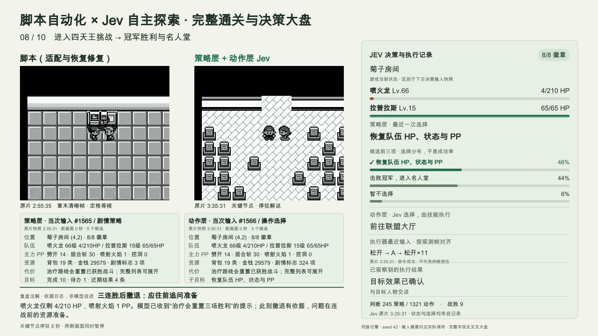

# 复盘配套素材

主文档：[用 Jev 自主通关 open-pokered：整体复盘](../jev-autonomous-retrospective.md)。

## 在线访问与视频存储

- [Jev 同步决策大盘](https://liuyanghejerry.github.io/open-pokered/jev-dashboard/)
- [English: Jev decision dashboard](https://liuyanghejerry.github.io/open-pokered/jev-dashboard/?lang=en)
- [脚本与 Jev 并排交互回放](https://liuyanghejerry.github.io/open-pokered/jev-dashboard/full-run/player.html)
- [English: script vs. Jev comparison](https://liuyanghejerry.github.io/open-pokered/jev-dashboard/full-run/player.html?lang=en)
- [完整解说视频](https://liuyanghejerry.github.io/open-pokered/jev-dashboard/full-run/script-vs-jev-full.mp4)

两个交互播放器顶部均可切换中文 / English，切换后保留当前播放位置、章节与倍速，并暂停以便阅读。
英文版翻译页面、动态输入摘要、候选、执行命令和关键节点注解；与中文版共用同一份视频及证据数据。
展开的原始请求／回答保持日志原文；已导出的解说 MP4 和整体复盘文档仍为中文，并在英文入口明确标注。
`?lang=en` 同样适用于直接在浏览器打开本地播放器；默认中文，其他参数值不自动改变语言。

Both players offer **中文 / English** links that preserve the playback position, chapter, and speed, then pause for reading.
The English dashboard translates the interface, recorded input summaries, candidate labels, executor commands, and retrospective commentary.
Both languages share the original recordings and evidence. Expanded requests and answers keep their recorded wording;
the exported commentary MP4 and full retrospective remain in Chinese. Add `?lang=en` to either local player URL as well.

原成片使用 HyperFrames 0.8.55 生成；发布前工程检查通过 0.8.58，项目命令已更新，视频未重渲染。

本目录的 MP4 通过 Git LFS 提交在 `feat/typesafe-semantic-judgments` 分支，原片和成片未重新编码。
克隆后安装 Git LFS 并运行 `git lfs pull`，即可恢复全部视频；普通 Git checkout 可能只得到指针文件。
Pages 发布会恢复实际视频，并校验两条原片的 SHA-256；网站不依赖 LFS 下载地址。

`Deploy Jev Dashboard` 工作流在该分支素材更新时发布，也支持手动执行。它下载最近一次成功的
`Deploy Web to GitHub Pages`（master）产物，保留原游戏和 `/editor/`，只更新 `/jev-dashboard/`。
如果基础产物过期，先手动运行 master 的 `deploy-web.yml`，再重试大盘工作流。
也可以通过 `base_run_id` 指定成功的基础发布。工作流共用 `pages` 并发组。

**合并前的限制：** master 还没有本分支的发布改动，随后单独发布 master 会暂时移除大盘路径；
重新运行大盘工作流即可恢复。合并本分支后，常规 Pages 发布会自动包含大盘。
发布只包含播放器依赖、原片、成片及证据文件，章节渲染中间视频仍保存在 Git LFS，但不重复放入网站。

## 完整通关录像与大盘

| 入口 | 内容 |
| --- | --- |
| [并排对比 MP4](full-run/script-vs-jev-full.mp4) | 按共同剧情节点对齐，全过程按原顺序加速；含 Jev 输入、决策、执行命令及关键节点解说 |
| [并排交互播放器](full-run/player.html) | 两路完整原片，可分章跳转、变速、暂停，并展开完整 Jev 请求和结果 |
| [Jev 原片 + 同步大盘](full-run/jev-player.html) | 单独查看 Jev 的实际输入、策略、动作及执行结果 |
| [脚本完整原片](full-run/script-full.mp4) / [Jev 完整原片](full-run/jev-full.mp4) | 60 fps 保存每个模拟更新帧，包含结局和单独标记的独立进程 CONTINUE |



两条完整录像均来自单次 NEW GAME 连续运行。不同失败尝试没有拼接进成功过程。脚本一侧标注“无模型参与”：相比早期版本，脚本含菜单兼容、森林败退后的训练时机、西尔佛及后续道馆重试、战斗用药及联盟重试等人工适配，详见主文档与[补丁](full-run/script-driver-adaptation.patch)。Jev 不调用 m01–m49 既有路线。

完整原片的时钟是模拟帧时间，模型和网络等待另存日志。并排版通常按 32 倍加速，结局与独立读档按 2 倍；每章先结束的一边以章末最近的清晰帧定格等候，并标出其原片时间。五个解说节点同时暂停两侧各 8 秒。加速版抽取展示帧，逐帧证据以完整原片为准，成片时长不能作为墙钟竞速成绩。

大盘区分策略层与动作层的真实输入快照、模型调用、缓存复用、代码选择及执行器 A/B/方向键或 `skip_dialogue` 命令。关键节点文字属于复盘注解，不是模型自述；候选概率也不是通关成功率。交互页保留完整状态、问题、全部候选和原始输出，可通过 `file://` 直接打开。请保留整个素材目录，视频和数据文件是 HTML 的必要依赖。

## 数据与验证

- [完整媒体索引](full-run/manifest.json)：原片哈希、帧数、章节及对齐方式。
- [结局验证](full-run/verification.json)：空存档起点、八徽章、名人堂、片尾、自然存档与独立读档。
- [对比分析数据](full-run/comparison-analysis.json)：墙钟、战斗、路线、队伍和模型成本。
- [Jev 实际输入与输出](full-run/jev-inputs.json)：2,122 次调用，可由交互页展开查看。
- [录制尝试](full-run/recording-attempts.json)：开发失败、主动停止和最终完成分别记录，不用这些开发尝试计算成功率。
- [后半程独立诊断](full-run/script-post-m33-diagnostic.json)：m34–m49 的连续局部验证，未纳入完整录像。
- [联盟独立诊断](full-run/script-league-diagnostic.json)：构造场景的恢复验证，未纳入完整通关录像。

## 复现

从仓库根目录执行。采集目录必须尚不存在；`--source` 指向冻结代码及构建好的调试引擎。两路使用相同二进制和 seed 42，脚本默认实时循环，Jev 按命令推进。

```bash
python3 docs/jev-retrospective-assets/capture_full_playthrough.py script \
  --source /path/to/frozen-script-source --output .artifacts/full-script
python3 docs/jev-retrospective-assets/capture_full_playthrough.py jev \
  --source /path/to/frozen-jev-source --output .artifacts/full-jev

python3 docs/jev-retrospective-assets/analyze_full_playthrough.py \
  .artifacts/full-script .artifacts/full-jev --output .artifacts/full-analysis.json
python3 docs/jev-retrospective-assets/verify_full_captures.py \
  .artifacts/full-script .artifacts/full-jev \
  --output docs/jev-retrospective-assets/full-run/verification.json
python3 docs/jev-retrospective-assets/build_jev_dashboard.py .artifacts/full-jev \
  --output docs/jev-retrospective-assets/full-run
python3 docs/jev-retrospective-assets/assemble_full_comparison.py \
  --analysis .artifacts/full-analysis.json --project docs/jev-retrospective-assets --speed 32

npx --yes hyperframes@0.8.55 check docs/jev-retrospective-assets
npx --yes hyperframes@0.8.55 render docs/jev-retrospective-assets \
  --fps 30 --quality high --workers 2 --frames-cache-dir off \
  --output docs/jev-retrospective-assets/full-run/script-vs-jev-full.mp4
```

Jev 使用环境变量或仓库 `.env` 中的 `TYPESAFE_API_KEY`。请求随机性、实时调度与主机负载会影响运行结果，不保证逐步复现路线。图表用 matplotlib 绘制；中文字体使用本机 Arial Unicode。英文版配图由 `build_figures_en.py` 生成（输出 `*-en.png/svg`，复制为 `blog/images/jev-*-en.png` 供 `blog/jev-playthrough-retro-2026-09.en.md` 使用）。视频工程使用本地字体子集与 GSAP，游戏画面没有调色或生成式重绘。

## 历史材料

[70 秒开场对比](script-vs-jev.mp4)、[脚本开场](script-opening.mp4)和[Jev 开场](jev-opening.mp4)只覆盖领取图鉴。旧开场素材按每秒 240 个模拟帧输出 60 fps，属于 4 倍回放；它们不是完整通关证据。

`journey.png`、`badge-order.png`、`cost-and-defeats.png` 和 `jev-full-clear-final.png` 来自历史 b19，主文档单独标注；完整录制的统计和图表位于 `full-run/`。[媒体清单](media-manifest.json)保留新旧素材来源和校验信息。
