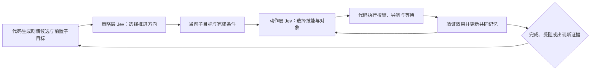

Jev 剧情探索评审，2026-09-19。最初评审基于 `25d2b20`，分支 `feat/typesafe-semantic-judgments`；以下先保留当时的发现，后附双层实现与早期实测。持续开发和完整自主探索的最新证据见 [自主探索进度](jev-autonomous-progress.md)。2026-09-20 已完成一次连续真实新开档全链：八徽章、冠军、名人堂、片尾、游戏自动存档及独立 CONTINUE，且未按旧 playthrough 路线执行。耗时 82 分 6 秒，策略 / 动作判断 383 / 2033 次，16 次战败；281 项相关 Python 测试通过。训练和过度恢复仍明显，不能视为全局最优或稳定性结论。

已实现在策略层与动作层分别调用 Jev，把连续剧情推进组织成“选择剧情方向 → 决定具体操作 → 执行并验证 → 向两层反馈”的闭环。两层共享已验证事实，分别接收与本层有关的状态和候选。优先解决完成判定、交互执行和进展记忆，然后把脚本事实从地图细化到具体触发器与分支。当前证据不支持仅增加 judgment budget、扩大地图候选或继续堆叠全局状态。

**现有使用情况**

| 位置 | Jev 的职责 | 当前边界 |
| --- | --- | --- |
| `scripts/openpokered/typesafe.py` | 自建 HTTP 客户端，支持 Choice / Noul / Score | 使用 `/v1/systemone`；默认 `jev-latest`；提供重试与 token 字段 |
| `semantics.py`、`policies.py` | Choice 将自然语言目标映射到已枚举实体 | LocalExplorer 可选启用；无 key 时保留原行为 |
| `semantics.py`、`bdd_steps.py` | Noul 判断对话是否表达某个含义 | 用于语义断言，不是剧情规划 |
| `judgment_agent.py` | Choice 选择 travel / interact；探索模式另外选择剧情目标 | 执行仍由代码控制，但动作选择是单步的，没有前置子目标栈 |
| `run_judgment.py --explore` | 从 11 个未完成里程碑中选择下一个 | 初始位置直接设为 PalletTown，并注入 Lv.100 Charizard；不能代表正常 NEW GAME 通关 |

已有的长处包括：模型只能选择已列出的动作、代码负责真实按键与导航、状态查询和 seed 可复现、可比较 deterministic baseline。Score 已封装，但当前探索策略没有使用；`SemanticJudge.decide()` 支持批量问题，但实际 T2J 循环走的是单一 `route_action()`。

**需要优先处理的发现**

1. **[P1] “没有选出目标”被当作“剧情完成”。** `semantics.py:221` 的目标选择在服务失败、答案缺失和 `none` 时都返回 `None`。`judgment_agent.py:578` 对任何 `None` 都返回成功，而 `run_judgment.py:75` 直接接受这个结果。目标文件损坏时加载成空列表，也会进入同一成功路径。本次用现有测试替身复现：仍有 2 个未完成目标、0 步，`run()` 返回 `(True, "")`。历史 `target/agent/runs/explore-the-story.jsonl` 也有 0 步、0 帧成功记录。应区分 `selected / no_pursuable / unavailable / invalid_config / all_complete`，只有实际终态验证可以判成功。

2. **[P1] 输入界面被当作只需等待的过场。** `judgment_agent.py:566` 对 dialogue、menu、transition 一律执行 `skip_dialogue()` 和空帧。`game.rs:6426` 的 skip 只在 `pending_dialogue` 存在时按 A，不会关闭独立预览或处理选择菜单。本次重放至选球前，交互精灵球后进入 `ShowPokedexEntry`；重复 8 轮原策略仍停留在那里。补上预览确认与实际 YES 菜单的按键后，在该 fixture 中 11 个驱动步骤内验证到 `EVENT_GOT_STARTER=true`。生产执行器需要根据 `script_effect`、choice 和 screen 细分状态，不能仅依赖粗粒度 mode。

3. **[P1] 进展检测既漏掉循环，又会永久屏蔽后续有效动作。** `_observe_key()`（`judgment_agent.py:542`）只包含 map/x/y/mode。打开同一段无收益对话会改变 mode，被当成进展；跳过后再次选择同一个 NPC，循环不受限制。反过来，原地获得道具、flag 或其他实际进展不一定改变这个 key。`_failed` 又以 `(map, action)` 永久保存，相关前提改变后也不会重新启用。本次替身验证拿到包裹后的状态仍不能重新提供被屏蔽的返程动作。应在一个技能完成并恢复控制后比较 flags、物品数量、队伍、门锁/对象状态及新对话证据；失败缓存以相关前提状态为键，前提变化后失效。

4. **[P1，架构缺口] 只知道“结果在哪张地图”，不知道“如何使结果发生”。** `ScriptIndex.build()`（`judgment_agent.py:214`）仅索引 flag/item 的产出地图，丢弃 storyline、triggers、条件和交互分支。`choose_objective()` 只排除已完成目标；被选中的目标只有完成后才更换。`get-pokedex` 所需的包裹和实验室劲敌事件没有进入可执行子目标计划。现有 `HierarchicalPlanner._producer_plan()`（`planner.py:145`）可复用 producer 查询和执行结构，但同样没有递归解决前置条件。

5. **[P1，规划前必须修正] 现有图的 `requires` 不等于真实前置条件。** `semantics/extract.rs:416` 遍历 if 的两个分支，将 reads/effects 汇成集合；`semantics/graph.rs:91` 把 flag read 转为 `requires`，没有保留否定、AND/OR 或早退语义。具体例子：ViridianMart 在 `EVENT_GOT_OAKS_PARCEL=true` 时立即 return，否则赠送包裹；现有图却同时记录该 flag 为 requires 和 sets。`planner.py:89` 移除 self-produced requires 只是局部规避，无法恢复真实逻辑。不能直接在这个平面图上做可靠的反向规划，也不能让 Jev 猜缺失的条件。

6. **[P2] 运行数据不足以支持成本与成功率比较。** `run_judgment.py:194` 保存的是共享 judge 的累计 calls；目标选择未计入 `policy.judgments`；RunMetrics 的 tier、policy、model_calls 和 token 字段没有被该 runner 正确填充，实际返回的模型版本也未持久化。历史记录出现 `judgments=60`、`judge_calls=393`、`model_calls=0`。战斗分支还单独增加 policy 的胜场，而最终报告读取 env 的计数；`fight_current_battle()` 的返回值被忽略。应记录每轮增量、实际 outcome、目标切换和完整决策证据。

**本次验证与可支持的结论**

构建 `cargo build --bin pokered-app --features debug-server` 成功，有现存编译 warning。执行以下测试共 140 项通过：

```bash
python3 -m unittest scripts.test_openpokered_typesafe scripts.test_openpokered_judgment scripts.test_openpokered_planner
```

实机固定 seed 42、`--speed 0`、`jev-1.13.0`，每个运行限制 12 次动作判断、80 env steps、6000 frames：

| 运行 | 结果 | 证据 |
| --- | --- | --- |
| get-starter | 40 steps，12 judgments，judgment_cap | 已有“博士允许选宝可梦”flag，但反复找 Oak，没有领取 starter |
| explore | 21 steps，12 action judgments + 1 objective judgment，judgment_cap | 选择 get-starter 后反复找 Scientist，starter flag 未置位 |

在 get-starter 的最后一个决策状态上，保持相同候选动作与同一句问题，做了局部请求对照：

| 输入变化 | 3 次选择结果 | 每次 input tokens |
| --- | --- | --- |
| 原始输入 | 3/3 继续找 Oak，P=0.86–0.89 | 1066 |
| 加相关 flags + 最近实际对话与 flag 增量 | 3/3 继续找 Oak，P=0.77–0.78 | 1321 |
| 在上一组基础上，给精灵球附上脚本条件、宝可梦产出及确认步骤；给 Oak 附上已观察到的重复结果 | 3/3 选择 Charmander 球，P=0.93–0.95 | 1551 |

第三组的分支描述是本次人工核对 `OaksLab/script.scene` 后添加的实验输入，自动提取尚未实现。这里只证明一个状态上的候选语义值得继续验证，不是端到端成功率提升，也不足以拟合 confidence 阈值。普通“丰富状态”没有改变选择；具体动作条件与结果改变了选择。

完整本地记录在 `target/agent/jev-review-20260919/`：`get-starter.json`、`explore-the-story.json`、`context-probe.json`、`effect-probe.json`、`menu-probe.json`，包含输入、问题、分布和状态。该目录被 git 忽略；上述结果表作为本次仓库内的评审记录。历史文档中的 18/27 等数字未在本次重新测量，不作为当前性能结论。

**建议的实现方式**



采用当前仓库已经使用的白盒能力：允许读取脚本、flags 和世界图。之后如果要测“只凭玩家可见线索探索”，将它设成独立 observation profile，不能把读取完整脚本的成绩混在一起。

**策略层与动作层的接口**

| 层次 | 交给 Jev 的状态 | Jev 的选择 | 调用时机 |
| --- | --- | --- | --- |
| 策略层 | 已完成里程碑、可推进子目标、依赖与解锁关系、队伍摘要、已有线索、路线成本和受阻记录 | 选择下一剧情子目标，或选择补给、收集线索等准备目标 | 启动、目标完成、相关前提改变、出现足以改变优先级的新证据或动作层持续受阻时 |
| 动作层 | 当前子目标、成功条件、本地对象和分支效果、当前对白/菜单、最近操作结果 | 选择具体技能、目标实体或菜单选项，如与哪个精灵球交互、接受哪个选项 | 技能结束且玩家可输入时，或出现需要决策的交互分支时 |
| 执行与验证 | 被选中的技能及其参数、实时游戏状态 | 代码负责路径、按键时序、状态校验和预算，不消耗 Jev 判断 | 每次执行与恢复期间 |

两层之间传递一个有约束的子目标，例如：

```json
{
  "plan_id": "p17",
  "parent_goal": "get-pokedex",
  "subgoal": "obtain-oaks-parcel",
  "success_when": {"item": "OAKS_PARCEL", "quantity_at_least": 1},
  "allowed_skills": ["travel", "interact", "ack_preview", "choose_option", "wait_for_control", "fight"],
  "state_revision": 42
}
```

字段由代码根据已验证的目标与技能目录装配；`state_revision` 是调度器的相关状态版本。策略层 Jev 只选择候选 ID，代码绑定完成条件及预算。动作层围绕这个子目标持续操作，直到验证成功或向上报告受阻，避免每走一步就重新决定整条剧情方向。若相关状态在判断期间改变，先重新校验动作；队伍濒危等明确条件可以中断当前技能，交回策略层选择恢复目标。

动作层向上返回 `completed / blocked / interrupted / no_progress / unavailable`，同时附上实际 flag/物品变化、阻碍来源、新线索和耗费。短暂 NPC 挡路优先在动作层有界重试；发现缺钥匙则交回策略层安排取钥匙；模型服务失败单独记录，不能伪装成剧情阻碍或任务完成。目标进展以验证结果为准，打开对话、走动和模型 confidence 都不能单独算作剧情收益。

这里的分层允许优化宏观方向与微观操作，但不会自动保证全局最优。策略候选需呈现后续解锁价值，动作结果需回流修正路线成本和可达性；同一目标下保留稳定的执行周期，减少来回换目标。两层按端到端已验证进展共同评价，各自的 Choice 概率不能相乘当作整条计划的成功率。

策略选择决定动作候选时，两次调用有依赖，应先策略后动作；已有目标执行期间只调用动作层。同一层里共享状态、互不依赖的问题才合并批量请求。用同一个固定 Jev 版本、不同问题和不同状态即可实现两层，无需先引入不同模型。

代码应负责三类精确工作：

- **带条件的剧情子目标。** 从 scene AST 提取 `trigger + guard + branch effects`，保留否定、AND/OR、早退、选项及有顺序的效果。将目标反向展开为缺失前提，生成当前可执行的 frontier；不能解析的条件标为 unknown，并通过观察或有上限的探测补证据。复用现有 producer 索引和地图导航，不再为每个 flag 写专属攻略。
- **技能执行。** 先做 `travel`、`interact`、`ack_preview`、`choose_option`、`wait_for_control`、`fight`。每个技能都有前置检查、终止条件、预算、成功/失败/被打断的结果与状态差分。技能被对话或战斗打断后能恢复父任务；菜单选项从实时 options 获取。是否拿到图鉴、是否获胜由游戏状态验证。
- **记忆和恢复。** 保存当前主目标与子目标栈、读到的对话及来源、最近实际效果、重复状态计数。根据完成、前提变化、新证据或持续无进展触发策略重评。相关前提不变时对重复失败退避；取得包裹、解除门锁或击败拦路者后，重新开放相关候选。

Jev 则用于以下有明确答案空间的判断：

| 判断 | 类型 | 输入与结果 |
| --- | --- | --- |
| 下一步推进哪条剧情、补足哪个前提或先收集什么线索 | Choice；候选较多时可先按一致标准做 Score | 策略层候选携带已知解锁价值、前提状态与成本；允许选择准备目标，拒选不得表示完成 |
| 为当前子目标执行哪个技能、针对哪个对象或选择哪个选项 | Choice | 动作层使用本地可执行候选及其条件/效果；选项与技能参数由代码绑定 |
| 对话是在请求交付、提示地点、提供帮助还是普通闲聊 | Choice | 实际对白、说话者、地点、当前子目标；保留无匹配选项 |
| 对话提到的对象对应哪个已知实体/地点/物品 | Choice | 代码枚举的候选；不能生成不存在的 ID |
| 当前候选对该子目标的语义相关程度 | Score，可按需要加入 | 每个候选使用同一组具体等级，例如无关、提供线索、推进已知前提、直接满足子目标；距离和已知可达性在代码里计算 |
| 是否有证据支持一个尚未确定的语义线索 | Noul | 保留概率及原始证据；不用于替代已经可精确查询的 flag 条件 |

选择少量实际需要的判断，不必一次加入所有类型。同一证据上的独立问题可以批量提交；需要上一步结果才能构建候选时再发下一次请求。多个同样合适的 starter 导致 Choice 分散时，可由稳定的偏好规则择一，不应自动视为决策失败。confidence 是选项分布的集中程度，不是整条剧情计划的成功概率。

**图鉴任务的具体形态**

源码中，`OaksLab:talkOak1` 的图鉴分支需要 `!EVENT_GOT_POKEDEX`、`EVENT_BATTLED_RIVAL_IN_OAKS_LAB` 与持有 `OAKS_PARCEL`。包裹由 ViridianMart 的首次入店脚本赠送；这一步不需要购物菜单。现有 get-pokedex task 的 note 对“需要 mart-shopping”的描述已不准确。

代码可由这些事实逐步导出：领取 starter → 完成实验室劲敌事件 → 去 ViridianMart 领取包裹 → 返回实验室交付 → 验证图鉴 flag。若起始存档已满足一部分，则只计划缺失部分。Jev 负责在真实线索和可行候选之间作选择；这条依赖链无需每步重新让模型从所有地点猜起。

**落地顺序与验收**

1. 修正成功判定、每次运行的 metrics、预览/YES-NO 驱动、技能结束后的进展比较。增加对应行为回归：模型拒选不能成功、临时前提变化后可以重试、重复对白不能无限循环、选择 starter 能经过预览和确认真正置 flag。
2. 为初始剧情提取带条件的 trigger/branch，复用现有 planner 的检索和执行骨架，跑通 starter → rival → parcel → Pokédex → Brock。只有一条精确可行路线时由代码执行，存在语义歧义或多条合理分支时才调用 Jev。
3. 在同一套候选生成、技能执行和总预算下，做策略层 × 动作层的四组对照：代码/代码、Jev/代码、代码/Jev、Jev/Jev；保留当前 T2J 作为旧基线。固定源码、二进制、场景 hash 和模型版本，多 seed、多重复；另列已有强化队伍 fixture 与合法新游戏。记录已验证里程碑数、终态成功率、无进展循环、恢复率、总帧数、调用数、tokens 与 wall time，并按层记录调用开销和目标切换。四组对照用于确认每层贡献以及组合是否有效，不能只比较各层单步选择的准确率。本次已有实验没有验证双层方案的端到端收益。
4. 再扩大到 HM、钥匙、道馆机关等门槛。`save_state/restore_state` 可用于有上限的候选探测，但应作为独立实验配置并记录总模拟开销；不作为第一阶段必需项。

依据 TypeSafe 当前官方文档，这种代码控制流程、窄判断与独立问题批量化的设计与其推荐方式一致：[构建指南](https://docs.typesafe.ai/concepts/how-to-build-with-system-one.md)、[函数调用](https://docs.typesafe.ai/cookbooks/function_calling.md)、[批量独立问题](https://docs.typesafe.ai/patterns/fan-out.md)。[Score](https://docs.typesafe.ai/primitives/score.md) 适用于有序的语义等级，[Confidence](https://docs.typesafe.ai/confidence.md) 需要在具体任务上验证阈值。[模型文档](https://docs.typesafe.ai/models.md) 建议需要可比性时固定版本，并记录响应中的实际模型 ID。本次固定使用 `jev-1.13.0`。

**双层自动化实现与实测（2026-09-19）**

现已新增 `scripts/openpokered/run_story.py`，上述方案中的早期剧情闭环已经实现。策略层 Jev 从尚未完成的剧情目标反推前置子目标，结合当前世界状态、可用地图路线和近期执行结果选择方向；动作层 Jev 选择导航目标、可见 NPC、坐标触发器及菜单选项。按键时序、寻路、战斗执行和完成条件检查由现有代码承担。两层分别调用，不在每帧重新规划；所有判断的状态、候选、概率和实际模型版本写入 JSONL。

这次落地同时解决了四个实测问题：

- `get_script_semantics` 新增可选 `program` 字段，保留分支、提前返回、选项和效果顺序，去除构建机器的路径。旧的扁平索引保持兼容。Python 规划器保留 AND/OR/否定和同脚本先前写入，按缺失 flag/物品回溯候选；不支持的查询保持未知。当前编译数据产生 915 条规则，索引构建错误为 0；这不等于支持全部游戏语义。
- 菜单与宝可梦预览单独处理，确认键前后明确释放，消除重复按键无法产生新按下事件的停滞。动作只绑定实时可见 NPC；打开对白和原地走动不能单独算剧情进展。
- 原生游戏的动态 flag 附属文件位于可执行文件旁，即使指定独立 `--save` 也会跨轮次泄漏 NPC 隐藏状态。新运行器为每轮复制独立二进制、隔离附属存档；污染实验不纳入下面的结果。
- 策略上下文显式提供剩余目标与地图路线。仅有当前地点和脚本效果时，Jev 曾拒选异地取包裹/挑战小刚。路线只表示地图连接关系，实际局部障碍仍由执行反馈处理。拒选、服务失败、预算耗尽都不能算通关；旧 `JudgmentAgent` 的假成功也已修正。

从仓库根目录运行：

```bash
cargo build --bin pokered-app --features debug-server
# 默认空队伍、无剧情 flag，从真新镇的初始 overworld 开始
python3 scripts/openpokered/run_story.py --until get-pokedex --runs 3
# 明确标注的强化队伍实验，只在初始化加入 Lv100 喷火龙
python3 scripts/openpokered/run_story.py --until beat-brock --assisted
# 独立开关两层；code 是同一规则图上的首个候选基线
python3 scripts/openpokered/run_story.py --until get-pokedex --strategy code --action jev
python3 scripts/openpokered/run_story.py --until get-pokedex --strategy jev --action code
python3 scripts/openpokered/run_story.py --until get-pokedex --strategy code --action code
```

Jev 配置沿用 `.env` 的 TypeSafe key，默认固定 `jev-1.13.0`。可指定 `--seed`、`--runs`、`--max-calls`、`--max-actions`、`--frame-budget`、`--wall-budget`。调用预算覆盖两层的逻辑判断；网络重试由客户端另行处理。帧/时间预算在判断、技能和战斗轮次之间检查，不是中断正在执行的调试命令。`--maps-dir` 暂不支持，以免编译时脚本 AST 与外部地图变体不一致。

seed 42、同一二进制和隔离后的四组图鉴流程对照如下。这组探索性小样本使用 policy `c19ce22f…`，随后增加了策略路线信息；不能把它当成最终策略的统计优势证明。

| 策略层 / 动作层 | 到图鉴成功 | 每轮策略 / 动作调用 | 每轮游戏帧 | 平均 agent 耗时 |
| --- | --- | --- | --- | --- |
| code / code | 2/2 | 0 / 0 | 5890 | 2.54 s |
| Jev / code | 1/1 | 5 / 0 | 5890 | 7.93 s |
| code / Jev | 1/1 | 0 / 9 | 5890 | 12.53 s |
| Jev / Jev | 3/3 | 5 / 9 | 5722 | 18.63 s |

双 Jev 的三个重复均自行选择初始宝可梦、完成研究所劲敌战、进入常磐商店领取包裹、返回博士领取图鉴，没有预置剧情 flag 或强化队伍。每轮输入 tokens 为策略层 5679、动作层 9299，输出合计 591。code/code 也完成了流程且耗时更短：现有证据支持闭环能运行，尚未证明 Jev 的总体收益或宏观/微观全局最优。后续应在有多条路线、变化条件和补给决策的场景比较。

补齐路线上下文后（policy `8f25e858…`），强化队伍完成“初始宝可梦 → 图鉴 → 小刚”：12 个语义操作、6 次策略判断、13 次动作判断、13035 帧、26.29 秒；实际获得 `EVENT_BEAT_BROCK` 和 `EVENT_GOT_TM34`。同版普通队伍推进到尼比道馆，但 Lv7 妙蛙种子两次败给前置训练家，恢复尝试后以 `strategy:no_candidates` 停止；没有获得小刚 flag。下一处实质能力缺口是练级、补给和战败后的准备目标，不能靠提高调用预算解决。

最终版本（policy `b16703e8…`）另外通过了 seed 17 的普通队伍图鉴流程：14 次判断、5941 帧、18.26 秒；再次通过 seed 42 强化队伍小刚流程：19 次判断、13035 帧、25.02 秒。最终复核仅调整预算边界、异常报告和战斗计数，没有修改游戏战斗或剧情规则。

上述程序从 `--skip-intro` 的 fresh overworld 开始；不包含开机、命名和完整新游戏初始化，也不是仅凭画面的黑盒探索。`--assisted` 成绩只用于检查剧情与导航，不能算普通队伍通关。战斗由现有技能执行，动作 Jev 目前不逐回合选择招式。

运行目录为 `target/agent/runs/story/<时间>-<策略>-<动作>-seed<seed>/`，包含每轮 JSONL、摘要、SRAM、动态 flag 附属文件和终态截图。摘要记录初始设置、实际完成 flag、模型、调用/tokens、源码文件 hash、二进制与索引 hash。`resolved_script_battles` 只统计显式结算的战斗，`travel_battles` 另记导航内部遭遇，均不是获胜次数。主要记录：

- 图鉴四组：`20260919-191758-jev-jev-seed42`、`20260919-191836-code-code-seed42`、`20260919-191921-jev-code-seed42`、`20260919-191922-code-jev-seed42`。
- 小刚强化队伍：`20260919-192043-jev-jev-seed42`；普通队伍失败：`20260919-192045-jev-jev-seed42`。
- 最终版本复核：`20260919-192247-jev-jev-seed17`（图鉴）、`20260919-192247-jev-jev-seed42`（强化队伍小刚）。

这些目录被 git 忽略，保留在本机；本节记录可随源码提交的实验结论。验证包括 158 项相关 Python 测试与 13 项 Rust semantics 测试，覆盖提前返回、否定/OR 依赖、选项前置效果、服务错误、预算和拒选不能假成功。


后续自主探索实现使用 `run_autonomous.py`；上面的 `run_story.py` 数据是早期实验，不能代表当前能力。当前入口执行真实 NEW GAME，以名人堂、片尾、游戏自动存档和独立进程 CONTINUE 作为完整成功条件。详细证据及尚未完成的 fresh 验证见 [自主探索进度](jev-autonomous-progress.md)。

持续实跑暴露出，两层判断需要共享的不只是子目标名称，还包括父目标、计划中的中间效果、当前触发点的实际可达性和操作代价。宝可梦屋退出曾要求先关开关、换位置、再开开关；动作层看不到整体原因时，会把必要步骤当成撤销进展。现在这些信息随所选策略传给动作层；已经选择并确认可达的训练和机关步骤，由动作层选择执行操作，实际阻挡再返回策略重新判断。

通用技能负责求解可检验的物理约束：地图、NPC、朝向、推石及联动门块。联动机关在完整且一致的开关布局中搜索，不把互斥开门状态拼成虚构通路；执行始终使用真实移动、交互和菜单，按实际观察重新规划。没有加入原 playthrough 的里程碑路线或专用通关存档。

策略层还需要比较局部收益与后续损失。四天王实跑中，挖洞 PP 用尽后返回护士会清除已胜战斗，造成长时间重战。治疗候选现从入图脚本的真实 resetFlag 推导将丢失的胜利标志，让 Jev 比较继续、随身恢复和退回治疗。只提供重置代价仍不足以稳定避免循环：连续新开档 b14 甚至在满血、仅少量 PP 消耗时返回治疗，真实重战升到 100 级仍未通关。

进一步明确恢复的目的，是使当前资源足够继续，而非每战补满；启发式 `urgently_needed` 不代表每个耗尽招式都必须恢复。两个真实失败状态各三次只读对照均选择继续。恢复 c07 随后用 39.771 秒、策略 6 次/动作 28 次判断，连续完成剩余联盟、结局和独立 CONTINUE。它起于已有高等级现场，只验证这次循环的恢复，不证明低等级队伍或任意状态都应继续挑战。详细证据保存在进度文档。

候选粒度也是后续优化方向。同一个后续挑战的战胜标志、自动入场标志会分别参与选择，而治疗集中成一个候选，可能分散继续推进的概率。只读小样本中，移除自动入场候选仍 3/3 选择治疗，按父目标合并后 2/3 选择继续；尚未将这一实验改为实际控制策略，也不能把这些概率直接相加当作决策收益。

当前完整验证命令：

```bash
python3 -u scripts/openpokered/run_autonomous.py --until become-champion \
  --output .artifacts/jev-autonomous-fresh --max-calls 4000 \
  --max-actions 4000 --wall-budget 10800 --checkpoint
```

`--checkpoint` 只在停止后保存开发现场；成功判定使用游戏自身的结局自动存档。一次完整成功只能证明该次运行完成，不能替代多种随机条件的稳定性评估，也不能证明两层组合达到全局最优。

入口可达性还需区分脚本条件与对话选择。新开档 b17 实际已拿八徽章，却因把“拒绝付款后退”的分支当成无条件墙，无法提出可执行的狩猎入场方案。通用导航现检查同一剧情中是否存在条件已满足、选择不同的传送分支；钱不足或仅有无关传送时仍保留障碍。失败现场续跑已通过真实付款、入场与拾取取得金牙，出口确认也按同一原则处理：可执行分支若能解除自身守卫，就不能把其自动移动当作前置墙。钱不足、无关传送、无关标志写入均保持障碍。现场续跑已退出狩猎区并取得怪力，相关测试共 281 项通过；新的完整新开档验证仍在进行。

后续优化应优先提升战斗与准备的联合判断，而非继续扩大目标列表。当前攻击候选已经计入命中、属性、STAB 和暴击的期望威力，但 trace 明示估算未纳入实际攻防数值、能力变化和附加效果。对“需要几回合击倒、期间承受多少伤害”的判断仍粗糙；期望威力稍高也不必然意味着更安全或更省 PP。可进一步给动作层提供可检验的击倒回合与生存区间，再让策略层比较继续挑战、携带补给与重新训练的总成本。该项是后续建议，尚未实施，也不改变当前冻结版本的验证。

独立 fresh b19 再次暴露满血后的过度治疗：83 级、HP 278/278、劈开/喷射火焰 PP 17/11 的真实状态（4303.236 秒）中，平铺 12 个子目标时选择治疗，概率 0.35、confidence 0.30，且恢复代价提示已存在。保持相同状态及原提示，只将候选按“继续剧情 / 恢复及其前提 / 可选准备”分组，3 次只读判断均选择继续剧情，概率 0.82、0.81、0.78。见 `.artifacts/jev-session-20260919/b19-intent-grouping-probe.json`。这是单一状态的重复测试，支持后续先选战略意图、再选具体子目标的实验；不是成功率评估，未改动当前实跑策略。

分组实验的负面对照也必须保留：补上 `none` 选项后，83 级满血状态仍 3/3 选择继续（0.76–0.80）；但 75 级仅剩 20/250 HP 的状态也 3/3 选择继续（0.60–0.61），并未表现出充分的恢复需求区分。见 `.artifacts/jev-session-20260919/b19-intent-grouping-controls.json`。这不证明低血量继续必败，却说明不能只凭满血样本就把分组当成可靠修复；需要结合可验证的战斗生存范围与实际续跑评估。

最终连续验证已通过：b19 从真实 NEW GAME 到独立 CONTINUE 未中断或恢复检查点，完整指标与哈希见进度文档顶部。此次成功覆盖条件保持的剧情回溯、父目标传递、冲浪边界、真实推石和联动开关、对话入口/出口，以及结局持久化检查。剩余首要问题是恢复与准备的候选组织和战斗风险估算；上面的只读分组实验尚未作为实现上线。
