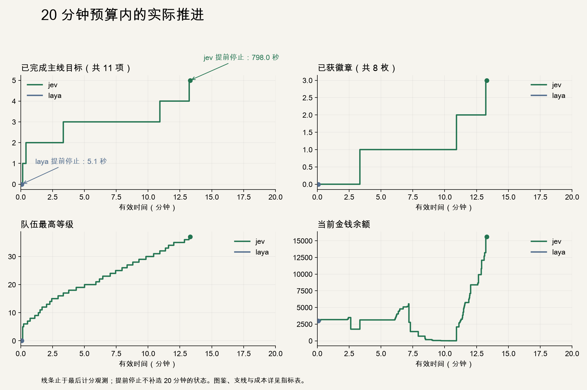
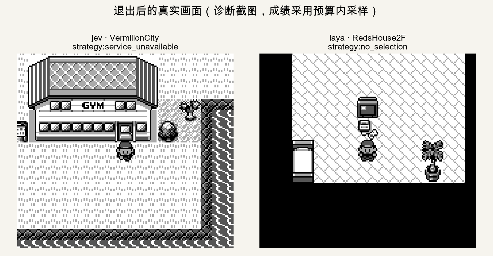

# Laya MLX 与 Jev：20 分钟预算下的自主探索实测

本页由两轮原始记录生成。实验条件与指标定义见[评测框架](../laya-jev-evaluation-framework.md)。
同一控制器、二进制、种子和上限；初始化单列，Jev 仅扣实测 RTT。一次运行用于案例分析，不代表平均表现或成功率。

**两轮均提前结束，未取得完整 20 分钟终点成绩。** 曲线不延长到预算终点，剩余时间也不外推为进度。

Jev 因 HTTP 402 额度不足停止。这是外部服务限制，不能归为模型无法继续推进。该失败请求没有返回 usage，表中 Token 是已报告部分。

原生后端适配、提前结束原因和后续实验建议见[本轮分析](interpretation.md)。

| 指标 | Jev | Laya |
|---|---:|---:|
| 退出原因 | strategy:service_unavailable | strategy:no_selection |
| 原始墙钟（秒） | 1,037.732 | 5.091 |
| RTT 扣减（秒） | 239.707 | 0.000 |
| 有效墙钟（秒） | 798.025 | 5.091 |
| 最后计分观测（秒） | 798.024 | 5.089 |
| 截止后等待 / 退出耗时（秒） | 0.000 | 0.000 |
| 完成主线目标 / 11 | 5 | 0 |
| 徽章 / 8 | 3 | 0 |
| 最终地图 | VermilionCity | RedsHouse2F |
| 已见图鉴 / 151 | 46 | 0 |
| 已拥有图鉴 / 151 | 3 | 0 |
| 可选成就 / 11 | 0 | 0 |
| 采样观察地图数 | 37 | 1 |
| 判断调用数 | 854 | 3 |
| 策略 / 动作调用 | 91 / 763 | 2 / 1 |
| 失败模型请求数 | 1 | 0 |
| 未返回 Token 用量的请求数 | 1 | 0 |
| 截止后返回的模型请求数 | 0 | 0 |
| 输入 Token | 2,450,366 | 1,331 |
| 输出 Token | 43,899 | 0 |
| 累计请求耗时（秒） | 717.627 | 0.296 |
| 请求时延中位数（秒） | 0.823 | 0.098 |
| 请求时延 P95（秒） | 0.966 | 0.122 |
| 可测 RTT 样本数 | 853 | 0 |
| 语义操作数 | 483 | 0 |
| 选招缓存命中数 | 294 | 0 |
| 模拟帧 | 373,861 | 1,676 |
| 队伍最高 / 平均 / 总等级 | 37 / 37.00 / 37 | 0 / 0.00 / 0 |
| 初始余额 | 3,000 | 3,000 |
| 最终余额 | 15,583 | 3,000 |
| 峰值余额 | 15,583 | 3,000 |
| 观测正余额变化累计 | 19,861 | 0 |
| 观测负余额变化累计 | 7,278 | 0 |
| 代理报告战败 | 12 | 0 |
| 观察全队 HP 归零 | 4 | 0 |
| 无效 / 受阻操作 | 8 | 0 |
| 其中旅行受阻 | 8 | 0 |
| 被拒动作 | 0 | 1 |
| 协议错误 | 0 | 0 |
| 疑似停滞区间数 | 0 | 0 |
| 计时前初始化（秒） | 1.634 | 1.209 |
| 预热输入 Token | 331 | 46 |

输入 Token 来自不同 tokenizer，不能按数量直接等价比较算力。Laya 无文本生成，输出 0 不代表零推断开销。金额变化是采样可见下界；失败各项可能重叠。

## 各主线目标首次观测完成时间

| 目标 | Jev 有效 / 原始秒 | Laya 有效 / 原始秒 |
|---|---:|---:|
| get-starter | 9.499 / 10.753 | 提前结束前未达到 |
| get-pokedex | 25.077 / 29.416 | 提前结束前未达到 |
| beat-brock | 200.792 / 255.211 | 提前结束前未达到 |
| beat-misty | 655.615 / 855.680 | 提前结束前未达到 |
| beat-lt-surge | 793.685 / 1032.713 | 提前结束前未达到 |
| beat-erika | 提前结束前未达到 | 提前结束前未达到 |
| beat-koga | 提前结束前未达到 | 提前结束前未达到 |
| beat-sabrina | 提前结束前未达到 | 提前结束前未达到 |
| beat-blaine | 提前结束前未达到 | 提前结束前未达到 |
| beat-giovanni | 提前结束前未达到 | 提前结束前未达到 |
| become-champion | 提前结束前未达到 | 提前结束前未达到 |

## 队伍、图鉴与支线

**jev**：拥有图鉴编号 [4, 5, 6]；可选成就 无。

| 成员 | 等级 | 经验 | HP | 招式 / PP |
|---|---:|---:|---:|---|
| Charizard | 37 | 44515 | 116/116 | Slash 16, Cut 30, Ember 25, Dig 0 |

**laya**：拥有图鉴编号 []；可选成就 无。

| 成员 | 等级 | 经验 | HP | 招式 / PP |
|---|---:|---:|---:|---|
| 尚未获得精灵 | — | — | — | — |

## 原生输入截断

Laya 的 3 道判断中，2 道发生状态截断；状态共删去 73 Token，候选共删去 315 Token，问题说明共删去 123 Token。
实际编码文本、完整应用输入、原始输出以及开始/结束阶段事件见 [decision-evidence.json](decision-evidence.json)。截断与结果同时出现只能作为待验证解释，不能替代受控消融。

## 完全相同应用输入上的判断

以下依据完整请求 SHA-256 匹配，表内是原始模型输出；条件选择、拒绝处理等控制器行为另见事件记录。

| 问题 | Jev 原始选择 | Laya 原始选择 | Jev / Laya 请求秒 |
|---|---|---|---:|
| strategy | strategy: subgoal:0 | strategy: none | 0.809 / 0.122 |
| action | action: action:0 | action: none | 0.822 / 0.076 |

## 证据与复现

[Jev 摘要](jev-summary.json) · [Laya 摘要](laya-summary.json) · [CSV](metrics.csv) · [原始记录哈希与核验](verification.json)。原始请求、观察和操作日志的本机路径保存在核验文件中。
