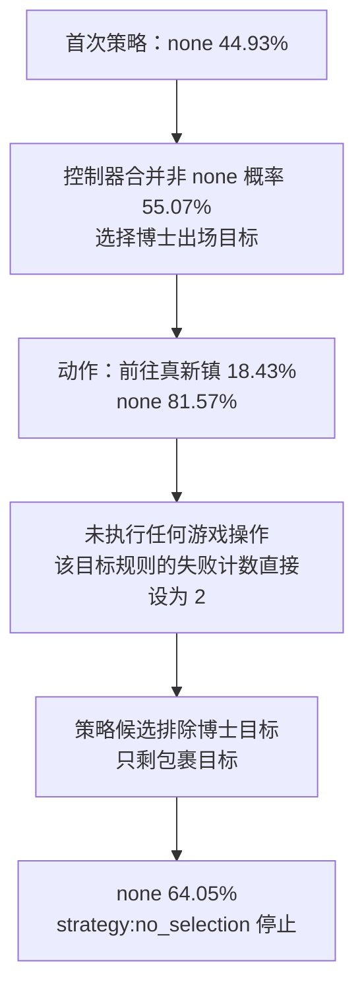

# Laya 首轮停止原因排查

2026-09-21。结论：**当前失败来自输入表示、模型判断和控制器拒选处理的叠加；不是本地推断程序没有运行，也不能只归因于 512 Token 截断。** 完整保留首次动作输入仍被拒绝；换成明确的关系描述能改变选择，但小规模正反例检查仍暴露不稳定判断，暂不能宣称已修复自主通关能力。

本次完成 **111 次本地离线推断**和一次控制器冻结答案回放。使用首轮同一检查点 `aac6fef/laya-mlx@20aed815fc6acde75733882e7ec0e3f28aeb9717`、`laya-mlx 0.1.0`。没有调用 Jev 服务，没有启动新的游戏计分运行，没有修改正式成绩、模型权重或安装包。开发探针不能计入原来的 20 分钟比较。

## 1. 真实失败链：一次拒选被放大为目标淘汰



`DualStoryAgent.choose()` 的条件选择解释了第一步：模型原始最高概率仍是 none，不能把控制器的最终选择说成 Laya 主动选择了博士。

`AutonomousStoryAgent.action_rejected()` 将当前目标的每条规则写为 `failures[attempt_key] = 2`；`select_strategy()` 又过滤失败计数 ≥ 2 的规则。这里把**模型拒选**当成了**实际执行失败**。这个键与地图和剧情/队伍状态有关，并非永久封禁；但本轮尚未产生任何状态变化，博士目标就被排除了。

冻结答案回放直接调用了这些现有函数：游戏操作数为 0，失败计数从 0 变成 2，随后复现相同退出原因。仅删除这条处理也不够：确定性输入下模型会重复拒选，可能转为耗尽预算的循环。

可执行性另有真实证据：原 Jev 运行的同一个首动作返回 `reached`，实际到达 `OaksLab`，获得 `EVENT_OAK_APPEARED_IN_PALLET` 等标记，`intended_effect_observed=true`。这里使用的是游戏结果，不是把 Jev 的判断当作标准答案。[冻结首轮证据](decision-evidence.json)

## 2. 截断存在，但恢复信息并未解决拒选

原生编码有三层预算：整个序列 512 Token、问题和选项前缀 192 Token、每个选项最多 48 Token。首次动作选项从 149 截到 48 Token，恰好停在 `"produces": ["flag",`，实际效果与导航说明未完整进入模型；此时整个输入仅 307 Token。

以下均针对同一个首动作，保留 none 候选：

| 干预 | 编码 Token | 前往真新镇概率 | none 概率 | 判断 |
|---|---:|---:|---:|---|
| 原生输入 | 307 | 18.43% | 81.57% | 拒选 |
| 仅把总窗口提高到 1024 | 307 | 18.43% | 81.57% | 拒选 |
| 完整保留原始动作选项；问题、状态原文不变 | 408 | 7.31% | 92.69% | 拒选 |
| 仅把候选改成简短自然语言 | 290 | 25.39% | 74.61% | 拒选 |
| 问题、状态、候选都人工缩短 | 131 | 33.59% | 66.41% | 拒选 |
| 在上述短状态中补写候选已有的“当地交互使博士出现”关系 | 148 | 56.01% | 43.99% | 选择动作 |

完整选项实验临时扩大诊断前缀预算，但首动作全部原文仍在原来的 512 Token 内，问题和状态均没有丢失。它否定了“只要把这次截断修好，首动作就能被接受”的解释。其他策略问题的 1024 Token 实验超出检查点默认训练长度，只作为诊断干预，不是推荐部署配置。

短输入是人工编写的开发变体，不能称为无损压缩。改变候选长度还可能释放指令预算，例如首个策略的指令从保留 81 Token 变为 124 Token，不能将那次变化全部归因于候选用词。

## 3. 关系表达比单纯压缩有效，但尚不稳定

把状态写成一条明确关系链：“当前在 RedsHouse2F → 经 RedsHouse1F 到 PalletTown → 北出口交互使博士出现 → 有助于选择初始宝可梦”，候选只描述移动操作。在这组人工诊断场景中：

| 当前目标 | 动作概率：原顺序 / 反转选项顺序 |
|---|---:|
| 到达 PalletTown | 93.20% / 96.27% |
| 使博士出现 | 90.20% / 81.66% |
| 选择初始宝可梦 | 73.59% / 68.55% |

把动作标签改为 `action:0`、`move`、`travel`，在博士目标的关系描述下均选择移动；原生输入与普通短输入换标签仍拒选。**不是某个动作 ID 导致的解析或标签映射错误。** 这些结果支持进一步尝试明确的局部状态与因果关系；但同时改变了多处表示，不能据此单独证明远期规划能力的高低。后续运行中的“路径存在”也必须由真实导航检查给出，不能由提示词虚构。

仅将短输入的 none 描述换为“等待，不执行所列操作”，首动作就从拒选变为 53.98% 选择。这个变化不能当成修复：等待与“没有任何候选有用”的语义并不完全相同，也没有证明模型能识别危险或无效动作。

为此又使用 8 个明确标注的小场景（门开/锁、护士在/不在、钱够/不够、路线存在/堵塞），比较问题形式：

| 问题形式 | 正确数 / 8 |
|---|---:|
| 选择操作或 none | 5 / 8 |
| 同题反转候选顺序 | 7 / 8 |
| yes/no 判断是否可执行 | 5 / 8 |
| 同题反转 yes/no 顺序 | 5 / 8 |
| noul 判断是否可执行 | 5 / 8 |

例如明确只有 100 金币、药水售价 300、不能赊账时，yes/no 问题仍给“可执行”93.04%（反序 94.17%）。原顺序下“门锁住、无钥匙和其他路线”也会被误选。这说明不能通过去掉 none、降低阈值或改用 noul，直接获得可靠动作过滤器。数字资源比较、碰撞、技能前置条件等应由代码检查。

这是为排查问题构建的开发集，只有 8 个独立场景；反转和重述不是新增独立样本。不能把这些比例当作 Laya 的通用准确率，也不能挑选本次最好的提示词当作正式评测结果。

## 4. 已排除和未排除的因素

| 因素 | 本次证据与结论边界 |
|---|---|
| 编译 / 前缀缓存 | 关闭二者后，三个原始请求的四位小数概率与原生配置完全相同 |
| FP16 数值误差 | 改为 FP32 后，三个请求仍全选 none；各选项概率最大差 0.0007，不影响结论 |
| 不稳定或随机推断 | 同配置重复原始请求，概率完全相同 |
| 适配器映射 / 协议 | 直接调用安装包的原生模型复现已记录的三个选择与分布；非干预编码逐 token 与原生 `prepare()` 相同 |
| 英文模型错误接收中文 | 首轮问题和状态主要为英文/游戏标识符；本次使用原来的英文检查点，不属于中文输入路由错误 |
| `action.act_probability` | 111 次原始输出四舍五入后都为 1.0，包括明显错误的控制题；它与我们自行加入的 none 类不是同一信号。适配器没有把它传给控制器，但据本次结果不能靠接上这个字段解决拒选 |
| MLX 移植的所有数学行为 | 本次没有重新进行 PyTorch 上游逐层比较，因此不宣称完全排除移植缺陷。已验证当前几个失败不由编译、缓存或 FP16 切换引起 |
| 其他检查点或更广泛任务能力 | 未测；不能由单个英文检查点和这些开发题推断所有 Laya 模型 |

本地实现与上游文档都将 Laya 作为结构化选择/评分/判断模型；输出 schema 相近，不保证能用同样的大段游戏 JSON 直接替换另一后端。[MLX 接口与检查点说明](https://github.com/mizorewww/laya-mlx#readme)、[上游决策原语](https://github.com/NandhaKishorM/laya#decision-primitives)。

## 5. 建议按这个顺序修，而不是再直接跑 20 分钟

1. **分开拒选和执行失败。** 拒选单独记账，允许一次有信息变化的重新编码/重规划；仍拒绝则明确以 `judgment_stalled` 停止。未经尝试的剧情规则不能被当作已经失败两次。不能靠无上限重试耗满时间。
2. **定义两个后端共用的紧凑输入。** 状态显式给出当前局部目标、已验证前置条件、位置到触发点的关系、触发效果和最近真实失败。候选仅保留本次操作及关键条件；编码前检查单候选、前缀和总预算，记录丢弃字段。规则筛选由代码负责，模型负责剩余合理选项间的偏好。
3. **用独立场景验证改法。** 预先固定可达/不可达、资源足/不足、应恢复/可推进、需要前置条件等案例，并检查选项顺序。下一轮从真实未参与提示词调试的游戏状态取样；不能只保证能够走出卧室。
4. **再做分层替换与限时比较。** 固定一个实现，同时用于 Jev 和 Laya；分别评估策略层、动作层和两层全替换。原生直接替换成绩与新适配成绩分开记录。本次不修改旧分数，也不声称已完成新的自主通关测试。

## 复现与原始数据

- [53 次原始请求消融及初步控制题](laya-diagnosis/ablations.json)：完整 state、questions、原生输出、实际编码文本与 token 统计。
- [40 次可执行性控制题、6 次目标层级探针与控制器回放](laya-diagnosis/contracts.json)。
- [12 次标签与关系位置探针](laya-diagnosis/representation.json)。
- [版本、文件哈希及结果一致性验证](laya-diagnosis/verification.json)。
- 代码：[diagnose_laya.py](../../scripts/diagnose_laya.py)、[diagnose_laya_contracts.py](../../scripts/diagnose_laya_contracts.py)。

在评测工作树根目录运行；输出目录必须是新的，脚本拒绝覆盖已有结果：

```bash
HF_HUB_OFFLINE=1 ~/develop/laya-mlx/.venv/bin/python scripts/diagnose_laya.py \
  --output .artifacts/laya-diagnosis-new/ablations.json
HF_HUB_OFFLINE=1 ~/develop/laya-mlx/.venv/bin/python scripts/diagnose_laya_contracts.py \
  --output .artifacts/laya-diagnosis-new/contracts.json
HF_HUB_OFFLINE=1 ~/develop/laya-mlx/.venv/bin/python scripts/diagnose_laya_contracts.py \
  --suite representation --output .artifacts/laya-diagnosis-new/representation.json
```
