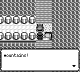
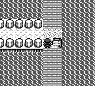

# 捕捉终态结算修复（2026-10-04）

真实球菜单成功捕捉后，`captured_mon` 已保存，但共同的 `BattleOver`
路径仍产生 `Win`。因此地图脚本收到了 `win`，而不是 `caught`；既有
手动构造 `Captured` 的写回测试没有覆盖这个实际终态交接。

现在仅在 `won && captured_mon.is_some()` 时产生 `Captured`。
未捕捉的胜利、逃跑、失败和故意不保存捕获对象的教程保持原分类。
不改变捕获率、球消耗、经验、金钱、PC 或存档格式。

## 回归与画面

- 实际 Master Ball 菜单 → 捕获文字 → 终态交接的测试：旧逻辑失败，修复通过。
- 核心库：2622 通过；应用库（debug-server）：122 通过。
- 新二进制 fresh m01–m49：通过，含冠军、名人堂、片尾、自动存档和独立进程
  CONTINUE；未使用续跑、warp、构造存档或状态注入。
- 原生画面对照：基线 master `0f94a6faa1d4ff779e3bb0c3301ac0832994200c`，
  两版重放相同普通推进命令，同为第 752 帧。两版队伍、原版提供的所有
  图鉴字段相同，都实际抓到 Lv30 Snorlax（唯一 owned 编号 143）。
  修复版没有错误的“mountains!”台词，正常设置击败旗标并隐藏阻挡对象。
- 对照夹具使用隔离的 SaveBuilder 存档；仅用于原生回归，不计收集进度。

前：



后：



对照二进制 SHA-256：

```text
before b5bbc227e86237dba8e253dff8a3325d726e3a7b5d04710ebd2de30fa8e226ca
after  2e9ee5831f544175c7e8840920d50ce1faa5bdba5bd077f63450c0831ddbd411
fixture cb5d961d50eed2b3d6221f98542ea2f8788dc6600f40cc44e0cecedd52035aff
```

## 收集证据边界

当前独立验证的安全存档为第24段闭合的 60/124；本段只完成了实际 PC 换箱、
购买一枚 Great Ball 和取出 Thunder Wave 支援 Pikachu，没有新增登记。
第24段自然停止于两候选请求的 `max_tokens_exceeded`；当时容量修复尚未验证。
后续容量修复及证据见 [决策请求报告](jev-dex-decision-wire-20261004.md)。
24个原片和179779条普通推进回执的文件/输入完整性通过，不等于原版
生产者、路线和全部机制的完整合法性认证。旧62/83及合成测试均不计入。

所有原存档、失败记录、策略、原片和二进制保存在仓库 `.artifacts/` 下的
持久目录；核验未改写正式存档。构建失败与测试夹具初次失败也保留。
最终严格合法 NEW GAME 的124、完整 MP4 和图鉴大盘仍待完成。
