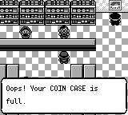
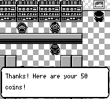

# 图鉴收集：购币柜台的原版上限边界

## 原因与修复

红版多边兽的奖品价格为9999枚代币。原场景在`getCoins() > 9949`时拒售；从0开始每次买50枚，199次之后为9950，无法再买到9999。即使现金足够，现有`buy_coins`操作也会收到拒售而停止。这是实际收集能力缺口，不是需要增加捕获概率或降低124目标。

[原版GameCornerClerk1Text](https://github.com/pret/pokered/blob/master/scripts/GameCorner.asm#L131-L194)调用`Has9990Coins`，拒售边界为9990；成功购买仍扣1000日元，增加50枚，代币加法在9999封顶。本次将场景改为`getCoins() >= 9990`，不修改商品价格、现金、代币封顶、奖品条件、模型选择或存档。9950→9999实际只增加49枚，但仍收取完整1000日元；原版成功台词仍称50枚，不改文案。

## 验证

新增`game_corner_coin_boundary`的7项原生回归覆盖9949、9950、9989、9990、9999；缺少代币盒、钱不足和选择NO均不改变资源。另从0枚/200000日元开始，通过200次真实柜台菜单逐笔核对付款和代币，结束为9999枚/0日元。最后一次购买后再通过红版奖品菜单实际支付9999枚，收到26级多边兽并登记，未直接给予该物种。

这些是隔离内存夹具：只在测试准备时设置地图、现金、代币、代币盒和初始宝可梦，再用普通按钮运行原生场景。奖品测试的场地切换也仅属于夹具，不是正式Jev的NEW GAME收集或新增图鉴。修复前3项失败，修复后7项全部通过。

2624项核心测试、51项事件图测试和1246项Python测试通过。第一次Python全量运行中GBA超时日志夹具未及时写出标记；保留失败记录，未改无关代码，10项专项与第二次全量通过。使用仓库生成器核对事件图，生成图无差异。

新原生二进制SHA256为`514a01da973e413686f738cb30af39be86f5c9e255867deaf178330c12f76cab`。另开隔离NEW GAME的m01–m49全部通过，包含真实联盟失败后两次正常重入、名人堂、片尾、自动保存和独立进程CONTINUE。回归驱动早先遗漏`playthrough.Game`的嵌套构造器覆盖，默认二进制不存在而失败；保留失败链，修正新驱动后从NEW GAME完整重跑，不续用失败存档。这仍是里程碑回归，不是双Jev最终124种收集。

## 同帧前后截图

前图为`master`的`cb131bbd`，后图为本修复。相同原生夹具：GameCorner(5,8)、朝上、9950枚/1000日元、有代币盒，普通YES，结果显示的第242帧；均为160×144。差异仅在结果文字区域`(8,107)..(127,130)`，场景与柜台相同。

## 收集状态的边界

当前原始第30段继续冻结旧原生`a795d997`，没有热更新或第二个调试连接。实际卡拉卡拉27→28、嘎啦嘎啦28级替换和新登记位已由原始进化阶段、队伍、PP、XP及第一份后续世界观察核验，验证链实时73种；独立保存核验仍为72种。早期幽灵通行祖先不追认为合法，最终单独合法NEW GAME的124种、完整MP4和图鉴大盘仍待验收。修复将在安全封存与独立读档验证后采用，不将隔离多边兽测试补算到原收集链。
