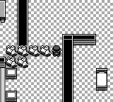
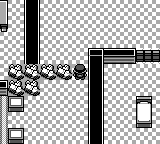

# 宝可梦屋开关：返回红莲岛后复位

修复原版一致性问题：原版
[CinnabarIsland_Script](https://raw.githubusercontent.com/pret/pokered/d2704a63c26f9ba046ade877445216b3de0519a4/scripts/CinnabarIsland.asm)
清除 `EVENT_MANSION_SWITCH_ON`，移植版红莲岛入口此前仅清除化石复活等待标记。
两份独立的第26段 CONTINUE 副本用普通步行返回红莲岛，都观察到开关错误地保持 ON。

修复仅在红莲岛 `@load` 补上开关复位，保留既有化石等待处理。
屋内各楼层仍共享开关，秘密钥匙和夏伯胜利标记不会被清除。
原版每次岛上脚本执行均复位；入口处理覆盖正常可达状态，因为开关只能在屋内切换。
这不是对任意 debug 注入状态的逐帧等价声明。

## 验证

- 修复前正向 ON 用例失败；修复后 `pokered-core --release --lib` **2624/2624** 通过。
- 新测试覆盖普通入岛、岛上读档入口、原始 ON/OFF、楼层间保持和重入后的四处门栅。
- 两份独立修复版 CONTINUE 副本返回岛上后均为 OFF，钥匙与背包保留。
- 同一修复版二进制 fresh m01–m49 全链通过（63.98秒）；两次联盟正常败退后重试，
  最终八徽章、名人堂、片尾、游戏自动存档和独立进程 CONTINUE 均验证。
- 上述回归不调用 `warp`、`give_*`、`set_flag`、debug `save` 或状态回滚；
  不调用模型、不接触正在录像的第27段进程，不计入任何图鉴收集进度。

## 前后截图

“前”为实际 `master` 提交 `cb131bbde9168cb7486aeff0d220cc9b21849b30`。
两图均由普通 CONTINUE、出屋、返回岛上、重新入屋和步行取得，未编辑测试存档。
匹配 `PokemonMansion1F (12,8)`、朝上、第20000帧，截图命令不推进模拟。
四处地图块恢复 OFF；画面差异仅324像素，范围 `(136,48)–(160,64)`。
主分支尚无 PR 新增的 `get_state.pokedex` 字段，其截图不是图鉴存档验证结论。

前：

后：

紧凑证据与哈希见 [JSON报告](jev-dex-mansion-switch-reset-20261004.json)。
原始测试、截图输入回执及保留日志位于持久 `.artifacts/`，不放在 `/tmp`。
早期截图辅助脚本适配失败和共享构建缓存冲突的日志也保留，未作为游戏进展计数。

报告快照时修复仅完成独立验证，尚未切入第27段原录像。
现有收集链仍用于策略验证，不能据此追认为完整合法流程。
最终合法 NEW GAME124、完整 MP4 和图鉴大盘的完成判据不变。
