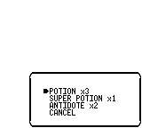
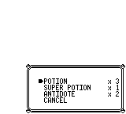

# Battle Bag with the project font preserved

The comparison uses the same Battle Bag mock (POTION×3, SUPER POTION×1, ANTIDOTE×2, cursor 0), English and frame 0. The before image is freshly rendered from the preserved `72ff719` core/UI/data/renderer libraries. The after image comes from the current Fusion Pixel preview dump, built at `2c6c941` plus the recorded layout worktree edits. Both sides use the project's Fusion Pixel font.

The original baseline already displays SUPER POTION and its quantity inside the box. This comparison does **not** establish a baseline quantity-overflow bug. The current layout draws item names and quantities separately, aligns quantities against the right interior edge, and retains the border/cursor fixes. The earlier `6fb9812` comparison used the temporary 8px font change and is superseded here.

| Before | After |
|---|---|
|  |  |

[capture-manifest.json](capture-manifest.json) records the actual before source, after source/worktree provenance, compiled-library hashes, image hashes and all 14 reviewed golden hashes. The preserved-base capture follows the exact mock/default-layout draw body from `render_battle_bag`; the current native preview omits only WASM export annotations for its standalone PNG dump. All fourteen current previews were individually inspected before updating their golden hashes. The naming metadata and editable-region fixture fixes remain. A standard Cargo run passed all 58 preview tests and its zero-test documentation target.

Original assembly basis for the separate fields: `home/list_menu.asm:364` places the name, and `479–491` writes × followed by a two-digit `PrintNumber`. The current authored box is retained; this does not assert every original item-menu coordinate. The production quantity regression now uses Fusion Pixel as its glyph/measurement oracle, covering English/Chinese mode, SUPER POTION/THUNDERSTONE and quantities 1/99, a clear cell before the quantity, and the untouched right-border tiles. Earlier pixel logs involving the temporary 8px font are historical evidence and are not used to label the project-font baseline as defective.

Additional frozen-base checks used the actual `PokemonRenderData` provider in English and Chinese mode, with SUPER POTION/THUNDERSTONE quantities of 99, plus the default Chinese-mode mock. All fit: the longest measured row is 80px, begins at x56 and ends at x136, inside the right border at x152. The baseline provider returns English item names in both modes, so these checks establish the real production behavior; they do not establish a CJK-name overflow. The three extra images and measurement log remain in `/tmp/pokered-font-preserved-preview`, with hashes recorded in the manifest.

After the dialogue descender fix at `d7291ea`, all fourteen previews were exported and individually reviewed again. Only DIALOG changed (364 pixels; golden `599168bcd2b2e67c`). The default proportional dialogue and battle-text rows use 12px spacing, with English row origins at y112/y124, keeping the retained 10px font above the bottom border. Glyph shape and size remain unchanged, as do tile-coordinate mock positions. Additional EN/ZH `gyp` diagnostic images visibly separate descenders from the border. The other thirteen previews, including this Battle Bag image pair, are byte-for-byte unchanged, so their image provenance is retained. All 58 preview tests passed again; the manifest records the actual clean-crates capture and library hashes.
