# 审计验收截图

基线：远端 master `0c32b9d`，在独立 worktree 编译。前后均执行同一份 `capture-acceptance.rs`，固定状态和帧数，分别调用 app / TUI 的实际渲染器；没有使用改图或示意图。

复现命令（在对应 checkout 执行，base checkout 仅复制截图入口和共享 fixture）：

```sh
cargo run -p pokered-app --example capture_audit_acceptance -- /tmp/app-shots
cargo run -p pokered-tui --example capture_audit_acceptance -- /tmp/tui-shots
```

每个文件的 SHA-256 见 `manifest.json`。`empty-party-before/after.png` 是另附的真实新游戏按键复现，before 使用合入 master 后、空队伍修复前的二进制；正式 master 对比为下表的 `app-empty-party-*`。

## app

| 画面 | 前（master） | 后 |
|---|---|---|
| 红莲门禁初始化 |  | 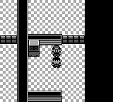 |
| 红莲第一门原版旗标 | 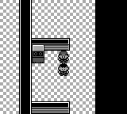 |  |
| 闪电鸟旧档恢复 | 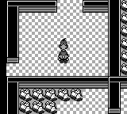 |  |
| 急冻鸟旧档恢复 |  | 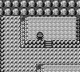 |
| 火焰鸟旧档恢复 | 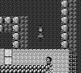 | 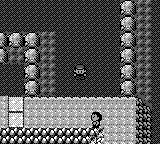 |
| 二层落石初始隐藏 | 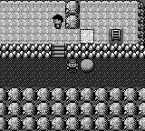 | 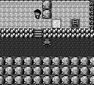 |
| 三层落石后隐藏 | 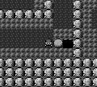 |  |
| 希巴未战出口 | 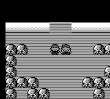 | 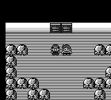 |
| 饮料显示名 |  |  |
| 长背包滚动 |  | 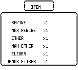 |
| 遗忘招式框 | 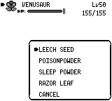 | 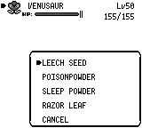 |
| 狩猎地带信息框 | 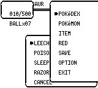 | 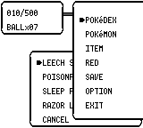 |
| 名人堂嘟嘟双属性 |  | 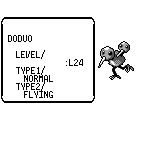 |
| 名人堂拉普拉斯双属性 |  |  |
| 片尾 POKéMON |  |  |
| CUT 后树消失 |  |  |
| 正辉入机器 |  | 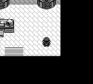 |
| 领取初始宝可梦前不中毒全灭 | 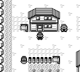 |  |

## tui

| 画面 | 前（master） | 后 |
|---|---|---|
| 红莲门禁初始化 |  |  |
| 红莲第一门原版旗标 |  | 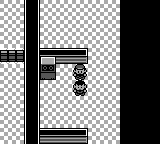 |
| 闪电鸟旧档恢复 |  | 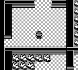 |
| 急冻鸟旧档恢复 | 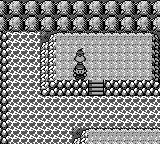 |  |
| 火焰鸟旧档恢复 |  |  |
| 二层落石初始隐藏 |  |  |
| 三层落石后隐藏 |  | 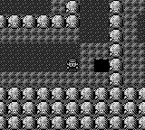 |
| 希巴未战出口 |  |  |
| 饮料显示名 | 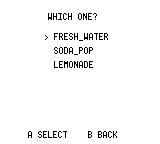 | 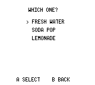 |
| 长背包滚动 | 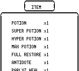 |  |
| 遗忘招式框 | 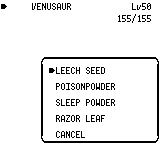 | 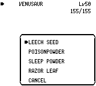 |
| 狩猎地带信息框 | 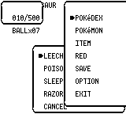 | 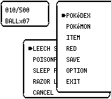 |
| 名人堂嘟嘟双属性 | 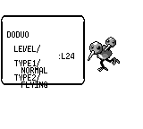 |  |
| 名人堂拉普拉斯双属性 | 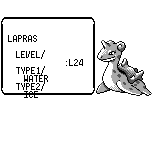 | 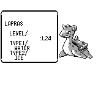 |
| 片尾 POKéMON |  |  |
| CUT 后树消失 | 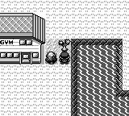 | 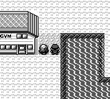 |
| 正辉入机器 | 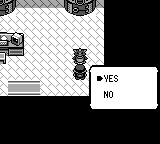 |  |
| 领取初始宝可梦前不中毒全灭 | 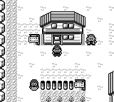 | 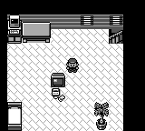 |
