# 中文菜单排版修复

基准：`master` 提交 `dc65c6c`。先在该提交上运行同一截图工具，再修改渲染并重跑。原始 PNG 为 160×144；总览仅以最近邻方式放大 2 倍。

## 前后对比

| 界面 | 前 | 后 |
|---|---|---|
| 选项页 | 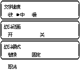 | 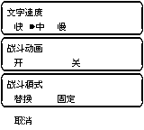 |
| PC 道具列表 | 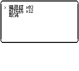 | 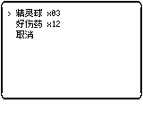 |
| PC 多行提示 | 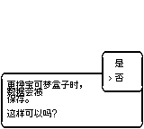 | 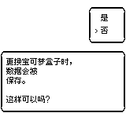 |
| 图鉴侧栏 | 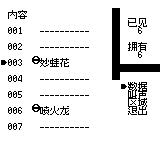 | 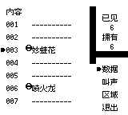 |
| 背包数量 | 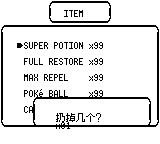 | 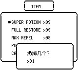 |
| 商店数量与金额 | 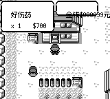 | 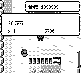 |
| 保存确认 | 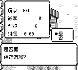 | 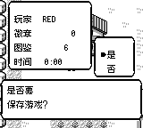 |
| 战斗菜单 |  | 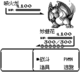 |
| 主菜单 | 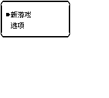 | 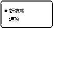 |
| PC 盒子列表 | 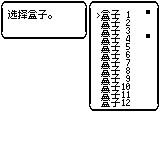 | 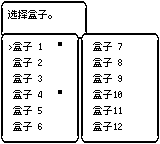 |
| 商店确认 | 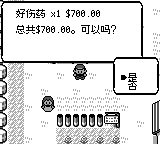 | 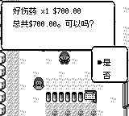 |
| PC 数量框 | 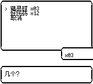 | 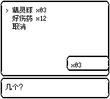 |
| PC 放生提示 | 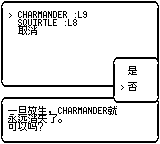 | 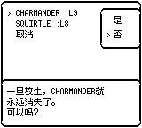 |
| PC 图鉴评价 | 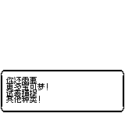 | 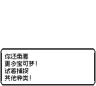 |
| 商店购买列表金额 | 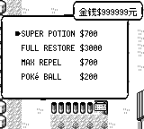 | 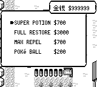 |
| 商店首页金额 | 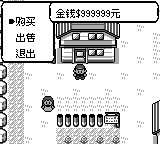 | 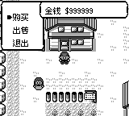 |

## 复现

```sh
cargo run --release -p pokered-app --example ui_audit_capture -- /tmp/menu-capture
cargo run --release -p pokered-app --example pc_tour -- /tmp/pc-capture zh
```

对比基准时将本 PR 的截图工具复制到基准 checkout：`ui_audit_capture.rs` 与 `pc_tour.rs`，再运行相同命令。主菜单基准另由 `screenshot --screen main-menu --lang zh -f 10` 截取（相同静态菜单）。

常用菜单使用六只 Lv100 宝可梦、99 个道具和 999999 金钱；战斗推进到 PlayerMenu，PC 沿用原 pc_tour 示例数据。脚本额外验证设置项全部位置、“否”选项、99 个道具的总价、第 12 个盒子、满盒末尾的取消项。

英语检查：`ui_audit_capture -- /tmp/menu-en en` 和 `pc_tour -- /tmp/pc-en en`。中文以外仍保留原来的文字间距；背包数量、商店数量框和 PC 数量框的越界修复适用于两种语言。