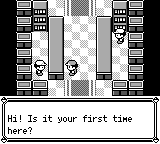
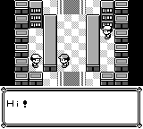

# 文字显示中的 A/B 加速

原作 `PrintLetterDelay` 检查按住的 A/B，结束当前字符等待后继续逐字打印。复刻此前把新的 A/B 按下当作整页展开，并发出翻页音。共享字段对话现改为按住加速；普通对话、脚本对话、嵌套赠送/阅读流程及自动拾取文字均经过共享逻辑。完整文字后的新按键仍负责翻页。

前/后来自 master `31b1eda` 与本次分支的实际构建，使用同一原作 SRAM 的真实 Continue，再结束受控沙湖状态、定位到有效柜台 `(3,4)`。明确设置 Medium=3；相同 A 开始对话（0..1）、13..14 帧短按 A，第 15 帧截图。B 也有独立重复录制。每份 145 帧，无遮罩、无后处理；重复的 PNG 和原始状态均逐字节相同。基础检出的生产代码未修改，已有和新增录制辅助代码均在测试模块中；两边本次辅助模块的字节相同。

原作参考使用对应预触发状态，从受控零球返程实际走到柜台，释放之前的 A；原作现有 Medium=3。按键安排在首字后第 10、11 帧。四个 A/B、有/无短按场景的前 19 帧逻辑字符数量与修复后的实际运行一致。原作图仅是首字后 12 帧参考，**不是绝对帧、字体或 LCD 传输时序的逐像素一致性证明**。

验证：核心 2737 项通过；debug-server 应用 208 项通过、27 项截图辅助测试按需运行；本次实际截图测试均运行 1 项并通过；GBA 31 项指标通过既有阈值，未改基线，15 个源文件哈希与最终检出一致。证据包包含原始输入、状态、PNG、原作执行钩子、编译/测试日志、拒绝的零测试调用和测试夹具首次失败，以及源文件和 SHA-256 清单。

历史固定构建主线 m01..m28 通过，m29 因脚本仍期待旧沙湖返程 `(3,4)` 失败；已依照先前原作录制修正为 `(4,3)`。日志和 28 份里程碑证据保留。它不是当前提交的通关证明。

尚待修复：`DisplayTextID` 初始化、嵌套 `PrintText` 的额外等待、最后字符等待及结束命令/YES-NO 自动衔接、完整文本会话与精灵恢复。原作这句问话最后字符在 111 帧、YES/NO 在 114 帧，复刻仍需另外按键。这些及其他既有合入门槛继续阻止合入。

