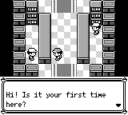
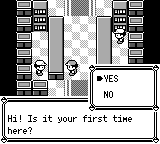
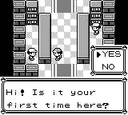

# PrintText 的 DONE 返回与问话自动衔接

原作内层 `PrintText` 遇到 `DONE` 后返回调用者，调用者可立即进入 `YesNoChoice`；文字内 `PROMPT` 和外层 `DisplayTextID` 的结束等待则需要按键。复刻此前把这些都作为 `ShowDialogue`，导致问话已打完还必须再按一次。

新增游戏侧 `printFieldText` / `PrintFieldText`，明确表达内层打印完成后返回；原有 `ShowDialogue` 保留外层结束等待。最后一个字符也执行设定速度或按住 A/B 时的 `PrintLetterDelay`，不会提前接收下一段输入或跳过等待。新命令已注册到原生 AST、Boa 和函数目录，按已有规则替换玩家/劲敌/初始宝可梦名字，模式可经 JSON 保存恢复。

已依据原作确认并接入的调用点：沙湖信息员问话、博物馆两个入口的门票问话及柜台后的琥珀问话，以及共享赠送宝可梦流程的昵称问话。博物馆同时纠正余额框顺序：原作先 `MONEY_BOX` 再 `PrintText`，复刻此前打完问话才显示。

## 同输入截图

主分支 `31b1eda` 与本次分支均以同一原作 SRAM 实际 Continue，再进行明确受控的沙湖结束与有效柜台定位 `(3,4)`，Medium=3、seed=1。打开对话只发送第 0、1 帧 A，第 2 帧释放；之后没有按键。第 120 帧，旧版仍等待按键，新版已显示 YES/NO 且保留问话。两边使用字节相同的录制辅助模块、各录制两次 145 帧；全部 PNG 和原始状态重复逐字节相同，输入序列也相同。基础检出的生产代码没有修改，辅助代码全部在测试模块中。

原作参考来自已冻结的 160 号录制：受控零球返程后实际走到柜台，释放此前 A，仅发送开场两帧 A。首字 24、末字 111、`YesNoChoice` 114；新版首字 3、末字 90、选择命令交接 93，菜单于下一帧初始化。相对首字的 90 帧返回及最后字符后的 3 帧等待相符。**这不证明绝对起始时刻或 LCD 传输逐像素一致**；原作图是参考而非对齐后的图。

## 验证与剩余工作

核心 2739、应用 210、数据层 262 项通过；27 个录制辅助测试按需运行，本次录制每次明确运行 1 项并通过。实际输入验证包含沙湖无第三次 A、最后字符等待中的 JSON 恢复、选择不被开场 A 误答、B 后正确分支；实际伊布赠送不使用 SkipDialogue 或额外按键就进入昵称菜单，按 B 后得到伊布并设置剧情标志；博物馆第一价格页已有余额框，最终问话/拒绝走位正确。新文本命令的名字替换与返回模式序列化亦通过。

GBA 31 项指标通过未修改的基线与阈值；21 个源文件哈希与最终检出一致。压缩包包含原始输入、状态、PNG、原作执行钩子、相关原作汇编、源文件、编译/测试日志与 SHA-256 清单。首次三个旧测试因仍假定末字即结束而失败，按原作等待修正后的完整结果也保留。

这里只迁移了已确认的五处问话路径。其他 `PrintText`/`DisplayTextID` 调用点、共享文字会话初始化/关闭、完整精灵恢复、此前其他动画/功能门槛以及最终提交的全主线与独立 SAVE/CONTINUE 验证仍待完成，PR 继续保持草稿。
