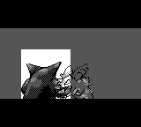
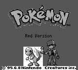
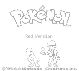

# Opening and title fade corrections

Previously only the cleared background darkened during FadeOut. Gengar,
the title Pokémon and the copyright tiles kept opaque white backgrounds,
and the other graphics and black bars did not fade at all.

Both screens now keep their white background and apply the existing GB
three-step fade-to-white palette to the completed frame. The intro retains
its 24-frame duration (8 frames per step); the title retains its 16-frame
duration. Background tile occlusion and sprite transparency are preserved.
The terminal frontend uses the same fade helper and matching drawing changes.

These captures use the renderer from base `3d8dda2` before the fix and the
PR renderer after the fix. The capture harness is identical in both runs:

```sh
cargo run --release -p pokered-app --example capture_intro_fades -- /tmp/pokered-fades-before
# Apply the renderer fix, then:
cargo run --release -p pokered-app --example capture_intro_fades -- /tmp/pokered-fades-after
```

The harness advances the intro through the lunge into FadeOut, and starts
the title fade by pressing a button and waiting for the cry. It then renders
the same phase-relative frame counters in each run, without a window/audio.

| Screen / FadeOut frame | 前 | 后 |
| --- | --- | --- |
| Gengar/Nidorino, 12 |  |  |
| Title Pokémon/copyright, 8 |  |  |

The final captures (intro frame 23 / title frame 15) were also checked to be
entirely white. `cargo test --release -p pokered-app --test intro_fades`
checks each fade-step boundary pixel by pixel, including a normal render
after a fully faded frame to catch palette leakage. Both tests fail against
the old renderer and pass with the fix.

For PR bodies, embed these screenshots using absolute raw URLs pinned to
the PR branch, as required by `AGENTS.md`.
