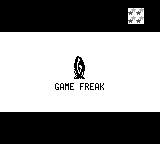
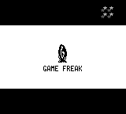
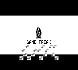
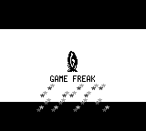

# Intro star transparency

The stars used the opaque background palette, so color 0 erased the black
letterbox bars with white tile rectangles. Both star paths now use an OBJ
palette with transparent color 0 and the same visible shades.

Captured on `master` before the fix and again after the fix, with identical
screen targets and frame counts:

```sh
cargo run --release --bin pokered-app -- screenshot --screen gamefreak-splash -f 250 -o docs/screenshots/intro-star-before.png
cargo run --release --bin pokered-app -- screenshot --screen gamefreak-splash -f 398 -o docs/screenshots/intro-small-stars-before.png
# After applying the fix, repeat with the corresponding -after.png paths.
```

| Frame | 前 | 后 |
| --- | --- | --- |
| 250: big star |  |  |
| 398: small stars |  |  |

Pixel comparison confirms that only white tile-background pixels on the
black bars changed; all other pixels are identical. When embedding these
captures in a PR body, use absolute raw URLs pinned to the PR branch as
required by `AGENTS.md`.
