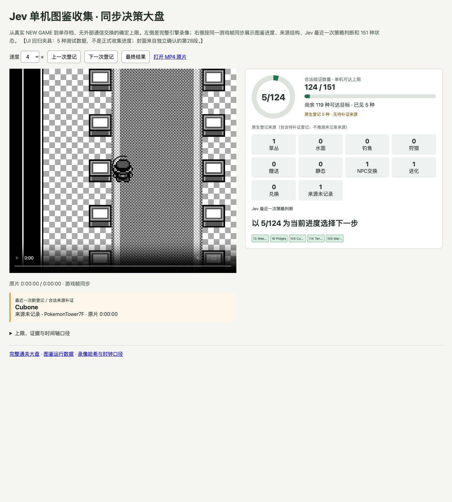
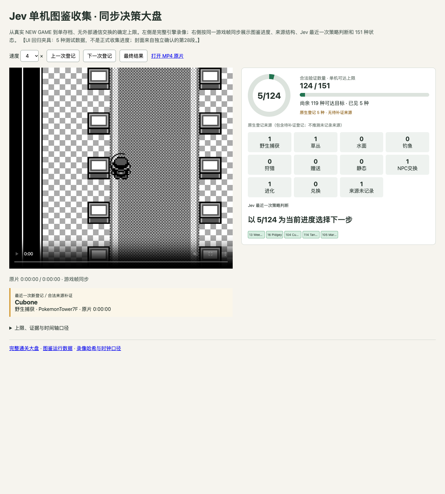

# 图鉴大盘：实际野生捕获来源

`origin/master` 没有这个新页面（已核对），不能从主分支截取不存在的画面。
前图取本 PR 修复前 `40ef2b2b69d90cf6f004d0071a80dc44667ed0fc` 的原始 HTML；后图取修复后页面。
使用相同 Chrome headless `154.0.8037.95`、1440×1600 视口、同一 CSS、同一静态引擎封面、同一 5 种 UI 测试夹具。
夹具明确标为测试数据，不是正式收集进度；没有生成或拷贝 MP4，没有游戏输入、存档编辑或正式收集计分。

- 前：`wild_capture` 没有对应格子，5 项来源只显示合计 4 项，最近登记错误显示“来源未记录”。
- 后：新增“野生捕获”格子，合计恢复 5 项，最近登记显示正确来源；旧地形来源与确实未知的来源仍单列，不回填历史登记。
- 实际播放器脚本回归先红后绿；播放器与生成器专项 15 项、完整 Python 1232 项通过。

匹配身份：夹具 SHA256 `7e5c4eafe223ee4b1c37b4f3cf6b5e7dd26528478819c41732cc9ded68b580de`；封面 SHA256 `064953600042bfc361677025a28ba96a634cbd20fdc5df9258362ca3b6a4fe89`。
前图 SHA256 `34420df37966c2fbd1929a1b5c48c9da31edd2f6b8a19d5abbdb20992e2662b2`；后图 SHA256 `802ca2af8879894b7f3d5f247099c3359feb71c78c3831672af4fde73dbc0aea`。

此 UI 修复不改变第29段冻结策略，不补认证其早期幽灵通行祖先；最终合法 NEW GAME、124 种独立验收与完整 MP4 仍待完成。
