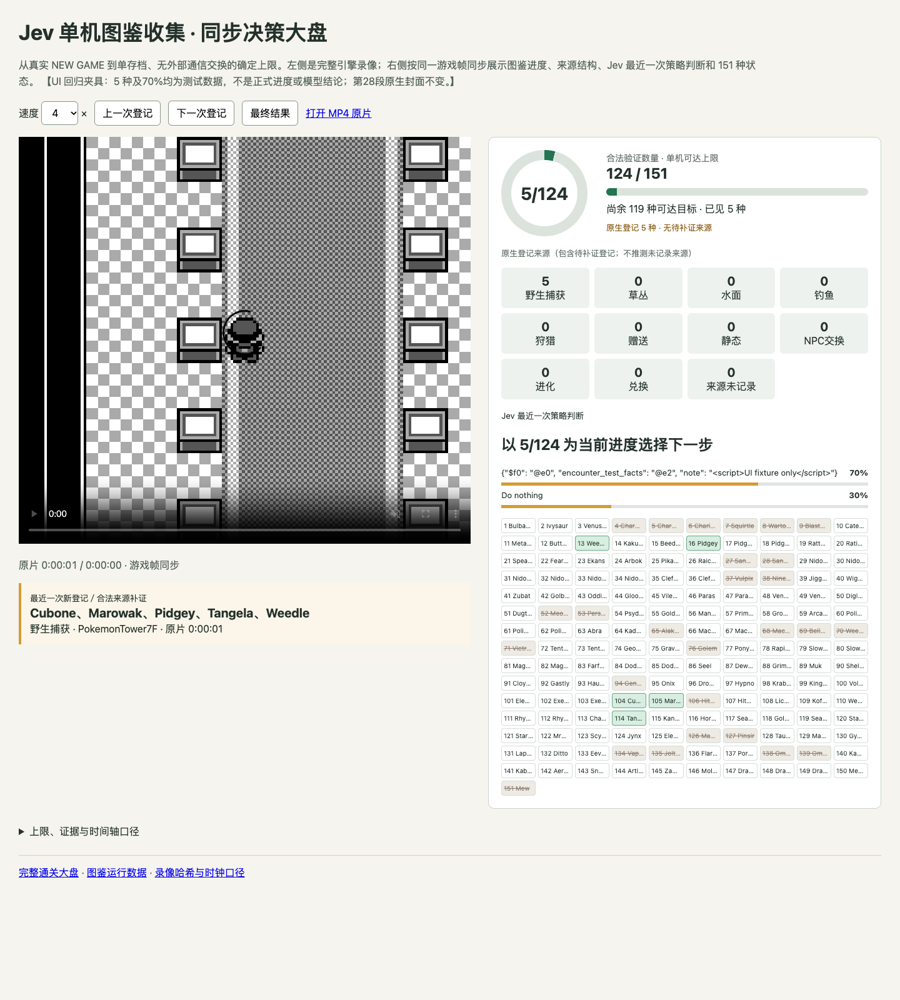
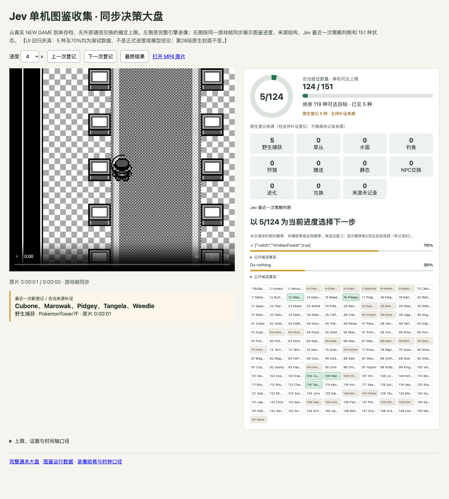

# 图鉴大盘：还原公开候选事实

“前”为 PR 已发布的 `277cbabd0a0370ab253651f2930b4c905b994a9e`，
“后”为当前修改。`master` 尚无此图鉴页面，无法拍到该页面的 master
版本，因此采用修复前的 PR 页面作对照；不是最终 NEW GAME 验收录像。

两张截图使用相同的 UI-only 输入，通过各自真实的旧／新数据生成器
导出数据，Chrome 154.0.8037.95，1440×1600、设备比例 1、原片定位
1 秒、详情初始折叠。5 种与 70% 均为合成回归数据，不是正式图鉴进度
或模型结论。相同封面来自独立读档确认 68 种的第28段原生 `final.png`；
没有连接游戏调试端口、操作存档、重新询问 Jev 或复制／渲染 MP4。

前：传输别名 `$f0`、字符串引用 `@e0` 直接出现在候选文字中。
后：复用已有解码器，显示公开的 `establish` 目标，标记实际选择，
注明概率仅在该次策略请求内有效；可展开完整公开候选事实。
浏览器另验证了传递引用、记录表恢复、HTML 转义，以及时钟刷新不会
关闭已展开的详情。原始选择、数值概率、概率顺序均未改变。

schema 4 将完整已展示描述按原始类型去重存储在 `candidate_descriptions`；
每个候选用 `description_ref` 引用，不复制整份未使用的世界／引用库。
保留前五个记录概率，以及排在其后的实际选择；缺失概率标为未记录。
判断卡片的 `dex_progress` 仅导出实际显示的 `owned`／`validated_owned`
计数，不重复未展示的全图鉴目录。原始请求及游戏输入不受此显示投影
影响。旧数据仍可播放。导出记录包含源段、原始墙钟锚点、帧／估计区间和
原始 `state` 与 `question` 的规范 JSON SHA-256。
本显示投影不冒充完整提供方请求校验，也不把分组请求的概率解释成
整个候选集合的统一概率；公开事实不是隐藏思维过程。

回归：21 项定向测试与 1238 项全量 Python 测试通过。另在原始第29段
已封定哈希的完整 trace 前缀上，被动检查 946 次成功策略请求的导出，
确认每次实际选择、置信度、数值概率与原始排序均保留。此项不代表
独立 SRAM 验收、历史链完整合法性或最终 124 种／完整录像验收。

配对输入 SHA-256：`033699d0d5026fbdd2140a88b9d96947ebee9ac6c5e15976e97e53d8bed0a009`。
配对封面 SHA-256：`064953600042bfc361677025a28ba96a634cbd20fdc5df9258362ca3b6a4fe89`。
前 PNG：`9055e5fb5ee8abb0c1a45d5506a2b963e1a2799e0b3e50ba0b415e7a944ab71d`。
后 PNG：`631725c5821ddba2dd5e7b8af5154da9e1ec8d1cbea5972ec54178d5d1c38155`。

同一更早前缀的 915 次真实请求，旧决策展示 JSON 为 20,410,695 字节，
新结构（包括完整描述表）为 17,060,026 字节，约减少 16.4%。这是
展示数据大小对照，不是模型 token、整个大盘或录像大小对照。最初
将解码事实再次存为 JSON 字符串的试验为 25,025,915 字节，未发布；
此试验的配对截图、报告与尺寸证明另存，不以最终代码测试冒充它。
