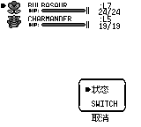
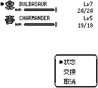
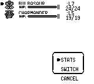
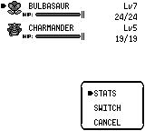
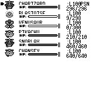
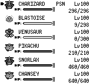
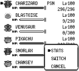

# Party action menu overflow

The before frames use master at `a952ebfb64767763cc0e117aeea44a356a06b30d`;
this fix branch started at the same commit. Both captures use the same party,
DVs, cursor, and icon animation frame (10).

Reproduce with:

```sh
cargo run -p pokered-app --example party_menu_capture -- /tmp/party-menu-capture
```

| Language | Before | After |
| --- | --- | --- |
| Chinese |  |  |
| English |  |  |

The frame now includes all three rows and the full English labels. Menus with
field moves and move-forgetting options also reserve space for the longest label,
the cursor, and both borders. Chinese SWITCH is translated as 交换.

## Level and HP spacing

Entries now occupy 24px each (six entries fit the 144px screen). The name,
status and level share the header; HP uses a second baseline 12px below it,
leaving space for Fusion Pixel's taller glyphs. Numeric values align to the
same right edge using measured pixel widths, with an 8px screen margin.
Icons and HP bars follow the same row spacing, and menus are composited last.

The full-party fixture exercises level 100, three-digit HP, low/zero HP,
and poison. Its before capture uses `903ccd1`, whose list layout is the same
as master at `a952ebf`; the two-member before captures above remain unchanged.

| Before | After |
| --- | --- |
|  |  |


