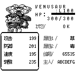
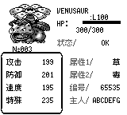
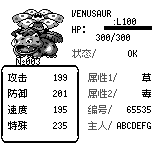

STATS 中文间距对照

- 前：master `a952ebfb64767763cc0e117aeea44a356a06b30d`，在独立 worktree 中运行相同截图示例。
- 后：中文页启用按实际字宽排版，能力数值距左框右边缘留 4 px；第一页图像上移 4 px，避免覆盖图鉴编号。
- 场景：100 级妙蛙花、双属性、训练家编号 65535、七字母主人名；进入页面后推进 10 帧。
- 复现：`cargo run --release -p pokered-app --example capture_stats -- /tmp/stats-captures`
- 中英文招式页的 PNG 均与 master 逐字节一致；英文第一页仅调整图像的纵向位置。

前：

后：

PR 描述中请使用指向 PR 分支的绝对 raw.githubusercontent.com 图片链接。

本轮编号间距调整（前图为上一轮中文间距修正后）：

