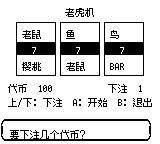
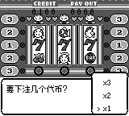
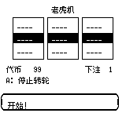
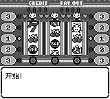
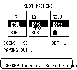
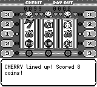

# Game Corner：机台画面保真

参考本机 `pokered-worktree/engine/slots/slot_machine.asm` 的
`LoadSlotMachineTiles`、`SlotMachine_AnimWheel`、`SlotMachine_LightBalls`、
`SlotMachine_PrintCreditCoins`、`SlotMachine_PrintPayoutCoins` 和 `.flashScreenLoop`。

- 使用原版 Red 的 `slots.tilemap` 与两张图块表；三个文件已与参考仓库逐字节核对。
- 转轮从屏幕 `(40/72/104, 72)` 向上绘制六行图块，每步移动半个图案。
  逻辑偏移指向已绘制内容的下一字节；奇数偏移对应三个完整图案。
  初次进场执行原作加载时的那一次转轮推进，使画面正确对齐。
- 下注后按 1/2/3 枚代币点亮中线、上下横线、对角线指示灯。
- 余额与剩余奖金回到顶部四位计数栏；奖金不再遮挡转轮。
- 中奖时只将背景色号 3 从黑色变为深灰（BGP XOR `$40`）；转轮精灵色板保持不变。
- 下方文本框按字宽换行，兼容中英文；下注菜单显示三个倍率及当前选择。

## 对比截图

以下“前”来自最新 `origin/master`（`dc65c6c`）的独立 checkout。
前后均通过同一个确定性测试构造相同状态，调用实际
`draw_slots`，以 160×144 原始分辨率保存；中奖示例固定为中线三樱桃。

| 场景 | 前 | 后 |
| --- | --- | --- |
| 中文下注 |  |  |
| 中文转轮 |  |  |
| 英文中奖 |  |  |

## 复现

```sh
cargo test -p pokered-core slots
cargo test -p pokered-app --lib render::slots
SLOTS_CAPTURE_DIR=/tmp/slots-capture cargo test -p pokered-app --test visual_verify_slots
```

截图测试生成下注、旋转、中奖、闪光和继续提示的中英文画面。
渲染回归测试检查停轮稳定、未停轮移动、背景闪光不影响图案和中奖文案宽度。
