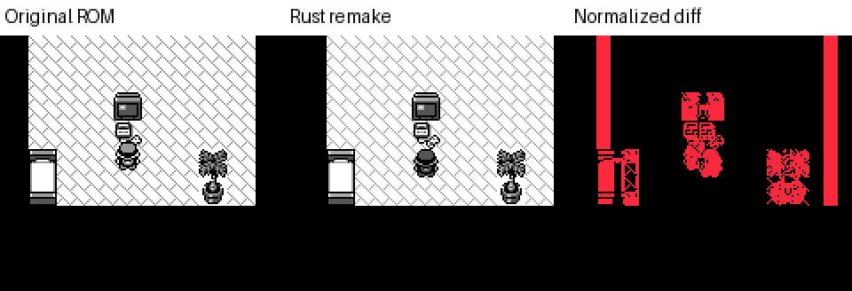
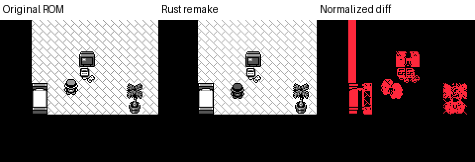

# 原版视觉 oracle MVP（m02，属于 m10 内）

这个实验真正启动原版 ROM，推进新游戏，在 Red 卧室按键走一步，再与 Rust 的等价 seeded 状态比较。它验证“状态对齐之后截图是否有发现价值”，没有声称完成原版主线通关，也没有把相同绝对帧号当成等价状态。

## 重跑

```bash
python3 -m venv /tmp/visual-oracle-venv
/tmp/visual-oracle-venv/bin/pip install -r scripts/visual_oracle_requirements.txt
cargo build --bin pokered-app --features debug-server
/tmp/visual-oracle-venv/bin/python scripts/visual_oracle.py \
  --rom /path/to/verified/pokered.gbc \
  --binary target/debug/pokered-app \
  --output /tmp/visual-oracle-new-run
```

输出目录必须不存在或为空，避免覆盖证据。程序不下载 ROM。使用自己的本地 ROM，或从参考母本构建：本次使用 `pret/pokered` commit `fbcf7d0e19a3a2db505440d3ccd3d40ca996c15c`，RGBDS 1.0.3，`make -j4 pokered.gbc`。构建结果 SHA1 必须为 `ea9bcae617fdf159b045185467ae58b2e4a48b9a`，否则拒绝运行，防止内存地址误读。ROM 不加入仓库。

Python 依赖版本见 requirements；本次 Python 3.13、macOS ARM64。依赖安装、RGBDS 安装及 ROM 构建合计约两分钟（估计，不含人工调试）；这些只需一次。已有依赖后的完整测量约 **1.8 秒**，包含原版启动、两状态截图、两端重放、两次 Rust 状态观测和差异输出；debug Rust 构建不计入这个时间。精确运行耗时、二进制 SHA256 和依赖版本都在 report.json。

本机另一个旧 `.gb` 文件 SHA1 为 `d89481f9f602a7d306e481861e2af593a979e7b6`，不匹配参考版本，并在 PyBoy 中 LCD 关闭、PC 卡在 0x38；已弃用。没有把它生成的灰屏作为原版基线。

## 对齐和观察

原版从无存档启动，固定预算的 Start/A 操作推进开场；随后通过实际按键以及 ROM 内存观测确认卧室位置和朝向。原版 ROM 被复制到临时目录，隔离既有 `.ram` 和 `.state`。这段 bootstrap 是 bounded replay，并非通用 AI 导航器；如版本或时序改变导致对齐失败，脚本直接报错。

两个状态是 `(map=38, x=3, y=6, facing=Up)`，以及真实向左走一格后转向上得到的 `(38,2,6,Up)`。Rust 使用对应地图/位置的 `--skip-intro --warp` 启动；为同样的 seed 参数单独启动 debug server，实际确认 map、位置、朝向、overworld、Idle 与无 fade。截图是对应 seed 的另一进程，不是 debug server 原进程；报告保留两条命令及实际观测，明确这个关系。所有 Rust 进程指定临时空存档路径、仓库 cwd。

只比较稳定卧室，不存在游走 NPC 或花朵相位的不确定性。完整四灰阶按亮度排序归一化，消除 DMG 灰阶选择（153 vs 170）的差别；缺少某个灰阶、附加颜色或颜色数量不同直接拒绝，避免对不同灰阶集合分别编号造成假差异。这个规则**无法检测纯调色板错误**，因此原始 RGB 差异同时保留，未来颜色专项须另设规则。

## 实际结果

| 场景 | 原始 RGB 差异 | 归一化差异像素 | 归一化比例 |
|---|---:|---:|---:|
| 卧室出生位置 | 约 20.27% | 2974 / 23040 | 12.91% |
| 左走一格后 | 约 16.98% | 2219 / 23040 | 9.63% |





[完整机器报告](screenshots/visual-oracle-mvp/report.json) 同时包含上部地图、玩家区域、下部地图差异和 bounding box。区域 bounding box 使用区域局部坐标。

两个状态均提示：地图有约 **水平 8 像素偏移**。额外平移搜索仅用于诊断，最佳 candidate offset 为 `[8,0]`；此时内部裁剪区域仍有约 0.95%/0.96% 差异，目视主要包含玩家残余位置/绘制差异。内部区域比例不能直接当作全帧比例比较。**没有自动配准后忽略这个问题，也没有声称所有差异都是 camera 原因。** 这是需要产品侧确认预期的 fidelity 候选，本次未修改游戏代码。

校准共八项全部通过：每个场景，原版 save/restore 后同样推进的重放差异为 0；Rust 相同 seed 重启截图差异为 0；单独注入 8×8 灰阶替换精确检出 64 像素且 bbox 正确；仅单调替换调色板后归一化差异为 0。注入只作用于内存中的测试图像，不修改产品。

这证明了小范围稳定场景中的重跑噪声和检出敏感度，**不能据此估计全游戏误报率**。报告 `needs_review` 表示发现候选，命令 exit 0 表示实验执行和校准成功，不表示视觉一致。确认并分类差异之后再设计 CI gate；当前不应把既有 fidelity 偏差全部当成新回归。

## 性价比结论与下一步

原版状态准备和对齐规则是主要人工成本，比较本身很便宜。两个同地图状态已经发现仅看 Rust 截图不易判断的偏移，因此适合把视觉对照接到已有场景规格上。

下一批建议复用 m10 内内容场景的 NPC 对话完成、主菜单打开、治疗稳定阶段，每个状态明确前置条件、实际观测和允许差异。暂不拓展绝对帧对帧的长流程。当前固定路线由人工/AI探索后固化，没有每次调用视觉模型、没有通用自动异常归因；下一步才是让 AI 挑选待覆盖状态并归纳差异。
