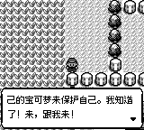
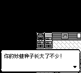

# 中文 NPC 对话分页核对

核对基线：`72ff719`（2026-10-01），范围为 open-pokered 的中文地图对话。

## 覆盖范围与结果

从当前编译出的 `.scene` AST 读取所有分支的 `@speaker`、`@say`、
`showText`、`showRandomText` 候选，以及 VermilionGym 的 `@run` 台词。
包含共享对白脚本和 `dialog_text::EXACT` 静态备用翻译。
随机对白逐条检查，不依赖一次游玩恰好抽到哪条。

| 项目 | 结果 |
| --- | --- |
| 场景/备用对白记录 | 2,677 |
| 含汉字的记录 | 2,665，来自 214 个场景键及备用翻译表 |
| 名字组合 | 英文、短中文、长中文、7 字母英文，共 4 组 |
| 中文布局测试组合 | 10,660 |
| 默认中文名字下页面数 | 修复前 4,179；修复后 3,994 |
| 完全空白页 | 修复前 3；修复后 0 |
| 字符丢失/乱序、行溢出、新增标点行首、行末左括号 | 修复后 0 |
| 独立 Jieba 整句分词的断词候选 | 修复后 0 |

剩余 12 条无汉字或空白的记录不计入中文布局组合数。
数字、育屋宝可梦名称等动态表达式使用代表值；名字占位符分别代入四组值。
另以真实 NPC 交互检查中文商店对白结束后能打开商店、空白剪贴板对白
直接完成、育屋的自定义中文昵称完整显示。测试也覆盖逐字显示的快照恢复。

这是当前文本的自动排版核对和问题样例的逐页复核，独立分词用于发现候选，
不把机器分词当作每种新文本、每种动态昵称的人工语言审校。

## 发现的问题与处理

- 核心按源文本每两行切页，绘制层又重新软换行，两者对中文的页边界没有
  共同约定。长行可能挤成第三行被裁掉，逐字显示期间还会改变已经显示的位置。
- `EXACT[97]`（马志士）第 5、10 页，`EXACT[101]` 第 4 页完全为空。
  原因是多余空行被计入页内容。现在空行仅表示段落边界，不产生空页；
  空对白的脚本效果直接完成，也不会闪出空文本框。
- 大木博士的“自己的”“我知道了”以及菊子的“英俊”曾跨页断开。
  中文源文本的单个换行现在作为软换行，先合并，再按真实字形宽度排版。
- 单纯尽量填满页面会把“了！”“的！”单独留在下一页。现在页面优先
  在完整句子或分句末尾结束；超长单句没有合适句界时，以完整词为单位
  调整第二行，给下一页留下足够上下文。
- 新增中文排版的禁则：右括号和句末标点附在前一个词上，左括号随下一个词。
  原文有意使用的行首省略号保留，不新增其他标点行首。
- 实际字形度量决定宽度：第一行 144 px，第二行 136 px，给翻页箭头留 8 px。
  专有名词、常用词、玩家/对手名字、队伍和育屋的显示名、ASCII 缩写及数字
  优先作为完整单元。超过整行宽度的输入才使用逐字回退，以确保显示能继续。
- 中文页面在逐字显示之前定稿；原生/Web 绘制保持这两行，TUI 本来就逐行
  绘制，直接使用同一份分页结果。普通 UI 对话和英文软换行继续走现有接口。

运行时词表包含 3,611 个当前对白、描述、提示及名字表中的保护词。
Jieba 只用于开发时生成和独立复查，游戏不加载其分词器或词典。

## 截图

截图由 `visual_verify_zh_npc_dialogue` 调用实际 `draw_overworld` 生成。
前图使用基线的核心对话入口及绘制代码，后图使用修复代码；两边使用相同
语料、地图、页面索引、完整揭示状态和帧号 0。比较的是相同翻页次数；
修复页边界后，同一索引包含的文字会变化。

| 状态 | 前 | 后 |
| --- | --- | --- |
| 大木博士第 1 页：第三行截断/逐字重排 |  |  |
| 大木博士第 2 页：断词/断句 |  |  |
| 马志士第 5 页：空白页 |  |  |
| 育屋第 1 页：动态名称及数字的完整表达式 |  |  |
| 菊子第 4 页：跨页断词 |  |  |

## 复查命令

```sh
# 测试直接读取当前编译 AST，不依赖复制的一份旧对白快照。
ZH_DIALOGUE_AUDIT=/tmp/zh-pages.json \
  cargo test --locked -p pokered-core --test zh_npc_dialogue_layout -- --nocapture
cargo test --locked -p pokered-ui --test zh_dialogue_rows

# 开发时生成词表和独立分词审查；不影响运行时依赖。
python3 -m pip install jieba==0.42.1
python3 scripts/generate_zh_dialogue_words.py --check
python3 scripts/audit_zh_dialogue_pages.py /tmp/zh-pages.json \
  --transcript /tmp/zh-pages.jsonl

# 可审阅的完整页面记录：source 定位场景和源文本行，pages 给出每页两行。
# --before 接受基线的 pages.json，验证两边输入完全相同并列出原先空页。

PR_SCREENSHOTS=/tmp/zh-npc-captures \
  cargo test --locked -p pokered-app --test visual_verify_zh_npc_dialogue -- --ignored
```

修改对白后，先运行词表生成脚本（不带 `--check`），再运行语料测试与独立审查。
独立审查可能报告合理分词的候选，应结合上下文判断并补充必要的保护词。
源对白和英文译文未改写。

本地回归：core 2,947、data 425、UI 93、app（debug-server，lib）111、TUI 23 项通过；
5 组截图成功生成，翻译保真脚本和词表可复现检查通过。

开场、图鉴及其他描述文案的补充核对见 [描述文案审查](zh-descriptive-text-audit.md)。
